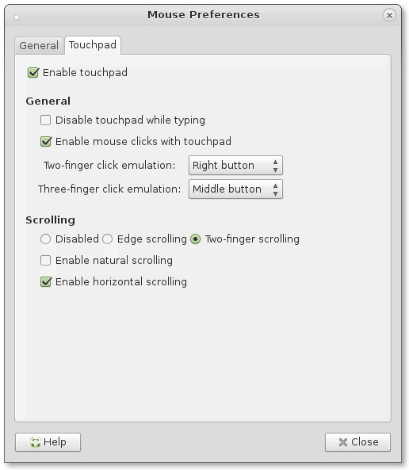
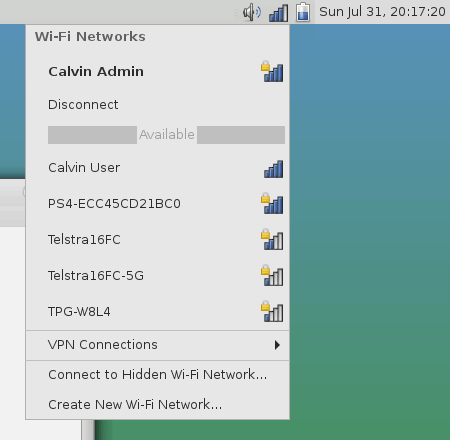
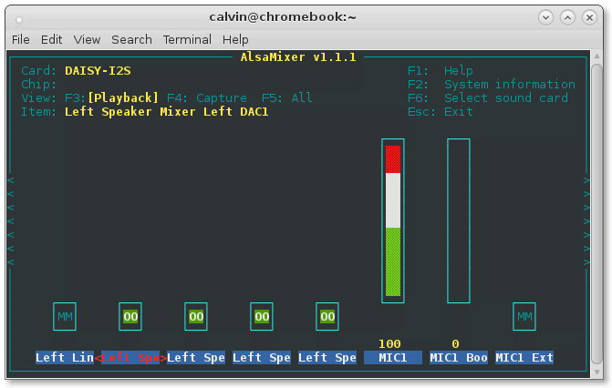
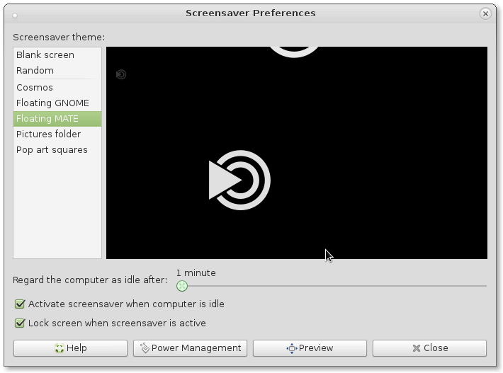
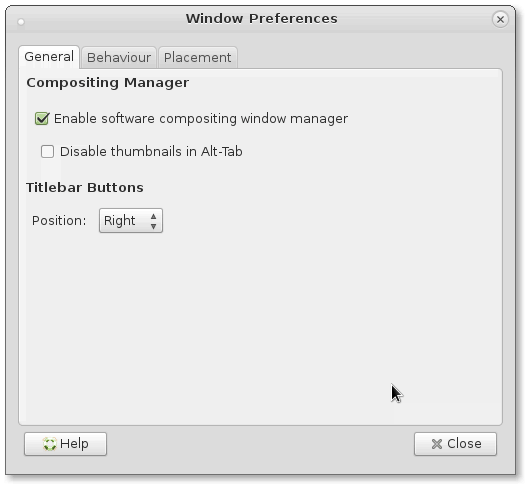

This is an up-to-date collation of everything to get a good working base for Arch Linux on the Samsung ARM Chromebook XE303C12.

<!-- more -->

I took my Chromebook out of retirement over the week and experimented around with a few distros. This is an old device and there's not a lot of information going around on the Internet. I've taken everything I've found and updated it to work on latest Arch release. I've also included some of my own configurations together into this post.

I assume you are familiar with Linux so I won't be explaining what everything is and what it does.

### Install Arch Linux following the official guide

Install Arch on the Chromebook using [the official guide](https://archlinuxarm.org/platforms/armv7/samsung/samsung-chromebook).

To install to the internal memory, use _/dev/mmcblk0_ as the path after launching Arch from a USB. For this to work you will need Internet (_wifi-menu_), _wget_ and _cgpt_ (pacman -S cgpt wget).

### Set up Wi-Fi

On the first boot without a GUI, the command _wifi-menu_ should work out of the box to pick a simple network. It does not support WPA2 Enterprise or Hidden Networks however.

Proper networking will be explained later on once we have a GUI ready.

### Update the system

Simply run:

```shell-session
pacman -Syu
```

then reboot and hope everything still works.

### Create a user

The next few steps require some files to be created in a user's home directory or preferences changed under their profile. This is would be a good time to do that unless you plan to use 'root' forever.

Create a new user

```shell-session
useradd -m -G wheel -s /bin/bash calvin
```

Set a new password

```shell-session
passwd calvin
```

Install _sudo_

```shell-session
pacman -S sudo
```

Add user to sudoers

```shell-session
$ visudo

...
...
calvin ALL=(ALL) ALL
```

Login to your new user and let's begin.

### Get a GUI


I prefer [MATE](https://wiki.archlinux.org/index.php/MATE) as it's light on resources (lighter than XFCE in my tests) and pretty usable. There a list to choose from on the [wiki](https://wiki.archlinux.org/index.php/desktop_environment).

To install MATE and everything required for a desktop environment, run:

```shell-session
pacman -S mate mate-extra xorg-server
```

The _Disk Utility_ and _Account Manager_ are optional packages if you wish to install them. The built-in account manager seems to work but throws an error when launching.

```shell-session
pacman -S mate-disk-utility mate-accountsdialog
```

Finally if you need a Display Manager (Login screen) to launch _MATE_ (or use [xorg-xinit](https://wiki.archlinux.org/index.php/Xinit)). _MATE_ recommends using _[LightDM](https://wiki.archlinux.org/index.php/LightDM)_:

```shell-session
pacman -S lightdm lightdm-gtk-greeter
```

Then enable _LightDM_ to run on startup:

```shell-session
systemctl enable lightdm.service
```

Reboot and try it out.

### Fix the trackpad

Now the trackpad will not feel right. This is easily fixed with a config file and driver.

Install the driver first:

```shell-session
pacman -S xf86-input-synaptics
```

Then set-up the config file at _/etc/X11/xorg.conf.d/70-synaptics.conf_

```text
Section "InputClass"
        Identifier "touchpad"
        Driver "synaptics"
        MatchIsTouchpad "on"
        Option "FingerHigh" "5"
        Option "FingerLow" "5"
        Option "TapButton1" "1"
        Option "TapButton2" "3"
        Option "TapButton3" "2"
        Option "HorizTwoFingerScroll" "on"
        Option "VertTwoFingerScroll" "on"
EndSection
```

Reboot when done.

This should enable a good working trackpad on boot with tapping working. Afterwards, you can edit trackpad settings under '_System > Preferences  > Hardware > Mouse_' to enable two finger scrolling, two finger taps, three finger taps, etc.



Note: if it's really hard navigating with the broken trackpad, press _CTRL + ALT + Refresh_ to return to the command line.

### Networking

Install _Network Manager_ and _network-manager-applet:_

```shell-session
pacman -S networkmanager network-manager-applet
```

Then enable _Network Manager_ and reboot to find the applet:

```shell-session
systemctl enable NetworkManager.service
```



### Brightness Control

First make controlling brightness available to every user by editing permissions at startup. Create _/etc/tmpfiles.d/brightness.conf_ with:

```shell-session
f /sys/class/backlight/backlight.12/brightness 0666 - - - 800
```

Reboot to activate the new permissions.

Next create this brightness script wherever you want. I used _/usr/local/bin/brightness_

```bash
#!/bin/bash
cur_bri=$(/usr/bin/cat /sys/class/backlight/backlight.12/brightness)

if [ $1 == "up" ] ; then
    bri=$(($cur_bri+200))
    `echo $bri > /sys/class/backlight/backlight.12/brightness`
fi

if [ $1 == "down" ] ; then
    bri=$(($cur_bri-200))
    `echo $bri > /sys/class/backlight/backlight.12/brightness`
fi

if [ $1 == "-s" ]; then
    `echo $2 > /sys/class/backlight/backlight.12/brightness`
fi
```

Make the scripts executable:

```shell-session
chmod +x /usr/local/bin/brightness
```

Then create keyboard shortcuts through '_System > Preferences > Hardware > Keyboard Shortcuts_' to map:


```yaml
Name: Brightness Down
Command: /usr/local/bin/brightness down
Shortcut F6

Name: Brightness Up
Command: /usr/local/bin/brightness up
Shortcut F7
```

If it doesn't work, make sure you have rebooted first to set the right permissions to the brightness file. Try running the scripts manually as well to see what the problem could be.

### Sound

First install _alsa-utils_

```shell-session
pacman -S alsa-utils
```

Then run _alsamixer_

```shell-session
alsamixer
```

Go across the page (arrow keys) and press M to unmute

* Left Speaker Mixer Left DAC1
* Left Speaker Mixer Mono DAC2
* Left Speaker Mixer Mono DAC3
* Left Speaker Mixer Right DAC1
* Right Speaker Mixer Left DAC1
* Right Speaker Mixer Mono DAC2
* Right Speaker Mixer Mono DAC3
* Right Speaker Mixer Right DAC1



Press ESC when down and it should save itself.

Set the volume keyboard shortcuts by going to '_System > Preferences > Hardware > Keyboard Shortcuts_'

### Suspend on lid close

Forget about _acpid_ and _pm-utils_ in the wiki, sleeping works fine without them and it's easier to manage with systemd.

Install the relevant power manager for your environment, e.g. for _MATE_ it should be:

```shell-session
pacman -S mate-power-manager
```

The trackpad has a tendency to wake up the computer as almost any movement to the computer will cause it to activate. To disable it from waking the computer during sleep, I use a systemd unit file _/etc/systemd/system/tp-wake-disable.service_

```ini
[Unit]
Description=Disable trackpad waking computer

[Service]
Type=oneshot
ExecStart=/bin/sh -c "echo disabled > /sys/devices/12c70000.i2c/i2c-1/1-0067/power/wakeup"

[Install]
WantedBy=multi-user.target
```

Then enable the unit:

```shell-session
systemctl enable tp-wake-disable.service
```

### Suspend after idle

The Chromebook does not suspend after a period of inactivity in my tests, the display goes black and stays that way until woken again. I've found the easiest way to activate suspend is to edit _/etc/systemd/logind.conf_ and change the _IdleAction_ and _IdleActionSec_ fields. This means 1 minute after the display is put to sleep it will suspend.  The time for the display to sleep is configured through Screensaver in '_System Preferences > Preferences > Look and Feel > Screensaver_'.

```text
...
#HoldoffTimeoutSec=30s
IdleAction=Suspend
IdleActionSec=1min
#RuntimeDirectorySize=10%
...
```



Reboot to apply.

Note: During startup, _LightDM_ will not suspend the computer if no one logs on, just leaving the laptop awake at the prompt indefinitely. I have experimented with _xautolock_, running it as a systemd unit and _LightDM_ script but nothing seems to fix it. Closing the lid will also not suspend the computer. Basically, don't leave it on at the login screen without anyone logged in.

### Change Search key to Caps Lock

Install _xmodmap_:

```shell-session
pacman -S xorg-xmodmap
```

By default, _LightDM_ will read the _~/.Xmodmap_ file and modify the keymaps listed within it.

```shell-session
keycode 133 = Caps_Lock
```

### Delete/Home/End/Page Up/Page Down

Install _xbindkeys_ (for creating shortcuts) and _xvkbd_ (emulate keyboard input):

```shell-session
pacman -S xbindkeys xvkbd
```

Create the configuration file:

```shell-session
touch ~/.xbindkeysrc
```

Add the following to the configuration file:

```text
"xvkbd -xsendevent -text "[Prior]""
    m:0x4 + c:111
    Control + Up

"xvkbd -xsendevent -text "[Next]""
    m:0x4 + c:116
    Control + Down

"xvkbd -xsendevent -text "[Delete]""
    m:0x4 + c:22
    Control + BackSpace

"xvkbd -xsendevent -text "[End]""
    m:0x4 + c:114
    Control + Right

"xvkbd -xsendevent -text "[Home]""
    m:0x4 + c:113
    Control + Left
```

I prefer using _CTRL + Arrow_ keys as it's easier than _ALT + Arrow_ keys. If you prefer ALT, change 'm:0x4' to 'm:0x8' and 'Control' to 'Alt'

To run the configuration file at startup, add it to the _~/.xprofile_ which is executed by _LightDM_.

```shell-session
echo 'xbindkeys &' >> ~/.xprofile
```

### Enable Compositing

'_System > Preferences > Look and Feel > Windows_' and tick '_Enable software compositing window manager_' in the General tab.



### Set Hostname

```shell-session
hostnamectl set-hostname arch-chromebook
```

### Set the Time Zone

First find your time zone:

```shell-session
$ timedatectl list-timezones | grep Sydney
Australia/Sydney
```

Then set the time zone:

```shell-session
timedatectl set-timezone Australia/Sydney
```

### Other Notes

* The trackpad sometimes doesn't work on boot. A restart fixes it (press the power button)
* Can't seem to get PulseAudio working
* Two finger clicks that are too wide apart don't register as a right click. Two finger taps do though
* Current RAM usage for me is 123M, A LOT better than Chrome OS which always sits around 1.5GB
* Still can't get 720p video to run smoothly. Chrome OS is a bit better here but even then it dies on a 720p60 video. Sticking to 480p seems to be the best thing to do
* It is possible to get rid having to press CTRL + D on each boot, I did that once and totally forgot how to get it back. I eventually did but it was crazy stuff.
