The TP-Link T1600G-28PS (TL-SG2424P) network switch has really loud fans, but they can be swapped to quieter ones.

<!-- more -->

I went with this switch for a few reasons:

- 802.3at/af POE+
- VLAN support
- Price compared with other brands
- 24 port (48 port would be nice too)
- Smart switch (i.e. built-in web interface)
- Link Aggregation

...which is all great but it's **loud**, louder than what it should be. Luckily the fans can be easy replaced without voiding the warranty.

Start by removing the screws on the left, right and back of the switch

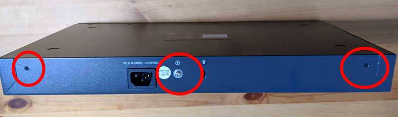
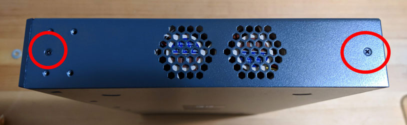
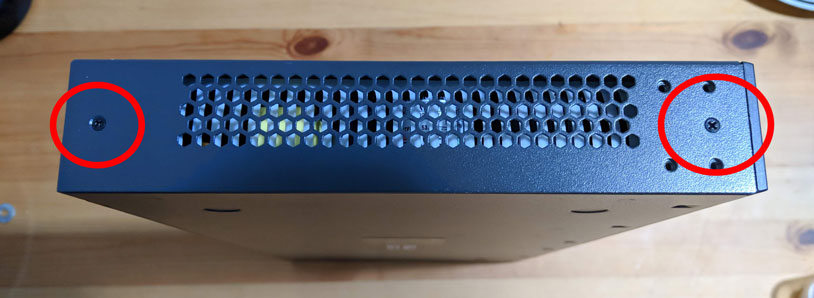

Remove the front cover by pressing down on the tabs and popping it off

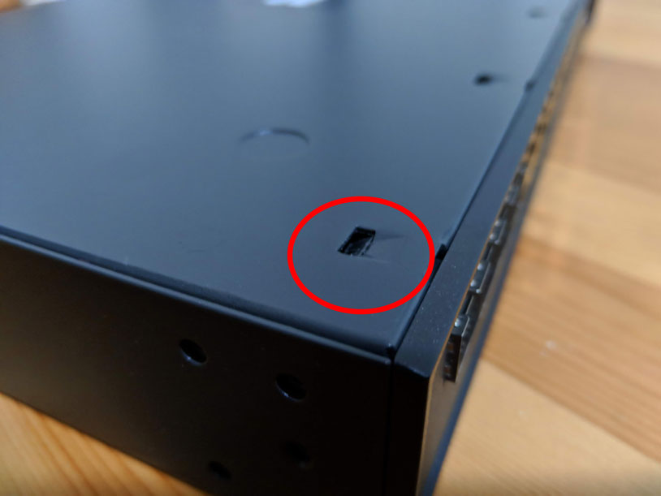
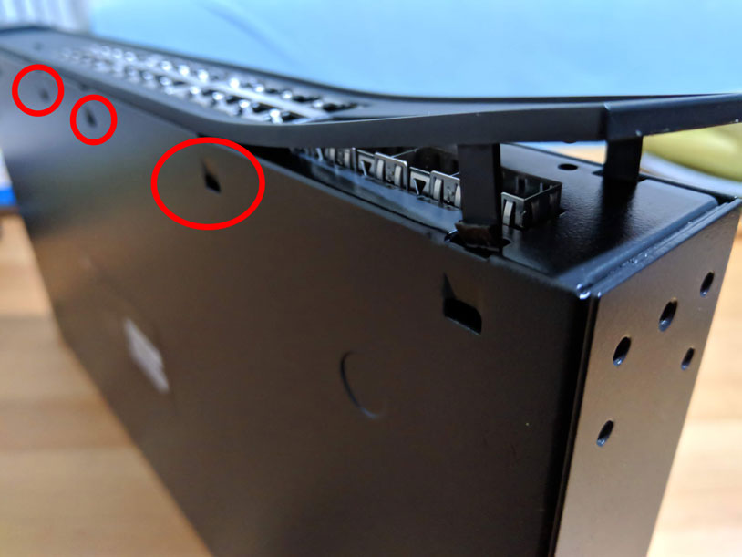
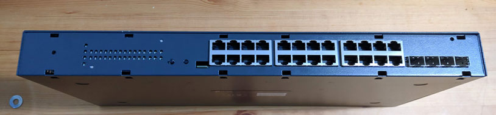

Slide the switch's top cover off. This can take some force. I forgot to take photos at this part. There is a gap naer the back of the switch. Try to wedge something in the gap to push them apart slowly.

Once the top is off, next is to remove the fans. If there is glue on the fan port, remove it with some pliers, but make sure to hold the capacitor down so it doesn't come off too.

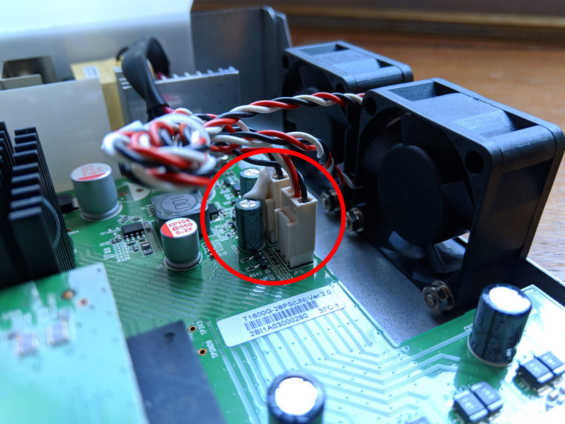
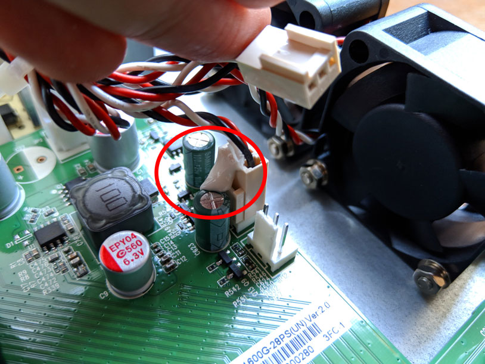
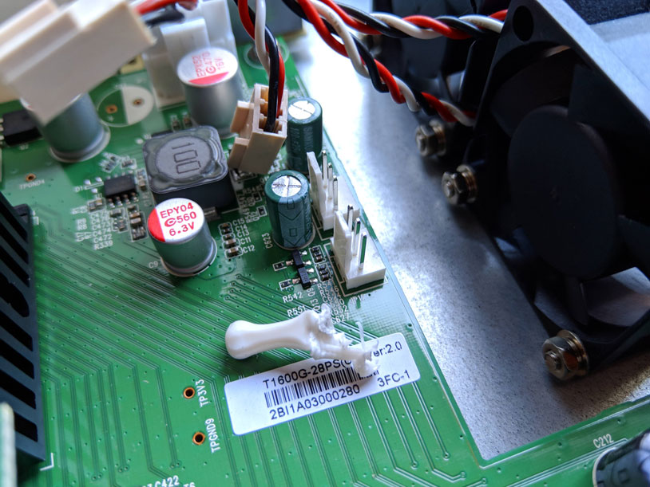

Next is to remove the fans. There are two screws holding them to the frame. Make sure you memorise the order of the washer and nuts.

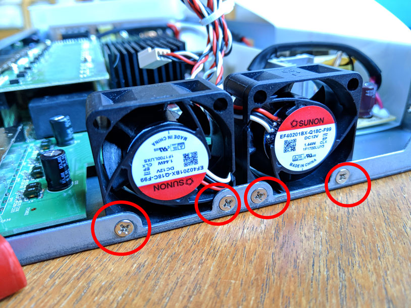

TP-Link has installed the fan ports the other way around for whatever reason. They can be pulled straight out and flipped around.

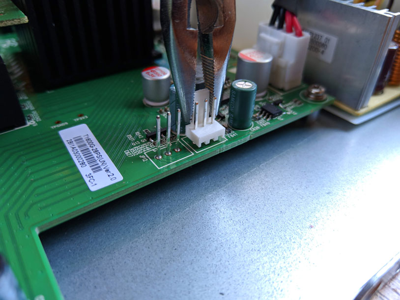
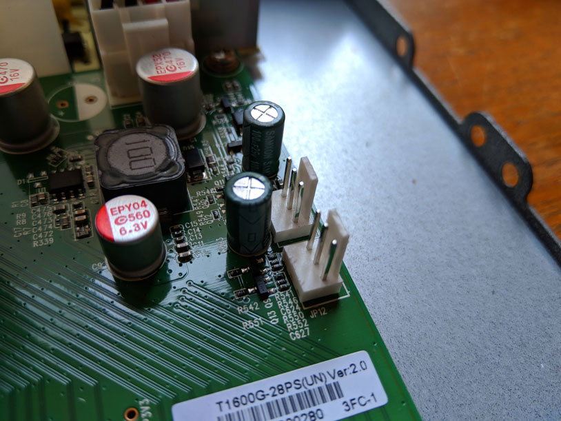

Install your new fans

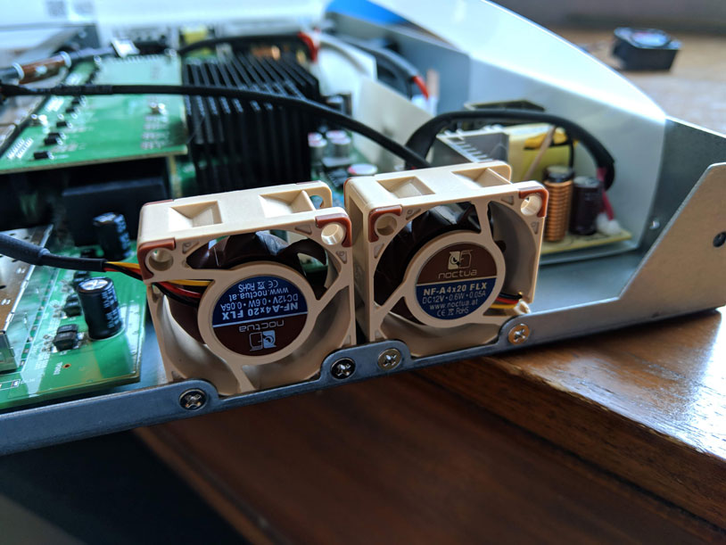
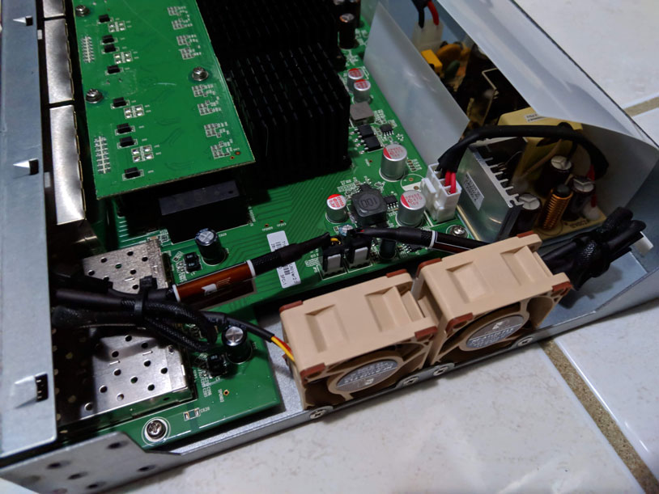

[Two notes by zeroZshadow over on GitHub](https://github.com/calvinbui/calvin.me/issues/16):

1. Noctua fans while quieter, are a significant step down in cooling power. This might be problematic for switches in warm closed spaces or that are under load.
2. Some units have a fan status LED appearing to indicate an issue with the fans. This can be safely ignored.
