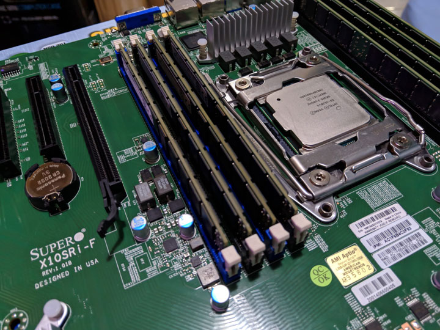
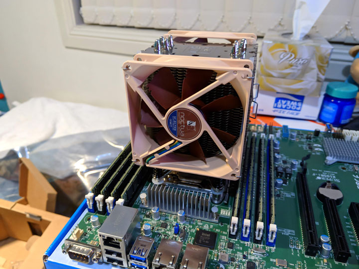
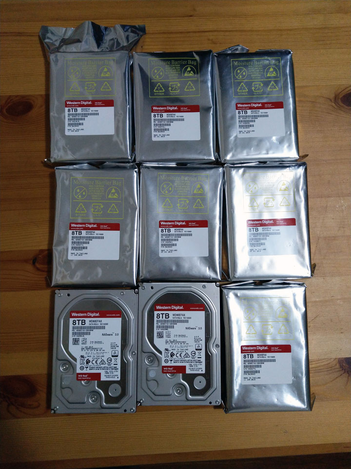
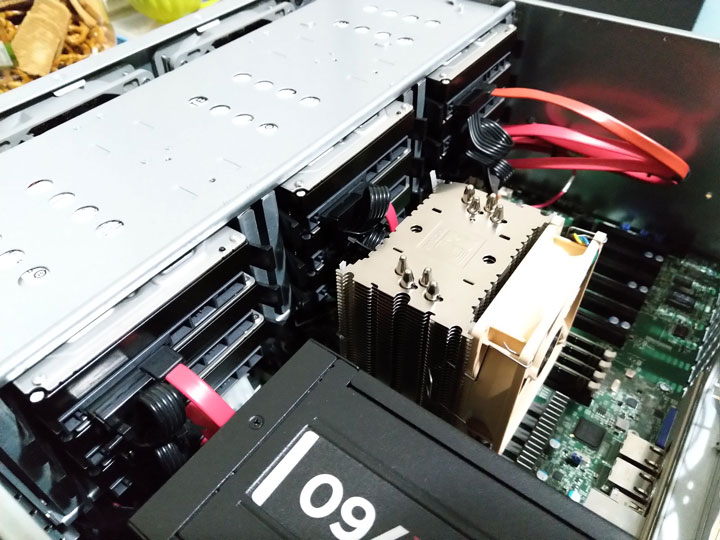
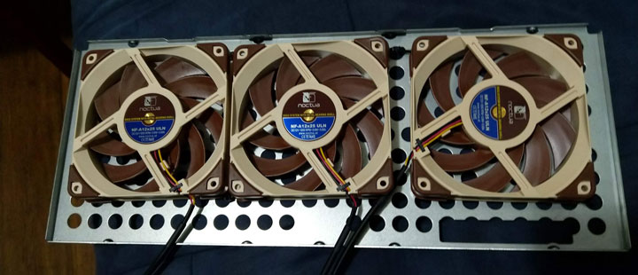
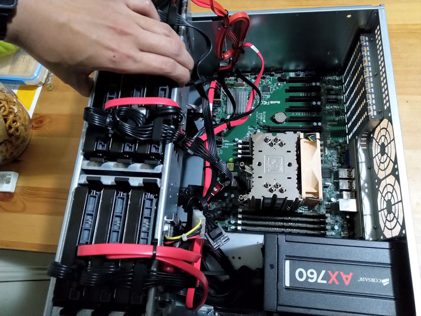

It's been 5 years since my last one and I was starting to run out of space.

<!-- more -->

## Reason for upgrade

The drives I used at the time, WD Se, had 5 years warranty and I couldn't risk them all dying on me at the same time.

The last FreeNAS server was built in mid-2014 with 24TB of raw space. In a RAID-Z2 configuration, it left me with 14.3TB. You can read more about that in my [previous post](/all-in-one-esxi-server).

## Hardware

| Type             | Item                                                                                                                                        |
|------------------|---------------------------------------------------------------------------------------------------------------------------------------------|
| **CPU**          | [Intel Xeon E5-1620 V4](https://ark.intel.com/content/www/us/en/ark/products/92991/intel-xeon-processor-e5-1620-v4-10m-cache-3-50-ghz.html) |
| **Memory**       | 16GB Micron 128GB VLP DDR4 x 8 (128GB)                                                                                                      |
| **Motherboard**  | [Supermicro X10SRi-F](https://www.supermicro.com/products/motherboard/xeon/c600/X10SRi-F.cfm)                                               |
| **Case**         | [Norco RPC-431](http://www.norcotek.com/product/rpc-431/)                                                                                   |
| **Power Supply** | Corsair AX760                                                                                                                               |
| **SSD**          | Intel 520 120GB SSD                                                                                                                         |
| **HDD**          | Seagate Ironwolf 8TB x 9                                                                                                                    |
| **CPU Cooler**   | [Noctua NH-U9DX i4](https://noctua.at/en/nh-u9dx-i4)                                                                                        |
| **Front fans**   | [Noctua NF A12x25 ULN](https://noctua.at/en/nf-a12x25-uln) x 3                                                                              |
| **Rear fans**    | [Noctua NF-A8 FLX](https://noctua.at/en/products/fan/nf-a8-flx) x 2                                                                         |

I want to talk about a few bits of hardware:

**Supermicro X10SRi-F**: An upgraded version of the [Supermicro X10SL7-F](https://www.supermicro.com/products/motherboard/Xeon/C220/X10SL7-F.cfm) which I used in my last build. Supports 10 drives via SATA and 1TB of RAM.

**Intel Xeon E5-1620 V4**: A pretty powerful CPU which isn't necessary for FreeNAS, but the motherboard needed an E5 processor. I chose this as I found a good price for it on eBay.

**128GB RAM**: I went with more memory than required (it's recommended to do 1TB = 1GB of RAM) so the next upgrade I do wouldn't a completely new server like this time. My previous motherboard only supported 32GB max, this new one supports up to 1TB (1000GB).

**Norco RPC-431**: A very short-depth case that can hold 9 drives. I had a hard time finding cases that were shorter than 400mm that could fit this many drives. The airflow isn't the best which is why I had to mod it a bit. More on that later on.

**Seagate Ironwolf 8TB**: A drive with 3 years warranty, 2 less than my previous drives. In terms of price per TB, 4TB was still king with 8TB coming next. The enterprise 5 year drives were too expensive for me this time around. Compared to the WD Red drives, these run slower but that also means quieter and cooler.

## Adding Fans

The airflow in the Norco RPC-431 is pretty bad. There's an option to put 2 x 120mm on the front and 2 x 80mm fans on the rear. From the front to the rear, there is very little room for air to be pushed through due to the hard drive bays.

It's a given you will need the rear dual 80mm fans to exhaust the hot air built up inside. Any time I hold my hand behind the server, there is guaranteed to be warm air being exhausted.

At the front, instead of installing two fans, I chose to zip tie together three Noctua NF A12x25 fans. With all these fans, the hard drives stay roughly around 40 degrees. This is higher than ideal.

## Completed Build

With the completed build, I have 47.9TB of usable storage in RAID-Z2. So far I've used 11.3TB with 36.5TB remaining.

