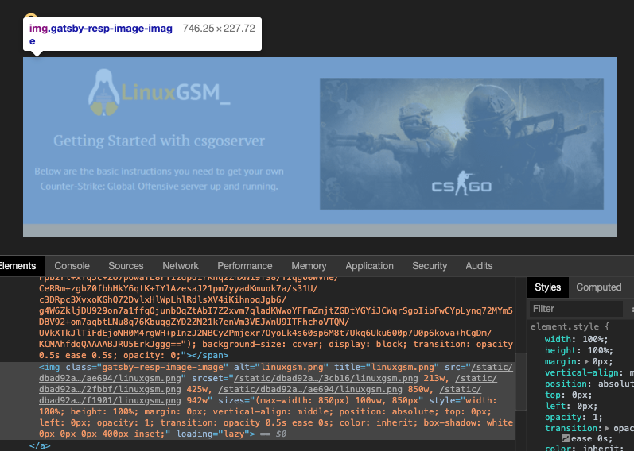
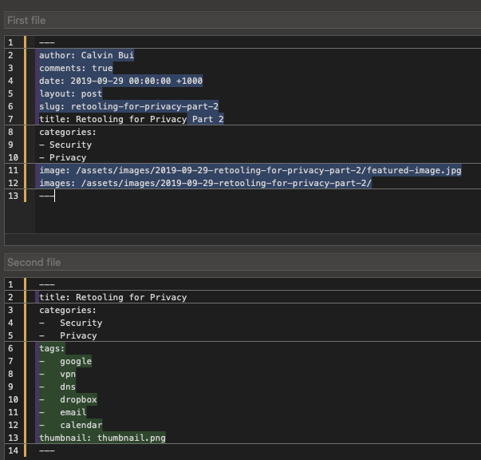
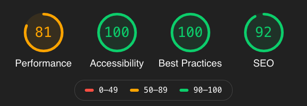
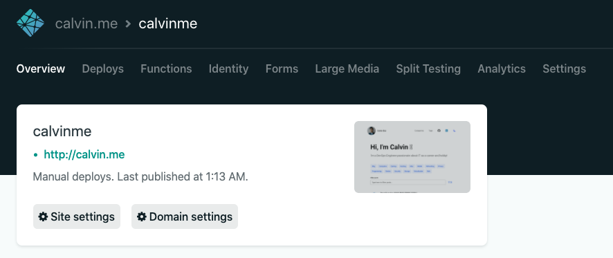

After [three and half years of Jekyll](/wordpress-to-jekyll), I've made the move over to [GatsbyJS](https://www.gatsbyjs.org/).

<!-- more -->

## Introduction

GatsbyJS was introduced to me by [Kia Storm](https://github.com/kiastorm), an up and coming frontend developer who previously worked at Autopilot. What stood out to me was the [Progressive Web App](https://en.wikipedia.org/wiki/Progressive_web_application) capabilities which made the site feel **FAST**.

The entire source code can be found on GitHub at [calvinbui/calvin.me](https://github.com/calvinbui/calvin.me)

## Goals

There were a few things I wanted to achieve with the change.

### Dark Mode

Dark mode is available by clicking the Moon icon in the top right corner.

### Collaboration

To make this site more collaborative, it's easier to suggest changes.

On the top of every post, there's an _Edit_ link which will go straight to repository to create a new PR. Feel free to add your name and a link to your profile on the edit as well.


### RSS Feed

An RSS feed is available at [/rss.xml](/rss.xml) to subscribe to posts. This was a feature a few readers used on WordPress which has removed when moving to Jekyll. This is done using [gatsby-plugin-feed](https://www.gatsbyjs.org/packages/gatsby-plugin-feed/).

### Easier to start writing

Writing a blog post was always a big pain for me. I removed almost all of these pain points:

#### Finding a featured image and formatting it.

After writing each post I would have to find a featured image. This image then had to be edited in Photoshop, exported in two sizes (small and large), renamed and optimised using [FileOptimizer](https://nikkhokkho.sourceforge.io/static.php?page=FileOptimizer) or [ImageOptim](https://imageoptim.com/mac).

Now all I have to do is find an image and rename it to `thumbnail.svg` so that [gatsby-image](https://www.gatsbyjs.org/packages/gatsby-image/) and [gatsby-transformer-sharp](https://www.gatsbyjs.org/packages/gatsby-transformer-sharp) can take care of the rest.



#### Folder and files

I used to lump all my posts under `/posts/<slug>` and images under `/image/<slug>`. Now they live together under `/posts/<slug>`. This doesn't seem like much but now I don't have to rename two folders when I change a slug anymore!

```shell-session
$ tree posts/2020-01-31-managing-the-perfect-csgo-server
posts/2020-01-31-managing-the-perfect-csgo-server
├── crosshair.png
├── index.md
├── linuxgsm.png
├── rankme.png
├── slack-bot.png
├── thumbnail.png
└── weaponskin.jpg

0 directories, 7 files
```

#### Remove duplication from post frontmatter

Frontmatter is a blog at the start of a post's markdown specifying it's metadata such as `date`, `categories`, `tags` and `title`.

Previously I had a lot of duplicated items in the frontmatter such as the `slug`, `date`, `featured-image`, `image_directory`. These has been removed so only what I need to edit exists.



#### Browser Reloading

Developing in GatsbyJS is easy as the browser automatically refreshes!

## Deployment

Moving from Jekyll, I no longer rely on GitHub Pages to build and serve the site. I'm now using a combination of Gatsby Cloud, Netlify and Cloudflare. All of which are free.

### Gatsby Cloud

[Gatsby Cloud](https://www.gatsbyjs.com/) is responsible for building the site. It builds the site whenever a new commit is pushed. The free tier provides 25 free builds and previews per day. A really nice feature is that it runs [Google's Lighthouse](https://developers.google.com/web/tools/lighthouse/) tool to audit the site.



### Netlify

[Netlify](https://netlify.com/) is a CDN responsible for website hosting. It can also build the site and I could move over to it if I wanted.

The Netlify version of the site is available at [https://calvinme.netlify.app/](https://calvinme.netlify.app/)



### Cloudflare

Cloudflare is responsible for DNS but also it's caching and automatic optimisations. This will reduce Netlify bandwidth usage, which isn't free like GitHub Pages was.

## Future

There are some things that still need to be done:

- Hamburger menu on mobile devices for [Categories](/categories/) and [Tags](/tags/)
- Automatically load `thumbnail.svg` instead of having to specify it in the frontmatter
- A fuzzy filter search
