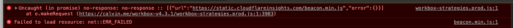

A few more changes building on top of [my previous post](/now-powered-by-gatsby).

<!-- more -->

## Better Search

Searching is now a partial search instead of a sub-string search

## Comment System

I've moved off [Disqus](https://disqus.com/) over to [Remark42](https://github.com/umputun/remark42). This is to be more privacy friendly.

## Serve Fonts Locally

Another change to be more privacy friendly. [Google's Roboto font](https://fonts.google.com/specimen/Roboto) is now being served from this website.

## Use Netlify for Builds

Netlify can also build this website in addition to serving it on their CDN. This removes the need to use Gatsby Cloud which had little benefit besides the Lighthouse Auditing.

## Delete Cloudflare

Another privacy change. Proxying through Cloudflare gave me a TLS/SSL certificate but also meant Cloudflare was injecting it's own analytics into each page.

To combat this I switched my DNS and cert over to Netlify. Netlify already builds the site (above) and it's CDN is more or less the same as proxying through Cloudflare. Netlify is also able to provide a cert through Let's Encrypt once I changed my DNS Nameservers over to them.
