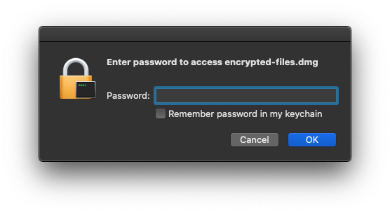

[John The Ripper](https://www.openwall.com/john/) is a free and open-source software for fast password cracking. Cracking DMG, RAR and other types of passwords is made easier using [magnumripper's "jumbo" version of John The Ripper](https://github.com/magnumripper/JohnTheRipper).
<!-- more -->

## Install John

Install John The Ripper using `brew`

```shell-session
$ brew install john-jumbo
```

## Find John The Ripper Utilities Folder

John comes with extra utilities to help generate hashes. By default `brew` does not install/symlink john's extra utilities to the PATH folder `/usr/local/bin`. The path can be found in a variety of ways:

1. Using `ls` and following the path will eventually return `/usr/local/Cellar/john-jumbo/1.9.0/share/john/` or similar:

```shell-session
$ ls -al /usr/local/bin/john
lrwxr-xr-x 1 admin admin 35 Mar 16 20:04 /usr/local/bin/john -> ../Cellar/john-jumbo/1.9.0/bin/john

$ ls -al /usr/local/Cellar/john-jumbo/1.9.0/bin/john
lrwxr-xr-x 1 calvin staff 18 May 15  2019 /usr/local/Cellar/john-jumbo/1.9.0/bin/john -> ../share/john/john

$ ls -1 /usr/local/Cellar/john-jumbo/1.9.0/share/john/ | head -n 5
1password2john.py
7z2john.pl
DPAPImk2john.py
SIPdump
adxcsouf2john.py
```

2. If you have `readlink` installed, it's even easier:

```shell-session
$ dirname $(readlink -f /usr/local/bin/john)
/usr/local/Cellar/john-jumbo/1.9.0/share/john
```

## Generating Hashes

When cracking files, John cracks the hash of the password rather than the file itself. To generate the hash files, we use the extra utilities from the folder in the last step.

For DMG files, we'll pass the `encrypted-files.dmg` file to the `dmg2john` command and output the hash to a `.hash` file.

```shell-session
$ /usr/local/Cellar/john-jumbo/1.9.0/share/john/dmg2john encrypted-files.dmg > encrypted-files.dmg.hash
encrypted-files.dmg (DMG v2) successfully parsed, iterations count 333333
```

The other tools available to generate hash files are:

- RAR: `rar2john_cmd`
- PDF: `pdf2john.pl`
- ZIP: `zip2john`
- 7Z: `7z2john.pl`

## Crack the Hash

The last step is to crack the hash. We use the `john` tool directly for this step.

To ensure the GPU instead of the CPU is doing the cracking, specify a format with `-opencl` in its suffix. For example, `dmg` will be significantly slower than using `dmg-opencl`.

```shell-session
$ john --format=dmg-opencl encrypted-files.dmg.hash
Device 3: AMD Radeon Pro 560X Compute Engine
Using default input encoding: UTF-8
Loaded 1 password hash (dmg-opencl, Apple DMG [PBKDF2-SHA1 3DES/AES OpenCL])
Cost 1 (iteration count) is 333333 for all loaded hashes
Cost 2 (version) is 2 for all loaded hashes
Error creating binary cache file: No such file or directory
Press 'q' or Ctrl-C to abort, almost any other key for status
Warning: Only 13888 candidates left, minimum 16384 needed for performance.
abc_123 (encrypted-files.dmg)
1g 0:00:00:57 N/A 0.01747g/s 815.3p/s 815.3c/s 815.3C/s abc_000..abc_123
Use the "--show" option to display all of the cracked passwords reliably
Session completed
```

You can see the password above is `abc_123`. If it's not clear you can run `john --show encrypted-files.dmg.hash` to present it clearer.

To make things even faster, if you have an idea of what the password is, you can pass a regular expression to john using the `--mask` flag.

```shell-session
$ john --format=dmg-opencl --mask="abc_[0-9][0-9][0-9]" encrypted-files.dmg.hash
```

Another thing I like to do at the end is remove the password on the DMG file and keep it empty:

```shell-session
$ printf '%s\0' abc_123 '' | hdiutil chpass encrypted-files.dmg -oldstdinpass -newstdinpass
```

Now when you open it, click the OK button.



## Script

To put all the above together, I use this script to set aliases to crack DMG files

```bash
#!/usr/bin/env bash

dmg2john_cmd(){
  echo "Generating hash file"
  "$(dirname $(readlink -f /usr/local/bin/john))/dmg2john" "$1"
}

dmgcrack(){
  dmg="$1"
  dmg2john_cmd "${dmg}" > "${dmg}".hash
  john --format=dmg-opencl "${dmg}".hash
  password=$(john --show "${dmg}".hash | sed '1q;d' | cut -d':' -f2)
  echo "The password for $dmg is $password"
  echo "Setting empty password"
  printf '%s\0' "$password" '' | hdiutil chpass "${dmg}" -oldstdinpass -newstdinpass
  rm "${dmg}".hash
}
```
