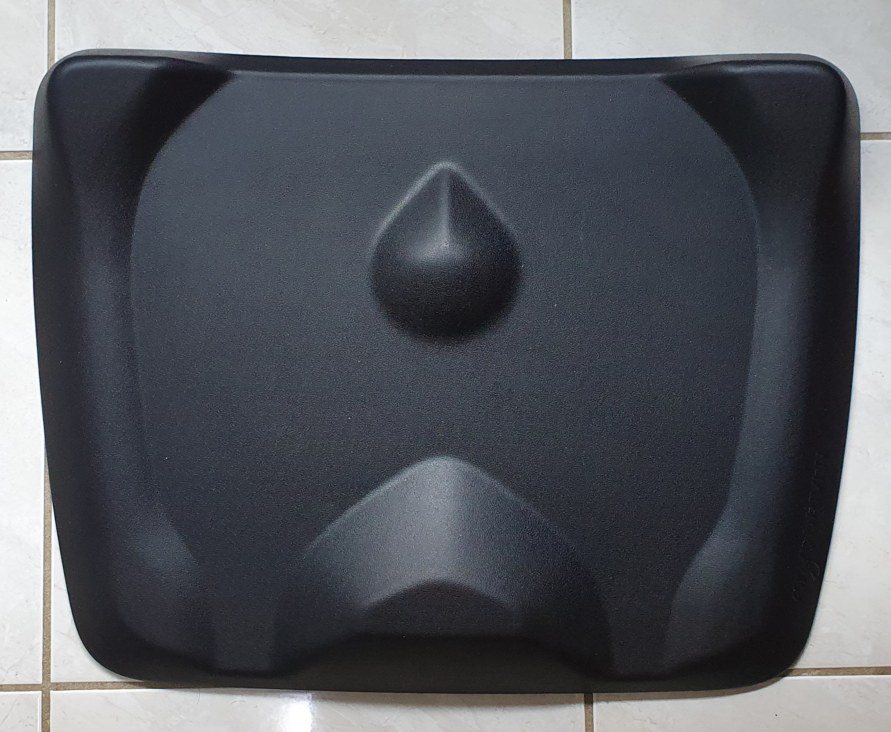
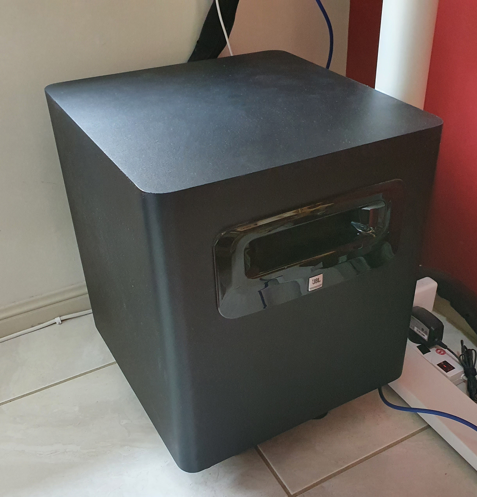
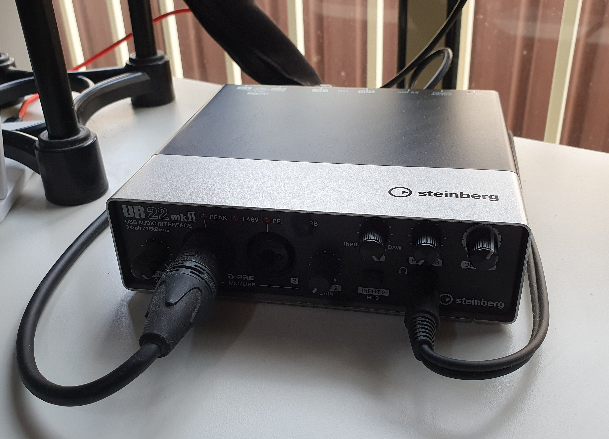
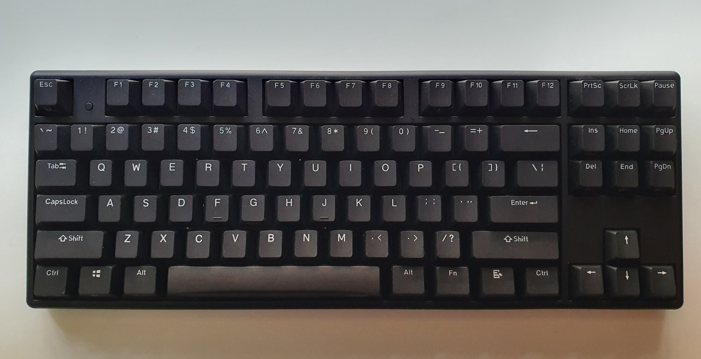
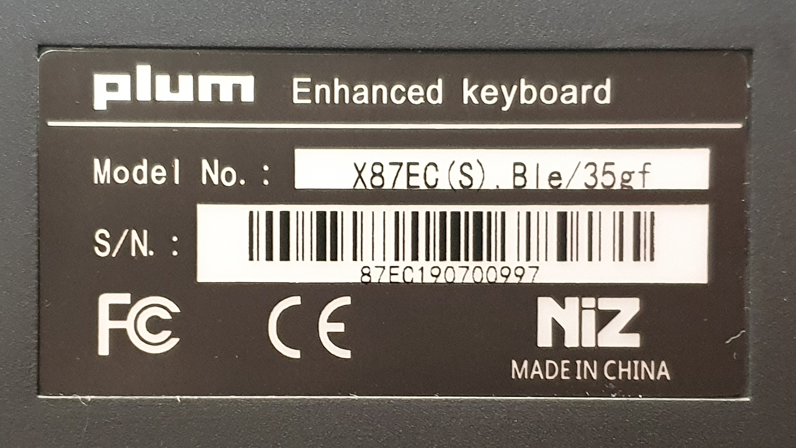
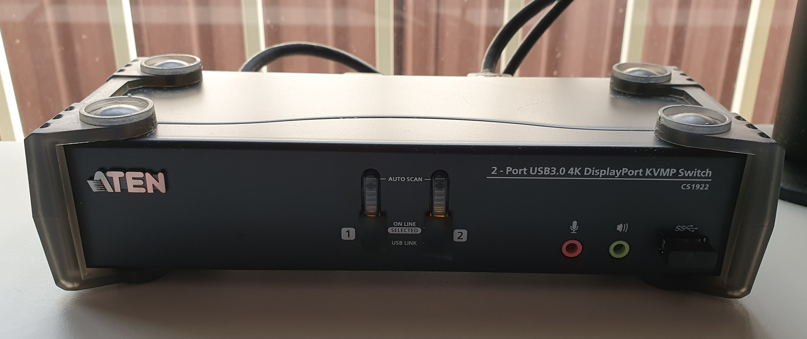
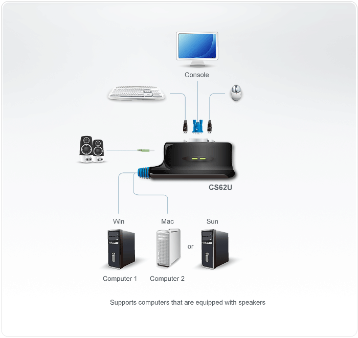
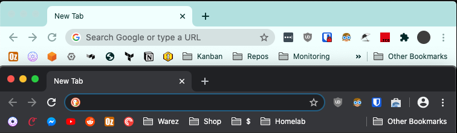
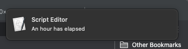

Due to unprecedented times, I'm working from home.

<!-- more -->

```toc
# This code block gets replaced with the TOC
```

## My Setup


Everything was purchased before the pandemic which is lucky as prices have gone up for all these items.

### Desk

[IKEA Bekant](https://www.ikea.com/au/en/p/bekant-corner-desk-right-sit-stand-white-s09222520/). Sit/stand desk that I pair with a [Topo Mini from Ergodriven](https://www.amazon.com/Ergodriven-Not-Flat-Standing-Anti-Fatigue-Calculated/dp/B01N8YE3VI?ac_md=3-2-QWJvdmUgJDYw-ac_d_pm&psc=1).



### Monitor

[Acer Predator X34P](https://www.acer.com/ac/en/GB/content/predator-model/UM.CX0EE.P01). Features:

- Ultrawide, 3440x1400
- High refresh rate
- G-Sync
- IPS Panel

### Speakers

[JBL LSR 305P MKII](https://www.jbl.com/studio-monitors/305PMKII-.html) and [JBK LSR310S Subwoofer](https://jblpro.com/products/lsr310s). This is connected to a [Steinburg UR22 MKII](https://www.steinberg.net/en/products/audio_interfaces/ur_series/models/ur22mkii.html) audio interface.





### Microphone

- [Rode Procaster](http://www.rode.com/microphones/procaster). Connects using XLR to my Steinburg UR22 MKII audio interface.
- [Rode PSM1 Shock Mount](http://www.rode.com/accessories/psm1).
- [Rode WS2 Pop Filter/Wind Shield](http://www.rode.com/accessories/ws2).
- [Rode PSA1 Boom Arm](http://www.rode.com/accessories/psa1). Mounted on the side of the my desk.

### Headphones

[Sennheiser HD58X](https://drop.com/buy/massdrop-x-sennheiser-hd-58x-jubilee-headphones). I used to have a [HD6XX and Bottlehead Crack](/bottlehead-crack-build-log) and my ears haven't found any difference.


### Webcam

[Logitech C922](https://www.logitech.com/en-us/product/c922-pro-stream-webcam). Not pictured. Wished it had Windows Hello.

### Keyboard

[Niz X87 EC-Ble 35g](https://www.nizkeyboard.com/collections/peripherals/products/niz-2019-new-x87-electro-capacitive-bluetooth-keyboard-non-rgb-white-black?variant=30347148099655). An electro-capactive knock-off of Topre switches. I've fitted mine with 10g springs to bring the weight up to 45g which feels even nicer to type on.






### Mice

I have three different mice that I switch between throughout the day to reduce fatigue and other nasty illnesses that can happen to your hands and wrists. Each is wireless and the battery life lasts months!

- [Logitech G603](https://www.logitechg.com/en-us/products/gaming-mice/g603-lightspeed-wireless-gaming-mouse.html)
- [Logitech MX Ergo](https://www.logitech.com/en-au/product/mx-ergo-wireless-trackball-mouse)
- [Logitech MX Vertical](https://www.logitech.com/en-us/product/mx-vertical-ergonomic-mouse)


Chair: [Herman Miller Aeron Remastered](https://www.hermanmiller.com/products/seating/office-chairs/aeron-chairs/)


## Switching between my PC and Laptop



With a single button press I am able to move all USB devices (keyboard, mice, speakers and webcam) and the display over to my PC or Mac without having to unplug and plug anything. This is done with a device called a [KVM Switch](https://en.wikipedia.org/wiki/KVM_switch), short for keyboard, video and mouse. The KVM I have is an [Aten CS1922 2-Port USB3.0 4K KVMP Switch](https://www.aten.com/global/en/products/kvm/desktop-kvm-switches/cs1922/).

This model supports [NVIDIA G-Sync](https://developer.nvidia.com/g-sync) as well as my monitor's 100hz refresh rate via DisplayPort. This is a welcome upgrade where previously my laptop was connected via HDMI and stuck on 60hz.

The image below is the best diagram I could find from Aten to explain a KVM Switch:



## Automatically Switch Default Browser

This is a cronjob I made to switch my Mac's default browser between my work and personal browsers at 9AM and 5PM.



I keep [Google Chrome](https://www.google.com.au/chrome/) as my default browser during work and [Ungoogled Chromium](https://github.com/Eloston/ungoogled-chromium) as my personal browser. This allows me to separate their extensions, firewall rules and bookmarks from each other.

I don't take my laptop home from work so I've always been okay with Google Chrome as my default browser at all times. But with the current pandemic, it's with me all the time and always connected to my peripherals so I tend to keep using outside of work hours.

Changing the default browser is important when I start clicking links in chat applications ([Slack](https://slack.com)/[Mattermost](https://mattermost.com)) and email clients ([Outlook](https://outlook.live.com/owa/)/[Thunderbird](https://www.thunderbird.net)). Both browsers have different logins and cookies and it's better to not let those trackers link my work and personal online profiles.

I stumbled across [DefaultBrowserTool by pvieito](https://github.com/pvieito/DefaultBrowserTool) which changes the default browser on macOS programmatically.

I've added this to my crontab to change to Google Chrome 9AM and change to Ungoogled Chromium at 5PM, each weekday.

```shell-session
$ crontab -l
# change default browser to chrome each morning
0 9 * * 1-5 swift run DefaultBrowserTool --input com.google.Chrome -f
# change default browser to chromium in the afternoon
0 17 * * 1-5 swift run DefaultBrowserTool --input org.chromium.Chromium -f
```

## Stand/Sit Down Alert

To keep active and not become a slouch, I've set up another cronjob to send a macOS alert and a message through my speakers when each hour has passed. This gives me a reminder to get up, stretch and change between sitting and standing.

```shell-session
$ crontab -l
# standing time
0 * * * * osascript -e 'display notification "An hour has elapsed"' && say An hour has elapsed
```


