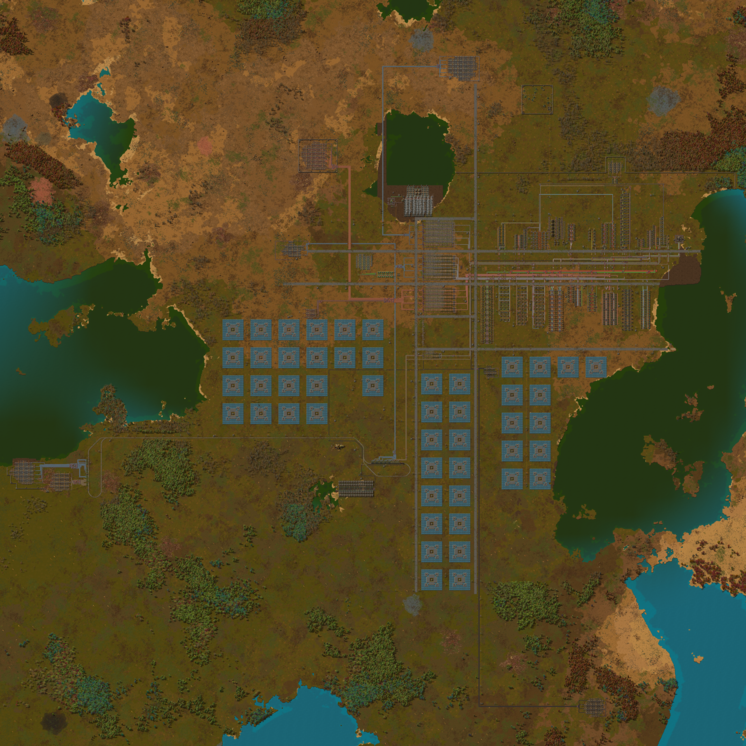
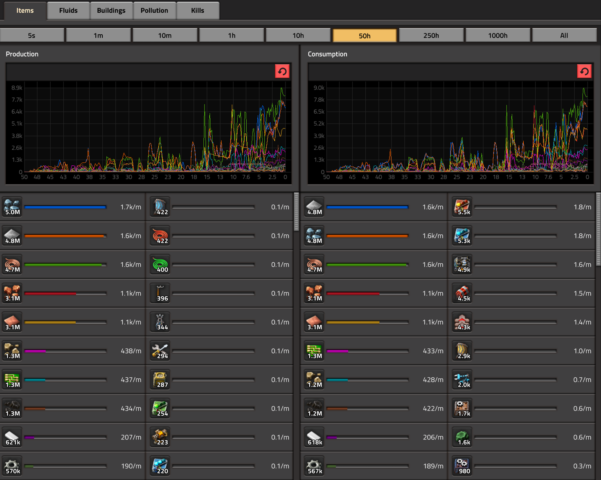
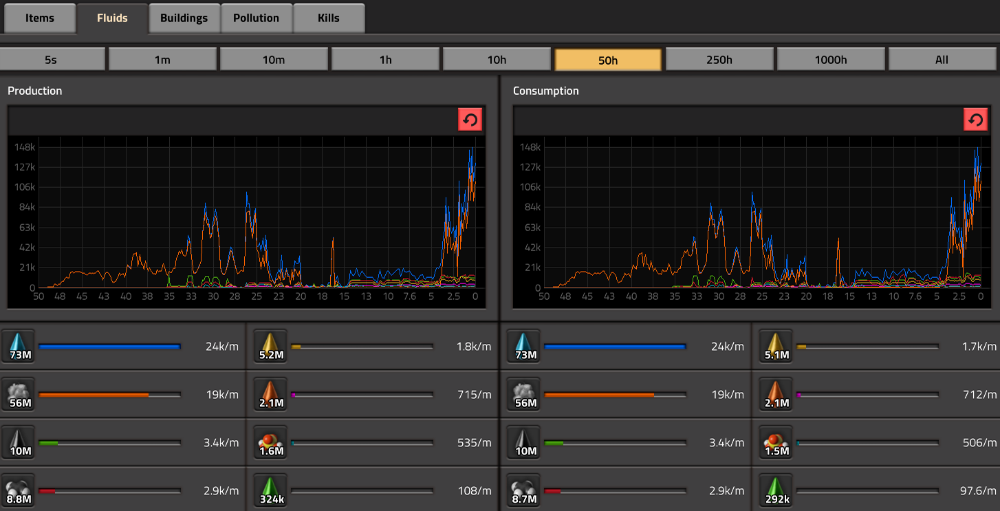
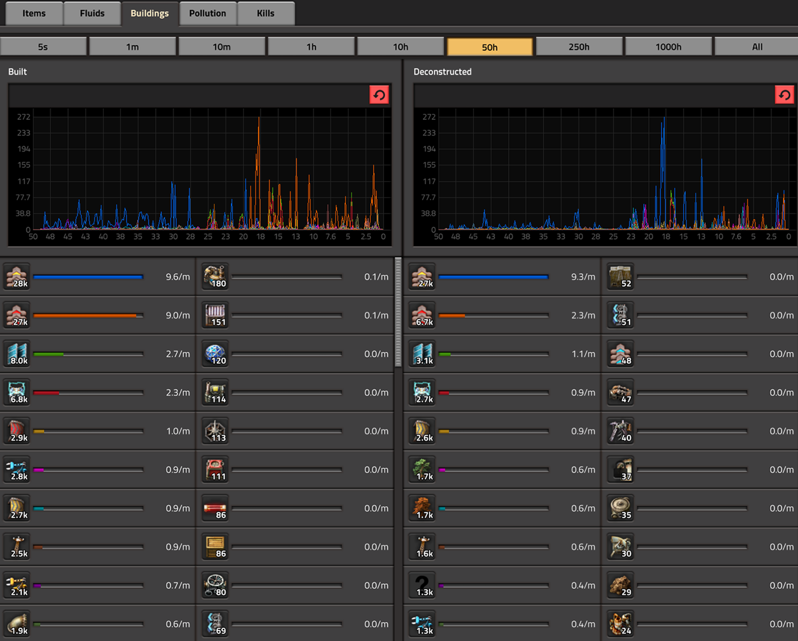
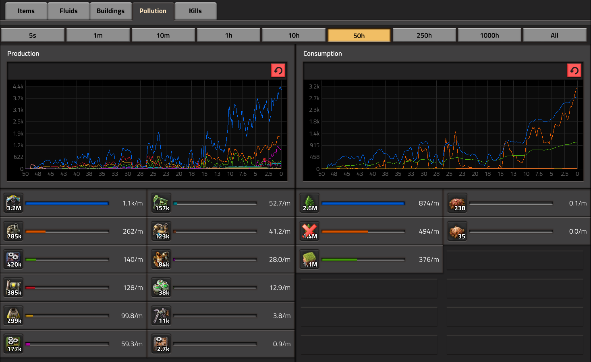
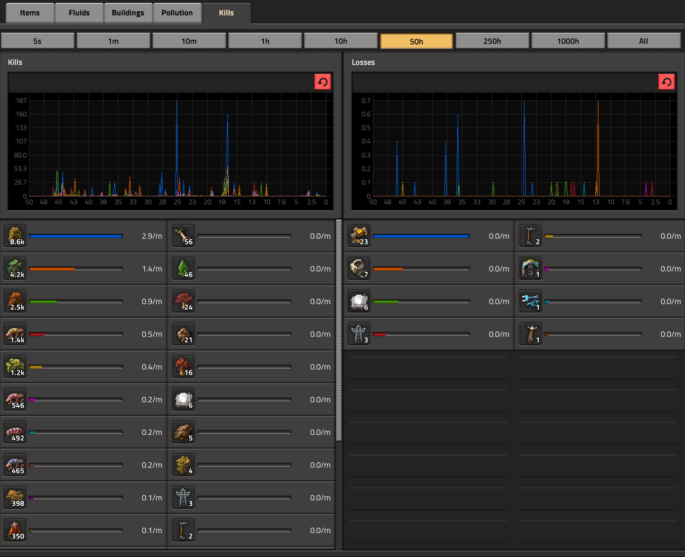
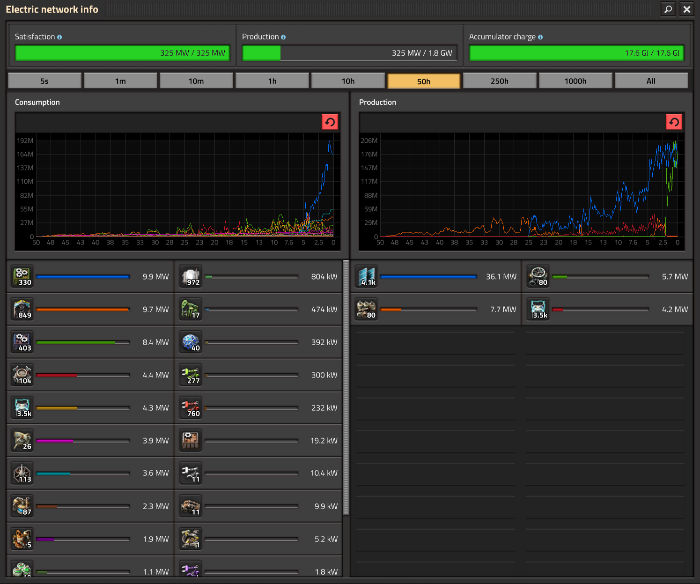

I finished Factorio for the first time in just under 50 hours. I waited for the 1.0 release to play it and it was well worth it.

<!-- more -->

```toc
# This code block gets replaced with the TOC
```

## What is Factorio?

The premise in [Factorio](https://www.factorio.com/) is: you are an engineer/scientist that has crash landed onto an alien planet. This planet has Earthly natural resources such as trees, water, iron ore, copper, oil and uranium. Your goal is to use these resources to launch a rocket (and leave!).

Watch these amazing trailers for more:

<iframe src="https://www.youtube.com/embed/J8SBp4SyvLc" allowfullscreen width="1280" height="720"></iframe>

<iframe src="https://www.youtube.com/embed/BqaAjgpsoW8" allowfullscreen width="1280" height="720"></iframe>

## My First Base

> Click the image below to open a 45MB 16384x16384 image

[](base-full.jpg)

Watch my rocket launch:

<video controls width="100%" height="auto">
  <source type="video/mp4" src="rocket.mp4">
  <p>Your browser does not support the video element.</p>
</video>

## Blueprints

- [Belt Balancers](https://pastebin.com/igs2CvVd)
- [Science](https://pastebin.com/bgjAa9Bx)
- [Rocket Parts](https://pastebin.com/5wLy8jMP)
- [Nuclear Power](https://pastebin.com/QEJBwdXL)
- [Plastic and Sulfur](https://pastebin.com/PHqfMA3f)
- [Green/Red/Blue Circuits](https://pastebin.com/f7LjnmtV)
- [Hub](https://pastebin.com/DW7Thk8G)
- [Oil Refining](https://pastebin.com/Uv90sjmQ)

## Mods

- [Afraid of the Dark](https://mods.factorio.com/mod/AfraidOfTheDark): Brightens up the game during night time
- [Bottleneck](https://mods.factorio.com/mod/Bottleneck): Indicates if machines are working, limited by input or limited by output
- [Bullet Trails](https://mods.factorio.com/mod/bullet-trails): Adds trails to bullets
- [Car/Tank/Spidertron Locator Button](https://mods.factorio.com/mod/car-finder): Marks the location of your vehicle on the map
- [Disco Science](https://mods.factorio.com/mod/DiscoScience): A fun mod to flash science labs the colour they're consuming
- [Even Distribution](https://mods.factorio.com/mod/even-distribution): Better resource distribution when placing items into machines
- [FNEI](https://mods.factorio.com/mod/FNEI): Quick lookup for how resources/items are used
- [Honk](https://mods.factorio.com/mod/Honk): Train honks when stopping and starting
- [Long and Far Reach](https://mods.factorio.com/mod/themightygugi_longreach): Interact with entities that are 'far away'
- [Picker Pipe Tools](https://mods.factorio.com/mod/PickerPipeTools): See pipe connections
- [Squeak Through](https://mods.factorio.com/mod/Squeak%20Through): Walk in-between adjacent structures
- [VehicleSnap](https://mods.factorio.com/mod/VehicleSnap): Direction snapping while driving

## Stats

### Items



### Fluids



### Buildings



### Pollution



### Kills



### Electricity



## How I took a screenshot

At the the middle of my base and ran the console command:

```shell-session
/c game.take_screenshot{resolution = {x = 16384, y = 16384}, zoom = 0.4, show_entity_info = true}
```

This produced a 665.6MB file. GitHub has a 100MB file limit so I had to get it smaller.

To compress that down I converted it to JPEG, a lossy format, to bring it to 146.9MB:

```shell-session
$ magick convert orig.png new.jpg
```

Then following [PageSpeed Insights](https://developers.google.com/speed/docs/insights/OptimizeImages) I took it down to `70` quality from the recommended `85` to bring it down to 47.9MB. I didn't find the loss in quality to be noticeable to a quality setting of `80` or `90`, but did see it in `60`.

```shell-session
$ magick new.jpg -sampling-factor 4:2:0 -strip -quality 70 -interlace JPEG -colorspace sRGB 70.jpg
```

Finally I threw it in [ImageOptim](https://imageoptim.com/mac)/[FileOptimizer](https://nikkhokkho.sourceforge.io/static.php?page=FileOptimizer) to take another few KBs off it.
[Guetzli](https://github.com/google/guetzli/) couldn't be run on it as the image as it was too large. The image is 268,435,456 pixels so I would've required 80GB of memory (300MB per megapixel) and 80 minutes of CPU (1 minute per megapixel). It is possible to remove this limitation by [removing these lines of code](https://github.com/khavishbhundoo/guetzli/blob/patch-1/guetzli/jpeg_data_reader.cc#L153-L159).

```shell-session
$ guetzli new.jpg new-guetzli.jpg
Image too large
```
