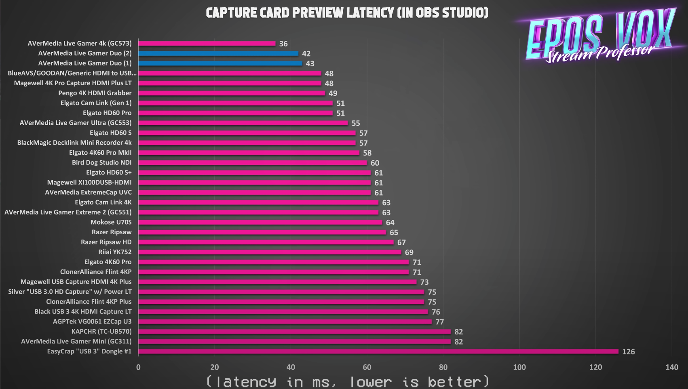
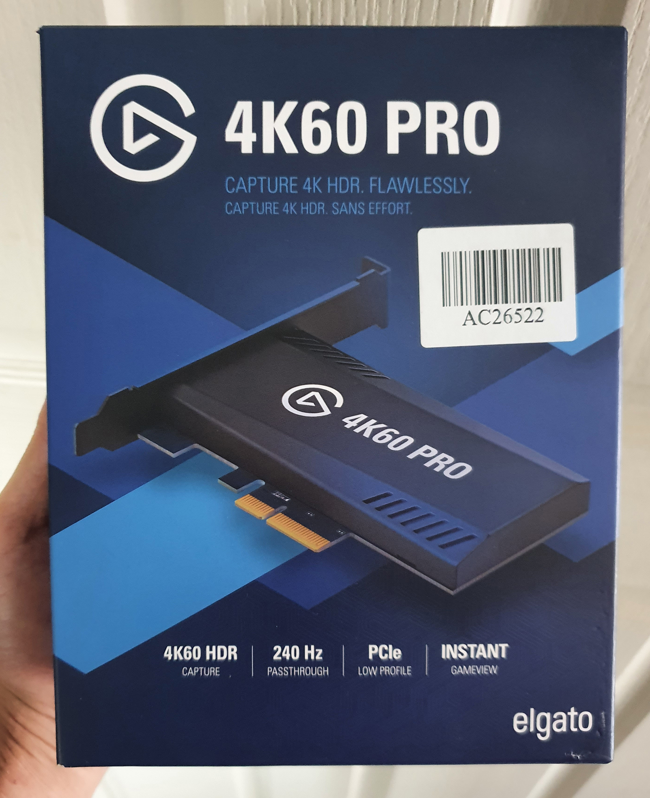
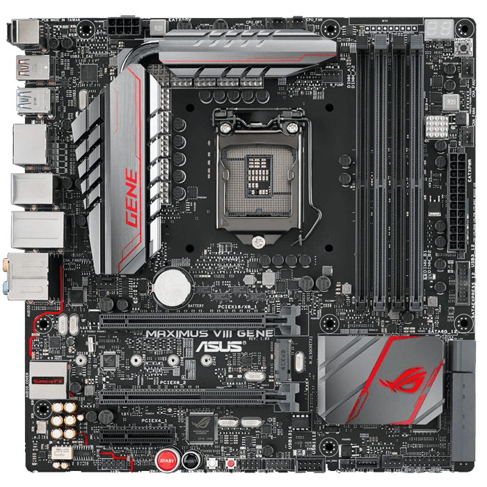
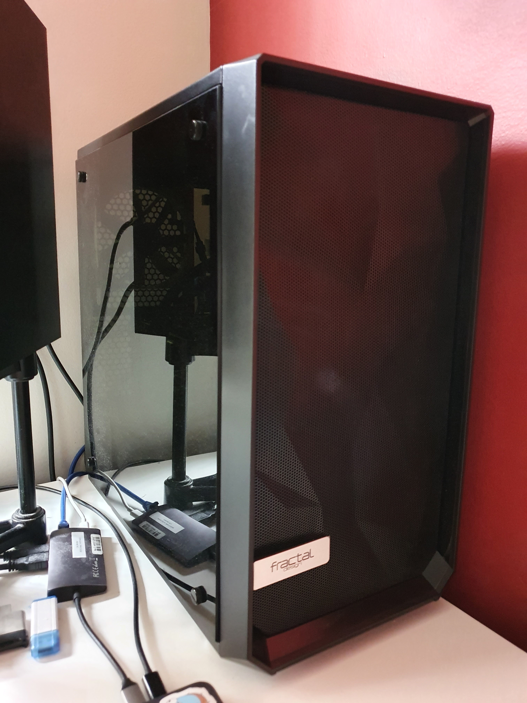
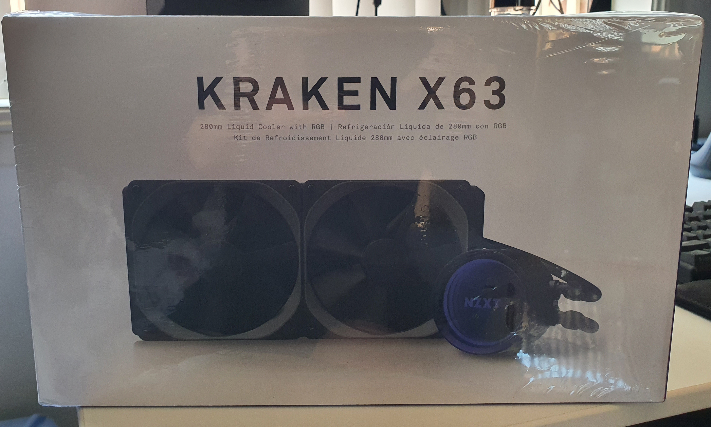
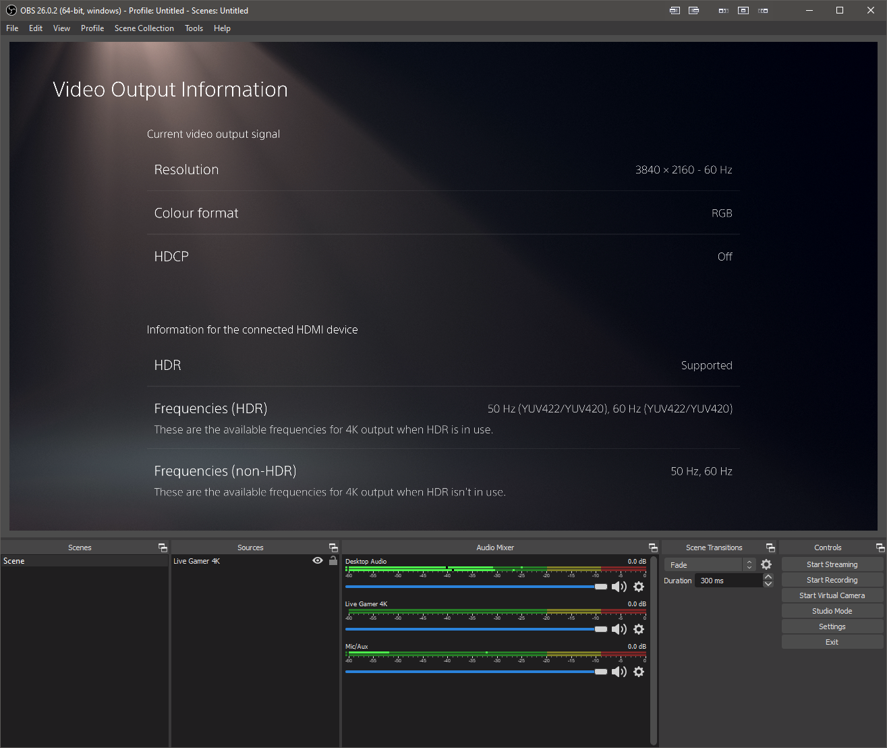

A small update to my personal computer.

<!-- more -->

## Current PC

I [blogged before about my current PC](/sff-desktop). It was built in 2017 with the [Dan A4-SFX v1](https://www.dan-cases.com/). It is a mini-ITX (mITX) system with an Intel i7 7700K and NVIDIA GTX 1080Ti.

## The Problem

I recently got a Sony PlayStation 5 (PS5). I don't have a TV in my room so I use USB capture cards to play directly from the preview with almost zero latency. The two most popular brands with this common feature are [AVerMedia](https://www.avermedia.com/us/) and [Elgato](https://www.elgato.com/en).

The PS5 is able of outputting 4K60 HDR (and even 8K) which all USB capture cards are unable to transmit.  Only PCI-e based cards have this capability but I don't have any PCI-e slots to spare in an mITX build.

The problem can be summed up as: **I need an additional PCI-e slot.**

## The Solutions

There are few ways to get another PCI-e slot:

1. **external-GPU (eGPU) enclosures**: An eGPU enclosure would give me an extra PCI-e slot but I would also need a new motherboard with Thunderbolt 3.
2. **[PCI-e bifurcation](https://blog.donbowman.ca/2017/10/06/pci-e-bifurcation-explained/)**: This is the process of splitting a 16x slot into 2 8x slots. My motherboard doesn't support this and no other Z170 or Z270 chipset boards seem to either that I could find. This would require a new computer.
3. **Get a bigger motherboard and case**: An micro-ATX or bigger motherboard have at least 2 PCI-e slots but won't fit in my Dan A4. I would also need a bigger case.

Weighing up the price of all options, the least expensive approach was **option 3**.

## Upgrades

Here's a picture of the complete system:

### Capture Card - [AVerMedia Live Gamer 4K](https://www.avermedia.com/us/product-detail/GC573)

Two PCI-e capture cards that can capture 4K 60fps, the AVerMedia Liver Gamer 4K and the [Elgato 4K60 Pro](https://www.elgato.com/en/gaming/game-capture-4k60pro).

Based on the [EposVox's latest capture card review](https://www.youtube.com/watch?v=AMuaQOXagxk&t=459s), he lists the AVerMedia having a lower the lowest preview latency at _36ms_ while the Elgato is slower at _58ms_.

I had the opportunity to try out both and could feel a difference.

### Motherboard - [ASUS Maximus VIII Gene](https://www.asus.com/us/Motherboards/MAXIMUS-VIII-GENE)

This was the only mATX board I could find across Gumtree, eBay and Facebook Marketplace that supported my Intel i7 7700K. It is a Z170 board which is a minor downgrade to my previous Z270 board. Everything I owned was compatible. The only downside is it takes forever to POST.

### Case - [Fractal Design Meshify C Mini](https://www.fractal-design.com/products/cases/meshify/meshify-c-mini-dark-tempered-glass/black/)

A medium-sized case with good airflow and enough room to fit everything. I didn't want to splurge on a unique case again to keep the cost down.

### Cooler - [NZXT Kraken X63](https://www.nzxt.com/products/kraken-x63)

I also took the opportunity to upgrade the small Noctua NH-L9i to a full-blown 280mm AIO watercooler. Slapped two Noctua NF-A14 fans on and it's whisper quiet.

## End Result

Success! Here's OBS outputting the AVerMedia Live Gamer 4K and my PS5 at 4K 60FPS!

## Future Upgrades

After all the research I've done, there are potential upgrades I've been thinking of:

- [Cooler Master NR200](https://www.coolermaster.com/catalog/cases/mini-itx/masterbox-nr200/): A mini-ITX case with no compromises to cooling and relatively cheaper than other cases. The NR200 also supports some mATX boards but I would need a different cooler.
- Intel is also releasing [Rocket Lake](https://en.wikipedia.org/wiki/Rocket_Lake) very soon and this could be a good opportunity for a full upgrade. I'm mostly GPU bound with my Acer X34P ultrawide so I won't see much performance increases in games but the newer chipset features and non-gaming tasks would be much better.
- A new graphics card. Most likely the NVIDIA RTX 3080 Ti if it happens.
- A USB capture card that can capture 4K60 with near-zero latency. I wouldn't be doing all this if it existed!
- A 2-slot [mini-DTX](https://en.wikipedia.org/wiki/DTX_%28form_factor%29) motherboard to be released. I could then squeeze everything inside the Cooler Master NR200. Right now, only [ASUS has a mini-DTX board](https://rog.asus.com/us/Motherboards/ROG-Crosshair/ROG-Crosshair-VIII-Impact-Model/) but it only has 1 PCI-e slot.
