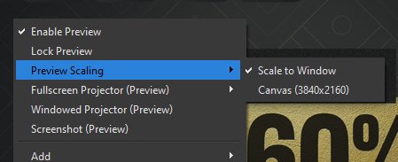
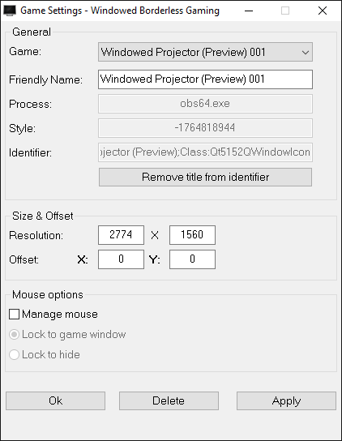

This post shows how I play console games through my PC.

<!-- more -->

```toc
# This code block gets replaced with the TOC
```

I get a confused face each felt each time I tried explaining to somebody how I intended to use a capture card I had purchased, they would give me a confused face. I tried explaining I wanted to play through the preview window but that left them even more confused. In this post, I wanted to break down how this works.

## Hardware

### Capture Card

The secret of all this is by using a capture card with very low latency. [EposVox's latest capture card review](https://www.youtube.com/watch?v=AMuaQOXagxk&t=459s) lists the AVerMedia GC573 with the lowest preview latency at _36ms_. This is the difference between what's happening inside the game and it appearing on the capture card.


I picked up the AVerMedia Live Gamer 4K for ~$200 (Australian Dollars) from a buy/sell forum. It uses a PCI-e x4 slot compared to a USB connection.


### HDMI Cable

A good quality HDMI cable is required. I had HDMI cables that did not display anything. To be safe, I went with this 15ft (4.5 meters) [certified HDMI from Monoprice](https://www.amazon.com.au/gp/product/B01GCGKFBY).

## Software

### OBS

[OBS](https://obsproject.com/) is a free video recording and live streaming software. It can pull in a lot of recording sources such as the capture card.

To add a new source, click the '+' button under sources and select **Video Capture Device**.


To enhance the quality of the input, I manually edited the canvas size within OBS' settings. Otherwise, OBS will downscale the incoming video.


Finally, change the video source preview scaling to scale to the window:



Putting it all together, it looks like this:


OBS provides a **Windowed Projector (Preview)** option which opens a bordered window of the game preview without any toolbars or docks.


At this point, it is enough for most people to start playing their consoles through the computer. However, I wanted to get every bit of my ultrawide monitor. Below I'm using another tool to remove window borders to maximise the preview size.

### Windowed Borderless Gaming

[Windowed Borderless Gaming](https://westechsolutions.net/sites/WindowedBorderlessGaming/) is a free tool that removes borders around applications and resizes them too.

Within Windowed Borderless Gaming, I have these settings targeting the OBS Windowed Projector. The resolution is for my monitor to achieve a ~16:9 aspect ratio. I also take into account the Windows Task Bar that is roughly 40 pixels tall.



With these settings, I maximised the OBS Window Project with a bit of room to spare on the side because I have an ultrawide monitor. This room can be for the game's trophy list or any helpful guides along the side.


## Automating through PowerShell

I wrote a Windows PowerShell script to automate the process of opening up OBS and Windowed Borderless Gaming.

The script is available on here on [GitHub Gists](https://gist.github.com/calvinbui/a4f325da40caaffaa2fcb465b4a8458d). Change lines referencing OBS or Windowed Borderless Gaming to their respective directories.

An OBS plugin called [obs-websockets](https://github.com/Palakis/obs-websocket) will also be required to allow PowerShell to control OBS to open the Windowed Projector Preview. Enable it within **OBS > Tools > WebSocket Server Settings**


The script is written to entirely open and close both OBS and Windowed Borderless Gaming idempotently.
