The official Book Cover Keyboard Case from Samsung provides zero protection around the edges of the tablet. My goal was to combine a cheap TPU case to give it the protection it needs.

<!-- more -->

```toc
# This code block gets replaced with the TOC
```

## Samsung Galaxy Tab S7+

I bought this tablet because it was the best Android tablet I could find. What drew me to the device were:

- the large AMOLED screen and powerful chip to stream 4K videos
- the integrations with my Galaxy S10+ (call & text, hotspot)
- support for Android 11 and future updates commitments by Samsung

But this isn't a review for the tablet.

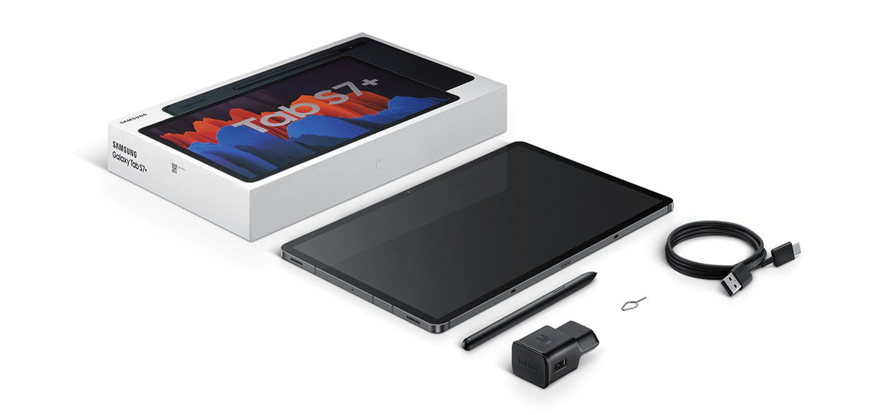

## Official Book Cover Keyboard Case

In Australia, [Samsung sell the Book Cover Keyboard case for $359](https://www.samsung.com/au/mobile-accessories/galaxy-tab-s7-plus-book-cover-keyboard-dt970-ef-dt970ubegww/). This is expensive as it is possible to purchase a Bluetooth keyboard + trackpad combo for ~$40 on eBay.

The rear folding hinge cover attaches onto the back using magnets built into itself and the tablet. There are no other cases on the market that have a versatile hinge like this one.

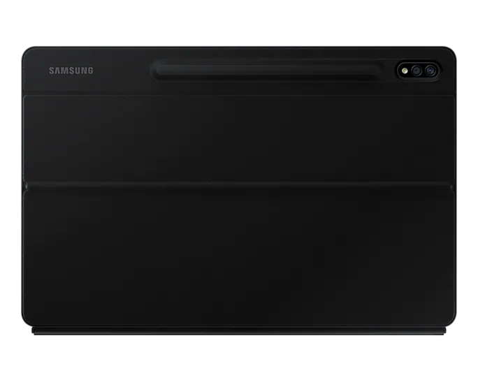

The keyboard/trackpad combo connects using three POGO pins to the bottom of the tablet. The back of the keyboard is a hard plastic that acts as a 'book cover' for the screen.

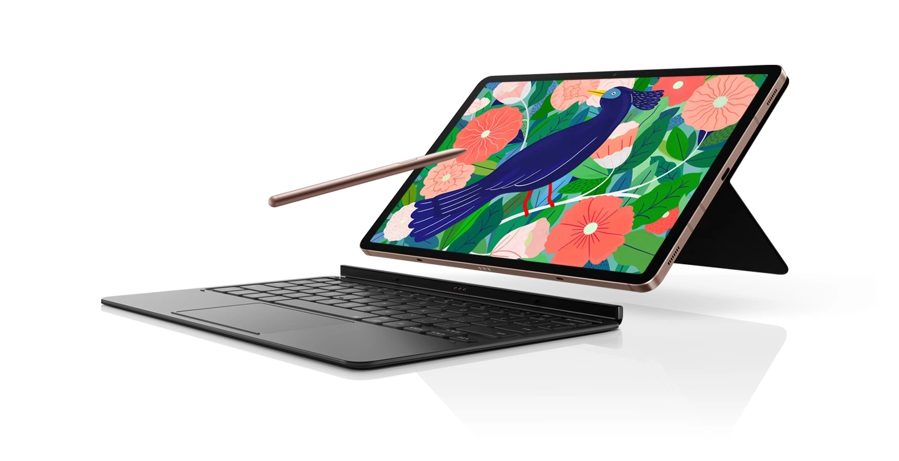

The main problem with this case is it provides zero protection around the side edges of the tablet. Also, as shown in the photos below, the bottom of the tablet is touching the ground and can scratch it when used without a keyboard.

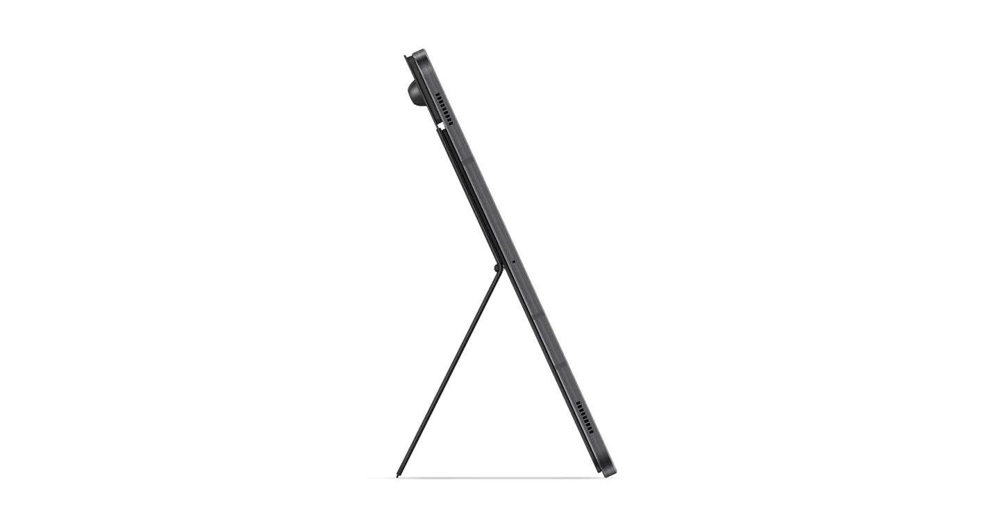

The sides of the tablet have zero protection:

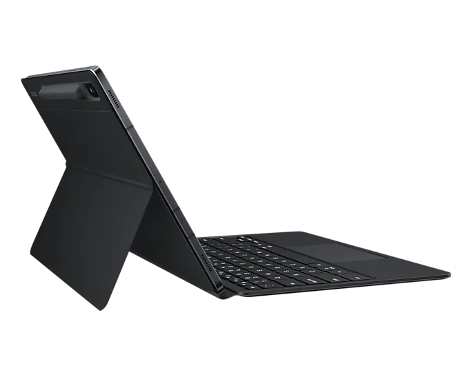

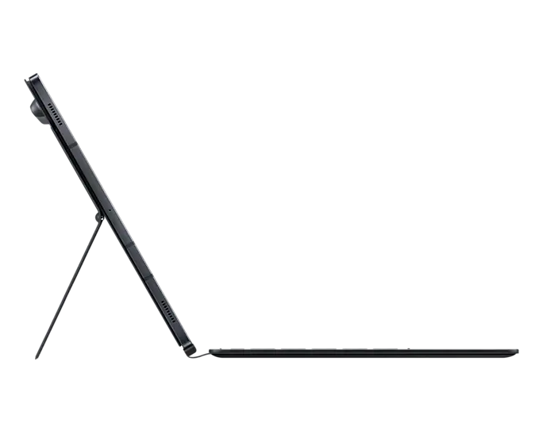

## TPU Case

My goal was to combine a cheap TPU case to give the tablet the protection it needs when combined with the Book Cover Keyboard Case. On eBay, these sold for $7.99 with free shipping.

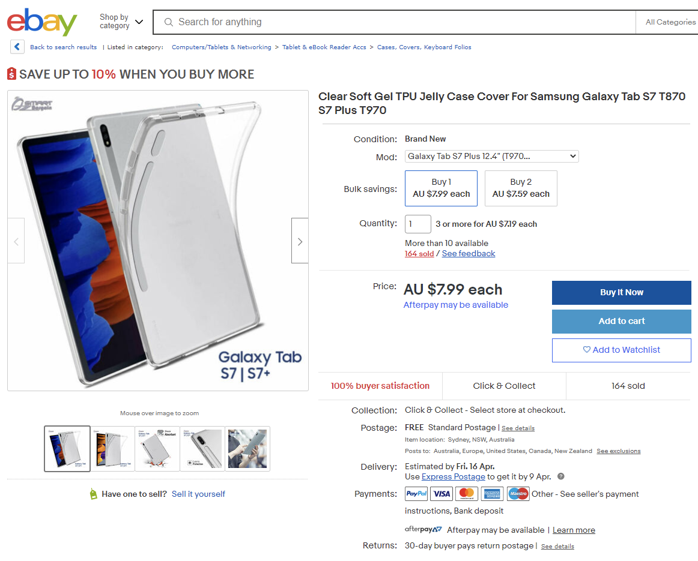

## Magnets

As mentioned above, the Book Cover Keyboard Case attaches to the tablet using magnets. I bought 3mm x 2mm circular rare earth magnets and attached them to each point possible on the back cover. Note that some points alternate between positive and negative, so I had to flip it around if needed. Around the tablet, each point had four magnetic points while the top areas had only two.

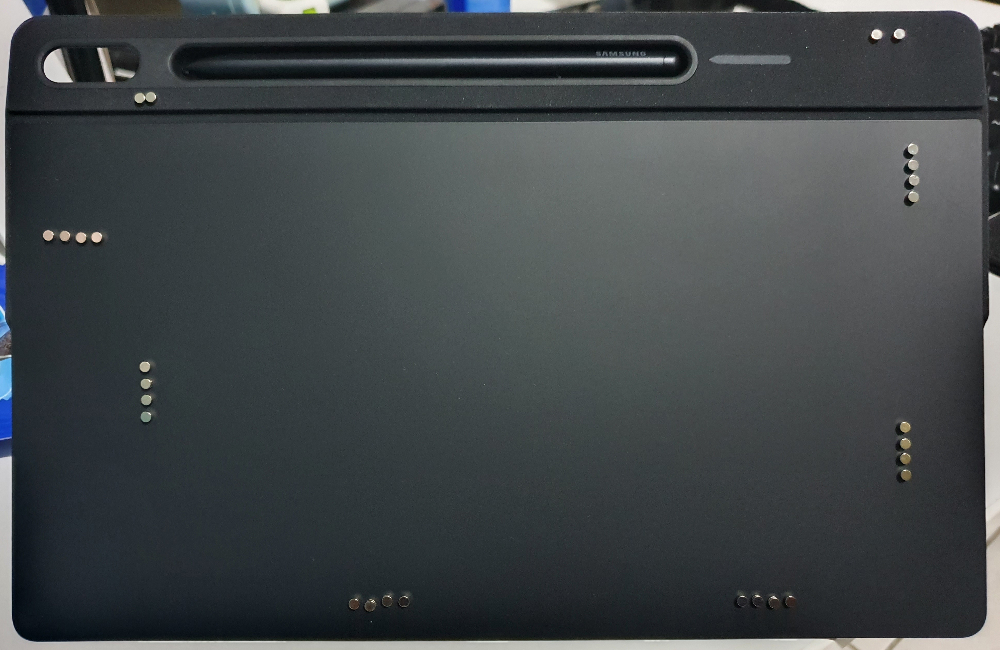

They are advertised as being 2mm thick but measured 1.72mm.

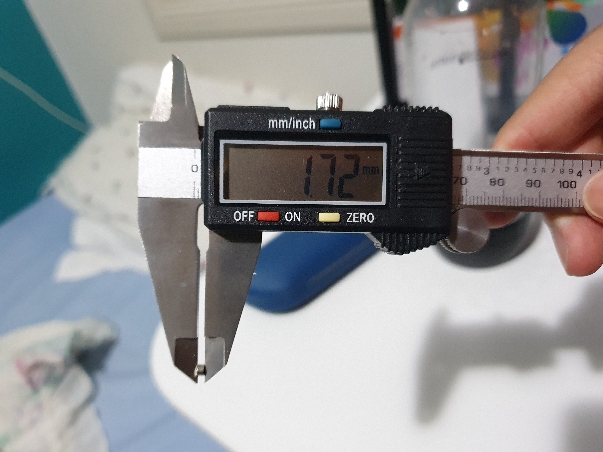

## Cutting

Using these points, I marked areas to cut on the TPU case. I cut the TPU case using pliers and a box cutter.


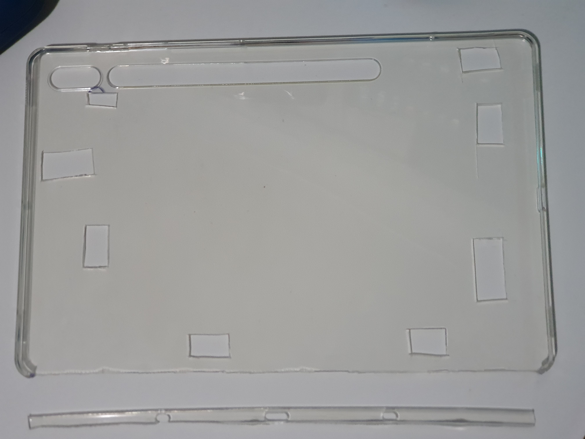

The case itself is 1.85mm thick, 0.13mm smaller than the magnets, but I didn't see any issues with it.

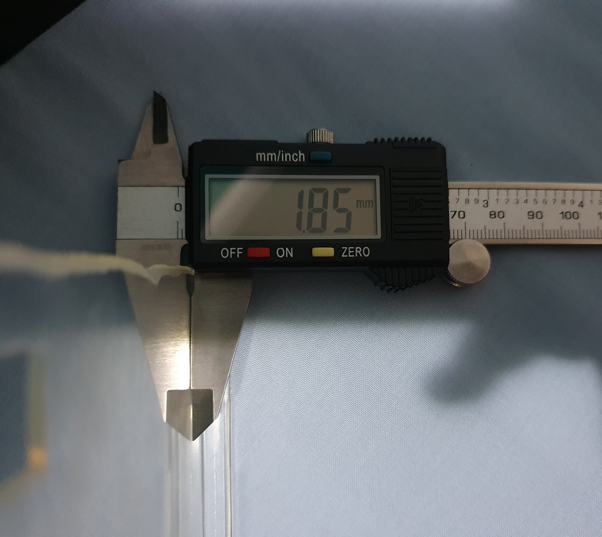

I also cut the bottom edge off the TPU case to fit the keyboard as the POGO pins don't reach the pads. I cut just enough, so the keyboard case can be attached.

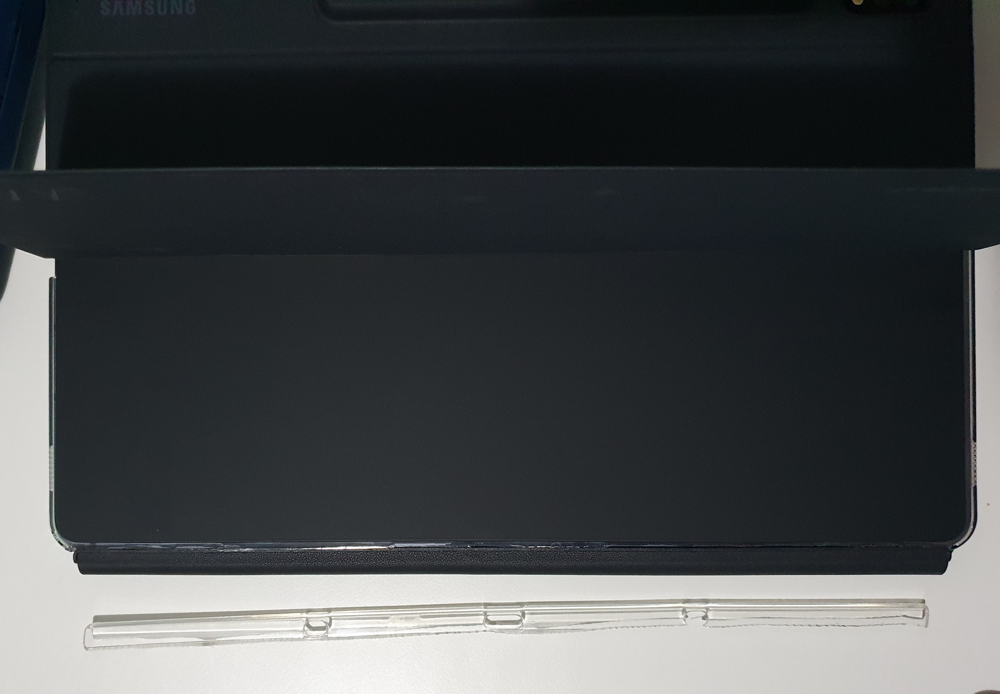

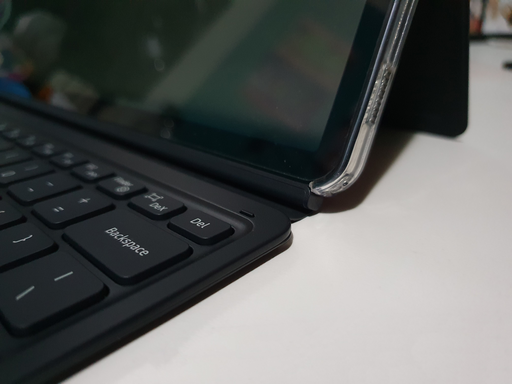

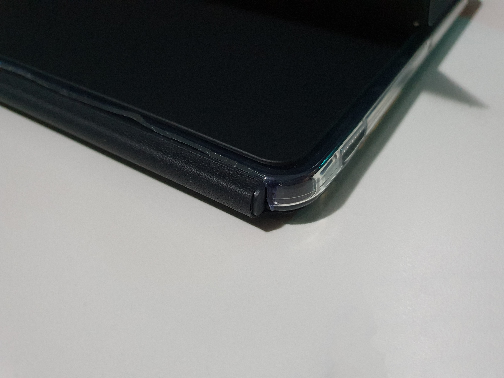

## Complete

Here are photos of the mod once completed:

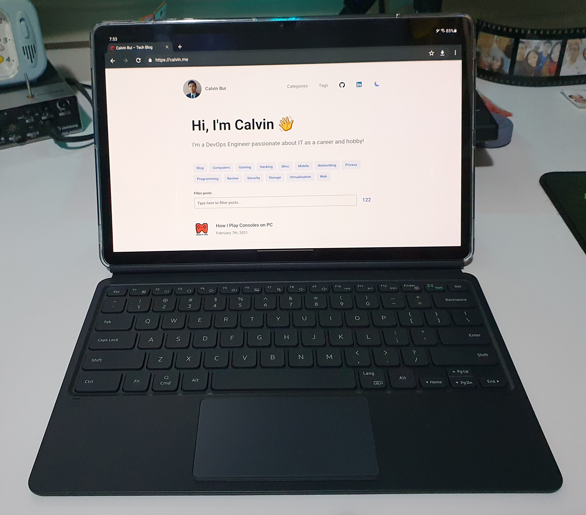


The rear case is also strong enough to hold up the weight of the tablet with the keyboard attached.

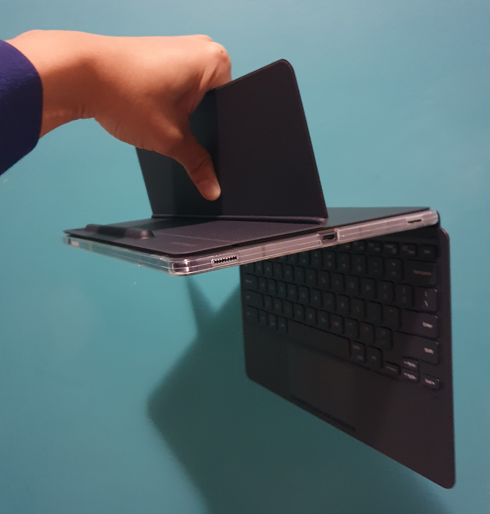
