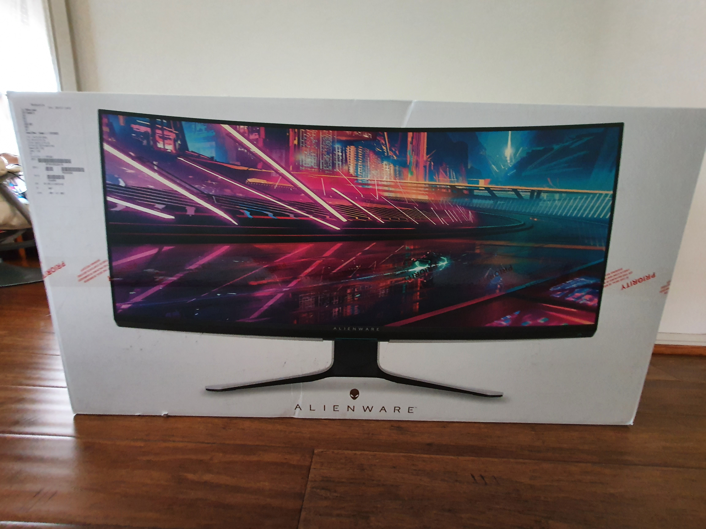
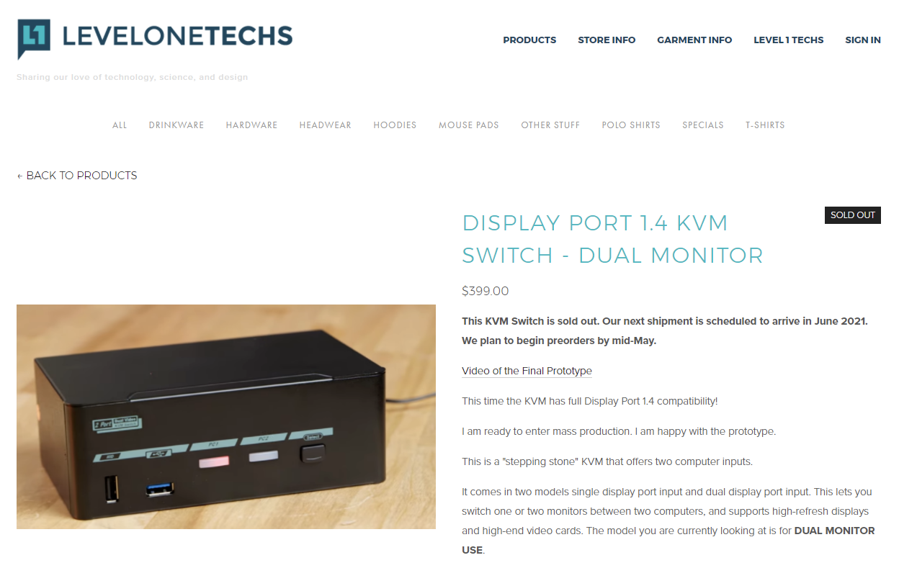
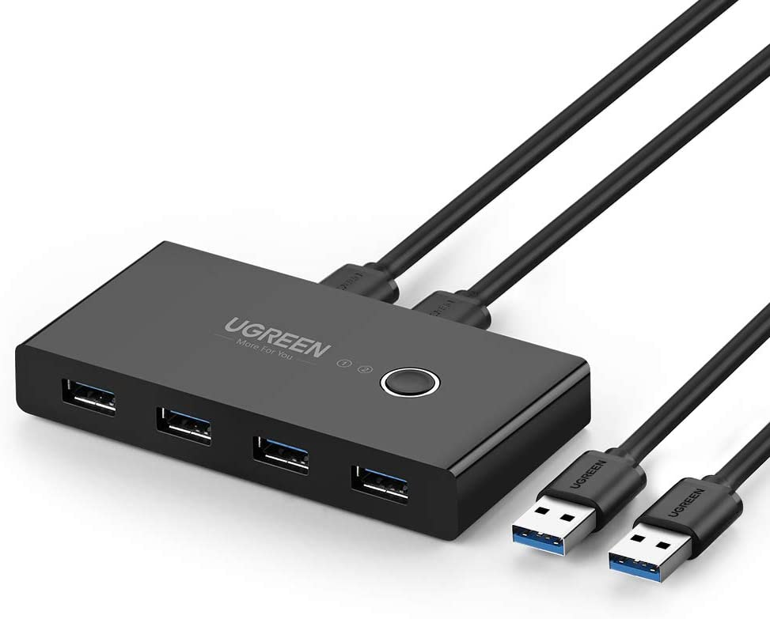
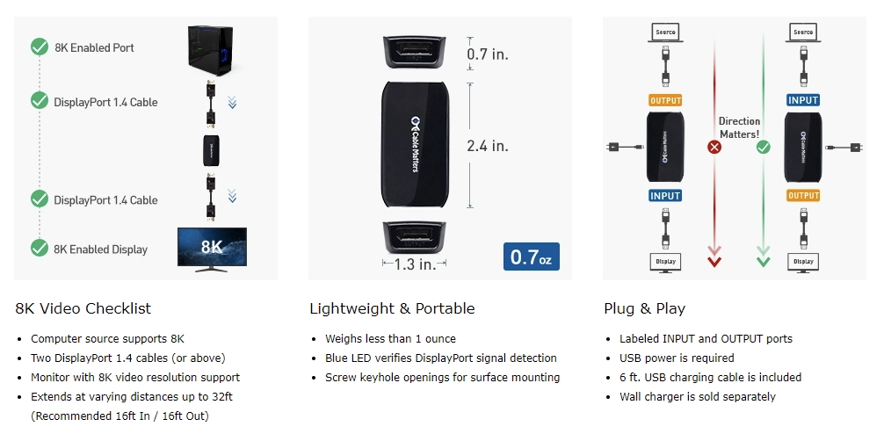
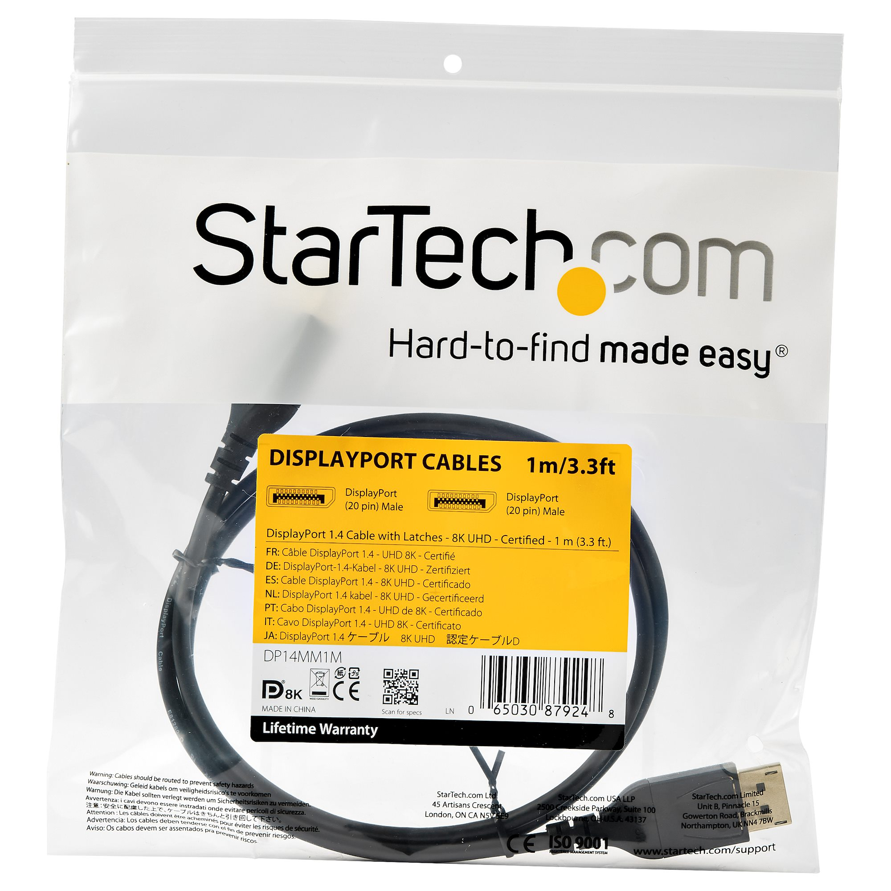
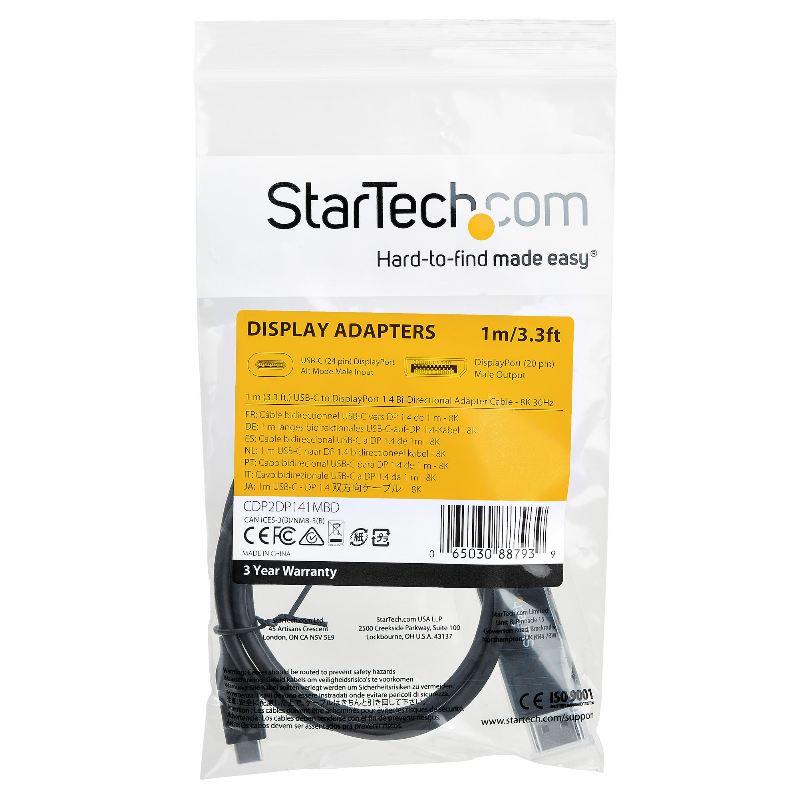
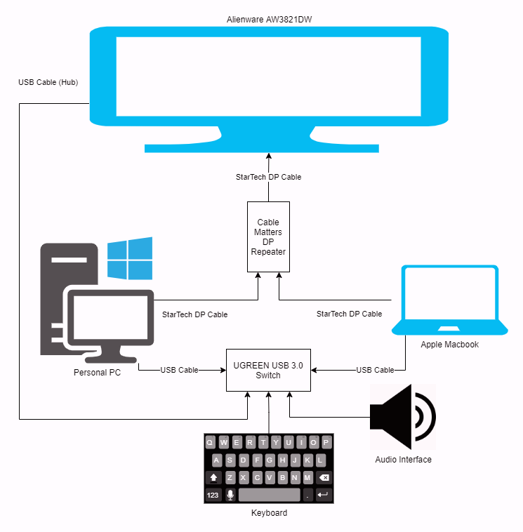

My cheaper solution to purchasing a DisplayPort 1.4 compatible KVM.

<!-- more -->

```toc
# This code block gets replaced with the TOC
```

## New Monitor

In my [previous post showcasing my WFH setup](/my-wfh-setup), I used an Aten DP KVM to switch between my PC and Macbook. I have since upgraded my monitor from an [Acer X34P](https://www.acer.com/ac/en/AU/content/predator-model/UM.CX0SA.P02) to the new [Alienware AW3821DW](https://www.dell.com/en-au/shop/alienware-38-curved-gaming-monitor-aw3821dw/apd/210-axni/monitors-monitor-accessories).



The advantages are the extra 4" inches (10 cm), higher resolution, higher refresh rate, HDR (HDR 600...) and DisplayPort 1.4.

## DisplayPort 1.4 (DP1.4) KVMs

The Aten DP KVM only supported DisplayPort 1.2 devices but, my new Alienware monitor is a DisplayPort 1.4 device. I wasn't able to reach the display resolutions or refresh rates advertised when going through the KVM. If I tried, the screen would continually flash or have incorrect colours.

There aren't many DP1.4 KVMs available on the market and with good reviews. The best I have seen is from [Level1Techs](https://store.level1techs.com/products/kvm-switch-2-port-dual-monitor-8k-model), which has been sold out for months and is very expensive.



For my solution, I had to replicate these two functions from my KVM:

1. Switching my USB devices between computers
2. Switching my monitor between computers

I never used any of the audio of my KVM as I connected everything through a USB Audio Interface. Similarly, I never used the keyboard hotkeys to switch between computers as it didn't support my keyboard.

## USB Switching

I purchased the [UGREEN USB 3.0 switch from Amazon](https://www.amazon.com.au/UGREEN-Computers-Peripheral-Switcher-One-Button/dp/B01N6GD9JO) for ~$33 ([on sale every once in a while](https://www.ozbargain.com.au/search/node/ugreen%20usb%203.0)). It lets me attach 4 USB devices, and with one button press, switches all connected peripherals between computers.



I have populated the four ports with:

1. USB Audio Interface (has its own power)
2. Keyboard
3. USB Type-C cable for connecting other devices
4. My monitor's powered USB 3.2 Gen 1 hub, containing:
   1. Logitech BRIO webcam
   2. Logitech G603 mouse receiver
   3. Logitech Unifying receiver (my other mice)

## Monitor Switching

I had to find an easy and manageable way to switch the DP1.4 cable without getting my head underneath the monitor with my phone's flashlight. The monitor has only one DP port behind a small crevice making it even more difficult.

I thought about having a short extender and I came across the [Cable Matters DisplayPort Repeater](https://www.cablematters.com/pc-1212-154-active-displayport-repeater-8k-ready.aspx) for $28. It is a DP1.4 signal repeater that I converted to become a small extension cable. It also needs to be powered through micro USB which I have done through one of the monitor's 4 USB ports.

<iframe src="https://www.youtube.com/embed/Gu4RI4ybwgo" allowfullscreen width="1280" height="720"></iframe>



To accompany the repeater, I also needed DisplayPort 1.4 cables. Cables advertised as DisplayPort 1.4 support 8K 60Hz or 4K 120Hz. To make sure I got a capable cable, I made sure they were also certified by VESA (the organization behind DisplayPort).

StarTech has a collection of certified DisplayPort 1.4 cables in different lengths. They are also fairly priced and readily available.

For my PC, I needed a DP to DP cable. This cable is sold in many lengths. I got the 2M cable which cost $35. I also got a 1M cable for the DP Repeater which cost $25.

- [dp14mm1m](https://www.startech.com/en-au/cables/dp14mm1m)
- [dp14mm2m](https://www.startech.com/en-au/cables/dp14mm2m)
- [dp14mm3m](https://www.startech.com/en-au/cables/dp14mm3m)
- [dp14mm4m](https://www.startech.com/en-au/cables/dp14mm4m)
- [dp14mm5m](https://www.startech.com/en-au/cables/dp14mm5m)



For my Mac, I needed a DP to USB-C cable. I liked this one because it was also reversible (USB-C to DP or DP to USB-C). I got the 2M cable which cost $55

- [cdp2dp141mbd](https://www.startech.com/en-au/audio-video-products/cdp2dp141mbd)
- [cdp2dp142mbd](https://www.startech.com/en-au/audio-video-products/cdp2dp142mbd)



I keep both DP cables from my computers cable tied to each other to quickly switch between them.

## Final Solution

### Diagram



### Price

Compared to the Level1Techs KVM $500 AUD ($400 USD) price, my solution cost $176:

- Cable Matters DP Repeater: $28
- StarTech DP-to-DP (2m): $35
- StarTech DP-to-DP (1m): $25
- StarTech DP-to-USB (2m): $55
- UGREEN USB Switch: $33

All items were purchased from Amazon Australia.

### Video

Here's a short video of how I'm switching between my computers:

<video autoplay loop controls width="100%" height="auto">
  <source type="video/webm" src="changing.webm">
  <p>Your browser does not support the video element.</p>
</video>
