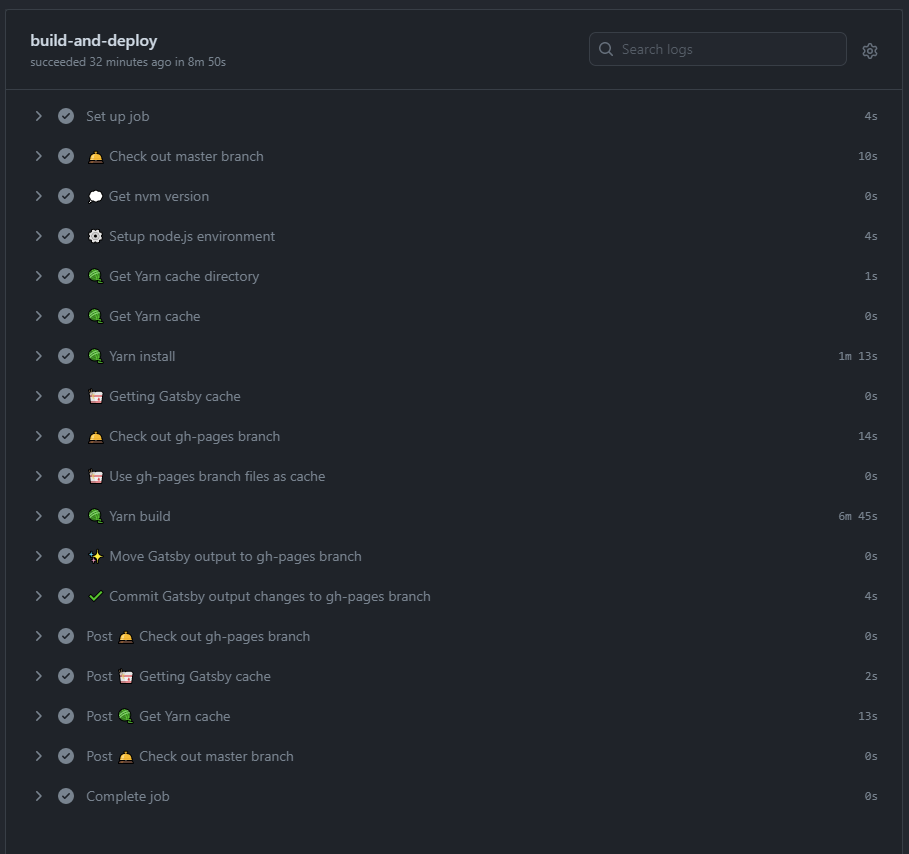
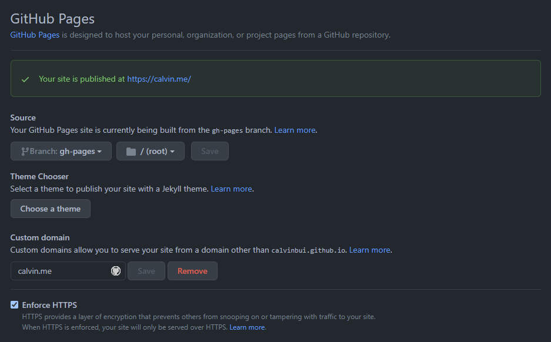
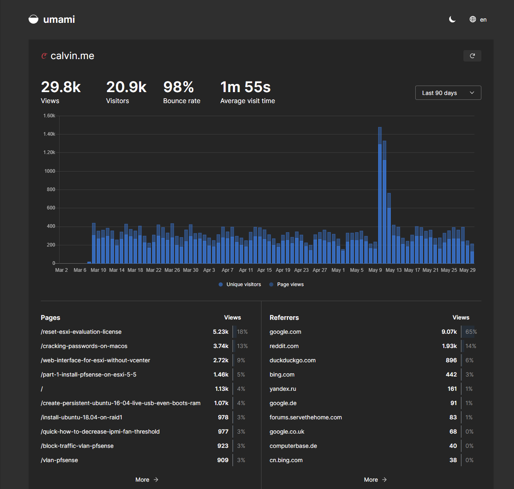

I've made changes to this blog's build, hosting and analytics to be more transparent.

<!-- more -->

This blog has been open-source since moving to Jekyll back in 2016. Its source code (posts, themes, images, etc.) are all publicly available. Anyone is free to take it and start their blog based on everything I've done. The source code is available [on GitHub](https://github.com/calvinbui/calvin.me). There is also a link in the footer of each page.

## Build

This site was with [Gatsby](https://www.gatsbyjs.com/), a web framework that also generates static sites. To create the static site files, it must be built using a continuous integration (CI) system. This was done [using Netlify](https://docs.netlify.com/configure-builds/common-configurations/gatsby/).

To make this more clear and visible, I have moved this over to [GitHub Actions](https://github.com/features/actions), a CI system by GitHub. [Every build](https://github.com/calvinbui/calvin.me/actions) can be viewed directly in the repo.

The difference with GitHub Actions is that every command the CI performs can also be seen. The GitHub Action [workflow file is available inside of the repo](https://github.com/calvinbui/calvin.me/blob/master/.github/workflows/gatsby-build.yml). This file details each step used to build the website and shows the link between the source code and the final site viewers are reading now.

I have also set the GitHub Action's log retention to 30 days to give time for anyone to see what transpired inside each build. Using git also allows auditing of all changes to the build.

## Hosting

Hosting has now moved from [Netlify](https://www.netlify.com/with/gatsby/) to [GitHub Pages](https://github.com/calvinbui/calvin.me/tree/gh-pages).

With GitHub Pages, it is instantly visible which files are being served through the `gh-pages` branch in the source code. Users can also navigate to [https://calvinbui.github.io/calvin.me/](https://calvinbui.github.io/calvin.me/) to confirm the site is legit (GitHub Pages are hosted in the format username.github.io/repo).

Previously it was impossible to know which files Netlify was hosting and if they had made any changes to them. GitHub can do the same but in this scenario, users can also download
every single file from the `gh-pages` branch to browse the site locally. Alternatively, they can also build the files following the GitHub Actions workflow file as mentioned above.

## Analytics

Finally, I am making the analytics for the site publicly available. These are analytics I have collected using [Umami](https://github.com/mikecao/umami), an open-source analytics tool. Its deployment code can be found inside my public [Ansible repository](https://github.com/calvinbui/ansible-monorepo/commit/4cf3e009a70b5ba9b2fb29d5f6f1a38d90d05eed).

The dashboard is available at [https://umami.calvin.me/share/AkrFoOXj/calvin.me](https://umami.calvin.me/share/AkrFoOXj/calvin.me). I have also added the link to the website's footer visibility.

