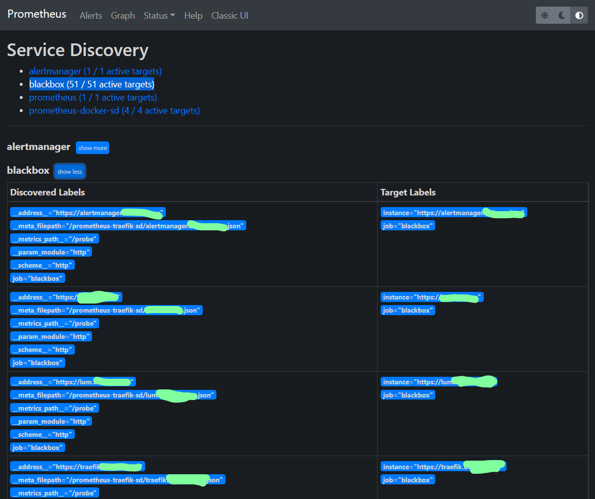
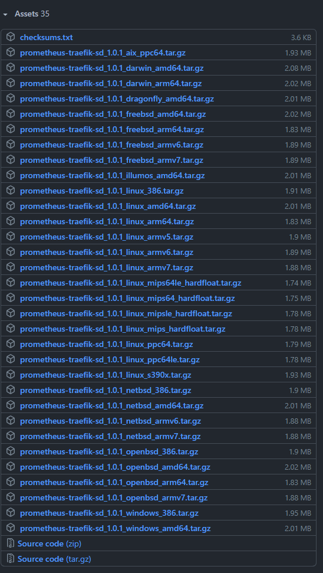

I wrote a tool to generate [Prometheus](https://github.com/prometheus/prometheus) targets from [Traefik](https://github.com/traefik/traefik). Prometheus Traefik Service Discovery is available over on GitHub at [calvinbui/prometheus-traefik-sd](https://github.com/calvinbui/prometheus-traefik-sd).

<!-- more -->

## The Idea

Following on from my previous post about [Homer Service Discovery](/homer-service-discovery), I wrote a tool to automate generating targets for Prometheus from Traefik. The need idea was the same: adding, changing or removing a self-hosted service also required updating my [blackbox exporter](https://github.com/prometheus/blackbox_exporter) config to monitor the new service.

## About

The application is written in Golang and is free and open-source including the CI and release process on [GitHub Actions](https://github.com/calvinbui/prometheus-traefik-sd/actions).

I made it available for all operating systems and architectures that Prometheus does to support all users. It is available as static binary files on the [GitHub release page](https://github.com/calvinbui/prometheus-traefik-sd/releases) or Docker images on [GitHub's Container registry](https://github.com/calvinbui/prometheus-traefik-sd/pkgs/container/prometheus-traefik-sd) using [goreleaser](https://github.com/goreleaser/goreleaser).

More information, including how to use it, can be found on the [project's README file](https://github.com/calvinbui/prometheus-traefik-sd/blob/master/README.md).

## How It Works

Prometheus offers a variety of [service discovery options](https://github.com/prometheus/prometheus/tree/main/discovery) for discovering scrape targets. When something doesn't exist, they recommend using [file-based service discovery](https://prometheus.io/docs/prometheus/latest/configuration/configuration/#file_sd_config), by generating the files yourself.

The application connects to [Traefik's API](https://doc.traefik.io/traefik/operations/api/) and gets all [HTTP routes](https://doc.traefik.io/traefik/routing/routers/) rules configured. It places these rules into JSON files within a folder that Prometheus watches for changes. When a file is added, Prometheus reads the file for new scrape targets. When a file is deleted, Prometheus will stop scraping the target.

I also added a 'grace period' before a target file is deleted. This is in case a service isn't working as expected and needs to be alerted on.
