I enjoyed playing this game. The themes it explores were deep. The music matched the environments. The boss fights remind me of Undertale.

<!-- more -->

[Chicory: A Colorful Tale](http://chicorygame.com/) is a 2D adventure colouring game. I first heard about it on the [Triple Click podcast (Episode 63, The Games of Summer)](https://maximumfun.org/episodes/triple-click/the-games-of-summer/).

<iframe src="https://www.youtube.com/embed/zqSZrq5LzSU" allowfullscreen width="1280" height="720"></iframe>

## End Screen

I cleared the game in 9 hours. Near the end, I used this [map tool by JdavisBro](https://jdavisbro.github.io/chicory/) which let me know which collectibles I was missing.

<video autoplay loop muted controls width="100%" height="auto">
  <source type="video/webm" src="end.webm">
  
Your browser does not support the video element.

</video>

## Save Game

I have [attached my save data](save.zip) so that anyone can roam around and see everything I've created. Unzip it under `%LOCALAPPDATA%\paintdog\save\`. Excuse any immaturity I have created.

## Screenshots

There isn't a tool to take a screenshot of every area and stitch them together yet.

I took a few screenshots of my favourite areas below. Click on them to see the full resolution.

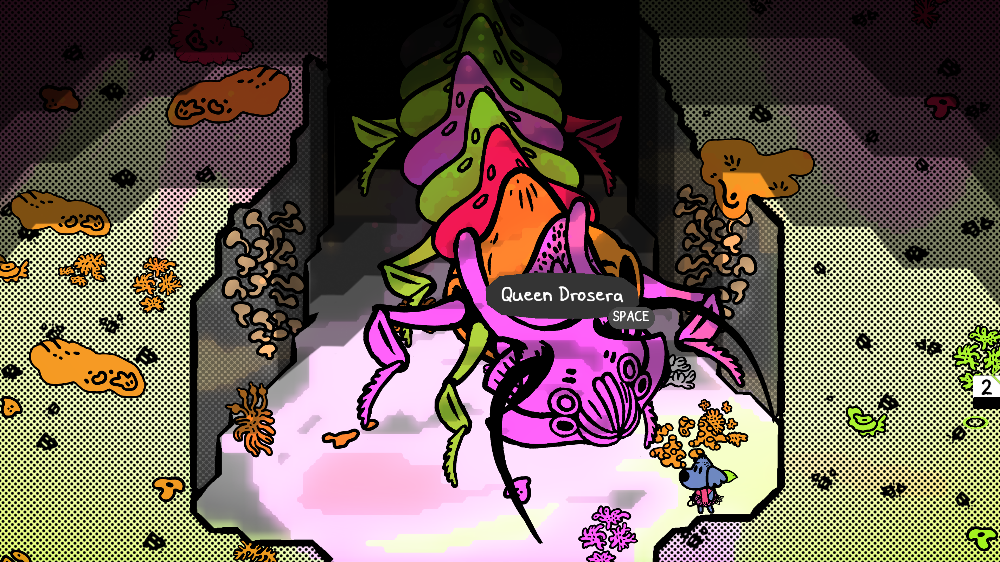

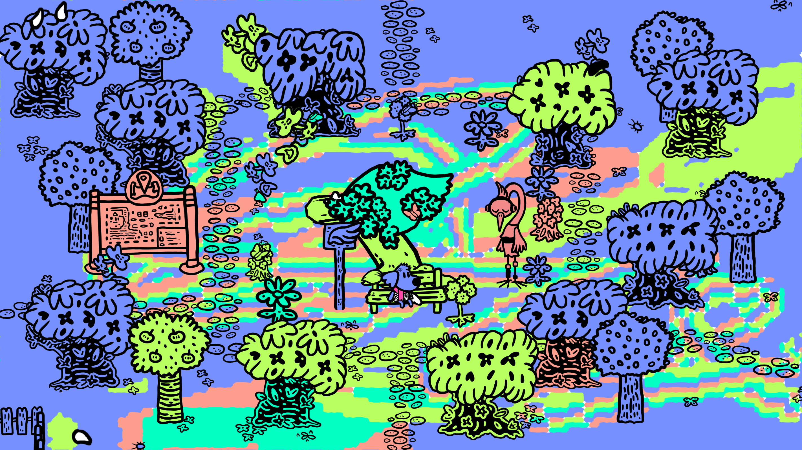

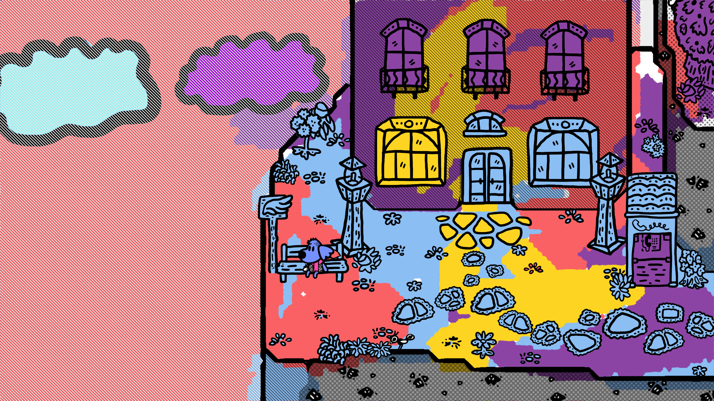

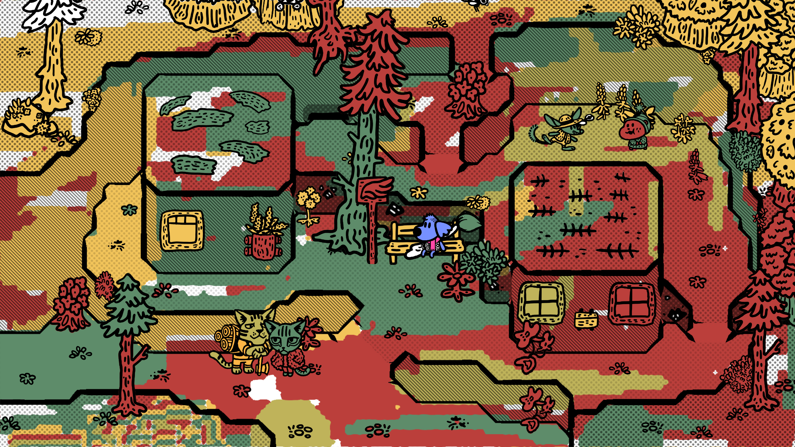

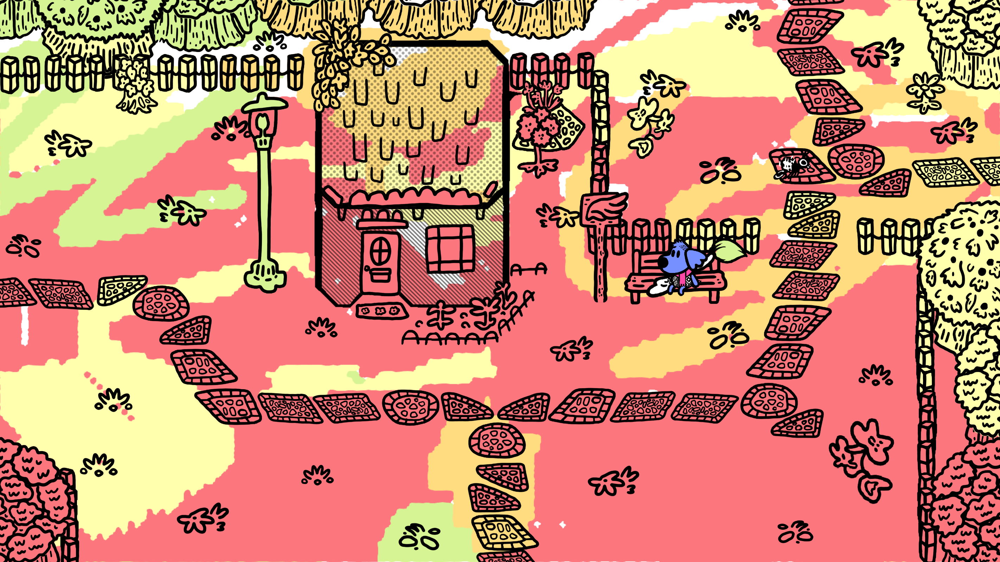

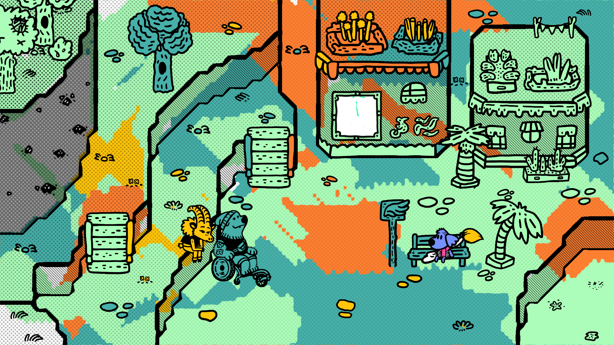

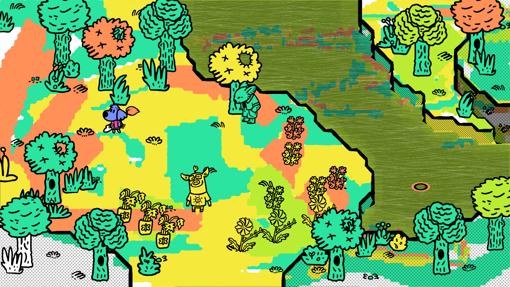

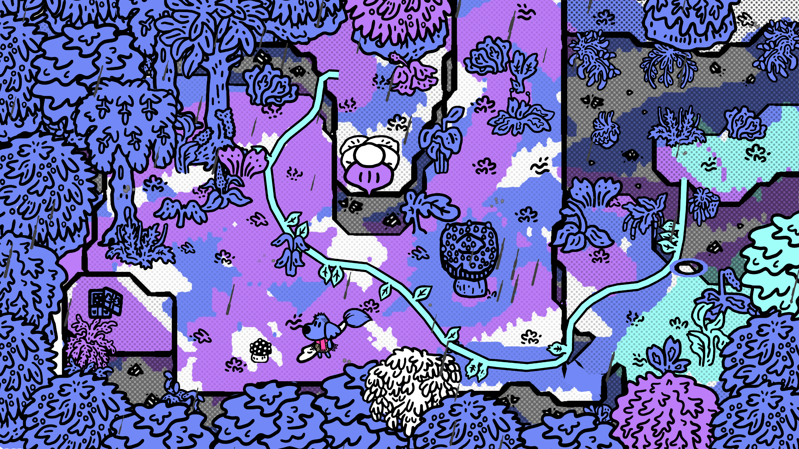

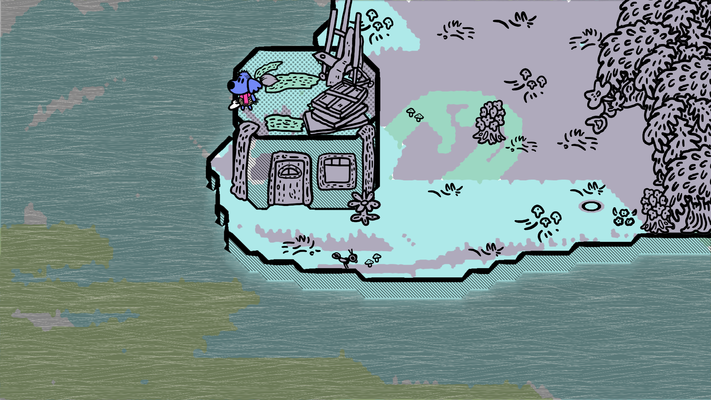

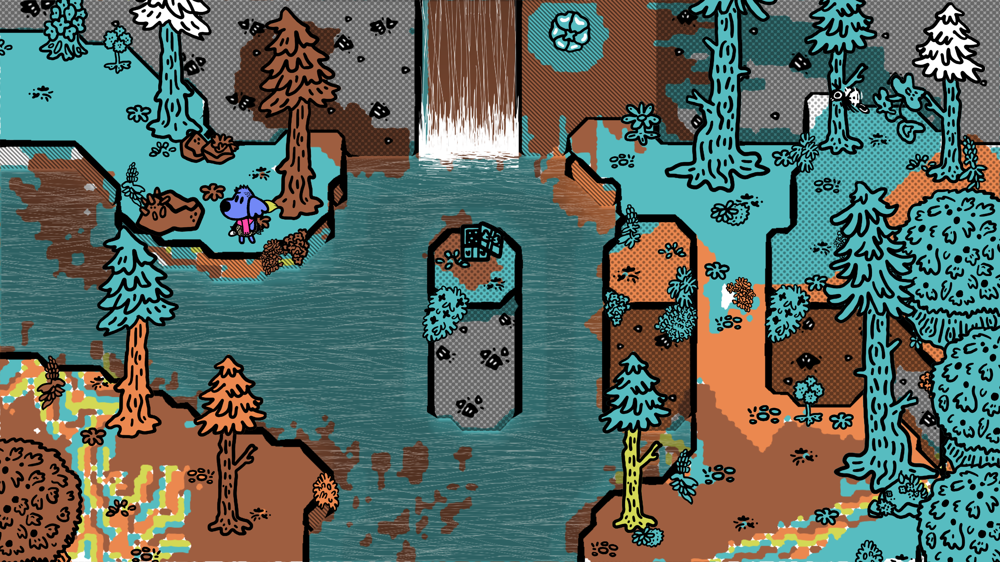

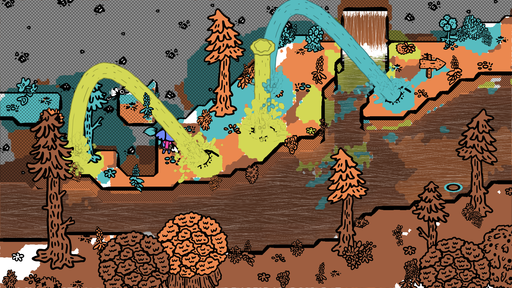

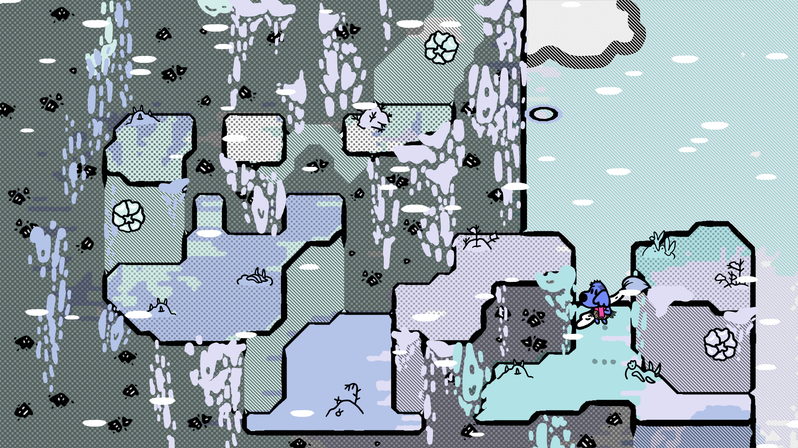

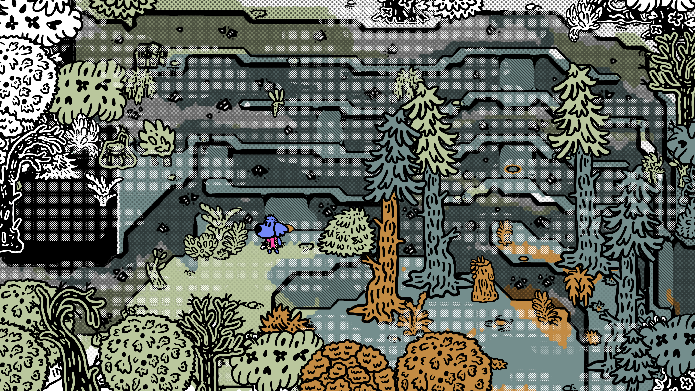
