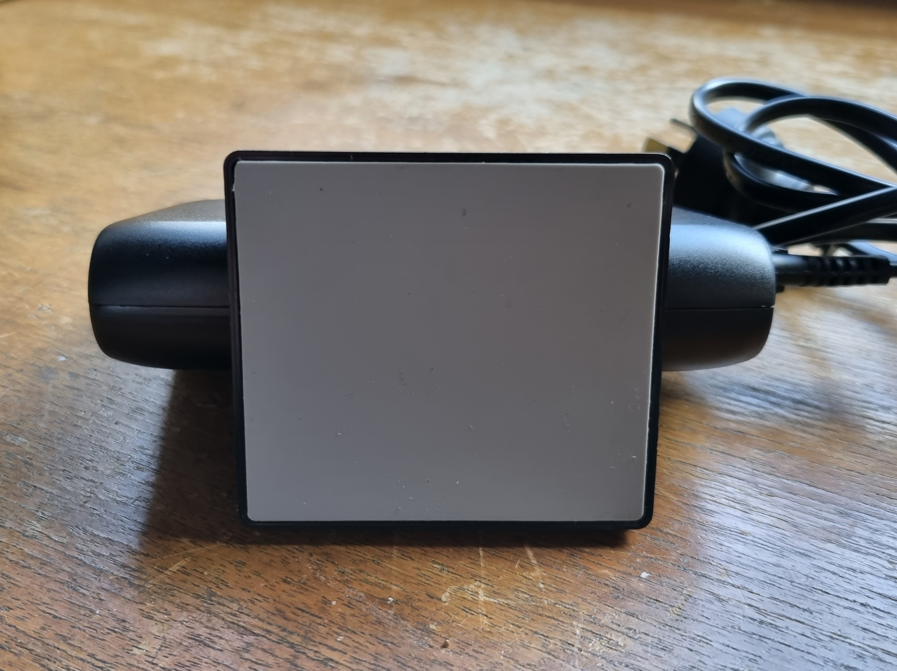

[Super Fast Charging](https://www.samsung.com/global/galaxy/what-is/super-fast-charging/) is Samsung's marketing term for charging their mobile phones between 25W to 45W. I went deep into a rabbit hole to enable the feature recently upgraded after upgrading from a Galaxy S10+ to a Galaxy S21 ([on Telstra Day for AUD $624](https://www.ozbargain.com.au/node/648279)).

<!-- more -->

```toc
# This code block gets replaced with the TOC
```

## Samsung's Charging Technologies

Samsung (and other manufacturers) has made a couple of buzzwords for their charging technology. For Samsung, there's a couple to take note of:

1. **Fast Charging**: Cable charging up to 15W. Also known as Adaptive Fast Charging.
1. **Fast Wireless Charging**: Wireless charging up to 9W.
1. **Fast Wireless Charging 2.0**: Wireless charging up to 15W. Only supported with official Samsung chargers.
1. **Super Fast Charging**: Cable charging up to 25W. Uses USB-PD and USB PPS.
1. **Super Fast Charging 2.0**: Cable charging up to 45W. Uses USB-PD and USB PPS.

## Super Fast Charging is USB PPS

Samsung's Super Fast Charging is another word for USB Power Delivery (USB-PD) 3.0 PPS (programmable power standard). To break that down:

- **USB Power Delivery (USB-PD)** is a standard for chargers and devices to communicate with each other to charge at higher voltages (originally up to 5V). This standard is also used by laptops, cameras and computer monitors.
- **USB PPS** is the third revision of the USB-PD standard. With PPS, the power being delivered can now be controlled in smaller steps in real-time.

These standards can be found on the [USB Implementers Forum (USB-IF) document library](https://usb.org/document-library/usb-power-delivery).

## Hardware and Software Requirements

My Galaxy S21 only charges up to 25W and my [Galaxy Tab S7+](/samsung-galaxy-tab-s7-plus-keyboard-case-mod) charges up to 45W. This is still a conservative number, given some phones are now charging over 100W. Instead of focusing on reaching 25W, **I wanted to achieve around 100W** for future-proofing. To achieve this, I needed the following:

- USB PD 3.0 PPS wall charger
- USB PD 3.0 PPS car charger
- USB-C 5V Cables

On the phone itself, fast charging has to be enabled under Settings > Battery and Device Care > Battery > More battery settings.


## Wall Charger

There aren't many wall chargers available with an Australia plug, so it simplified my choices. Furthermore, I wanted a charger with multiple ports to charge multiple items at once.

- [HUWDER 110W 5 Port Desktop PD Charger Station](https://huwder.com/products/100w-multi-usb-device-charger-station-for-cellhones-laptops-and-tablets?VariantsId=10001)
- [Satechi 108W Pro USB-C PD Desktop Charger](https://satechi.net/products/108w-pro-usb-c-pd-desktop-charger?variant=32118454386776)
- [Nekteck 5-Port 111W USB-IF Certified Charger](https://www.nekteck.com/product/usb-if-certified-usb-c-charger-nekteck-5-port-111w-usb-wall-charger-with-type-c-87w-power-delivery-pd-charger-station-compatible-with-2017-macbook-pro-pixel-32xl-galaxy-s9-plus-ipad-pro-2018/)

I went with the HUWDER as it was the cheapest (use code `huwder110w`). They are also the OEM for [HEYMIX on Amazon](https://www.amazon.com.au/HEYMIX-Charging-Station-Charger-Compatible/dp/B092VKH7JX) and the reviews there were good as well. Shipping took two weeks to arrive, with the last mile being done by courier.


The HUWDER has 2 USB-C and 3 USB-A ports. They have a [diagram on their website showing the power allocation](https://ueeshop.ly200-cdn.com/u_file/UPAK/UPAK437/2006/photo/ba90abd12e.jpg) when multiple ports are used. When both USB-C ports are used, they are split 60W/30W. HUWDER also sell a more [expensive model](https://huwder.com/products/150w-dual-pd-usb-c-4-ports-portable-desktop-fast-charger-station-for-phones-and-laptops-huwder-38?VariantsId=10064,10065) that splits [87W/60W](https://ueeshop.ly200-cdn.com/u_file/UPAK/UPAK437/2011/photo/7bcbfb154c.jpg) and [an even more expensive model](https://huwder.com/products/150w-4-ports-three-usb-c-pd-fast-charging-station-for-multi-devices-huwder-265?VariantsId=11401,11402) with three USB-C ports that split [60W/45W/45W](https://ueeshop.ly200-cdn.com/u_file/UPAK/UPAK437/2106/photo/875a91b394.png).


It uses a standard figure-8 cable and the base is rubber, so it doesn't slide around. The base is also removable.




## Car Charger

In my research, there were four 100W USB PD 3.0 PPS car chargers on the market:

- [BlitzWolf BW-SD8](https://www.blitzwolf.com/18W-QC3.0-+100W-PD3.0-Car-Charger-p-734.html)
- Xiaomi CC07ZM 1A1C
- [Baseus CCZX-160C](https://www.aliexpress.com/item/1005003161602319.html)
- [Baseus Superme](https://www.aliexpress.com/item/1005002546381515.html)

I went with the BlitzWolf BW-SD8 as it was the cheapest. It has 1 USB-C and 1 USB-A port.


## Cables

There are two types of USB cables, charging and data. Charging cables are better suited for charging and data cables are better suited for data transfers. Generally, one can also do the other, but at a much slower rate. Charging cables are often still using the USB 2.0 standard and can only transfer up to 480 Mbps.

Cables capable of 100W charging must contain an **e-marker chip**. An e-marker chip allows the charger and device to know the cable's power and data capabilities. It is required for all 5A applications (>=60W power) or 5 Gbit/s and greater transfers (USB 3.1 Gen1).

When it comes to cables, there are only a few brands I would buy:

<blockquote class="twitter-tweet tw-align-center" data-dnt="true"><p lang="en" dir="ltr">The best USB cables are by:<br><br>1. Belkin / Cable Matters<br>2. Anker / AmazonBasics<br>3. UGreen / BlitzWolf / Baseus</p>&mdash; Calvin Bui (@ASAPCalvin) <a href="https://twitter.com/ASAPCalvin/status/1434202732974338048?ref_src=twsrc%5Etfw">September 4, 2021</a></blockquote> <script async src="https://platform.twitter.com/widgets.js" charset="utf-8"></script>

I landed on the following combination:

- [Blitzwolf BW-FC1](https://www.blitzwolf.com/%C2%A05A-Type-C%C2%A0to%C2%A0Type-C%C2%A0Charging%C2%A0Data%C2%A0Cable-p-719.html) (1 m & 1.8 m, 3-pack)
- [UGreen 100W Right Angle](https://www.ugreen.com/products/right-angle-100w-usb-c-cable) (3 metres)
- [Belkin 3.1 USB-A to USB-C cable](https://www.belkin.com/au/cables/data/3-1-usb-a-to-usb-c-cable-usb-c-cable/p/p-f2cu029/)

### BlitzWolf BW-FC1

The connectors on these are very tight. It's too early to tell if they loosen up. One cable has already broken on me because the connector bent when I nudged it while plugged in.


### UGreen Right Angle

I needed a right-angle cable for charging my tablet when I lie it on its side. UGreen was the only company offering a 3-metre cable that was had one right-angle end, so it was perfect for me. There are no issues with this cable so far.


### Belkin

I bought this Belkin cable to take advantage of fast transfer speeds between my computer and devices. Its transfer speed goes up to 10 Gbps while the charging speed tops out at 60W. It's not braided like the others, but that is not an issue for me. Belkin products are usually on the pricier side, but they are always of fantastic quality.


## Conclusion

It was a surreal feeling to see the words **Super fast charging** to appear after all the research. I admit it is overkill aiming for 100W charging when my phone only does 25W max, but I could also charge my laptop and it slightly future-proofs it for future devices. Arguably, [USB4](https://en.wikipedia.org/wiki/USB4) cables and chargers are already on the market so, I didn't go all out yet.

From my S21 with Super Fast Charging enabled:


From my Tab S7+ with Super Fast Charging 2.0 enabled:


