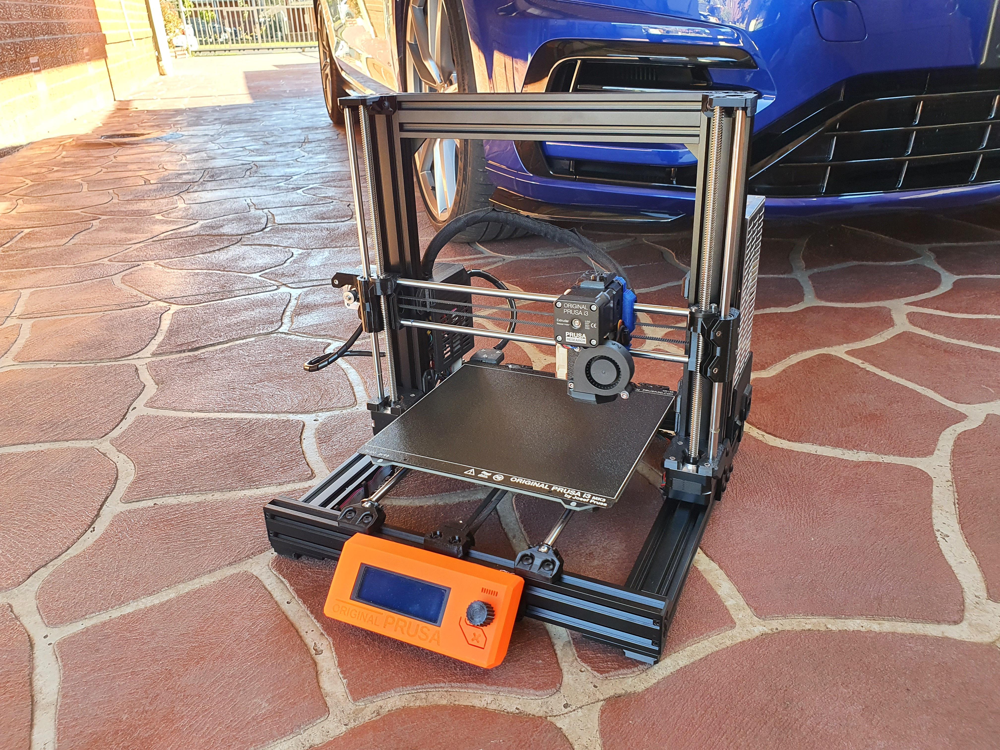
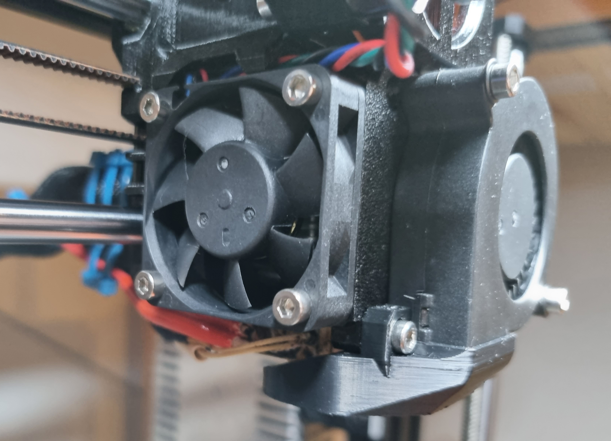
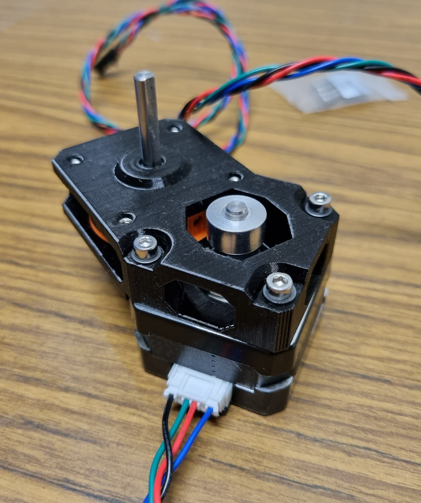
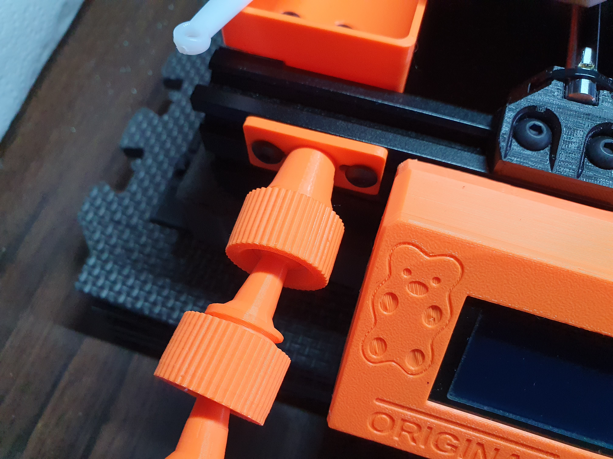
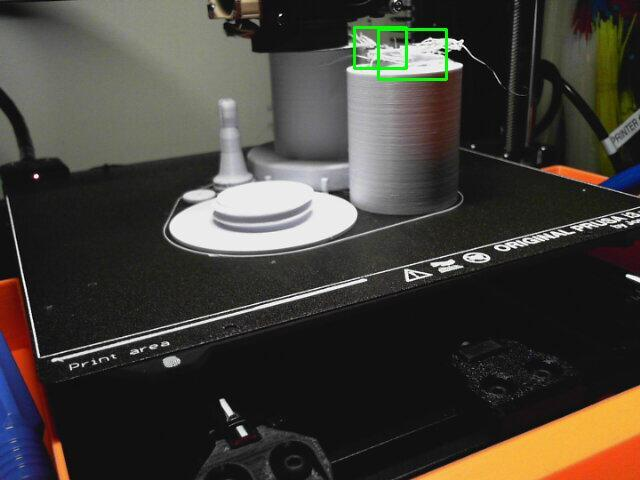
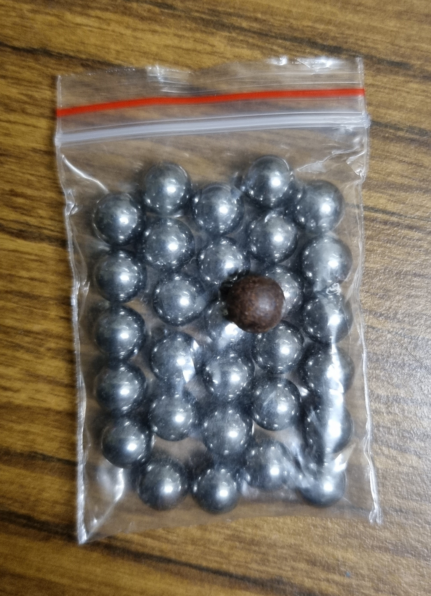
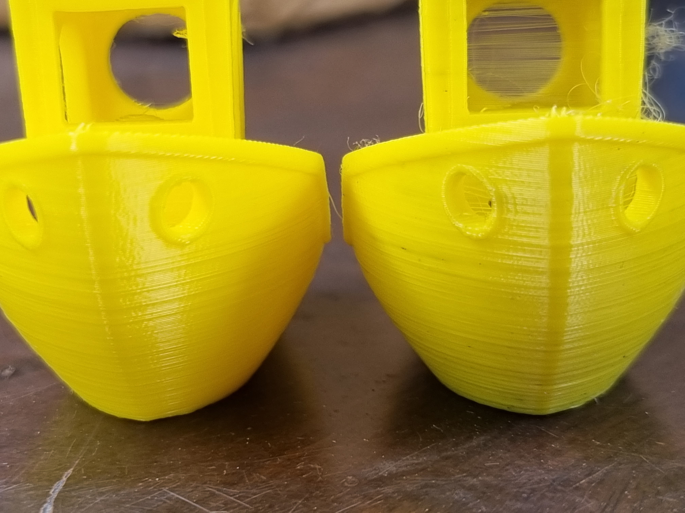

A lot of upgrades and add-ons for my Prusa i3 MK3S.

<!-- more -->

```toc
# This code block gets replaced with the TOC
```

## Current State

This journey started when I turned on my Prusa i3 MK3S 3D printer after months of inactivity. I started prints for a few of these [cable clips](https://www.thingiverse.com/thing:3248448) but had issues with bed adhesion. I also started printing this [HDD tray](https://www.thingiverse.com/thing:4487637), but the corners were lifting. These two issues made me determined to upgrade the printer so that it worked as I wanted it every time.

This is my current printer setup sitting in my garage:


It currently has:

- a [Prusa i3 MK3S](https://www.prusa3d.com/original-prusa-i3-mk3/) upgraded from a MK3 (non-S)
- a [Jaycar LED strip](https://www.jaycar.com.au/48-led-aluminium-led-strip-with-switch/p/ST3930) for visibility at night
- a [Microsoft Lifecam Studio](https://www.microsoft.com/en-au/d/lifecam-studio/91dt6wmfdlb3) webcam mounted on a vice-grip

## Bear Frame Upgrade 2.1

[Grégoire Saunier's (gregsaun) Bear Upgrade](https://github.com/gregsaun/prusa_i3_bear_upgrade) has been on my wishlist for a long time. It is an upgrade to the Prusa i3 frame to improve its stiffness and reliability to allow for faster prints, increased precision and easier maintenance.


### Purchasing

The cheapest place for me to buy a Bear Upgrade kit shipped to Australia was from [Lecktor Technologies in Estonia](https://lecktor.com/en/frames/193-66-bear-upgrade-21-kit.html). I went with black because it was the cheapest. While purchasing from Lecktor, I also bought the [LDO-42STH25-1004AC](https://lecktor.com/en/stepper-motors/322-18deg-slim-power-stepper.html) slim stepper motor. This is for the Pulleybox mod mentioned later in this post.  I want to mention it now in case someone makes two separate orders and pays shipping twice.


Along with the upgrade kit, I also had to print some parts for the upgrade myself.


### Assembly

I built the frame following the [online guide](https://guides.bear-lab.com/). The guide was very similar to Prusa's guide.


Beyond the tips within the guide, these are the tips I have for assembly:

- Have a lot of space. I used multiple boxes to group parts together
- Disconnect all cables and cut all cable ties. It's a full rebuild, you won't need them again
- Wear gloves to save your fingers
- Find an extra pair of hands where possible
- The kitchen benchtop or marble is usually flat
- Don't use a powerful screwdriver or tighten completely

Here are some photos I took along the way:




### MK3S to MK3S+ Upgrade Kit

During the Bear Frame assembly, I also implemented the [Prusa MK3/S to MK3S+ upgrade kit](https://shop.prusa3d.com/en/original-prusa-i3-mk3s/1390-original-prusa-i3-mk3-to-mk3s-upgrade-kit.html). I already had some items from the kit when I upgraded from a MK3 to a MK3S. Instead, I bought the missing items individually to save a few dollars. The missing items were:

- [SuperPINDA](https://shop.prusa3d.com/spare-parts/1396-superpinda.html)
- [Bearing Clips for Y-axis](https://shop.prusa3d.com/spare-parts/1423-bearing-clips-mk3s.html)
- [IR filament sensor](https://shop.prusa3d.com/en/mk3mk3smk3s/921-ir-filament-sensor.html) (this model was newer than the one I had)


I also purchased these other items as well for other sections in this post. I want to mention them now in case someone makes two separate orders and pays shipping twice:

- [MK3 Hotend PTFE tube](https://shop.prusa3d.com/en/mk3mk3smk3s/736-hotend-ptfe-tube-mk2s-mk25-mk3-mmu2.html) for the Bear Extruder (not MK3S/S+)
- [Prusa MINI Hotend Fan](https://shop.prusa3d.com/en/minimini/1019-hotend-fan-mini.html) for the Bear Extruder

### Y Idler Tensioner

An optional upgrade for the Bear Frame I chose to do was to use a [toothed Y idler](https://github.com/gregsaun/prusa_i3_bear_upgrade/tree/master/optional_parts/y_idler_tensioner_e3d) for the tensioner. At first, I purchased a GT2/2GT toothed idler from eBay with measurements for a 6/7mm belt, 20T (20 tooth) and 5mm inner diameter (ID). However, this upgrade requires the idler with the smaller flanges, so I had to [buy them again from E3D directly](https://e3d-online.com/products/gates-powergrip%C2%AE-2gt-idlers). I bought two of these as another was used for the X-axis upgrade in this post.


## Extruder Upgrades

### Bear Extruder and X-Axis

Another design from gregsaun to improve prints is the [Bear Extruder and X-Axis (BearExxa)](https://github.com/gregsaun/bear_extruder_and_x_axis). It is an alternative extruder design and X-axis compatible with the Prusa i3 MK3S+.

These are the main benefits of the upgrade:

> Bear X-axis (and X carriage):
>
> - Simple and precise belt tensioning system
> - Stiffer X-axis design to reduce ringing
> - Optimized belt path for smoother movements
> - Improved X-axis bearing alignment
>
> Bear extruder:
>
> - Better heat management to reduce inconsistency, clogs, and heat creep
> - Stiffer extruder thanks to a unibody structure
> - Easier installation and removal of E3D v6 hotend
> - Self-centering of extruder motor and Bondtech gears
> - Reduced extruder and Bondtech gear vibrations
> - Reduced wear and noise of print fan thanks to a vertical assembly
> - Compatible with the Prusa filament sensor

All screws and nuts were available either as spares from my Prusa or the Bear Upgrade kit. The only thing I had to buy separately were [metal M3 washers](https://www.bunnings.com.au/pinnacle-m3-black-flat-washer-12-pack_p0257725) as I didn't like the plastic spares I had from Prusa.

One thing to watch out for is to not print the `filament_sensor_lever` using [eSun PETG in black](https://www.esun3d.net/products/435.html). Because of its shiny black finish, many users and I had prints pause because the printer thinks it had run out of filament. I used [eSUN ASA in black](https://www.esun3d.net/products/279.html) instead.


### X End Idler Tensioner

The [X End Idler tensioner](https://github.com/gregsaun/bear_extruder_and_x_axis/tree/master/optional_parts/x_end_idler_tensioner_e3d) is a similar optional upgrade to the [Y Idler Tensioner](#y-idler-tensioner) on the Bear Frame. Read that section for more details.


### Prusa Mini Hotend Fan

Upgrading the Noctua hotend fan to another with more static pressure will reduce the risk of clogging and reduce stringing. gregsaun has provided some data on the compatible [40x40x10 fans on GitHub](https://github.com/gregsaun/bear_extruder_and_x_axis/tree/master/optional_parts/hotend_fan). This is outdated now as [he recommends the Prusa Mini fan for EU residents and the OEM3D fan for US residents](https://discord.com/channels/448951856660480030/459053621070528513/860878881308672002). While ordering the [MK3S+ Upgrade kit](#mk3s-to-mk3s-upgrade-kit), I ordered the [Prusa Mini Fan](https://shop.prusa3d.com/en/minimini/1019-hotend-fan-mini.html) as well.




### Pulleybox Mod

The Pulleybox is a mod to transform the direct drive extruder on a Prusa to a geared extruder. This helps reduce the 'moiré' effect, decrease the weight of the extruder and increase its accuracy. Another improvement it brings is reducing heat creep, by moving the motor away from filament and gears.


There are a few designs but the one by [vertigo235 on Thingiverse is the most recommended](https://www.thingiverse.com/thing:3714978). For this mod, [the pancake motor suggested is the LDO-42STH25-1004AC](https://discord.com/channels/448951856660480030/456266386675728385/818822860977733653). The two inner wires on the motor's cable have to be swapped however for it to work.





### E3D Nozzle X

The [E3D V6 Nozzle X](https://aus3d.com.au/products/e3d-v6-nozzle-nozzle-x) is the nozzle 'to rule them all' – it supports abrasive filaments and is also heat-resistant. E3D also believes that this nozzle will last indefinitely if used correctly. It also has a 'polyphobic' coating, so fewer materials get stuck to it or are easily cleaned with a paper towel. I went with the 0.40 diameter as it was the one that comes with the Prusa by default.


## Filament

### eSun PETG

[Cubic Technology](https://www.cubictech.com.au/), a 3D printing supplier in Australia had [a massive 30% sale](https://www.ozbargain.com.au/node/632907) at the end of June. I had bought all my filament from them in the past and was checking daily to see when their black eSUN PETG would be back in stock. Luckily it came back in stock that same day and I bought 11 PETG, 3 PLA and 1 ASA 1kg spools. The price difference between PETG and PLA was 20 cents, so I bought every solid colour they had. The 3 PLA spools were colours that I wanted but weren't available in PETG. I prefer printing in PETG for its higher strength and glass transition temperature.


### Filament Storage

To store all my filament, I went to Bunnings and got the [Ezy Storage 100L IP67 Storage Box](https://www.bunnings.com.au/ezy-storage-100l-waterproof-ip67-storage-box_p0219758). I chose this for its dust and waterproof rating (IP67) to keep out as much moisture as possible in the garage. One downside of it is the plastic handle which feels like it could snap when completely loaded with filament. Another one is it only has 2 wheels instead of 4 making it very difficult to move around as I keep it under a desk.


### Sunlu Filament Dryer

The [Sunlu Filadryer S1](https://www.sunlu.com/products/sunlu-filament-dryer-s1) is a filament dryer box. It's like a small oven that bakes out the moisture absorbed inside filament spools. With some searching on AliExpress, I was able to grab 2 for the price of 1 (AUD $60). I used this [design by JRD](https://www.thingiverse.com/thing:4631982) to mount a hygrometer on the inside with double-sided tape.


## Webcam

### Webcam Mount

One major area of improvement I needed was an improved webcam mount for my [Microsoft Lifecam Studio](https://www.microsoft.com/en-au/d/lifecam-studio/91dt6wmfdlb3). After searching on Thingiverse for different v-slot designs, I landed on this [mount by esoterik](https://www.thingiverse.com/thing:3417042) to suit this [system by FedorSosnin](https://www.thingiverse.com/thing:3147899).





<video autoplay loop controls width="100%" height="auto">
  <source type="video/mp4" src="webcam.mp4">
  <p>Your browser does not support the video element.</p>
</video>

### LED Light Mount

I couldn't find a v-slot design that suited my [Jaycar LED Strip](https://www.jaycar.com.au/48-led-aluminium-led-strip-with-switch/p/ST3930), so I made my own. I took inspiration from [ManFur's bracket](https://www.thingiverse.com/thing:3599301) and [jterranella's mounts](https://www.thingiverse.com/thing:3619763) to create this. At the end of the light strip, I could've made some holes and screwed it together, but a cable tie worked just as well.


### The Spaghetti Detective

[The Spaghetti Detective](https://www.thespaghettidetective.com/) (TSD) is an AI-powered 3D printing failure detection. Generally, when a 3D print fails, you end up with a mess similar to spaghetti. Every bit of TSD is open-source, so I decided to [self-host in Docker using Ansible](https://github.com/calvinbui/ansible-monorepo/blob/master/thespaghettidetective.yml).

I've set it to only email me when it detects spaghetti and not cancel the print. I've only had 2 false alerts so far out of days printing so I may have it cancel prints soon. Here are some alerts of real spaghetti I've received:





### TP-Link Smart Power Strip

To control my lights and printer, I purchased a [TP-Link KP303 smart power strip](https://www.tp-link.com/au/home-networking/smart-plug/kp303/) from Amazon on sale. It has 3 outlets that can be independently controlled in OctoPrint using the [TP-Link Smartplug plugin by jneilliii](https://plugins.octoprint.org/plugins/tplinksmartplug/).

I currently have it configured so that:

- When the printer is turned on, OctoPrint connect to it after 10 seconds
- When the printer is turned off, Octoprint will first disconnect before powering off


<video autoplay loop controls width="100%" height="auto">
  <source type="video/webm" src="power-01.webm">
  <p>Your browser does not support the video element.</p>
</video>

<video autoplay loop controls width="100%" height="auto">
  <source type="video/webm" src="power-02.webm">
  <p>Your browser does not support the video element.</p>
</video>

## Accessories and Add-ons

### Concrete and Foam Base

Reducing vibrations and wobbles while printing also reduces ringing artifacts and patterns that appear on the final result. The Bear Upgrade Frame's increased stiffness over the stock Prusa frame follows this methodology. In a [YouTube video by CNC Kitchen](https://www.youtube.com/watch?v=y08v6PY_7ak), they found that having concrete on top of a foam mat was the most effective solution to reduce ringing.


At my local Bunnings, I picked up the flat-est looking [400 x 400 x 40mm stone paver](https://www.bunnings.com.au/adbri-masonry-400-x-400-x-40mm-zurich-euro-stone-paver_p3041880) and a [pack of interlocking foam mats](https://www.bunnings.com.au/eva-50-x-50cm-interlock-foam-mats-solid-black-pk4_p0126584) to go with it.


<video autoplay loop controls width="100%" height="auto">
  <source type="video/webm" src="foam-concrete.webm">
  <p>Your browser does not support the video element.</p>
</video>

### LCD and Touchscreen

For the LCD, I added a [Pimoroni HyperPixel touchscreen](https://au.element14.com/pimoroni/pim369/hyperpixel-4-0-display-rasp-pi/dp/3498492) using [this design by nickrno77](https://www.thingiverse.com/thing:4793886). The design is remixed from [madalpaca's design](https://www.thingiverse.com/thing:3863115) and requires its Raspberry Pi backplate. The design is very wide, and I had to rotate it diagonally to fit on the print bed.

With the HyperPixel, I installed [Octodash](https://unchartedbull.github.io/OctoDash/index.html), an open-source dashboard for OctoPrint optimised for small touchscreen devices. This was [installed using Ansible](https://github.com/calvinbui/ansible-monorepo/commit/26a4d8606cc6a71b28a269a74bb439563f5c19d1) along with the HyperPixel drivers.


### Side Storage Box

To store some tools, I [printed this design by Vlastimil3](https://www.thingiverse.com/thing:3568289) to hold my pliers, wire cutters and scrapper.


### Other

A few other things I bought or printed:

- M5 Drop In Tee Nuts: for mounting things to the Bear Frame's v-slots
- [1kg Fire Extinguisher](https://www.bunnings.com.au/firepro-1kg-dry-powder-fire-extinguisher_p0171328): Just in case
- [Officeworks Glue Sticks](https://www.officeworks.com.au/shop/officeworks/p/keji-glue-35g-2-pack-keow2pva35): $0.50 each for ASA prints
- [15cm Ruler](https://www.officeworks.com.au/shop/officeworks/p/studymate-plastic-clear-ruler-15-cm-sm388520): To scrape off the glue. It was the sturdiest one I tried.
- [V-slot Cable Clamps](https://www.thingiverse.com/thing:2613532): A nice twist-in design by Z123456789 to route cables around the printer.
- New steel balls, as mine always seems to rust. I can't find anything about this online.




## Benchy (Before and After)

Here is a print comparison showing the difference in quality before and after the upgrades with noticeable less stringing.





