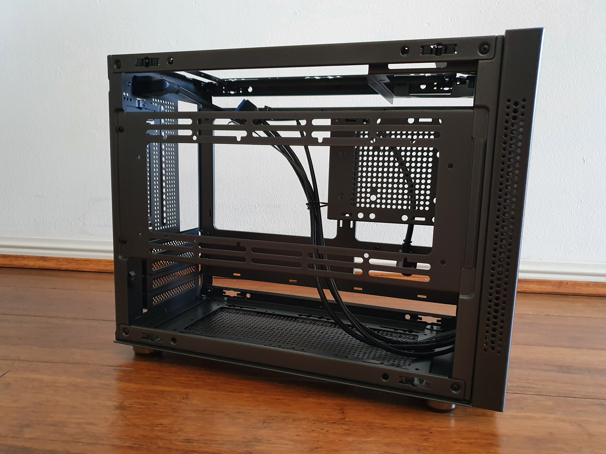
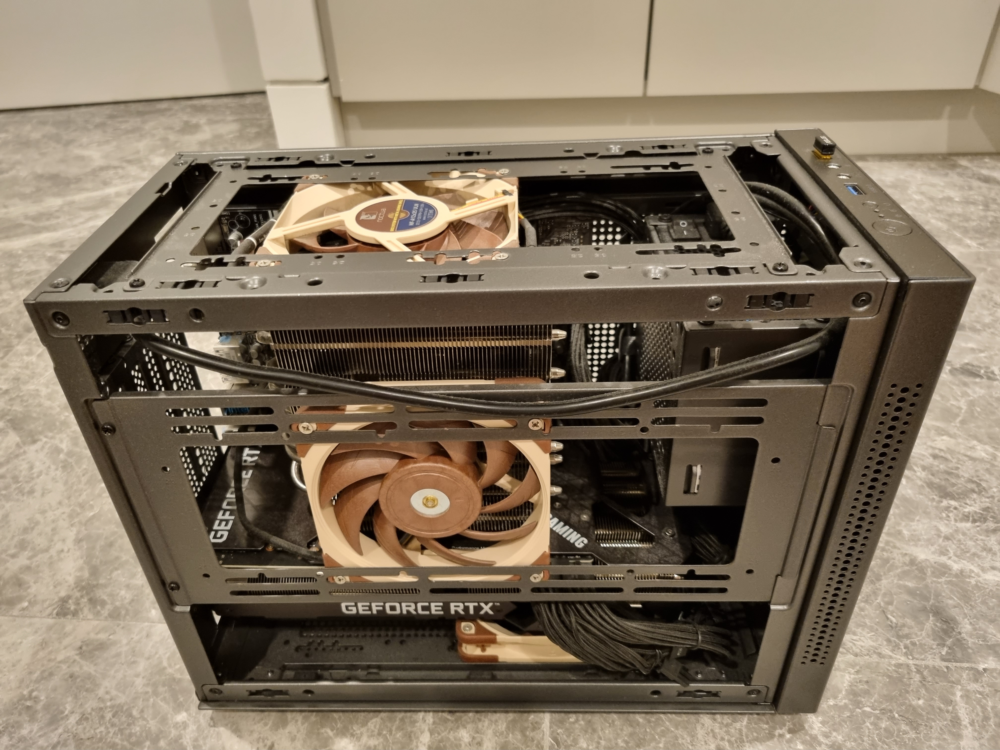

The [Quzao Sama I'm](http://www.sama.cn/archives/827) (sometimes IM, IM01 or IM-01) is a 21.9L computer case. It is best known as a micro-ATX (mATX) version of the mini-ITX (mITX) Cooler Master NR200, a very popular value case due to its hardware compatibility.

The Sama I'm is also sold across the world under different names/companies as the:

- [Tecware Fusion](https://www.tecware.co/fusion)
- [Inter-Tech IM-1](https://inter-tech.de/en/products/case/micro-tower/im-1-pocket)
- [ITEK Case Evoke](https://www.itekevo.com/en/product/case-evoke/)
- [NOX Extreme Hummer Vault](https://www.nox-xtreme.com/cajas/hummer-vault)
- [Cube Gaming Axel](http://cubegaming.id/?p=1776)

## CPU Cooler

As mentioned previously, the Sama I'm is best known as a micro-ATX (mATX) version of the popular Cooler Master NR200. This means all the cooling tests and configurations published can be applied. I used the findings from the YouTube channel, [Machines & More](https://www.youtube.com/playlist?list=PLemnpiFP58grWaU7TdevQTX9KDd5rOvs3), to pick up the [Noctua C14S](https://noctua.at/en/nh-c14s) with two [Noctua NF-A12x25 120mm PWM fans](https://noctua.at/en/nf-a12x25-pwm). In Australia, both items can be purchased directly from Noctua through Newegg for significantly less than local computer stores.

The Noctua C14S comes with one [Noctua NF-A14 140mm fan](https://noctua.at/en/nf-a14-pwm.html). Arguably, the NF-A12x25 120mm fan is newer and better than its larger brother by being both quieter and higher performing at a smaller size. [Noctua is working on its next-generation 140mm fan coming in 2022](https://noctua.at/roadmap), which is something I will look into once its released. I mounted the NF-A12x25 onto the side panel of the case instead of the heatsink, so it can pull in more and fresher air.

To mount the NF-A12 to the bottom of the C14S, I used this [120mm to 140mm fan converter by Andreas-Giesert on Thingiverse](https://www.thingiverse.com/thing:3484426). I pointed the fan down towards the motherboard to also cool the VRMs. Any air, even hot air, is better than no air blowing across the VRMs as discovered by [Gamer's Nexus](https://www.youtube.com/watch?v=0qYHWAnvXv8).

## Fan Configuration

I tested a variety of different fan setups inside the case to gauge the optimal configuration for GPU and CPU temperatures. The case supports many permutations of fan combinations on its side, top and bottom.

In these tests, I used a combination of regular [Noctua NF-A12x25 ULN/PWM](https://noctua.at/en/products/fan/nf-a12x25-uln) and slim [Noctua NF-A12x15 FLX](https://noctua.at/en/products/fan/nf-a12x15-flx) fans. Slim fans are used due to the clearance from the CPU cooler and PSU. This is in no way meant to be scientific.

| Fans | Bottom | Side       | Top        | GPU | CPU |
|:-----|:-------|:-----------|:-----------|:----|:----|
| 2    | Reg    | -          | Reg        | 84  | 76  |
| 3    | Slim   | Reg        | Reg        | 84  | 80  |
| 3    | Reg    | Reg        | Reg        | 80  | 80  |
| 4    | Reg    | Reg + Slim | Reg        | 80  | 78  |
| 5    | Reg    | Reg + Slim | Reg + Slim | 80  | 72  |

From my testing, I went with the middle option to have one fan on the bottom, side, and top to balance fan noise, GPU and CPU temperatures (80/80).

## Fan Spacers

Copying  [OptimumTech's video](https://www.youtube.com/watch?v=ztOZesVGIVo), I 3D-printed and copied [Noctua's NA-IS1-12 Sx2](https://noctua.at/en/na-is1-12-sx2) fan spacers to reduce noise and improve airflow.

