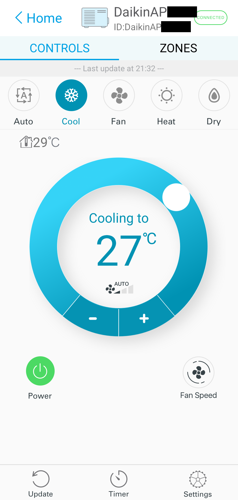
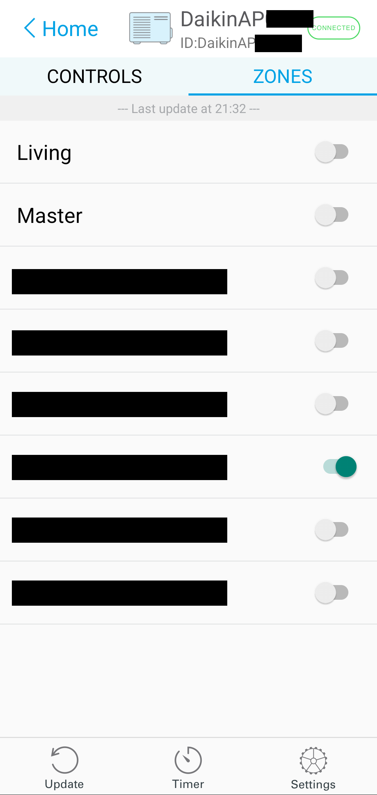
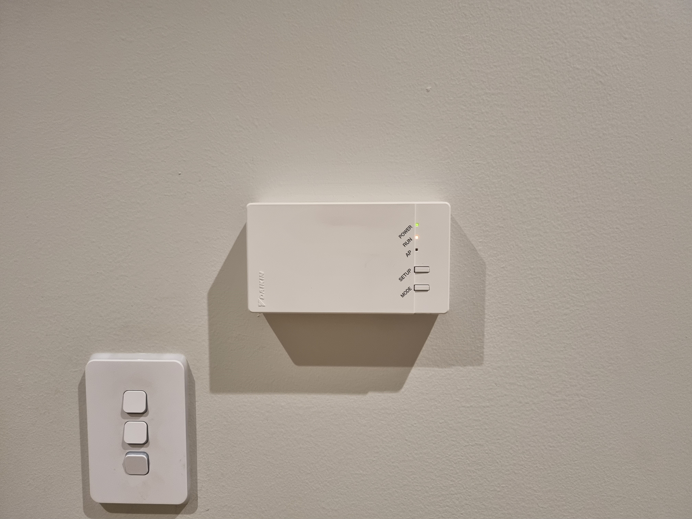
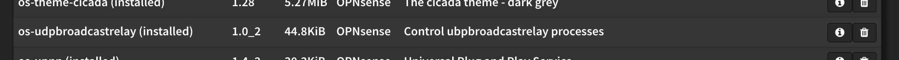
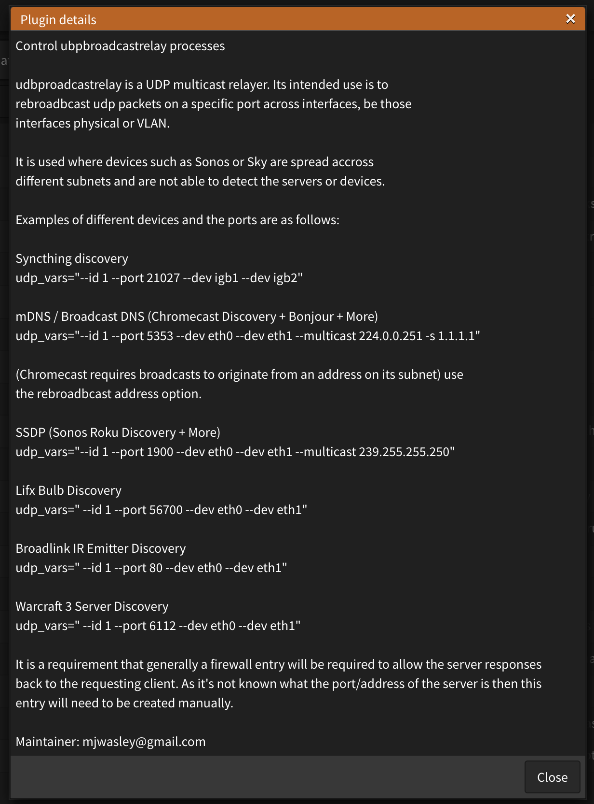
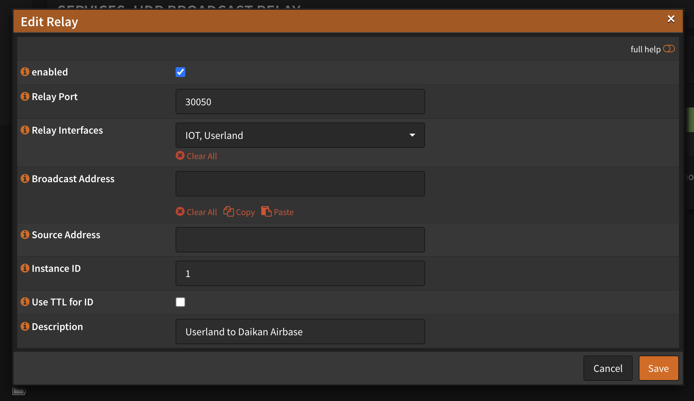
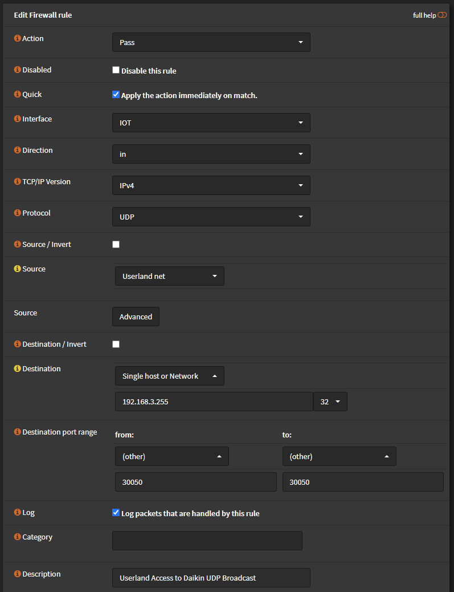
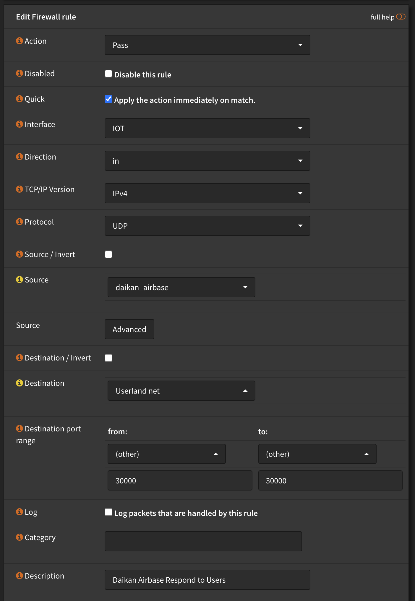
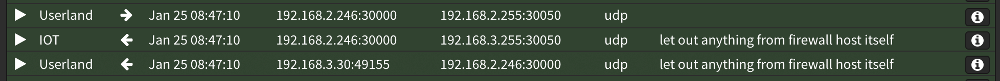

The [Daikin Airbase](https://www.daikin.com.au/controllers/daikin-airbase) is a Wi-Fi connected interface for controlling Daikin ducted air conditioning units. This gives the convenience of controlling temperature, timers, and zones from a mobile device or voice assistant.

This feature requires the Daikin Airbase BRP15B61 adaptor. It must be connected to the same Wi-Fi network as the mobile device to control the air conditioner locally. Otherwise, a 'remote' connection can be made over the Internet.

I segregated the Airbase controller onto my IoT VLAN where it has no access to important devices like my router, servers, or switches. However, this meant I wouldn't be able to access it locally as it was on a different VLAN. Even after enabling the [OPNsense MDNS Repeater](https://docs.opnsense.org/manual/how-tos/multicast-dns.html) (equivalent to [Avahi](https://docs.netgate.com/pfsense/en/latest/packages/avahi.html)), the Airbase was still not visible or connecting. This meant the Daikin app wasn't using [multicast DNS](https://en.wikipedia.org/wiki/Multicast_DNS) to discover the adaptor.

It led me to dig into OPNsense logs to find what connection the app was trying to make. This can be done by enabling logs on individual firewall rules, and then watching the Firewall Log with filters applied. The logs showed me the Daikin Airbase app was attempting to make a UDP connection from my device on port :`30000` to the broadcast address on port :`30050`. This is a UDP Broadcast instead of mDNS/DNS-SD which is why MDNS Repeater/Avahi wasn't working.

To allow UDP Broadcasts across networks, OPNsense provides the [udpbroadcastrelay plugin](https://github.com/opnsense/plugins/tree/master/net/udpbroadcastrelay) by [marjohn56](https://github.com/marjohn56/udpbroadcastrelay). The plugin listens for packets on a specified UDP broadcast port, and when a packet is received, it sends that packet to all specified interfaces. After installing the plugin, it can be found under Services > UDP Broadcast Relay.

Within the plugin, add a new relay with the following settings:

- Relay Port: `30050`
- Relay Interfaces: The network Daikin Airbase is on (IoT) and any other networks that need to connect to it (Userland, etc.)
- Instance ID: 1

Create a firewall rule on the Daikin Airbase's network, with the source set to the incoming networks and the destination as the broadcast IP address (the last IP address). The source is set to the incoming network as udpbroadcastrelay will rebroadcast the UDP packet as if it originated from the same network.

- Protocol: UDP
- Source: User network
- Destination: Broadcast IP address (i.e., `192.168.3.255/32`)
- Destination Port: `30050`

Create another firewall rule on the Daikin Airbase's network to allow it to respond to the incoming network but only on port `30000`.

- Protocol: UDP
- Source: Daikin Airbase
- Destination: Incoming network
- Destination Port: `30000`

The Daikin Airbase app should now be able to connect to the controller across VLANs. I watched the firewall logs and could see:

1. The app sends a packet from port `30000` to port `30050` on the broadcast IP address
2. udpbroadcastrelay rebroadcasts the request to port `30050` on the broadcast IP address where the Daikin Airbase resides
3. The Daikin Airbase responds from a random port to the app on port `30000`

