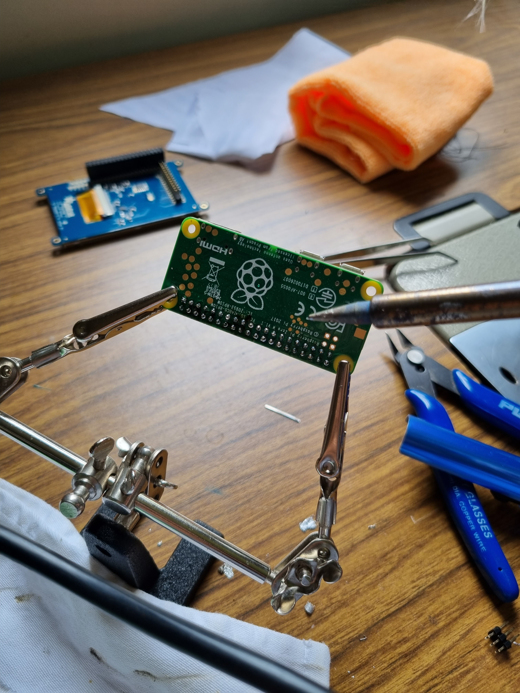
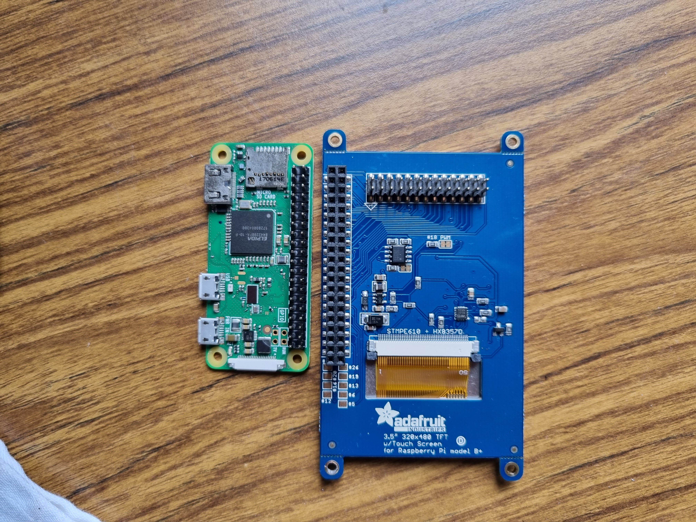
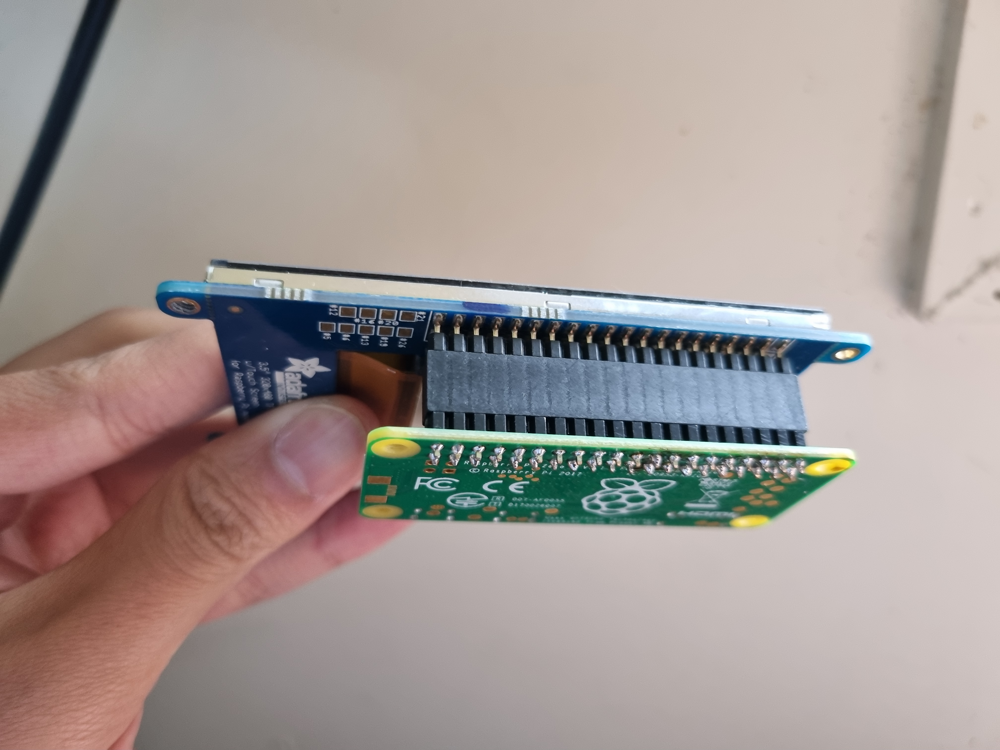
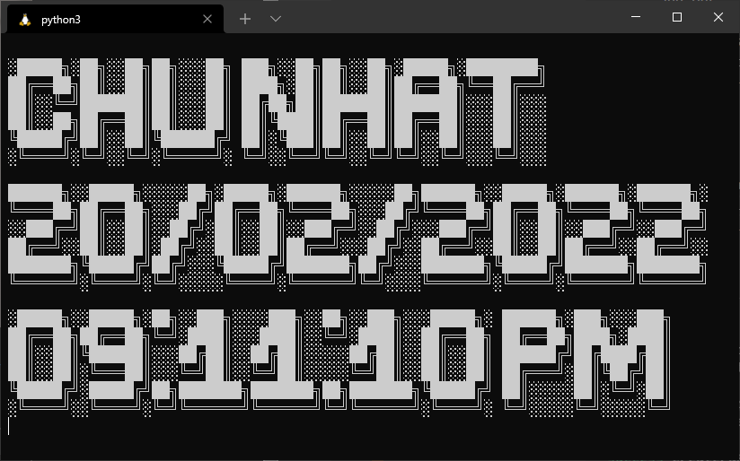
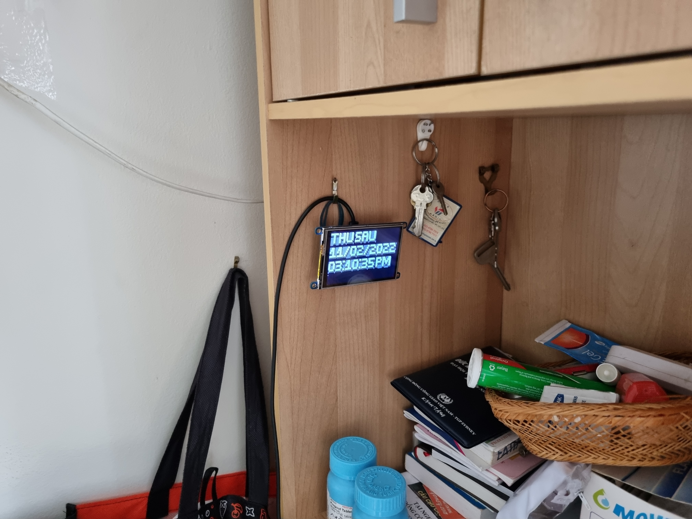
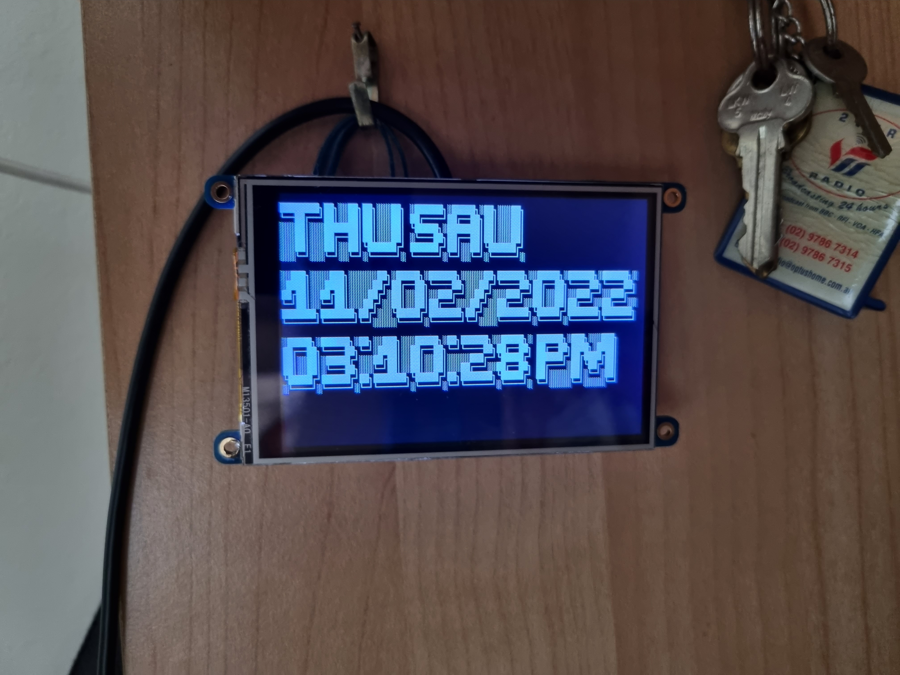

My Grandma sometimes forgets the date and day of the week as she gets older. She doesn't use a smartphone, only analogue clocks. She doesn't know English, so digital clocks wouldn't help. Some digital clocks also lose their time and date after a power cycle. I couldn't get her a voice assistant, as Google doesn't support the Vietnamese language yet. Since there was nothing available for her, I decided to hack together a solution.

I soldered together a [Raspberry Pi W](https://www.raspberrypi.com/products/raspberry-pi-zero-w/) and an [Adafruit PiTFT display](https://www.adafruit.com/product/2097). The Pi W was used on my Prusa MK3S Printer to run OctoPrint, but the performance was so bad [it's no longer recommended](https://github.com/guysoft/OctoPi/issues/318#issuecomment-284762963). The Adafruit Display was used as a touchscreen for [OctoPrint's Touch UI](https://www.thingiverse.com/thing:1601055), but I found it easier to use my phone than the interface. The Pi W's GPIO pins connect directly to the Adafruit display.







Adafruit provides [scripts on their GitHub](https://github.com/adafruit/Raspberry-Pi-Installer-Scripts) to install drivers for their displays, HATs and add-ons.

```shell-session
$ sudo python3 adafruit-pitft.py --display=35r --rotation=270 --install-type=console
```

I wrote a simple Python script that would output the day of the week, the date, and the time. It was difficult to change the font size on the terminal, so I used a package called [art](https://pypi.org/project/art/) to display large ASCII art which filled up the display. The source code can be found on my GitHub at [calvinbui/pi-clock](https://github.com/calvinbui/pi-clock). The package did not support the Vietnamese alphabet, so I had to remove their [diacritics](https://en.wikipedia.org/wiki/Diacritic). To autostart the Python script, I edited `/etc/rc.local` and added `/home/pi/pi-clock/main.py > /dev/tty1` before the `exit 0`.



The clock now hangs in her cabinet next to where she sits to watch television. It is powered using a single micro-USB cable, which automatically turns it on whenever it is plugged in. The Python script autostarts after boot. The Pi W is also connected to the Internet, so it will always have the correct time synced.




