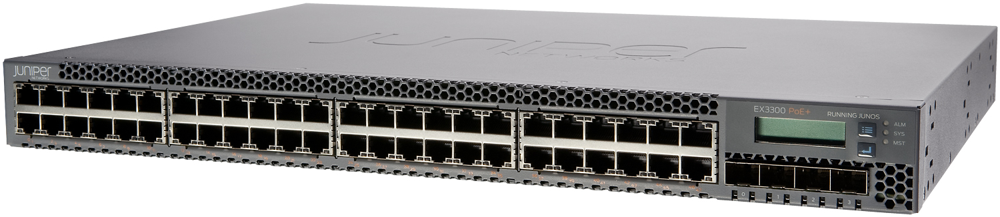

I purchased a Juniper EX3300-48P network switch which will be used to network the entire home.



## Features

The Juniper EX3300 was first released over 10 years in 2011. I bought it off eBay for just under AUD $400, but can be had in the lower $300s. The features I bought this for were:

- 48 ports
- Power-over-Ethernet (PoE)
- 4 x SFP+ ports
- Support for VLANs for network segregation
- Fans can be swapped
- Updates are still being released by Juniper
- [802.3az Energy-Efficient Ethernet](https://standards.ieee.org/ieee/802.3az/4270/)

An alternative I would've gone for is the Brocade ICX6450, but it is up to $100 more expensive. Comparatively, newer switches with similar features such as the [TP-Link SG3452P](https://www.tp-link.com/au/business-networking/easy-smart-switch/tl-sg3452p/) cost $900. Buying second-hand enterprise gear is the way to go!


## Firmware

Juniper still provides firmware updates for the EX3300 on [their website](https://support.juniper.net/support/downloads/?p=ex3300). To get the firmware, I had to [sign up on their website](https://userregistration.juniper.net/) and wait for approval before downloading it.

[Juniper Networks Technical Assistance Center (JTAC) recommends](https://kb.juniper.net/InfoCenter/index?page=content&id=KB21476&smlogin=true) the latest  Junos 12.3R12-Sx firmware for the switch. This is recommended instead of the 15.1 updates, because of memory issues the EX3300 experiences on the newer firmware.


Updating through the web interface or via HTTP did not work for me. The only method that worked was to download the firmware file locally and copy it over to the switch using SCP:

```shell-session
$ scp jinstall-ex-3300-12.3R12-S20.1-domestic-signed.tgz root@switch.example.com:/var/tmp/jinstall-ex-3300-12.3R12-S20.1-domestic-signed.tgz
```

Then validate the package:

```shell-session
root@switch> request system software validate /var/tmp/jinstall-ex-3300-12.3R12-S20.1-domestic-signed.tgz

Checking pending install on fpc0
```

Perform the update:

```shell-session
root@switch> request system software add /var/tmp/jinstall-ex-3300-12.3R12-S20.1-domestic-signed.tgz

Checking pending install on fpc0
Validating on fpc0
Done with validate on all virtual chassis members

fpc0:
Verify the signature of the new package
Verified jinstall-ex-3300-12.3R12-S20.1-domestic.tgz signed by PackageProduction_12_3_0
WARNING: A reboot is required to install the software
WARNING:     Use the 'request system reboot' command immediately
```

Reboot and wait until it comes back online:

```shell-session
root@switch> request system reboot
Reboot the system ? [yes,no] (no) yes
```

## Ansible

To configure the switch, I used the official [Junipernetworks.Junos](https://docs.ansible.com/ansible/latest/collections/junipernetworks/junos/index.html) collection. Ansible uses the Network Configuration Protocol (NETCONF), a standard for network management, to configure the switch. NETCONF is an XML-formatted command-and-response protocol that runs primarily over SSH.

First, I added the switch as a host to my `inventory.ini` file. I also specified the `ansible_network_os` variable, which informs Ansible which network platform these hosts corresponds to. This is required when using the `ansible.netcommon.*` connection options. I also added the username and password because SSH keys did not work for me.

```ini
[switch]
switch.example.com ansible_network_os=junipernetworks.junos.junos ansible_user=root ansible_password=password
```

Next, in the playbook, I targeted that host with `ansible.netcommon.netconf` as the connection mode.

```yaml
- hosts: switch
  gather_facts: false
  connection: ansible.netcommon.netconf
```

Finally, I used the following Ansible modules to configure the switch:

- [netconf](https://docs.ansible.com/ansible/latest/collections/junipernetworks/junos/junos_netconf_module.html): To enable NETCONF connections to the switch. The initial connection is done using `ansible.netcommon.network_cli`.
- [junos_l3_interfaces](https://docs.ansible.com/ansible/latest/collections/junipernetworks/junos/junos_l3_interfaces_module.html): Configures the switch's IP addresses.
- [junos_vlan](https://docs.ansible.com/ansible/latest/collections/junipernetworks/junos/junos_vlans_module.html): Creates and configure VLANs.
- [junos_l2_interfaces](https://docs.ansible.com/ansible/latest/collections/junipernetworks/junos/junos_l2_interfaces_module.html): Configure each network port's access, trunk and native VLAN/s.
- [junos_interfaces](https://docs.ansible.com/ansible/latest/collections/junipernetworks/junos/junos_interfaces_module.html): Configure each network port's description.

I have uploaded my configuration to my [Ansible repository on GitHub](https://github.com/calvinbui/ansible-monorepo/blob/master/juniper.yml).

## Fan Swap

Similar to a [previous post](/tp-link-t1600g-28ps-fan-swap), I performed a fan swap on the EX3300 following [Jade Angrboða's post on their website](https://jade.wtf/tech-notes/quiet-ex3300/). There isn't more I could add, so I'll post my images.


After the mod, the fan noise has dramatically reduced. Previously, I was able to hear the switch from an adjacent room on a quiet night. The airflow has decreased as well, but temperatures have been at a stable 59-60 degrees Celsius. From [Juniper's documentation](https://kb.juniper.net/InfoCenter/index?page=content&id=KB10969), the fan will go into high speed at 70 degrees, give a yellow alarm at 80 degrees and a red alarm at 95 degrees.


To monitor metrics from the switch, I used this [junos_exporter by tynany](https://github.com/tynany/junos_exporter) with Prometheus and Grafana. A [more popular exporter by czerwonk](https://github.com/czerwonk/junos_exporter) did not work with my EX3300, most likely due to the firmware version.
