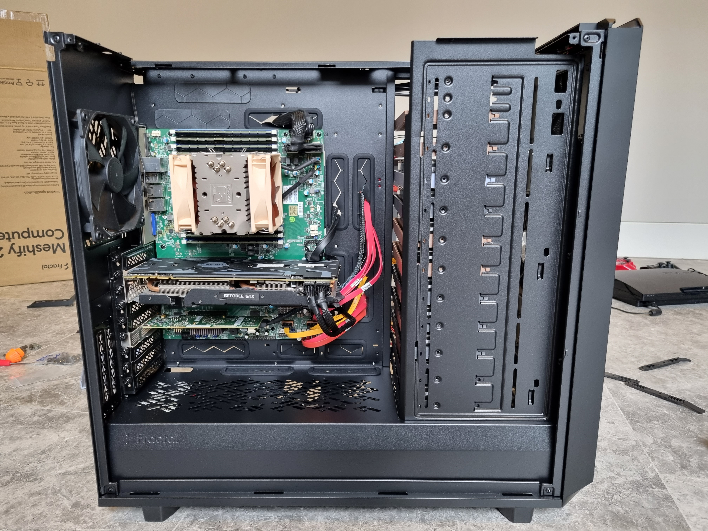

This is a short write-up of a switch in my server case. I went from the Norco RPC-431 to the Fractal Design Meshify 2 XL.

## Norco RPC-431

I have been using the [Norco RPC-431 rackmount case for over 3 years now](/my-72tb-freenas-server). Its size constraints have started to become an issue as I've tried to cram more peripherals inside. The straw that broke the camel's back was there was no room left for my NVIDIA GTX 1080 Ti for transcoding video.

## Meshify 2 XL

In my case search and landed on the Meshify 2 XL by Fractal Design. Its volume is 77.2 litres and weighs 16.4 kg. It's best suited for E-ATX and SSI-EEB form-factor motherboards as noted by [Gamers Nexus in their review](https://www.youtube.com/watch?v=sRFzaveNkOs).

The case ticked my criteria:

- fits at least 10 x 3.5" hard drives
- good airflow: cooling for hard drives
- PCI-e slots: for graphics cards, SAS cards, networking cards
- dust filters: the case will be kept in the garage

What I did not like about the case was the tempered glass side panel as it is unnecessary for my usage.

## Hard Drives

### Storage Layout
The Meshify 2 XL can support up to 18 x 3.5" and 5 x 2.5" drivers in its Storage Layout.

This is [covered in the user manual](https://www.fractal-design.com/wp-content/uploads/2020/10/Meshify_2_XL_Manual-v.1-2020-05-13.pdf) and took about 5 minutes to do.

### HDD Tray Kits

Even with support for 23 drives at once, the case only comes with 6 drive sleds. Any additional sleds must be purchased separately and sold as the HDD Tray Kit - Type B (2-pack). These cost $29 AUD and were sold out until June.

Turning to DIY, [JensCraft3D on Thingiverse has designed and provided a compatible model](https://www.thingiverse.com/thing:4487637) which worked just as well. I also had to purchase thumbscrews and HDD mounting screws from AliExpress to complete the item for around $15.

## Build

The case was very easy to work in given its size. All panels were removable making the case easy to work with. Only the bottom section where to power supply is was difficult, especially if I want to plug or unplug any cables.

Finally, photos of the build with the hard drives and graphics card installed.

