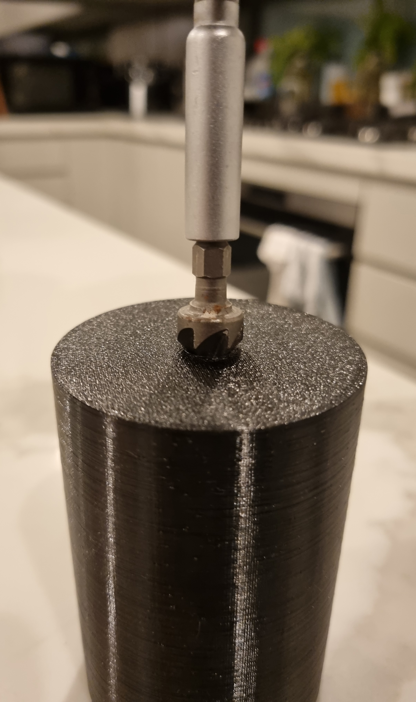

```toc
# This code block gets replaced with the TOC
```

I recently purchased a new sofa/couch, [the Chicago, 3-seater with chaise and electric recliner from OzDesignFurniture](https://ozdesignfurniture.com.au/furniture/sofas-sofabeds/leather-sofas/chicago-3-seater-chaise-lhf-elec-recs-in-natural). It looks a lot better in person than it does on their website.


The downside, however, is that it is too low for our robot vacuum, the [Roborock S7](https://roborock.com.au/pages/roborock-s7), to clean get under it.


The majority of our house was already *'robot vacuum friendly'*, so I decided to build upon the existing feet to raise the couch higher. The Roborock S7 required 10cm of clearance, and the lowest point on the couch was 1.5cm high. My idea was to equally raise each foot by 8.5cm to provide clearance.

The goal was set: design and 3D print extensions to each foot and fit them back to the sofa with longer screws.

## The Feet

Thankfully, all the feet on the sofa were removable but came in 4 different shapes and sizes across all the 15 feet.


| Type               | Qty | Current Screw              | New Screw    |
|:-------------------|:----|:---------------------------|:-------------|
| Brown Square       | 4   | M10 x 60mm                 | M10 x 140mm  |
| Brown Circle       | 7   | M10 x 20mm (not removable) | Threaded Rod |
| Black Large Circle | 3   | 10G x 40mm                 | 10G x 125mm  |
| Black Small Circle | 1   | M6 x 12mm                  | M6 x 100mm   |

## Designing

### Taking Measurements

To start, I took measurements with a pair of digital callipers on each foot.


### CAD Design

I designed the feet extensions within [Autodesk Fusion 360](https://www.autodesk.com.au/products/fusion-360/overview). I've used Fusion 360 in the past and also have experience with SketchUp and FreeCAD.


All the designs were very simple as the feet were either circles or squares. The most difficult design was for the black large circles as they used a very intricate pattern. It took a few iterations to get it to fit.


As I planned to use 3D printing to create the feet, the walls of each screw thread were offset by -0.1mm. Without this, screws will have trouble screwing into the thread.


Here's a photo of all the test prints I did in the end.


## Assembly

### 3D Printing

I chose to 3D print each foot using black eSun PETG filament on my [Bear MK3S+](/3d-printer-upgrades-galore). To increase the strength of the print, I used 4 vertical shells and 5 top and bottom horizontal shells. For infill, I used between 10% to 20% with gyroid.


Ideally, I would've opted for woodworking instead of 3D printing. [CNC Kitchen recently uploaded a video](https://www.youtube.com/watch?v=chCmwSdQzcE) showing how much better wood is than 3D printing for applications such as this project. Unfortunately, all I have is a 3D printer.


### Screws and Threaded Rod

I was unable to find any screw lengths I required at Bunnings but was able to find everything I wanted on eBay for $60 AUD combined.


With the threaded rod, I cut 7 x 7.5cm pieces with an angle grinder.


I filed each screw flat but didn't have the tools to filet or chamfer the edges. To work around this, I used a countersunk drill bit to make it easier to attach the threaded rod.



Finally, to screw in the threaded rod, I used a vice clamp.


### Putting it together


## Result

After two weeks of designing and printing, the project was complete! They look wonky, but they originally were and it's exaggerated when they've been extended.


The robot vacuum has no trouble cleaning underneath.


A picture of the map from the Roborock app.


## Files

These files are for the sofa feet designs shown in this blog post. They fall under the MIT License.

- [Fusion 360 (.f3d)](CAD.zip): The original CAD design files.
- [3D printable (.3mf)](3MF.zip): Files ready for a 3D printing slicer.
