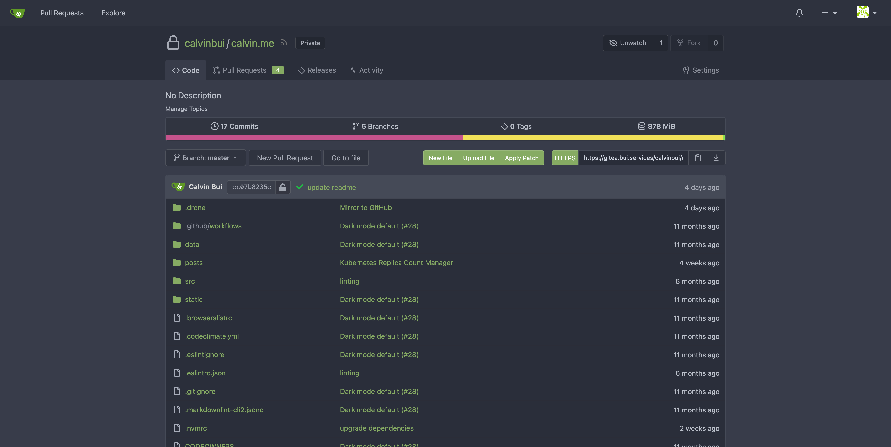
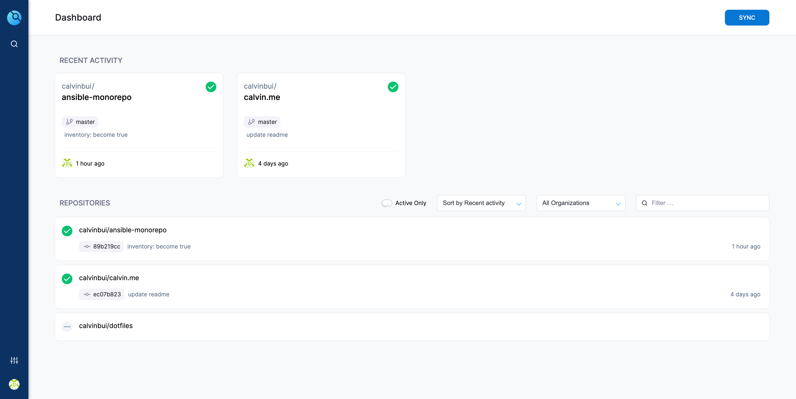
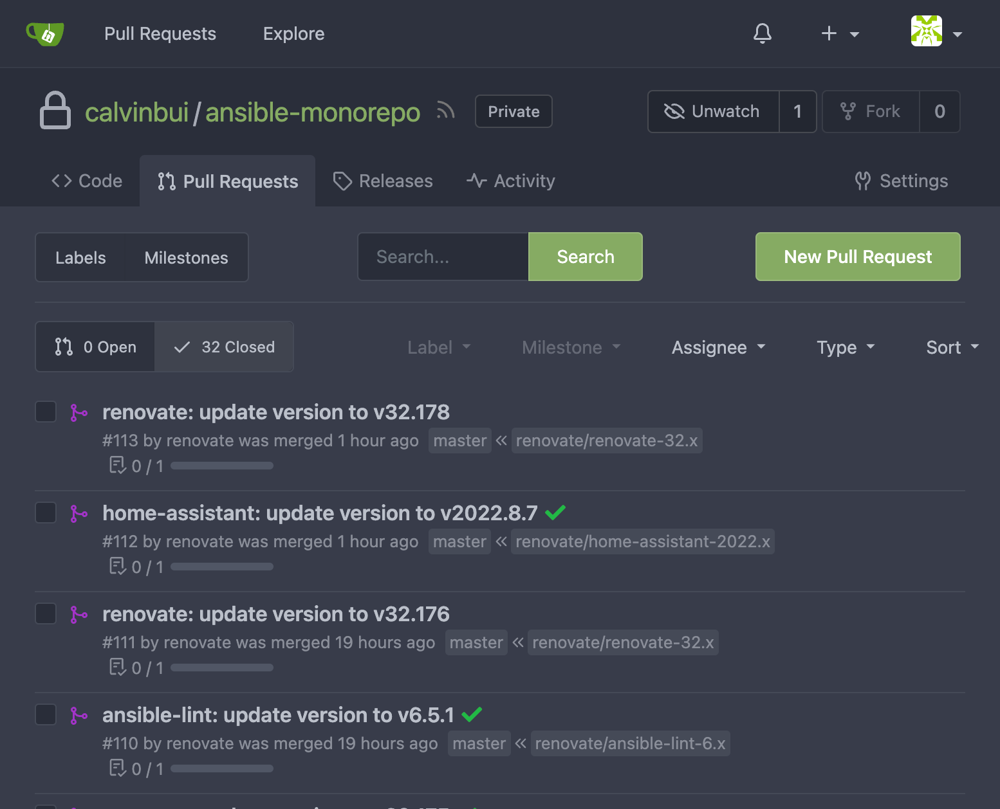
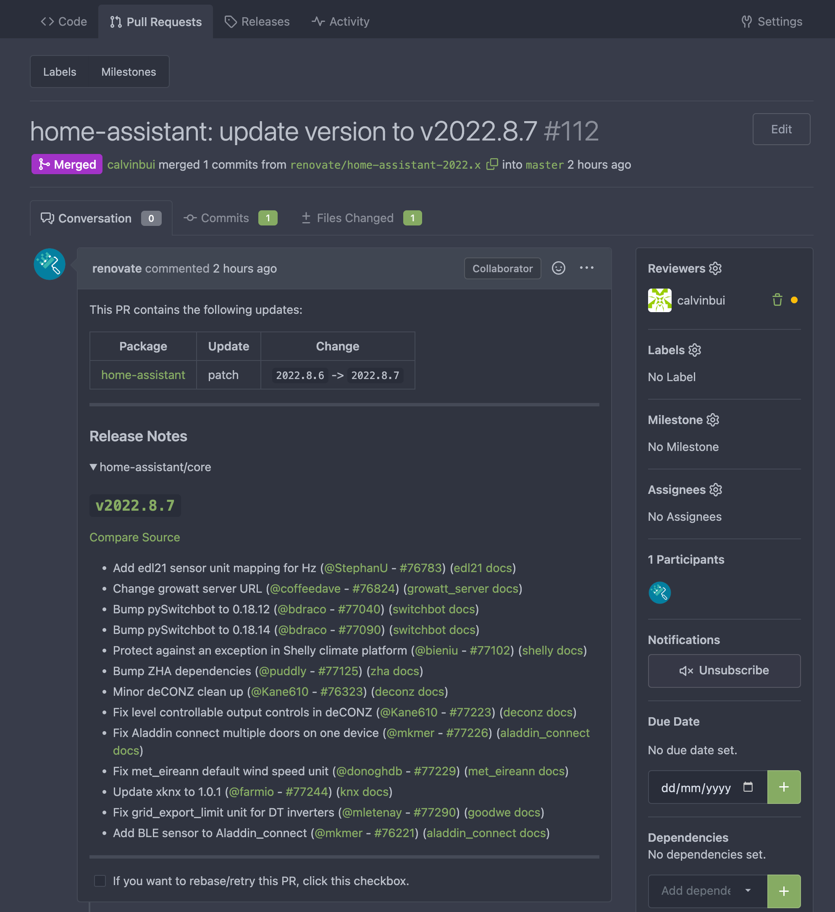
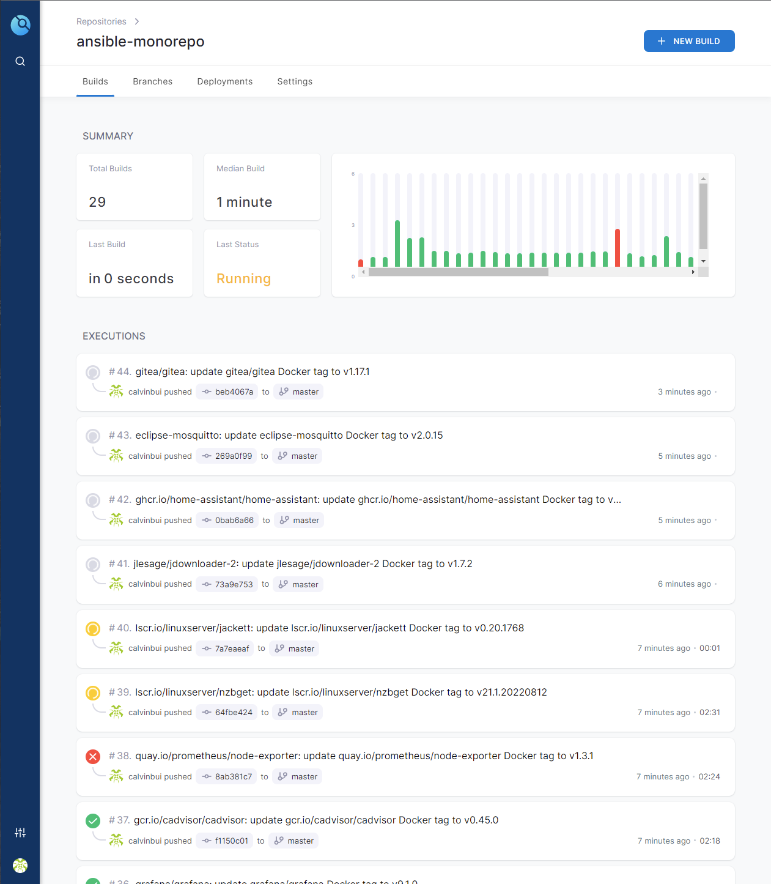
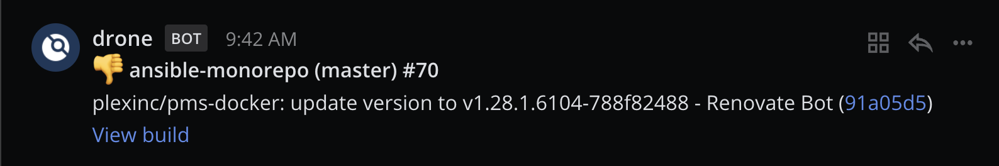
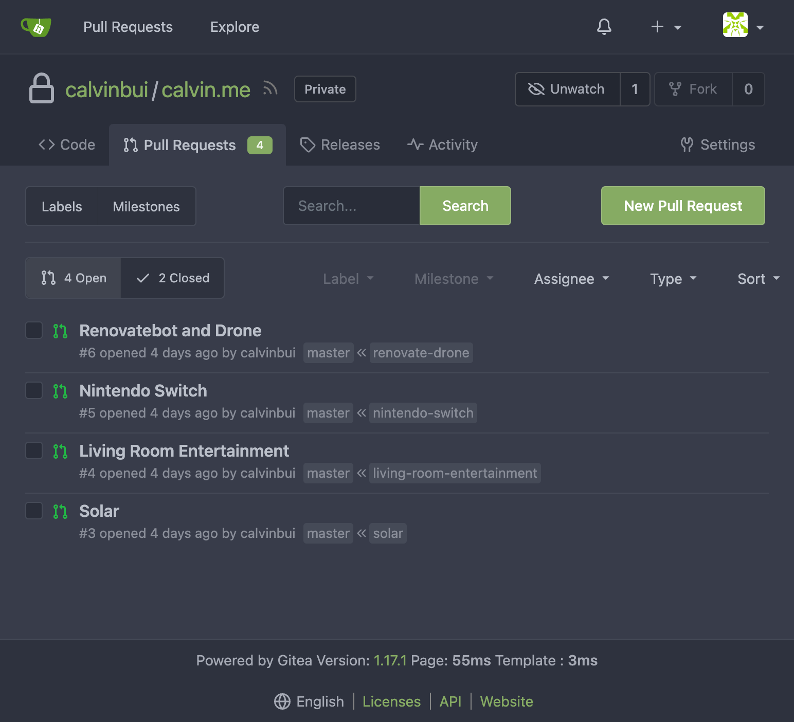

I've started running my own self-hosted Git server and CI/CD and wanted to share my use cases for it after avoiding both products for so long. Both can be great additions to a homelabber's toolbox.

<!-- more -->

```toc
# This code block gets replaced with the TOC
```

## Gitea

[Gitea](https://gitea.io/en-us/) is an open-source Git server written in Golang. It mimics GitHub's designs and concepts such as Pull Requests, Wikis, and Issues. I've been seeing it quickly rise in popularity over the years and thought I'd give it a try over other solutions like [GitLab](https://about.gitlab.com/).

In my environment, it runs in a Docker container and uses consistently less than 1% CPU and 1.2GB of memory. I only use Git over HTTPS, as enabling SSH requires opening additional ports. All its config options can be easily set with environment variables as well.



## Drone CI

[Drone](https://www.drone.io/) is an open-source CI/CD application also written in Go. It was acquired by Harness in August 2020. I don't like Harness, but Drone is a lot simpler and better than its bigger brother.



Drone uses 'runners' for executing build pipelines, similar to GitLab, Buildkite or TeamCity. [Runners](https://docs.drone.io/runner/overview/) can be on Docker (recommended), over SSH, locally, or on the cloud.

Its pipeline syntax is in `YAML` and is very simple to declare. Steps are executed sequentially.

```yaml
---

kind: pipeline
type: docker
name: default

steps:
  - name: test
    image: golang:1.19
    commands:
      - go test

  - name: build
    image: golang:1.19
    commands:
      - go build
```

One caveat is if the image is tagged with `:latest` either explicitly or implicitly, Drone attempts to pull the newest version of the image from the remote registry, even if the image exists in the local cache. I recommend building and managing private images with all the tools, configs and binaries you need.

Drone [connects to Gitea](https://docs.drone.io/server/provider/gitea/) as an OAuth application. It uses this to create webhooks inside the repo to trigger builds based on different events.

In my environment, both the server and runner are running on Docker. The server uses <1% CPU and 32MB of RAM. The runner also uses 1% of CPU and 14MB of RAM. Almost nothing.

## Uses Case 1: Managing Dependencies

I'm [using Ansible as the configuration management tool for my homelab](https://github.com/calvinbui/ansible-monorepo). Within Ansible, I use the [community.docker.docker_container](https://docs.ansible.com/ansible/latest/collections/community/docker/docker_container_module.html) module to create and modify containers.

To keep containers updated, I used the `:latest` tag and had [containrrr's watchtower](https://github.com/containrrr/watchtower) update them each night. The obvious problems with this solution were:

- Major version/breaking changes causing downtime (Mattermost v7 recently)
- Trusting the image maintainer updates the `:latest` tag (such as cAdvisor)
- The `:latest` tag gets changed to an unstable/nightly version
- Services I haven't used for a while breaking without knowing which update caused it

Instead, I began pinning my versions and deployed [Renovatebot](https://renovatebot.com/) to keep them updated. Renovatebot is an open-source tool to keep dependencies of all types up to date. It is very similar to [GitHub's Dependabot](https://github.com/dependabot). It can be self-hosted but also runs as a free hosted application on GitHub. The tool is [highly configurable](https://github.com/calvinbui/ansible-monorepo/blob/master/renovate.json5) and took me a few days to get it running exactly how I wanted. In my environment, it uses 1% CPU and 80MB of RAM. The Docker image is not long-lived, so I overrode the entrypoint to keep it running on a schedule.

The process is as follows:

1. Renovatebot scans the repository for all dependencies.

1. Renovatebot creates a PR for each dependency that requires an update.

    

1. Renovatebot sets me as a reviewer on the PR so I am notified via email.

1. I review the PR and changelog.

    

1. I merge the PR into the master branch.

1. Drone is triggered via the Gitea webhook.

    

1. Drone runs `ansible-playbook` to update the container

1. If the pipeline fails, Drone notifies me on Mattermost.

    

I am able to connect from Docker back into the server by mounting the SSH keys into the container and adding it to the `~/.ssh/authorized_keys` file.

```yaml
volumes:
  - name: ssh
    host:
      path: /home/calvin/.ssh

steps:
  - name: ansible-playbook
    image: calvinbui/ansible-runner:localhost
    volumes:
      - # container runs as root
        name: ssh
        path: /root/.ssh/
    commands:
      - .drone/ansible-playbook.sh
```

## Uses Case 2: Mirroring GitHub

Gitea can set up repository mirrors to or from external sources. This allows it to mirror all branches, tags and commits between itself and the external source on a schedule.

[GitHub takes DMCA notices seriously](https://github.com/github/dmca), with the most infamous case being the [youtube-dl repository back in November 2020](https://github.com/ytdl-org/youtube-dl). Being locked out of your account you control is dreadful, like when [Terraria's creator got locked out of their Google account](https://twitter.com/Demilogic/status/1358661842147692549?). Taking back control is one of the main reasons to self-host after all.

<blockquote class="twitter-tweet tw-align-center" data-dnt="true"><p lang="en" dir="ltr"><a href="https://twitter.com/Google?ref_src=twsrc%5Etfw">@Google</a> my account has now been disabled for over 3 weeks. I still have no idea why, and after using every resource I have to get this resolved you have done nothing but given me the runaround.</p>&mdash; Redigit (@Demilogic) <a href="https://twitter.com/Demilogic/status/1358661840402845696?ref_src=twsrc%5Etfw">February 8, 2021</a></blockquote> <script async src="https://platform.twitter.com/widgets.js" charset="utf-8"></script>

## Uses Case 3: Drafting Blog Posts

This blog and all its code and content are [available on GitHub](https://github.com/calvinbui/calvin.me). When I'm writing a new post, I'd keep all the drafts and images on my computer. This was limiting as I wouldn't be able to continue working on it on any other computer. I didn't feel comfortable uploading drafts into GitHub either as they weren't ready.

With Gitea, I can now push all the drafts to my heart's content. This is combined with a squash merge to keep all the changes contained in a single commit. To keep my blog's source code public, I have [a pipeline on Drone](https://github.com/calvinbui/calvin.me/tree/master/.drone) to sync the master branch to GitHub after each commit. [GitHub Actions is still used to build the website](/making-this-site-more-open-source#build) after both remotes are synced.

I couldn't use Gitea's mirroring feature as it does not support limiting which branches are mirrored.

Here's a preview of what's to come:


