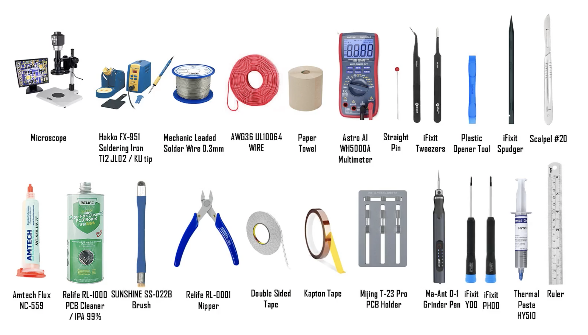
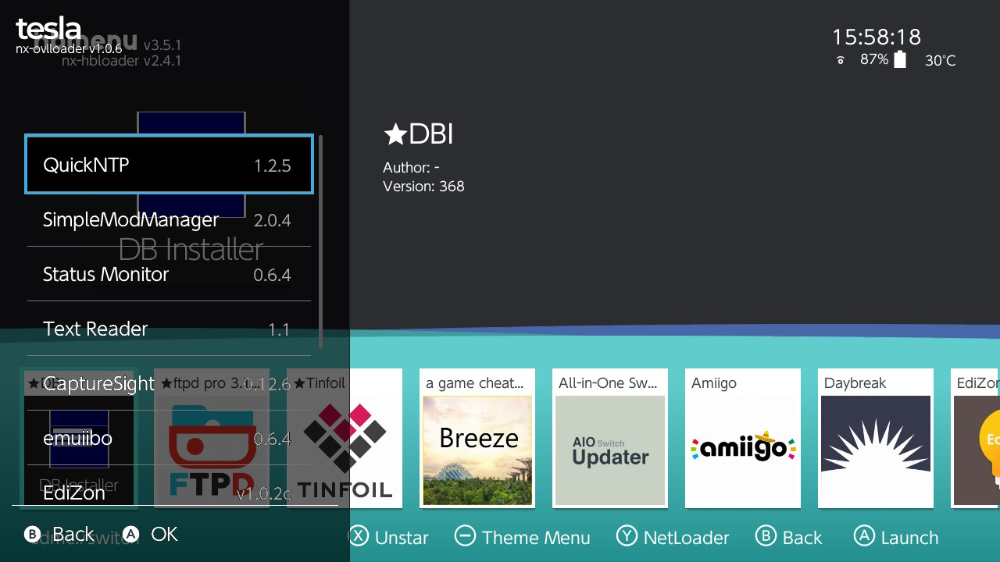
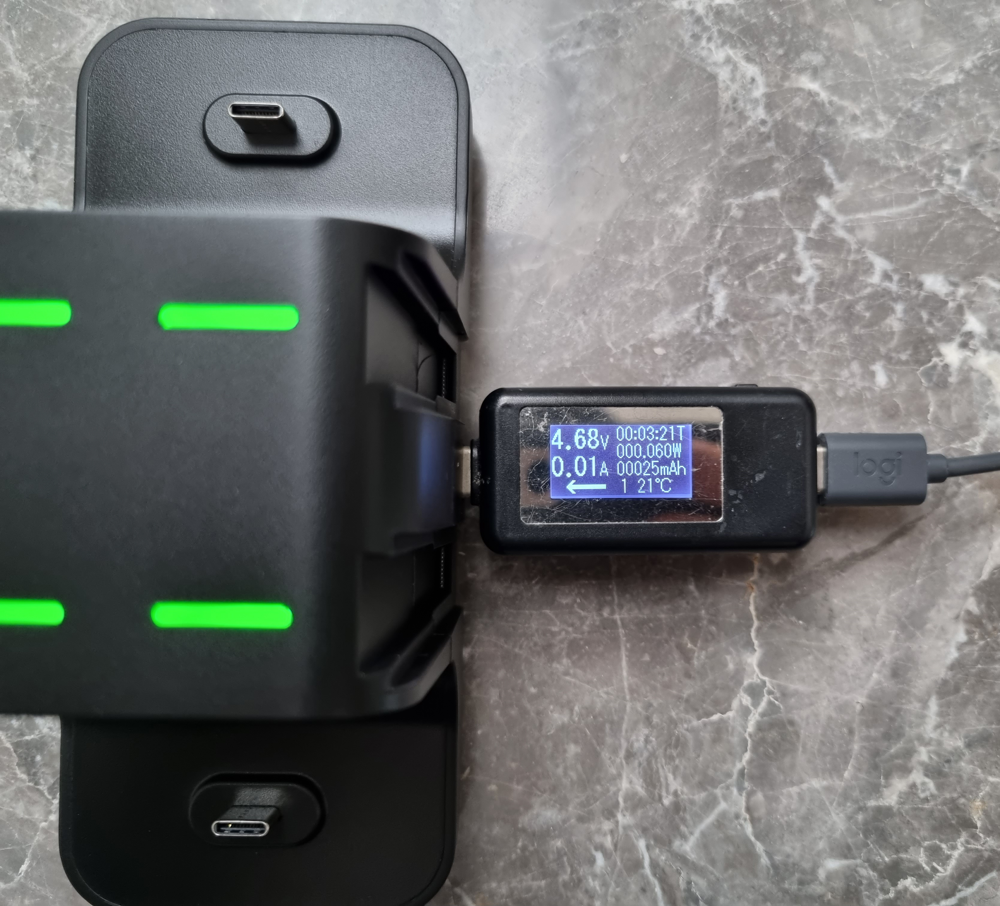

Modifying and installing homebrew on a Nintendo Switch OLED.

```toc
# This code block gets replaced with the TOC
```

## Winning a Nintendo Switch

My wife won a Nintendo Switch at a [meetup we attended](https://www.eventbrite.com.au/e/beerops-sydney-australias-largest-devops-data-meetup-tickets-323016740767). We initially regretted our decision to attend. On the night of the event, transport workers were taking industrial action, it was raining, the food and drinks were poor and the place was tightly crowded. The next day she got the call notifying her of the winning the Wordle competition the night prior which made up for everything!


Unfortunately, it was the regular model without the OLED screen. Luckily, the device was brand new and we had the receipt, so I swapped it over to the OLED model at JB Hi-Fi for an extra $40.


## Modchip

To install homebrew (I am not condoning piracy) on an OLED Switch, a hardmod/modchip is required. The modchip runs a custom bootloader instead of Nintendo's, allowing unsigned code to execute.

I bought the [HWFly v4.1 from Aliexpress](https://www.aliexpress.com/item/1005004410596922.html) for roughly $150 AUD. I would recommend the cheaper v4, as at the time of installation, there was no instructions available for the v4.1. The difference is the v4.1 uses ribbon cables to ease installation, but ultimately the difficulty is the same and not as secure.

I loosely followed this [amazing tutorial by Sthetix](https://www.sthetix.info/soldering-the-oled-v3/) to install the modchip. This video is for the v3, but I applied the solder points and connections to v4.1. The following equipment is also required along with my suggestions (photo from the Sthetix video):



- **Soldering iron**: I use a [Quicko T12-959](https://www.aliexpress.com/item/1005003502334733.html). Hakko is also a good brand.
- **T12-JL02 and T12-KU tips**: They are included in [this set from Quicko](https://www.aliexpress.com/item/32800132921.html).
- **Solder flux**: I used a flux pen.
- **Microscope**: A digital microscope with a screen is ideal, but I use a magnifying glass.
- **PCB Holder**: I don't have this either. I set it down on some bubble wrap.
- **Precision tweezers**: I like the [iFixit set](https://australia.ifixit.com/products/precision-tweezers-set). A bad pair of tweezers won't hold items as their noses don't align.
- **PCB Cleaner**: I used isopropyl alcohol.

This was my setup on my desk:


Before starting, I downloaded and updated the firmware on the modchip [using HWFly's GitHub repo](https://github.com/hwfly-nx/firmware).


Next was disassembly. Only the mainboard is required.


With everything diassembled, I begun soldering while following the Sthetix's video guide.


Finally, reassembly and turning it back on.


## microSD Setup

### Picking a microSD Card

The microSD card is responsible for running the [EmuNAND](https://rentry.org/SwitchTerminology#emunand) and storing files (such as homebrew, backed-up games and themes).

SD cards have [lot of specifications](https://en.wikipedia.org/wiki/SD_card#Speed) that define their speed. I recommend a microSD card that is:

- Size: 512GB or 1TB
- Bus: UHS-I
- Video Speed Class: U3 V30
- Application Performance Class: A2. A1 will also work, but it'll be slow to transfer files from/to a computer.

I went with [Samsung 512GB Pro Plus UHS-I U3 A2 V30](https://www.samsung.com/au/memory-storage/memory-card/pro-plus-512gb-microsd-card-mb-md512ka-apc/) (mouthful) microSD card for $95 AUD. Worthwhile alternatives from Sandisk are the 1TB A2 Extreme and Extreme Pro, however they are more are double the price of 512GB A2 cards (not worth it).


A card reader with UHS-I DDR200 is required to unlock the full speeds of the card when connected to a computer. I have the [Lexar Multi-card 2-in-1 3.1 Reader](https://www.lexar.com/product/lexar-multi-card-2-in-1-usb-3-1-reader/) which is roughly 20 MB/s faster than my other card readers (an increase of 70 MB/s to 90 MB/s).


### Creating an EmuNAND

I followed these guides to create an EmuNAND:

1. [Backup NAND](https://rentry.org/BackupRestoreNAND)
1. [Backup keys](https://rentry.org/DumpingKeys)
1. Consider if you want to run [Android](https://wiki.switchroot.org/en/Android/Setup-10) and/or [Linux](https://wiki.switchroot.org/en/Linux/Ubuntu-Install-Guide). This isn't yet support on the OLED, [but work has started](https://www.gofundme.com/f/add-mariko-support-to-switchroot-projects). These partitions are easier created now as doing a backup and re-partitioning takes a lot of time and risk.

    

1. Create the EmuNAND following any of these guides:

    - [Trimmed EmuNAND by Sthetix](https://www.sthetix.info/setting-up-a-trimmed-emummc/): I followed this to reclaim 52 GB of space.
    - [EmuNAND guide on Rentry](https://rentry.org/MarikoEmuNAND)
    - [EmuNAND guide by Homebrew Guide](https://switch.homebrew.guide/emummc/emummc.html)

1. Before booting into Atmosphere, I strongly recommend doing the following:

    - [Enable USB 3.0 for Homebrew](https://github.com/Atmosphere-NX/Atmosphere/blob/master/config_templates/system_settings.ini#L7=)
    - [Zero out the serial number and create a hosts file to block Nintendo servers](https://rentry.org/ExosphereDNSMITM)
    - In `atmosphere/config/system_settings.ini`, add/uncomment:
        - `enable_dns_mitm = u8!0x1`
        - `add_defaults_to_dns_hosts = u8!0x1`

1. Create `bootloader/hekate_ipl.ini` with the following. This autoboots into EmuMMC unless the `VOL-` is pressed within 3 seconds:

    ```ini
    [config]
    ; 0: Disable, #: Boot entry number to auto boot.
    autoboot=1

    ; 0: Read autoboot boot entry from hekate_ipl.ini, 1: Read from ini folder (ini files are ASCII ordered).
    autoboot_list=0

    ; 0: Disable (It also disables bootlogo. Having VOL- pressed since injection goes to menu.), #: Time to wait for VOL- to enter menu. Max: 20s.
    bootwait=3

    ; 0: Animated line is drawn during custom bootlogo, signifying time left to skip to menu. 1: Disable.
    noticker=0

    ; 0: Disable, 1: If woke up from HOS via an RTC alarm, shows logo, then powers off completely, 2: No logo, immediately powers off.
    autohosoff=2

    ; 0: Disable, 1: Automatically applies nogc patch if unburnt fuses found and a >= 4.0.0 HOS is booted.
    autonogc=1

    ; 0: Disable, 1: Protect bootloader folder from being corrupted by disallowing reading or editing in HOS.
    bootprotect=0

    ; 0: Disable, 1: Force updates (if needed) the reboot2payload binary to be hekate.
    updater2p=1

    ; Screen backlight level. 0-255.
    backlight=100

    [CFW EmuMMC]
    ; chain loading fusee instead of fss0/package3 removes the need for other patches.
    ; this includes having to load kips manually.
    ; https://rentry.org/SwitchTerminology#fusee
    payload=bootloader/payloads/fusee.bin
    icon=bootloader/res/emummc.bmp

    [CFW SysMMC]
    fss0=atmosphere/package3
    kip1patch=nosigchk
    emummc_force_disable=1
    icon=bootloader/res/sysnand.bmp

    ; Use the reboot OFW option in Hekate instead.
    ; [Stock SysMMC]
    ; fss0=atmosphere/package3
    ; stock=1
    ; emummc_force_disable=1
    ; icon=bootloader/res/stock.bmp
    ```

I used icons from [Sthetix's HATS Pack](https://u.pcloud.link/publink/show?code=XZAkVUXZkgrREaCGTQLsTYfCeUqXFhKDnfBk)


## Homebrew

Once loaded into Atmosphere, a good source of information and general guides can be found at:

- [Rentry](https://rentry.org/SwitchHackingIsEasy)
- [Sthetix](https://www.sthetix.info/nintendo-switch/)
- [Homebrew Guide](https://switch.homebrew.guide/)


There are a few all-in-one homebrew packs on the Internet. Personally, I don't have the time to dig into each pack to see if they do anything strange, or trust they can be maintained forever. Instead, I prefer to download and install each piece of homebrew myself. Installation is usually a drag-and-drop onto the microSD card, but read the instructions to be sure.

To access the homebrew menu, hold R while opening a game/title. It can also be accessed by opening the Album application, but this opens in Applet mode, giving the homebrew less memory. Only use the Album method if you don't have any games/titles installed. Also read up on [Forwarders later in this post](#forwarders).

I recommend making a note of all the homebrew that installs folders into `/atmosphere/content`. **This folder must be empty during a firmware upgrade**. An error screen may appear after upgrading if folders are left inside of the folder, but clearing it will solve the problem. That's why it's important to know what has been installed here.

### Must Haves

- [hekate & Nyx](https://github.com/CTCaer/hekate): Bootloader.
- [Atmosphere & fusee](https://github.com/Atmosphere-NX/Atmosphere): Custom firmware.
- [hbmenu](https://github.com/switchbrew/nx-hbmenu): Included with Atmosphere. Opens when launching the Album or holding R and launching a game/title.

### Gaming

I am not condoning piracy.

- [sys-patch](https://github.com/impeeza/sys-patch): Patch Atmosphere to run unsigned code (such as backups).
- [Tinfoil](https://tinfoil.io/): Title/game manager.
- [DBI](https://github.com/rashevskyv/dbi): Title/game manager alternative to Tinfoil. I prefer it's MTP feature over Tinfoil's.
- [JKSV](https://github.com/J-D-K/JKSV): Save game manager.
- [Breeze](https://github.com/tomvita/Breeze-Beta): Cheats. An updated version of [EdiZon SE](https://github.com/tomvita/EdiZon-SE/) by the same author.
- [Mission Control](https://github.com/ndeadly/MissionControl): Use controllers from other consoles.
- [SimpleModManager](https://github.com/nadrino/SimpleModManager): Run mods from GameBanana.

### File Management and Backup

- [ftpd](https://github.com/mtheall/ftpd): FTP server.
- [NX-Shell](https://github.com/joel16/NX-Shell): File browser.
- [nxdumptool](https://github.com/DarkMatterCore/nxdumptool): Dump game cards and eShop titles.
- [Lockpick_RCM](https://github.com/Decscots/Lockpick_RCM): Dump keys within Hekate.
- [TegraExplorer](https://github.com/suchmememanyskill/TegraExplorer): File browser within Hekate and executing scripts.
  - [Scripts](https://github.com/suchmememanyskill/TegraScript/tree/master/scripts).

### Screen Overlay (Tesla)

[Ultrahand](https://github.com/ppkantorski/Ultrahand-Overlay) is an libtesla overlay available at any time by pressing `L` + `DPad Down` + `R3`. [nx-ovlloader](https://github.com/WerWolv/nx-ovlloader/) is also required to load Tesla. The following overlays are available:

- [EdiZon Overlay](https://github.com/proferabg/EdiZon-Overlay/): Cheats from EdiZon.
- [ovlSysmodule](https://github.com/WerWolv/ovl-sysmodules): Toggle sysmodules on the fly.
- [Status Monitor Overlay](https://github.com/masagrator/Status-Monitor-Overlay): Hardware monitoring.
- [ReverseNX-RT](https://github.com/masagrator/ReverseNX-RT): Change between handheld and docked state.
  - [ReverseNX-Tool](https://github.com/masagrator/ReverseNX-Tool): To manage ReverseNX-RT.
  - [SaltyNX](https://github.com/masagrator/SaltyNX): Required to be installed first.
    - [SaltyNX-Tool](https://github.com/masagrator/SaltyNX-Tool): To manage SaltyNX.
- [TextReaderOverlay](https://github.com/diwo/TextReaderOverlay-NX): Display text files.
- [QuickNTP](https://github.com/nedex/QuickNTP): Syncing time as blocking DNS also blocks time syncs with Nintendo servers.
- [sys-ftpd-ovl](https://github.com/SegFault42/sys-ftpd-ovl): Display IP address.
- [CaptureSight](https://github.com/zaksabeast/CaptureSight/): Tesla overlay for viewing Pokemon data.



### Screen capture and Streaming

- [SysDVR](https://github.com/exelix11/SysDVR): Stream to a PC.
- [Moonlight-Switch](https://github.com/XITRIX/Moonlight-Switch). An updated fork of [Moonlight-NX](https://github.com/rock88/moonlight-nx/): Better performance than [switch-remote-play](https://github.com/Moehammered/switch-remote-play) and [SkyNX](https://github.com/DevL0rd/SkyNX) as I have an NVIDIA GPU. I have raised an [issue with them about Wake On LAN not working](https://github.com/XITRIX/Moonlight-Switch/issues/71).
- [Chiaki](https://sr.ht/~thestr4ng3r/chiaki/): PlayStation Remote Play.

### Tools and Utilities

- [Homebrew App Store](https://github.com/fortheusers/hb-appstore): App store for homebrew. I don't recommend installing or uninstalling anything with this as it messes around with the SD card files. Good to browse for apps.
- [AIO-Switch-Updater](https://github.com/HamletDuFromage/AIO-switch-updater): Helper to update bootloader, custom firmware etc.
- [hwfly-toolbox](https://github.com/hwfly-nx/hwfly-toolbox): Update modchip firmware. [Guide here](https://www.sthetix.info/updating-the-chip-using-a-special-toolbox/).
- [hwfly-nx firmware](https://github.com/hwfly-nx/firmware): Firmware for the modchip.
- [emuiibo](https://github.com/XorTroll/emuiibo): Emulate amiibos.
- [Amiigo](https://github.com/CompSciOrBust/Amiigo): GUI for emuiibo (above).
- [SwitchPoff](https://github.com/Storm21CH/SwitchPoff-ShutdownSwitch): A shortcut to power-off.
- [NXReboot](https://github.com/Ericvf/NXReboot): A shortcut to reboot.
- [NX-Activity-Log](https://github.com/tallbl0nde/NX-Activity-Log): Displays time playing games.
- [NXGallery](https://github.com/iultimatelp/nxgallery): Transfer screenshots to your phone through a web server and QR code.
- [Fizeau](https://github.com/averne/Fizeau/): Blue-light filter.
- [Linkalho](https://github.com/rdmrocha/linkalho/): Link Nintendo Network ID accounts offline. Required for some games such as Jackbox Party Pack.
- [Avatool](https://github.com/J-D-K/Avatool): Change account avatars.
- [FPSLocker](https://github.com/masagrator/FPSLocker): Unlock FPS in games.

## Updating Horizon OS

1. Boot into Stock SysMMC and update the firmware.
1. Wait for the modchip to retrain and boot back into Hekate.
1. Run [Lockpick_RCM](https://sigmapatches.coomer.party/) and select **Dump from SysNAND**.
1. Run [TegraExplorer](https://github.com/suchmememanyskill/TegraExplorer), select **Browse the SD card option** and run [this modified script](https://github.com/suchmememanyskill/TegraExplorer/issues/58#issuecomment-984845331) and select **Dump sysmmc**.
1. Copy the latest [hekate](https://github.com/CTCaer/hekate) release over to the SD card.
1. Copy the latest [Atmosphere](https://github.com/Atmosphere-NX/Atmosphere) release over to the SD card.
1. Copy the latest [sys-patch](https://github.com/impeeza/sys-patch) release over to the SD card.
1. Copy the latest [fusee.bin](https://github.com/Atmosphere-NX/Atmosphere) to `sdcard:/bootloader/payloads/`
1. Replace `sdcard:/payload.bin` with `hekate_ctcaer_X.Y.Z.bin` from hekate.
1. Backup the `sdcard:/atmosphere/contents/` folder to the computer and delete the folder.
1. Run **Daybreak** and select `sdcard:/tegraexplorer/Firmware/xxx`. Choose `Perserve settings` and `Install (FAT32 + exFAT)`. Reboot and check everything works.
1. Restore `sdcard:/atmosphere/contents/` and update all homebrew to be compatible with the new firmware.
1. Themes will have to be reinstalled. Delete the `0100000000001000` and `0100000000001007` folders if they exists under `sdcard:/atmosphere/contents/` or Atmosphere will crash.

## Theming

I followed [the guide on Rentry about theming](https://rentry.org/InstallingThemes). It requires [NXThemesInstaller](https://github.com/exelix11/SwitchThemeInjector/), and comes packaged with a tool to build and unpack themes.

Themes can be downloaded them [Themezer](https://themezer.net/) and copied onto the microSD card, or by using [themezer-nx](https://github.com/suchmememanyskill/themezer-nx) to download them directly on the Switch.

I built my own theme using images from the movie [Your Name](https://en.wikipedia.org/wiki/Your_Name). It uses:

- [Two Row Home Layout by xFlesk](https://themezer.net/layouts/homemenu/Two-Row-Layout-Compact-1c)
- [All Apps without title by Generic Goose](https://themezer.net/layouts/allapps/Goose-Apps-1f)
- [Side Lock by Migush](https://themezer.net/layouts/lockscreen/Side-Lock-1)

Download my theme [from here](theme/theme.zip).


## Forwarders

Forwarders are shortcuts to homebrew apps that can be launched from the home screen without going through the homebrew menu.

To create a forwarder, I used a tool called [SAK](https://github.com/dezem/SAK) which has a *NRO forwarder* feature. Fill in the details about the application and also include an icon. I used icons from these posts on gbatemp.net:

- [homebrew-nsp-forwarder](https://gbatemp.net/threads/homebrew-nsp-forwarder.529497/#post-8481967)
- [homebrew nsp forwarder no.2](https://gbatemp.net/threads/homebrew-nsp-forwarder-no-2.579975/)


Copy the `.NSP` file onto the Switch's microSD card. The `.NSP` file can be installed through DBI or Tinfoil.


Aftewards, go to the home screen and it will then appear as a game/title with all the information provided to SAK.

Download the Homebrew Menu forwarder I created above [here](forwarder/HBMENU-011a8df5c3152000.nsp).


## Games

I do not condone piracy.

### NSZ

The `NSZ` format is a compressed version of `NSP` using the loseless zstd compression algorithim. I prefer storing my games in the uncompressed `NSP` format, as this works with emulators such as [yuzu](https://yuzu-emu.org/) and [Ryujinx](https://ryujinx.org/). To (de)compress games, I use the [official nsz GUI by nicoboss](https://github.com/nicoboss/nsz). Make sure to enable 'Parse Cnmt' under Settings > Advanced.


If games are over 4GB and the microSD card is FAT32 formatted, they are split into multiple files. To merge these together, I use [ns-usbloader by developersu](https://github.com/developersu/ns-usbloader).


### Management

I manage my `.NSP` game files using [Switch Library Manager](https://github.com/giwty/switch-library-manager). After decompressing my `.NSZ` files above, I move them into my games folder and it does the rest. What I love about it:

- Shows missing DLC and updates
- Renames files
- Organise files into folders
- Finds duplicates
- Warns if older update files exist (updates are cumulative)


### Network Install

Installing games, updates and DLC over the network are supported in both [Tinfoil](https://tinfoil.io/install/network) and [DBI](https://github.com/rashevskyv/dbi/blob/main/README_ENG.md#home-server). The files only need to be served over HTTP/HTTPS using a web server with directory listing enabled. However, all files must be within the same directory can cannot be in separate subdirectories.

Instead of a traditional web server, I use [PHPinfoil](https://github.com/TheyKilledKenny/PHPinfoil/). It supports subdirectories, as it scans through all files and folders and creates a JSON file to be provided to Tinfoil. This makes it pair well with [Switch Library Manager](#management) for file management. One downside is the `/?reset` endpoint needs to be called manually to refresh the directory listing.


## Accessories

### Screen protector

I was given this free tempered glass screen protector at JB Hi-Fi. It's probably like any other.


### Case

For general protection, I use the [HeysTop Dockable Case from AliExpress](https://www.aliexpress.com/item/1005003509574322.html). Compared to other cases on the market:

- It can dock with the case on
- The kickstand is still accessible
- Ergonomic grips for handheld
- Joy-Cons are easily removable
- Fits two game cartridges
- Only $15 AUD

HeyStop make another case for the OLED Switch, but I returned it as it had issues making a connection to the TV when docked. Another review on Amazon mentioned the same thing.


### Carrying Case

I went with the [official Nintendo carrying case](https://www.nintendo.com/store/products/nintendo-switch-carrying-case-screen-protector/), for when travelling somewhere with the device. It comes with a plastic screen protector as well, but I preferred my tempered glass one. It fits perfectly with the HeyStop case. and can also hold more game cartridges and a glass cleaner.


### Controllers and Charger

We have two sets of Joy-Cons and two Pro Controllers. This is a perfect balance between party games (Switch Sports) and games that require finer control (Mario Kart). The reason is that Joy-Cons can be attached to the grip, turning them into regular controllers, to give a total of four controllers (two sets of Joy-Cons and two Pro Controllers).


To charge all these controllers, I purchased a 6-in-1 charging station. It charges over a USB-C cable connected to the dock.


It recommends a 5V/2A power source, but I didn't see it having any issues when measuring with the dock or an external charger.



Note, I've had to return two chargers already after one Joy-Con charger would no longer charge, so buy from somewhere with an easy return policy.

### HORI Taiko No Tatsujin Drum Mod

[Taiko No Tatsujin](https://en.bandainamcoent.eu/taiko-no-tatsujin/taiko-no-tatsujin-drumnfun) is a popular rhythm drumming game from Japan by Bandai Namco. The most popular controller for the game is a [licensed drum kit made by HORI](https://nintendosoup.com/hori-releasing-taiko-no-tatsujin-drum-controller-for-nintendo-switch/).


The HORI drum has low sensitivity, and you have to hit fairly hard to register hits. I followed the popular '[dollroom mod](http://dollroom.sakura.ne.jp/doll929/doll929.html)' to increase sensitivity using cork trivets and rubber adhesives. There are similarly guides in English on [Reddit](https://old.reddit.com/r/taikonotatsujin/comments/obs8ns/modding_the_hori_taiko_no_tatsujin_drum_for/) and [YouTube](https://www.youtube.com/watch?v=tq25QLHuhZk).


For the 'ka' mod, I used a 1cm wide strip to cover the entire sensor. This resulted in an *almost* perfect amount of sensitivity, I think it needed just a bit more.


Here are the final results, tested on [https://melon.cx/tatacon/](https://melon.cx/tatacon/):

<video loop controls width="100%" height="auto">
  <source type="video/mp4" src="accessories/taiko-test.mp4">
  <p>Your browser does not support the video element.</p>
</video>
