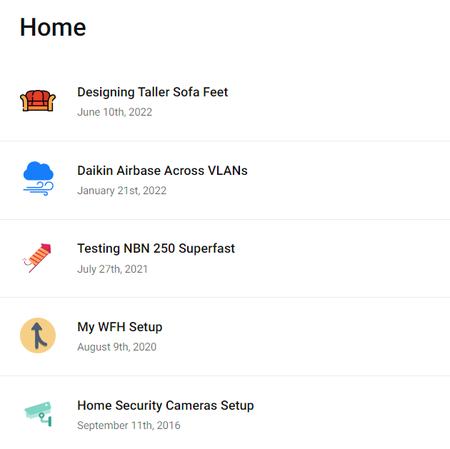
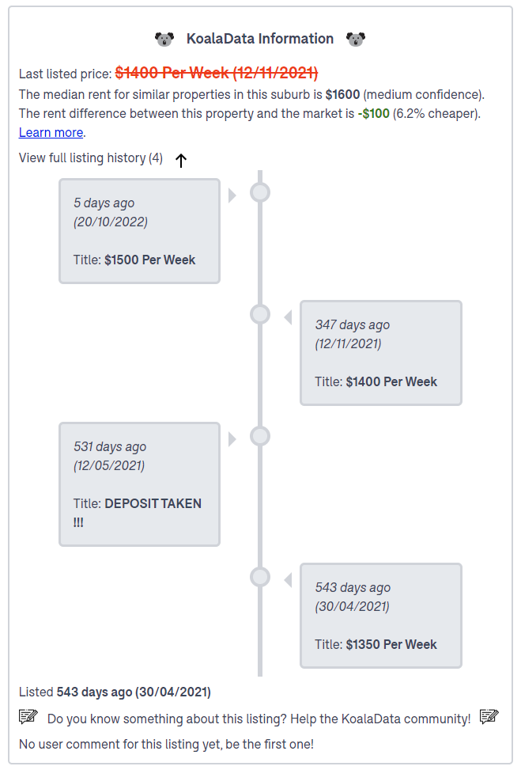
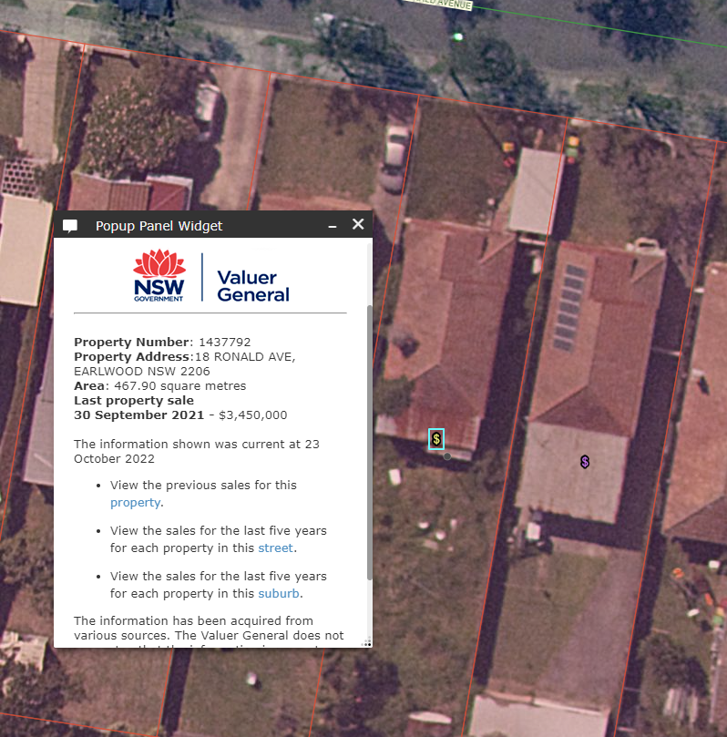
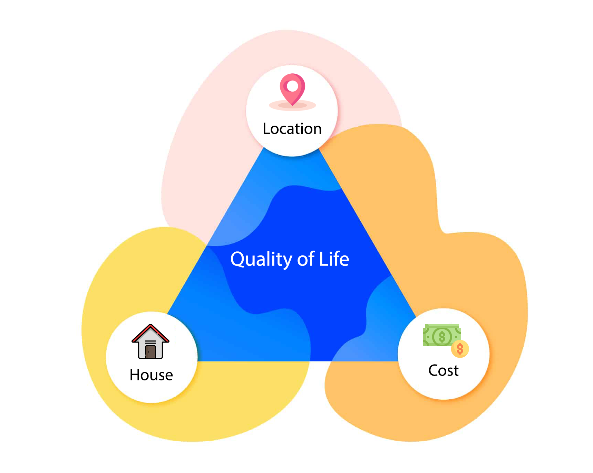
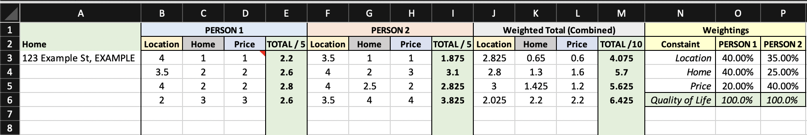
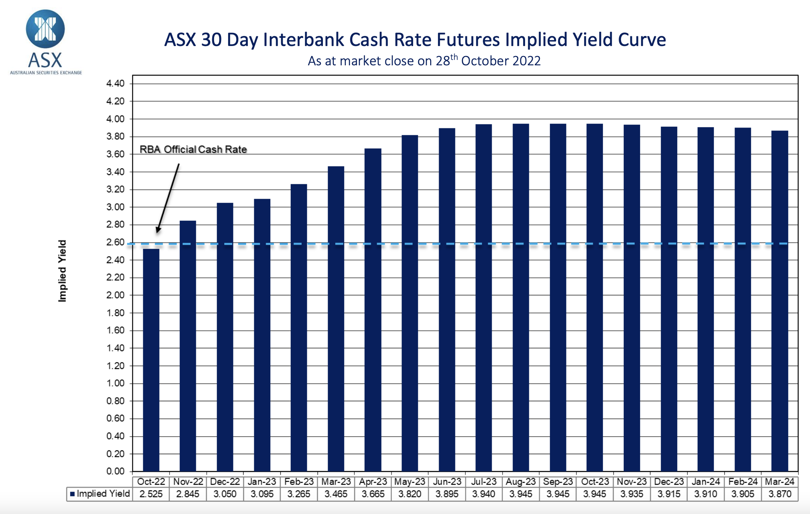
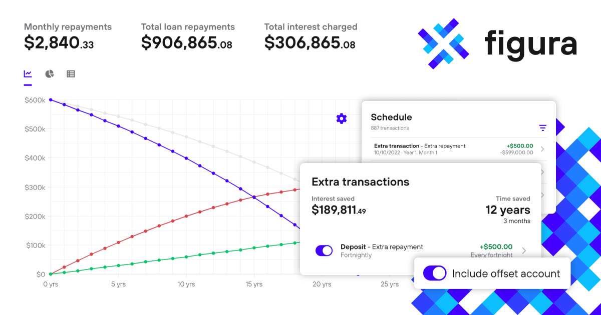
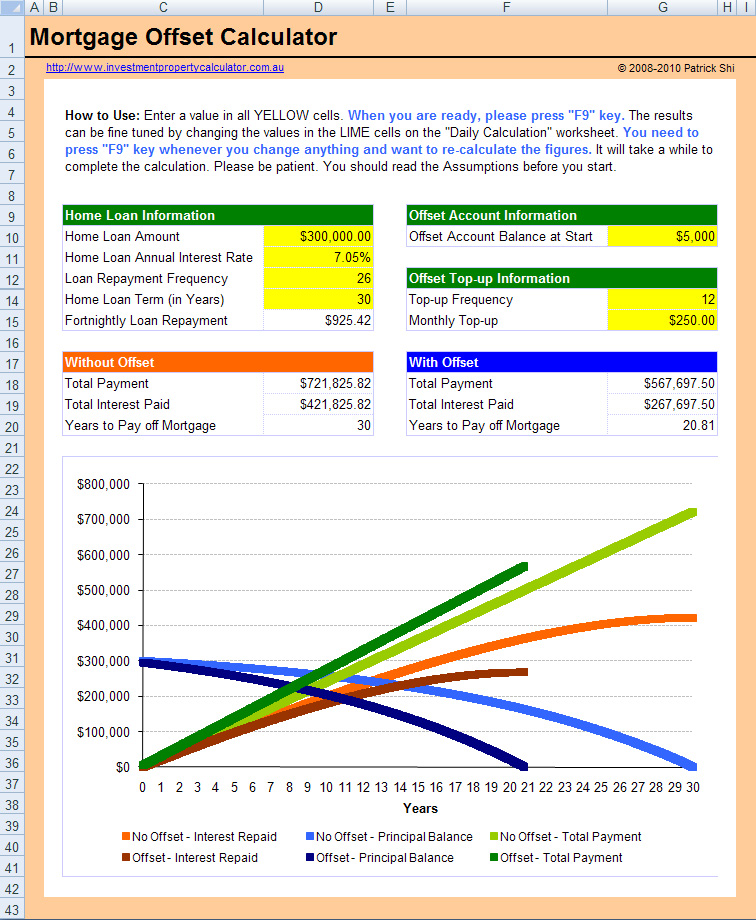

Last year, my wife and I purchased our first home together. I'll be sharing some of the wisdom we picked up from our 3-year-long search.

*Disclaimer: This is not financial advice*

```toc
# This code block gets replaced with the TOC
```

## New Blog Category

I have added a new [Home category](/categories/home) to this blog. I will be posting tech related (i.e. smart home) content such as:

- Solar
- Home Assistant
- Home Theatre

You can also find past posts here that I've recategorised.



## Choosing a Home

### Domain

All real estate agents list new houses on [Domain](https://www.domain.com.au/). Domain has this nice feature where you can get a daily email on new properties that match your search called [Property Alerts](https://www.domain.com.au/property-alerts).

[KoalaData](https://www.koaladata.com.au/) is a must-have extension that works on Domain to provide:

- Price history
- How long the property has been on the market: It may have passed in at auction, meaning there's a chance it can be had for even cheaper.
- Search price ranges: The price range the agent has set for the listing to appear in



### NSW Valuer General

Every house sold in NSW will eventually have its sale price listed on the [NSW Government's Valuer General website (Spatial Services)](https://portal.spatial.nsw.gov.au/portal/apps/webappviewer/index.html?id=2536c8e4882140eb957e90090cb0ef97). It takes about 3 months before the price appears.

The website is slow. After loading an area on the map, give it time to load all the overlays. It may also take a lot of clicks on the '$' symbol before you get the right details to appear.



### The Triple Constraint

There is a model in project management known as the [Triple Constraint](https://en.wikipedia.org/wiki/Project_management_triangle), where different attributes of a project contend with each other. We applied a similar model to evaluating homes using **location**, **house** and **price**, which all equate to our **quality of life**.

- Location: Proximity to public transport, shopping and work.
- Price: How much does the house cost.
- House: Type, design, quality, rooms, etc.



Examples of this in practice:

- A mansion in the middle of nowhere:
  - Cost 🆗
  - House ✔️
  - Location ❌
- An apartment in the CBD
  - Cost 🆗
  - House ❌
  - Location ✔️
- A townhouse far out in the suburbs
  - Cost ✔️
  - House 🆗
  - Location ❌

Unless you have unlimited amounts of money, there will have to be a compromise in one of these areas. We are two people with different goals and priorities. For example, I favour location and the house, while my wife is cost conscious. To objectively compare houses that tick both our boxes, I created a spreadsheet that weighs our ratings together.



[Download the spreadsheet from here](triple-constraint.xlsx).

## Mortgage / Home Loan Tips

A loan that comes with a 100% offset is a must. Any amount that cannot be offset *might* be better at a fixed rate. The ASX [provides an up-to-date daily futures forecast of the RBA's  cash rate for the next year and a half](https://www.asx.com.au/data/trt/ib_expectation_curve_graph.pdf).



Use home loan calculators. My wife likes to use the [Figura Finance](https://figura.finance/calculators/repayments) calculator. Each bank/lender will a different calculator. Different calculators make different assumptions. Your lender would also calculate differently.



Alternatively, do the calculations yourself on a spreadsheet using the [PMT](https://support.microsoft.com/en-us/office/pmt-function-0214da64-9a63-4996-bc20-214433fa6441) and [IPMT](https://support.microsoft.com/en-au/office/ipmt-function-5cce0ad6-8402-4a41-8d29-61a0b054cb6f) functions. The [investmentproperty.com.au website provides a spreadsheet](https://www.investmentpropertycalculator.com.au/free-mortgage-offset-calculator.html) using these functions.



After a few months, it may become worthwhile to refinance your loan to another lender. The two main reasons to refinance are lower rates and cashback. Your mileage may vary, so do the numbers first. This will also involve a credit check, updating bank accounts (income, direct debits, etc.) and restarting your 30-year loan period.

## How to Save for a Home

Here are my tips for saving money to purchase a house:

- Make use of the [First Home Saver Super Scheme](https://www.ato.gov.au/Individuals/Super/Withdrawing-and-using-your-super/First-Home-Super-Saver-Scheme/).
- [Return and Earn](https://returnandearn.org.au/)
- [SIM Slutting](https://www.ozbargain.com.au/tag/prepaid-mobile-plan)
- [M5 Cashback](https://www.nsw.gov.au/driving-boating-and-transport/tolling/m5-south-west-cashback-scheme)
- Everything on credit or BNPL for their spend bonuses
- [Use discounted gift cards](https://www.ozbargain.com.au/wiki/discounted_egift_cards)
- Cashback programs ([Cashrewards](https://refer.cashrewards.com.au/x/1eYzTM) and [ShopBack](https://app.shopback.com/PKlC0hNYlub))
- [Change energy providers regularly](https://www.energymadeeasy.gov.au/)
- Never eat out. Pack your lunch.
- If eating out, bring cheese to save on paying extra
- Job hop frequently
- Don’t pay bills
- Pirate content
- Marry someone rich
- Crypto (buy bags of [TRX](https://tron.network/))

## Other Tips

- Aim for a place with a bathroom 🚽
- Avoid living near busy roads, on or near the corner and at the end of a T-section. They are the most likely to be involved in an accident.
- Always get a building and pest report
- Save renovations and big changes until 3 months in. Understand the house first and make a list.
- There are always compromises to make, but location and orientation cannot be changed.
- [Study the Sydney Airport plane noise diagrams](https://ano.gov.au/wp-content/uploads/2022/03/assessment_aircraft_noise_sydney.pdf)
- Make sure there's money leftover for a rainy day
- Decide whether you want a forever home now or to upgrade slowly
- Don't be loyal to your bank/lender
