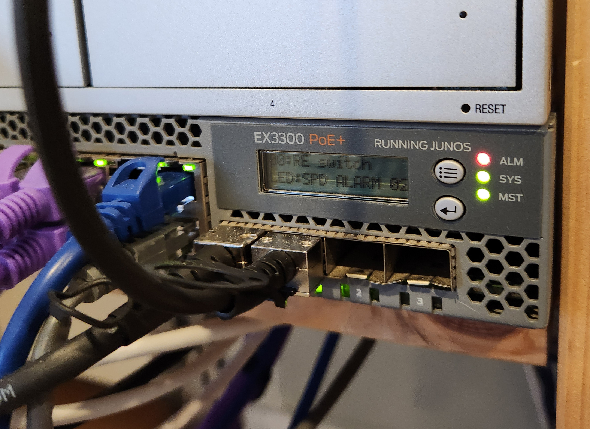

I bought a [Juniper EX3300-48P switch](/juniper-ex3300-48p) at the beginning of the year. It has 4 SFP+ ports capable of 10-gigabit transfer speeds. I thought I'd make use of them, and connect it to a couple of devices I had.

To connect to these SFP+ ports, I needed a network interface card (NIC), SFP+ transceivers and SFP+ cables.

## Network Interface Card (NIC)

From my research, the two most popular 10GbE NICs were:

- [Intel X520](https://www.intel.com.au/content/www/au/en/products/docs/network-io/ethernet/network-adapters/ethernet-x520-server-adapters-brief.html)
- [Mellanox ConnectX-3](https://support.mellanox.com/s/productdetails/a2v50000000XcOLAA0/connectx3-card)

With Intel, there are many fake clones, but luckily [many websites](https://hwp24.com/articles/how_to_distinguish_10_gigabit_network_card_intel_x520_da2_from_chinese_fakes/) can help identify them.

Intel also makes OEM models for IBM, HP and Dell. They perform the same. I went with the IBM 49Y7962 which is identical to the Intel X520 DA-2. It came with a low-profile bracket, so I printed [this design by RiHi from Thingiverse](https://www.thingiverse.com/thing:3976762).


## SFP+ Cable and Transceivers

I bought an SFP+ Twinax Direct Attach Copper (DAC) SFP+ Passive cable from eBay without any issues. This saves having to purchase transceivers and fiber cables separately. This worked for both the Intel X520 and my [UniFi Protect NVR](https://store.ui.com/collections/unifi-protect-nvr/products/unvr) which has an SFP+ port built-in.




## Juniper Configuration

On the Juniper, the interface is named `xe` (10-gigabit ethernet) instead of the usual `ge` (gigabit ethernet). It was the same process as setting up a `ge` port, with trunks, descriptions and port numbers.

## Ubuntu Configuration

I am using Ubuntu 22.04 as my operating system.

After installing the NIC, check if the device is connected using `sudo lshw -class network`

```
❯ sudo lshw -class network
  *-network:0
       description: Ethernet interface
       product: 82599ES 10-Gigabit SFI/SFP+ Network Connection
       vendor: Intel Corporation
       physical id: 0
       bus info: pci@0000:01:00.0
       logical name: ens3f0
       version: 01
       serial: 90:e2:ba:a4:51:78
       size: 10Gbit/s
       capacity: 10Gbit/s
       width: 64 bits
       clock: 33MHz
       capabilities: pm msi msix pciexpress vpd bus_master cap_list rom ethernet physical fibre 10000bt-fd
       configuration: autonegotiation=off broadcast=yes driver=ixgbe driverversion=5.15.0-53-generic duplex=full firmware=0x8000081f latency=0 link=yes multicast=yes speed=10Gbit/s
       resources: irq:24 memory:fb200000-fb2fffff ioport:e020(size=32) memory:fb404000-fb407fff memory:fb380000-fb3fffff memory:90000000-900fffff memory:90100000-901fffff
  *-network:1 DISABLED
       description: Ethernet interface
       product: 82599ES 10-Gigabit SFI/SFP+ Network Connection
       vendor: Intel Corporation
       physical id: 0.1
       bus info: pci@0000:01:00.1
       logical name: ens3f1
       version: 01
       serial: 90:e2:ba:a4:51:79
       capacity: 10Gbit/s
       width: 64 bits
       clock: 33MHz
       capabilities: pm msi msix pciexpress vpd bus_master cap_list rom ethernet physical fibre 10000bt-fd
       configuration: autonegotiation=off broadcast=yes driver=ixgbe driverversion=5.15.0-53-generic firmware=0x8000081f latency=0 link=no multicast=yes
       resources: irq:75 memory:fb100000-fb1fffff ioport:e000(size=32) memory:fb400000-fb403fff memory:fb300000-fb37ffff memory:90200000-902fffff memory:90300000-903fffff
```

Find the interface name using `sudo ip a`. Ubuntu chose `ens3f` for me.

```
❯ sudo ip a

4: ens3f0: <BROADCAST,MULTICAST,UP,LOWER_UP> mtu 1500 qdisc mq state UP group default qlen 1000
    link/ether 90:e2:ba:a4:51:78 brd ff:ff:ff:ff:ff:ff
    altname enp1s0f0
    inet6 fe80::92e2:baff:fea4:5178/64 scope link
       valid_lft forever preferred_lft forever
5: ens3f1: <BROADCAST,MULTICAST> mtu 1500 qdisc noop state DOWN group default qlen 1000
    link/ether 90:e2:ba:a4:51:79 brd ff:ff:ff:ff:ff:ff
    altname enp1s0f1
```

Create a new file under `/etc/netplan`. Replace currently interface (`eno1`) with new one (`ens3f0`). Move the old NIC configuration out then apply.

```
$ sed s/eno1/ens3f0/g > ens3f0.yaml
$ sudo mv eno1.yaml ~/eno1.yaml
$ sudo netplan apply
```

Update all Docker to use the new network interface. I used Ansible to create my Docker networks so it was simply changing the parent interface on the MacVLAN networks.

```
TASK [Create Docker networks] **************************************************************************************************************************
--- before
+++ after
@@ -1,14 +1,14 @@
 {
-    "connected.alertmanager": false,
-    "connected.blackbox_exporter": false,
-    "connected.grafana": false,
-    "connected.guacamole": false,
-    "connected.guacamole-guacd": false,
-    "connected.guacamole-postgres": false,
-    "connected.junos_exporter": false,
-    "connected.omada": false,
-    "connected.prometheus": false,
-    "connected.unifi-protect-proxy": false,
-    "driver_options.parent": "eno1.20",
+    "connected.alertmanager": true,
+    "connected.blackbox_exporter": true,
+    "connected.grafana": true,
+    "connected.guacamole": true,
+    "connected.guacamole-guacd": true,
+    "connected.guacamole-postgres": true,
+    "connected.junos_exporter": true,
+    "connected.omada": true,
+    "connected.prometheus": true,
+    "connected.unifi-protect-proxy": true,
+    "driver_options.parent": "ens3f0.20",
     "exists": true
 }
```

Redeploy any containers with a static IP address. For me, these were:

  - Authelia
  - TP-Link Omada
  - Plex
  - qBittorrent (opened port)

Finally, restart the host. I preferred this over restarting the Docker daemon. This will also clean ups the deleted VLAN interfaces.
