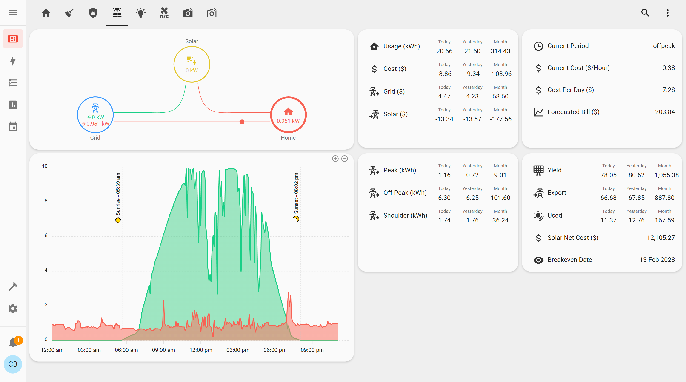

I created dashboards in Home Assistant and put them on Android tablets around the house. I've always liked the idea of quickly being able to view, monitor and action all the different smart devices around the home.

[*Mockup template by rawpixel.com on Freepik*](https://www.freepik.com/free-psd/digital-devices-screen-editable_16303836.htm)

<!-- more -->

## Table of Contents

```toc
# This code block gets replaced with the TOC
```

## Dashboard

### Home Assistant Dashboards

[Home Assistant](https://www.home-assistant.io/) is an open-source home automation software that integrates with over a thousand different devices and services. With its [customisable dashboards](https://www.home-assistant.io/dashboards/), I can quickly build and manage all aspects of my home.

Dashboards start with a [View](https://www.home-assistant.io/dashboards/views/), tabs inside of a dashboard to group rooms or services. Within a View, there are [Cards](https://www.home-assistant.io/dashboards/cards/), components that include devices and services. There are many built-in cards for common devices such as light bulbs and sensors, but [custom ones](https://home-assistant-cards.bessarabov.com/) can also be added. Think of *Views* as webpages and *Cards* as elements inside of them.

There's an **easy way** and a **hard way** to create dashboards. With the *easy way*, you can use the Home Assistant UI to create *Views* and add *Cards*. The hard way is to create dashboards purely with code in [YAML](https://en.wikipedia.org/wiki/YAML). The benefit of going the *hard way* is the flexibility and further customisation options available. I went the *hard way*, following this terrific video from [EverythingSmartHome](https://www.youtube.com/@EverythingSmartHome) on YouTube.

<iframe src="https://www.youtube.com/embed/A0fMt8IRKoI" allowfullscreen width="1280" height="720"></iframe>

### My Dashboard

<video autoplay loop controls width="100%" height="auto">
  <source type="video/webm" src="dashboard/desktop.webm">
  <p>Your browser does not support the video element.</p>
</video>

The **Home** page contains a weather forecast and calendar view of me and my wife's personal calendars.


The **Cleaning** page contains our bin collection schedule and control of our robot vacuums.


The **Security** page contains controls for the entryways and alarm system. To prevent accidents, the entryways need to be unlocked with a double-clicked.


The **Solar** page contains all information about our solar system. I will expand on this in a future post.



The **Lighting** page contains controls for all the smart lights in our home.


The **Air Conditioning** page controls our whole home ducted air conditioning system.


The **Indoor Cameras** and **Outdoor Cameras** pages show a real-time view of the security cameras in our home.


### Dark Mode

Each dashboard page is available in both light and dark mode. This setting can be found under User Profile settings. Selecting `Auto` will follow the [operating system setting](https://developer.mozilla.org/en-US/docs/Web/CSS/@media/prefers-color-scheme), and in the Android app, it will match the device's theme.


I relied heavily on [card-mod 3 by @thomasloven](https://github.com/thomasloven/lovelace-card-mod) to ensure colours were appropriate for both light and dark mode. It was not possible to determine the theme and have separate colours for both light and dark mode.


### Mobile

I've made the dashboards mobile and tablet-friendly using the [layout-card by @thomasloven](https://github.com/thomasloven/lovelace-layout-card). It supports a [CSS Grid layout](https://css-tricks.com/snippets/css/complete-guide-grid/) which allows setting layouts at different breakpoints.

<video autoplay loop controls width="35%" height="auto">
  <source type="video/webm" src="dashboard/mobile.webm">
  <p>Your browser does not support the video element.</p>
</video>

It also works well on my Samsung Galaxy Z Fold4 when unfolded.

<video autoplay loop controls width="50%" height="auto">
  <source type="video/webm" src="dashboard/fold.webm">
  <p>Your browser does not support the video element.</p>
</video>

### Source Code

The source code for my dashboard can be found on [my GitHub](https://github.com/calvinbui/ansible-monorepo/tree/master/files/home-assistant/ui_lovelace_minimalist). It is constantly updated and deployed by Ansible.

To quickly develop a dashboard, I highly recommend using the [VS Code Server](https://coder.com/docs/code-server/latest) either as an [add-on](https://github.com/hassio-addons/addon-vscode/blob/main/README.md) or standalone with the Home Assistant files accessible to it.


I used custom cards from the [UI Lovelace Minimalist](https://github.com/UI-Lovelace-Minimalist/UI) and [Lovelace Mushroom by @piitaya](https://github.com/piitaya/lovelace-mushroom) project. A few other shoutouts for their amazing work:

  - [multiple-entity-row by @benct](https://github.com/benct/lovelace-multiple-entity-row)
  - [Atomic Calendar Revive by @totaldebug](https://github.com/totaldebug/atomic-calendar-revive)
  - [Lovelace Vacuum Map by @PiotrMachowski](https://github.com/PiotrMachowski/lovelace-xiaomi-vacuum-map-card)
  - [ApexCharts Card by @RomRider](https://github.com/RomRider/apexcharts-card)

## Tablets

To have quick access to the dashboard, I had tablets installed around the house.

### Samsung Tab A7

I went with 3 x [Samsung Galaxy Tab A7 2020](https://www.gsmarena.com/samsung_galaxy_tab_a7_10_4_(2020)-10411.php) (`SM-T500`/`SM-T505`) Android tablets. They have a 10.4-inch display, running the Snapdragon 662 and 3GB of RAM. Each cost ~$155 AUD used from eBay and Gumtree. They all run [Android 12](https://www.android.com/android-12/) and [LineageOS](https://forum.xda-developers.com/t/rom-sm-t500-samsung-galaxy-tab-a7-10-4-2020-lineageos-19-1-and-twrp-3-6-1.4421365/) is also available.

The other tablet I considered was the more powerful [Lenovo Xiaoxin Pad](https://www.ozbargain.com.au/tag/lenovo+tablet) which regularly goes on sale for ~$230 AUD on AliExpress. However, the lack of Widevine, updates (unless on the Chinese ROM, which lacks the Play Store) and higher price turned me off.


### Mounting and Power

I purchased wall mounts for the tablets from [MB Mounts](https://mbmounts.com/collections/tablet-mounts/products/samsung-galaxy-tab-mount), also known as Makes By Mike. The mounts are 3D printed, come in white or black, and can be customised to open or close all the various sensors and buttons on the device.


MB Mounts also provide 8 different USB charging options compatible with their mount. I went with the [12/240v AC Converter](https://mbmounts.com/pages/120-240v-ac-converter) which took power from nearby light switches and transformed them down to 5v DC.


In total, I paid $206.18 USD for the three wall mounts, chargers and customisations.


In Australia, all electrical work must be performed by a qualified electrician. The installation was straightforward with a couple of screws and wire crimps. A neutral cable was also required.


The tablets were installed in Foyer near the front door, in the Dining Room (open floor plan) and by the stairs on the 2nd floor.


### Fully Kiosk Browser

To display the dashboards on the tablet, instead of the Home Assistant app or a web browser, I used an app called [Fully Kiosk Browser](https://www.fully-kiosk.com/). Fully Kiosk Browser uses the Android Webview to display the dashboard but goes beyond with extra features such as:

  - Enabling 'kiosk' mode by disabling common browser features such as history, back buttons, address bars, etc.
  - Auto reloading on idle, network reconnects and page load errors
  - Fullscreen mode with no system bars
  - Autostarting on boot and returning to the app to the foreground after inactivity
  - Screen on when the front camera detects motion and turns off on idle. Can also detect faces but I found it buggy.
  - Bypasses the lock screen
  - Remote control and administration over LAN


It also has an official [Home Assistant integration](https://www.home-assistant.io/integrations/fully_kiosk/) to further integrate its sensors into automations.


### Automations

To run automations on the tablet, I'm using [MacroDroid](https://www.macrodroid.com/). These are simple tasks such as:

- Enable or disable Dark mode based on the time of day. This also affects the dashboard.
- Tapping on the notification when someone rings the Doorbell to open the Eufy app. The Eufy integration within Home Assistant is too slow and buggy for me.
- Closing the Eufy app after the door is opened, and clearing its notifications.

[Tasker](https://tasker.joaoapps.com/) is another popular option, but it was having trouble recognising the doorbell notifications.


### Disabling Bloat

It's no surprise that Android devices come with bloat. I used [Universal Android Debloater GUI](https://github.com/0x192/universal-android-debloater) to disable packages that were constant background services, periodically running or used any resources unnecessarily.


I curated this list by investigating the following:

- Adguard's network usage and request count per app
- `Settings` > `Battery and device care` > `Memory`
- `Settings` > `Developer options` > `Running services`
- `Settings` > `Developer options` > `Memory`

To be extra careful, I ticked the `Clear and disable packages instead of uninstalling them` option under `Settings`.


I was able to gain around 350 MB of RAM by disabling this list of applications:

  - Application Recommendations (`com.samsung.android.mapsagent`)
  - BBCAgent (`com.samsung.android.bbc.bbcagent`)
  - Calendar (`com.samsung.android.calendar`)
  - Calendar storage (`com.android.providers.calendar`)
  - Call & Text on other devices (`com.samsung.android.mdecservice`)
  - ClipboardSaveService (`com.samsung.clipboardsaveservice`)
  - Configuration update (`com.samsung.android.sdm.config`)
  - Continuity Service (`com.samsung.android.mcfds`)
  - Customisation Service (`com.samsung.android.rubin.app`)
  - Device security (`com.samsung.android.sm.devicesecurity`)
  - DiagMonAgent (`com.sec.android.diagmonagent`)
  - Digital Wellbeing (`com.samsung.android.forest`)
  - FaceService (`com.samsung.faceservice`)
  - Find My Mobile (`com.samsung.android.fmm`)
  - Galaxy Themes Service (`com.samsung.android.themecenter`)
  - Game Optimizing Service (`com.samsung.android.game.gos`)
  - Google Calendar Sync (`com.google.android.syncadapters.calendar`)
  - Group sharing (`com.samsung.android.mobileservice`)
  - HandwritingService (`com.samsung.android.sdk.handwriting`)
  - IPService (`com.samsung.ipservice`)
  - KLMS Agent (`com.samsung.klmsagent`)
  - Nearby Device Scanning (`com.samsung.android.beaconmanager`)
  - Samsung account (`com.osp.app.signin`)
  - Samsung Push Service (`com.sec.spp.push`)
  - Smart View (`com.samsung.android.smartmirroring`)
  - SoundAlive (`com.sec.android.app.soundalive`)

Finally, other options I changed within the settings:

  - Disabled Bluetooth (Under `Connections`)
  - Disabled Nearby Device Scanning (Under `Connections` > `More connection settings`)
  - Disabled Location (Under `Location`)
  - Enabled Battery Protection to only charge up to 85% (Under `Battery and device care` > `Battery` > `More battery settings`)
