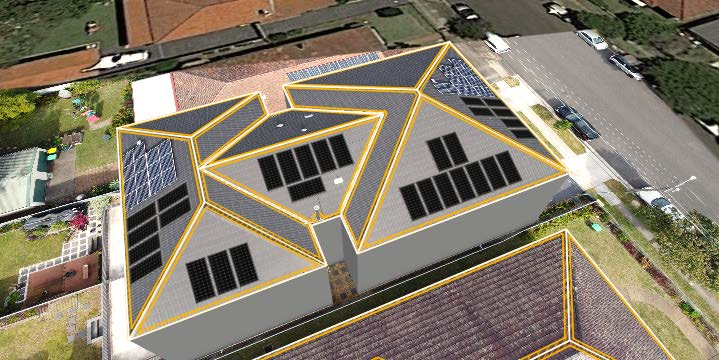
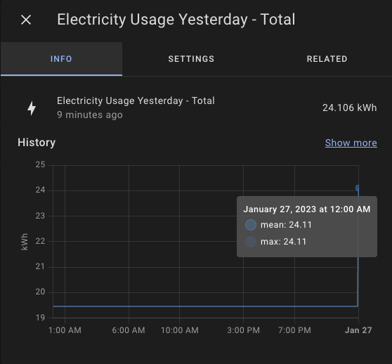

I got a 12.76 kW solar system installed at the end of July 2022. It's been half a year since then, and I'm immensely happy with how everything turned out. I'll cover every part of my journey from the research, installation and calculation of returns.

<!-- more -->

```toc
# This code block gets replaced with the TOC
```

## Initial Research

### Learning

The first thing is to learn how solar power works beyond sunlight and solar panels. I recommend reading [SolarQuote's Solar 101 guide](https://www.solarquotes.com.au/101-guides/) to understand other nuances.


At the minimum, I recommend understanding:

- [Inverters](https://www.solarquotes.com.au/inverters/): Converts solar to electricity.
- [Single-phase and 3-phase power](https://www.solarquotes.com.au/blog/three-phase-solar-inverters/): Determines the inverter to purchase.
- [The 133% rule](https://www.solarquotes.com.au/blog/oversizing-solar-arrays/): The sun never shines on all panels at the same time.
- [Importance of consumption monitoring](https://www.solarquotes.com.au/solar101.html#consumptionmonitor): To track solar consumption.
- [Monetary aspects](https://www.solarquotes.com.au/solar-calculator/): Self-consumption, feed-in tariff and payback
- [Roof orientation](https://www.solarquotes.com.au/solar101.html#roof-direction-angle): My roof faces East, North and West. No South facing at all!
- [String systems and shading](https://www.solarquotes.com.au/good-solar-guide/choosing-components/)
- [Microinverters and DC Optimisers](https://www.solarquotes.com.au/blog/microinverters-vs-dc-optimisers-which-option-is-best/): To overcome shading.

Another good source of information is [Whirlpool's Solar sub-forum](https://forums.whirlpool.net.au/forum/143?g=371). Here you can find quotes, suggestions and recommendations from solar enthusiasts.

### Picking Brands

After all my research above, I decided for my installation, I wanted:

- a simple string system (no microinverters or DC optimisers)
- the best value, bang-for-buck system
- industry-standard or better warranty (10 years for inverter, 15 years for panels)
- to completely cover the roof with solar panels (10 kW inverter & 13.3 kW panels)
- single-phase system, so most likely 2 x 5 kW inverters in parallel
- a quiet/silent inverter/s, to be installed in the garage
- the inverter/s to be compatible with Home Assistant
- no battery for now (not worth it), but ready for one in the future

SolarQuotes keeps an [up-to-date list of the best solar panel and inverter brands](https://www.solarquotes.com.au/solar-brands-trust.html), and also does yearly surveys of its installers.

- [2021 Inverters](https://www.solarquotes.com.au/blog/best-solar-inverters-2021/)
- [2021 Panels](https://www.solarquotes.com.au/blog/best-solar-panels-2021/)
- [2022 Inverters](https://www.solarquotes.com.au/blog/best-solar-inverters-2022/)
- [2022 Panels](https://www.solarquotes.com.au/blog/best-solar-panels-2022/)


For my needs, I landed on the following brands:

For panels, [Trina](https://www.solarquotes.com.au/panels/trina-review.html), [Jinko](https://www.solarquotes.com.au/panels/jinko-solar-review.html), [Canadian Solar](https://www.solarquotes.com.au/panels/canadian-solar-inc-review.html) or [Hyundai](https://www.solarquotes.com.au/panels/hyundai-solar-review.html) - all for their incredible value. It was hard to justify the top brands like [SunPower](https://www.solarquotes.com.au/panels/sunpower-review.html) or [REC](https://www.solarquotes.com.au/panels/rec-review.html) that cost 50% more for less than 10% gains in efficiency gains (though you can argue for looks).


For the inverter/s, the only quiet/silent options were [Huawei](https://www.solarquotes.com.au/inverters/huawei-review.html) and [GoodWe](https://www.solarquotes.com.au/inverters/goodwe-review.html). [Fronius](https://www.solarquotes.com.au/inverters/fronius-review.html) and [SMA](https://www.solarquotes.com.au/inverters/sma-review.html) are the best brands to buy, but anecdotes say they are noisy and hum. [SolarEdge](https://www.solarquotes.com.au/inverters/solaredge-review.html) is another top brand, but they rate limit their [public API](https://www.home-assistant.io/integrations/solaredge/) and [started disabling their local API](https://www.home-assistant.io/integrations/solaredge_local/).


### Find an Installer

When I had my shortlist of panels and inverters, I started looking for an installer. Again, SolarQuotes comes to the rescue with [a list of the top installers based on customer reviews](https://www.solarquotes.com.au/solar-installer-ratings.html). Alternatively, you can complete [an obligation-free form to get quotes](https://www.solarquotes.com.au/quote/start/) from three different installers.

My advice is to find installers that service your area with reviews for brands you have shortlisted. For example, this review for [PTE Solar](https://ptesolarelectrical.com.au/) shows the customer got Hyundai panels with a SolarEdge inverter. Many of their [other reviews](https://www.solarquotes.com.au/installer-review/pte-solar-and-electrical-pty-ltd/) include SolarEdge inverters as well.


When getting a quote from an installer, they'll most likely use a tool called [Pylon](https://getpylon.com/) to send the proposal. The proposal will generally include a picture of your roof with the solar and string design, financial analysis, environmental analysis and costings. [Here's an example from their website](https://app.getpylon.com/proposals/L0Gc41t01m):


## Quotes

I'd also like to share a few quotes and prices I received for anyone else looking at similar-sized solar systems.

| Quote 1    | Sparklife Solar                           |
|:-----------|:------------------------------------------|
| Price      | $12,300                                   |
| Size       | 12.035kW                                  |
| Panels     | 29 x 415W Jinko Tiger N-Type JKM415N-6RL3 |
| Inverter/s | 2 x Huawei 5kW SUN2000-5KTL-L1            |


The first quote I received was from [Sparklife Solar](https://sparklifesolar.com.au/). As I was aiming for as close to 13.3kW as possible, this wasn't enough. I asked for more panels, different panels, layout or configurations to increase it, but the installer wouldn't, citing safety reasons (?).

| Quote 2    | PTE Solar                                    |
|:-----------|:---------------------------------------------|
| Price      | $12,287                                      |
| Size       | 13.28kW                                      |
| Panels     | 32 x 415W Jinko Tiger P-Type JKM415M-54HL4-V |
| Inverter/s | 1 x GoodWe 10kW GW10K-MS                     |


The second quote was from [PTE Solar](https://ptesolarelectrical.com.au/). Emily and I exchanged emails frequently to come up with this configuration (she's so nice to put up with me!). It maximises the roof to get as close as possible to the 13.3kW goal and has one large (but quiet!) 10kW inverter. However, this inverter only supports 3 MPPTs, and I have 4 orientations, so DC optimisers were required on the east or west set of panels. They did not offer Huawei inverters.

| Quote 3    | Banana Solar                   |
|:-----------|:-------------------------------|
| Price      | $13,300                        |
| Size       | 13.2kW                         |
| Panels     | 30 x 440W LONGi Solar Hi-MO4m  |
| Inverter/s | 2 x Huawei 5kW SUN2000-5KTL-L1 |




The final quote, and the installer I went with is [Banana Solar](https://www.bananasolar.com.au/). They are a [Platinum-rated installer on Solar Quotes](https://www.solarquotes.com.au/solar-installer-ratings.html) and also [CEC Certified](https://www.cleanenergycouncil.org.au/consumers/buying-solar/find-an-approved-solar-retailer). They did an on-site visit to examine the meter box and possible installation paths. They also flew a drone around to take pictures of the roof. Compared to Quote #2, DC optimisers aren't necessary with the two inverters (2 MPPTs each).

The configuration, site visit, reviews/ratings and certifications were enough for me to pay the extra $1,000 to go with Banana's proposal over PTE. If it wasn't for the DC optimiser required with the GoodWe inverter, I would have gone ahead with PTE.

## Installation

The installation took one and a half days. It could have been completed earlier, but it was windy when they were about to install the panels.

There were four installers. One  was focused on the inverters and wiring, while the others took care of the mounting and panels. Watching them perform rudimentary tasks, such as how they unloaded the 30 panels off their ute in a small space showed me their experience. They weren't just casuals or backpackers, but veterans who have done a ton of these installs before.

Unfortunately, they got the measurements just off and could only install 29 panels instead of 30. This was unfortunate as it dropped the total system size down to 12.76 kW. I was refunded the price of that one panel. I am still able to hit 10 kW on sunny days (clipping), so the lost hasn't been detrimental in any way.

The meter box, before and after:


The inverters and conduit from the roof:


The Longi solar panels come in boxes.


Mounting in place the day before installation of the panels:


The completed installation, my house is on the left:


After the installation, I noticed my TV antenna was shading one of the panels. As it is a string system, any shading reduces the throughput of all other panels.


I reached out to the installer who also recommended I move it. I found someone on Facebook Marketplace who moved it for $150 AUD.


<video loop controls width="50%" height="auto">
  <source type="video/mp4" src="antenna/moved.mp4">
  <p>Your browser does not support the video element.</p>
</video>

## Fetching Data

The Home Assistant integration to fetch data from Huawei inverters is called [huawei_solar by wlcrs](https://github.com/wlcrs/huawei_solar). There is also a [long and active thread on the Home Assistant forums](https://community.home-assistant.io/t/integration-solar-inverter-huawei-2000l/132350) discussing this integration.

A connection can be made using [serial](https://github.com/wlcrs/huawei_solar/wiki/Connecting-to-the-inverter#serial-connection-to-usb-port) or through a [network bridge](https://github.com/wlcrs/huawei_solar/wiki/Connecting-to-the-inverter#network-connection). The serial connection is recommended, but I used the network bridge method via a dedicated WLAN OpenWrt router. A USB Ethernet dongle also might be a bad idea, as [discovered by manio on SKYBOO.NET](https://skyboo.net/2022/02/huawei-sun2000-why-using-a-usb-dongle-for-monitoring-is-not-a-good-idea/)

### Installer Mode Access

Access to Huawei's Installer mode allows access to changing the inverter's WLAN settings and passwords. The default SSID and password can be found on the right side of the inverter.


To reset the original installer password, I followed the [user manual](https://support.huawei.com/enterprise/en/doc/EDOC1100136173/8aa1f88a/resetting-password) guide which requires powering off and on the inverter in a specific sequence.


Once in the menus, I changed the default WLAN SSID password (`changeme`). It's also possible to hide the inverter's SSID, but make sure to remember the MAC address for later!


### OpenWrt WLAN Bridge

[OpenWrt](https://openwrt.org/) is a custom firmware for routers that opens it to more customisation. An OpenWrt router acts as a WLAN bridge between Home Assistant and the inverter, port-forwarding requests through the inverter's private network.

Both inverters were installed as separate units instead of a [daisy-chain/master-slave configuration](https://support.huawei.com/enterprise/en/doc/EDOC1100136173/daff17bb/optional-connecting-signal-cables). Two separate OpenWrt routers were required as each inverter has its own solar panel strings and only one had a power meter attached.


For the router, I went with the [GL.iNet Mango (GL-MT300N-V2)](https://www.gl-inet.com/products/gl-mt300n-v2/). They are semi-regularly on sale for $32 AUD. They come pre-installed with their own flavour of OpenWrt, but there is also [official support](https://openwrt.org/toh/gl.inet/gl-mt300n_v2) even on the latest version (22.03.3 at the time of writing).


I powered it using a 5V Micro USB PoE splitter connected to my [Juniper EX3300-48P](/juniper-ex3300-48p) network switch.


To get OpenWrt installed, I uploaded the firmware file through the Mango's web interface. Official instructions can be found on [OpenWrt's wiki](https://openwrt.org/toh/gl.inet/installation) and [GL.iNet's docs](https://docs.gl-inet.com/en/3/setup/mini_router/upgrade/).


Afterwards, I followed these [instructions thanks to KOA from the OpenWrt forums](https://forum.openwrt.org/t/connect-to-huwaei-sun2000-inverter-using-fiber-modem/104635/23) to connect the router to the inverter. Note, I wasn't able to connect from a different subnet to the OpenWrt afterwards.

The instructions are to connect OpenWrt as a wireless client to the inverter while its LAN connection remains on your local network. This was completed initially by connecting to the Mango's LAN port from my computer.


Set up a Port Forward to allow your local network to access the inverter port `6607` (disable NAT loopback as well under Advanced).


Create a NAT rule to change any traffic to port 6607 to appear to come from OpenWrt.


I also disabled the DHCP server:


Also, remember to set the router's hostname:


### Setup Integration

The Huawei Solar integration can be installed through the [Home Assistant Community Store (HACS)](https://hacs.xyz/).


Add the integration under `/config/integrations`.


Select `Network` as the connection type


Enter the OpenWrt's router IP address as the `Host`, set the port to `6607` and check `Advanced: elevate permissions`.


If everything goes well, the inverter will be successfully added to Home Assistant.


I also added my second inverter following the above steps.


If a power consumption meter is attached, it will also appear under the integration.


## Home Assistant

Using Home Assistant, I wanted to replicate as much functionality from [Huawei's FusionSolar app](https://appgallery.huawei.com/#/app/C102851109) as possible. This includes metrics, graphs and calculating costs.

### Important Metrics

Metrics provided by the inverter and power meter are raw. There's still work required to calculate how much electricity the house uses, how much electricity is imported and so on. These metrics are created using the built-in [Template](https://www.home-assistant.io/integrations/template/) integration.

The raw energy generated by both inverters. If you don't have two separate inverters, you can ignore this one.

```yaml
- name: "Total Solar Generation"
  unique_id: "total_solar_generation"
  icon: mdi:solar-power-variant
  unit_of_measurement: "W"
  device_class: power
  state_class: measurement
  state: >
    
    
    {{ (inverter_1_power + inverter_2_power) | float(0) }}
```

The total electricity (solar and/or grid) the house is consuming:

```yaml
- name: "Home Power Consumption"
  unique_id: "home_power_consumption"
  icon: mdi:lightning-bolt
  unit_of_measurement: "W"
  device_class: power
  state_class: measurement
  state: >
    
    
    
    {{ ((inverter_1_power + inverter_2_power) - meter_power )  | float(0) }}
```

Electricity imported from the grid. This value from the power meter is negative when drawing from the grid and positive when drawing from solar. The value is inverted so it is useful for other calculations.

```yaml
- name: "Grid Power Consumption"
  unique_id: "grid_power_consumption"
  icon: mdi:transmission-tower-export
  unit_of_measurement: "W"
  device_class: power
  state_class: measurement
  state: >
    
    
    {{ (meter_power * -1) | float(0) }}
    
    {{ 0.0 | float(0) }}
    
```

Electricity exported to the grid, i.e. solar feed-in. Similar to above, any negative value means nothing is being exported because there is no yield or it is being consumed by the house.

```yaml
- name: "Grid Power Export"
  unique_id: "grid_power_export"
  icon: mdi:transmission-tower-import
  unit_of_measurement: "W"
  device_class: power
  state_class: measurement
  state: >
    
    
    {{ meter_power | float(0) }}
    
    {{ 0.0 | float(0) }}
    
```

How much solar is being self-consumed by the house. It takes the total solar generated and minuses what we are feeding to the grid. If we are not feeding in anything, we are consuming it all, such as during sunrise/sunset. The value of this sensor will be equal to the yield. Once there is no more solar, the value of this sensor will be `0`.

```yaml
- name: "Solar Self Consumption"
  unique_id: "solar_self_consumption"
  icon: mdi:lightning-bolt-circle
  unit_of_measurement: "W"
  device_class: power
  state_class: measurement
  state: >
    
    
    
    {{ (yield - export) | float(0) }}
    
    {{ 0.0 | float(0) }}
    
```

Lastly, I take the above sensors can convert their `kW` measurement into `kWh` using the built-in [Riemann sum integral](https://www.home-assistant.io/integrations/integration/) integration.

```yaml
sensor:
  - platform: integration
    name: Grid Power Import
    unique_id: grid_power_import_kwh
    source: sensor.grid_power_consumption
    method: left
    unit_prefix: k
    unit_time: h
  - platform: integration
    name: Grid Power Export
    unique_id: grid_power_export_kwh
    source: sensor.grid_power_export
    method: left
    unit_prefix: k
    unit_time: h
  - platform: integration
    name: Solar Self Consumption
    unique_id: solar_self_consumption_kwh
    source: sensor.solar_self_consumption
    method: left
    unit_prefix: k
    unit_time: h
```

### Forecasting

[Solcast](https://solcast.com/) is a solar production forecasting tool with a [Home Assistant integration by oziee](https://github.com/oziee/ha-solcast-solar).


With the free tier, there is a limit of 50 API calls per day, and a maximum of two sites/systems. Unfortunately, a site only has one roof orientation, and I have three roof orientations. To average it out, I split my panels between two sites, one for North-East (5.28 kW) and one for North-West (7.48 kW) panels. This is calculated by taking the middle azimuth between the three orientations (-30° and 60°).

| Roof   | Direction  | Compass | Azimuth |
|:-------|:-----------|:--------|:--------|
| Back   | North-East | 75°     | +75°    |
| Center | North      | 345°    | -15°    |
| Front  | North-West | 255°    | -105°   |


### Dashboard

I wanted to replicate the graph from within the FusionSolar app in Home Assistant. This is the graph from FusionSolar:


With all the metrics above, I used the [ApexCharts card by RomRider](https://github.com/RomRider/apexcharts-card) to create a graph of the solar yield, energy consumption and forecast within Home Assistant. See my [previous post for more information about my smart home dashboards](/smart-home-dashboard).


I added a sunrise and sunset annotation using the [Sun2 sensor](https://github.com/pnbruckner/ha-sun2) custom integration.

```yaml
sensor:
  - platform: sun2
    monitored_conditions:
      - sunrise
      - sunset
```

This is the complete code for the graph, which also uses the [Config Template Card by iantrich](https://github.com/iantrich/config-template-card) to use execute Javascript.

```yaml
type: 'custom:config-template-card'
entities:
  - sensor.sunrise
  - sensor.sunset
variables:
  getTime: |
    sensor => {
      const today = new Date();

      var event_time = new Date(states[sensor].state);

      if (event_time.getDate() == today.getDate()) {
        return event_time.getTime();
      }

      return 0;
    }
  getTimeString: |
    sensor => {
      const today = new Date();

      var event_time = new Date(states[sensor].state);

      if (event_time.getDate() == today.getDate()) {
        return event_time.toLocaleTimeString('en-AU', {hour: '2-digit', minute: '2-digit'});
      }

      return "";
    }
card:
  type: custom:apexcharts-card
  update_interval: 30sec

  graph_span: 24h
  span:
    start: day

  show:
    loading: true
    last_updated: false

  hours_12: true

  cache: true

  stacked: false

  header:
    show: false

  yaxis:
    - min: 0
      max: 10
      decimals: 0
      apex_config:
        tickAmount: 5

  apex_config:
    chart:
      type: area
      zoom:
        enabled: true
        type: x
      toolbar:
        show: true
        tools:
          reset: false
          pan: false
          download: false
          selection: false
          zoom: false
          zoomin: true
          zoomout: true
    stroke:
      show: true
    dataLabels:
      enabled: true
    legend:
      show: false
    fill:
      type: gradient
      gradient:
        inverseColors: true
        type: vertical
        shadeIntensity: 0
        opacityFrom: 0.7
        opacityTo: 0.7
    grid:
      show: true
    annotations:
      xaxis:
        -
          x: "${getTime('sensor.sunrise')}"
          strokeDashArray: 2
          label:
            text: "${'☀️ Sunrise - ' + getTimeString('sensor.sunrise')}"
            borderWidth: 0
            style:
              background: '#0000'
        -
          x: "${getTime('sensor.sunset')}"
          strokeDashArray: 2
          label:
            text: "${'🌙 Sunset - ' + getTimeString('sensor.sunset')}"
            borderWidth: 0
            style:
              background: '#0000'

  locale: en

  all_series_config:
    stroke_width: 2
    curve: smooth
    opacity: 1
    unit: kW
  series:
    -
      name: Solar
      entity: sensor.total_solar_generation
      color: '#18cf87' # green
      transform: return x / 1000;
      type: area
      float_precision: 3
      extend_to: now
      group_by:
        func: avg
        duration: 5m
    -
      name: Grid Consumption
      entity: sensor.home_power_consumption
      color: '#f76354' # red
      transform: return x / 1000;
      type: area
      float_precision: 3
      extend_to: now
      group_by:
        func: avg
        duration: 5m
    -
      name: Forecast
      entity: sensor.solcast_forecast_today
      type: line
      color: '#3798fe' # blue
      curve: stepline
      data_generator: |
        return entity.attributes.forecast.map((entry) => {
          var date_period = new Date(entry.period_start);

          return [date_period, Math.min(entry.pv_estimate, 10)];
        });

```

## Payback Period

Solar is also an investment. After a few years, the system should pay itself off and start returning only profits. With the metrics inside Home Assistant, it's possible to get an accurate breakeven date.

### Energy Provider

With the size of my system, I signed up for [GloBird Energy](https://www.globirdenergy.com.au/) Solar Plus which is offering an uncapped 20c feed-in tariff. The other costs however are much higher than any other electricity plan I've seen, but my calculations have it being the best for me.


So far, my combined electricity and gas bills have been regularly in ~$140 credit. Refunds are processed straight back to my bank account within 3 days.


### Calculations

To calculate the breakeven date, I considered:

1. The feed-in tariff and solar exported
2. The price difference if I was on an electricity plan with no feed-in tariff (usually cheaper)

To start, I added the date of installation using the built-in [Input Datetime](https://www.home-assistant.io/integrations/input_datetime/) integration:

```yaml
input_datetime:
  solar_installation_date:
    name: Solar Installation Date
    has_date: true
    has_time: false
    initial: "2022-07-27"
```


I also added the cost of the system using the built-in [Template](https://www.home-assistant.io/integrations/template/) integration:

```yaml
template:
  - sensor:
    - name: Solar Initial Cost
      unit_of_measurement: AUD
      state: "13010"
```


To track the current net cost, I used the built-in [Input Number](https://www.home-assistant.io/integrations/input_number/) integration.

```yaml
input_number:
  solar_net_cost:
    name: Solar Net Cost
    min: -13010.00
    max: 99999999.00 # A max is required for all input_number resources
    mode: box
    unit_of_measurement: AUD
    icon: mdi:currency-usd
```


I then added sensors for my current electricity plan. My house is on a time-of-use meter, meaning I pay a different rate based on the time of day and season.

```yaml
-
# Create a sensor to know the current time of use pricing by Ausgrid NSW
#
# https://www.ausgrid.com.au/Your-energy-use/Meters/Time-of-use-pricing
# Peak:
#   - From 2pm to 8pm on working weekdays during 1 November and 31 March (inclusive) – the “summer months”
#   - From 5pm to 9pm on working weekdays during 1 June to 31 August (inclusive) – the “winter months”
#
# Shoulder:
#   In simple terms, the shoulder period applies from 7am to 10pm every day, except where a peak period applies during that period.
#
#   Specifically, it applies:
#   - from 7am to 10pm on all weekends and public holidays
#
#   on working weekdays in the summer months:
#     - from 7am to 2pm; and from 8pm to 10pm
#
#   on working weekdays in the winter months:
#     - from 7am to 5pm; and from 9pm to 10pm
#     - on working weekdays in spring and autumn, from 7am to 10pm.
#
# Off-peak: All other times, 10pm to 7am
-
  name: TOU Period
  icon: mdi:clock-time-three-outline
  state: >
    

    
    

    
    

    
      
    
      
    

    {{tou_period}}

# Current electricity plan
-
  # Peak
  name: Electricity Peak Cost
  icon: mdi:currency-usd
  unit_of_measurement: AUD
  state: "0.5442"
-
  # Offpeak
  name: Electricity Offpeak Cost
  icon: mdi:currency-usd
  unit_of_measurement: AUD
  state: "0.3521"
-
  # Shoulder
  name: Electricity Shoulder Cost
  icon: mdi:currency-usd
  unit_of_measurement: AUD
  state: "0.3521"
-
  # Supply
  name: Electricity Supply Cost
  icon: mdi:currency-usd
  unit_of_measurement: AUD
  state: "1.0137"
-
  # A sensor to calculate the current cost of electricity based on the TOU and price
  name: Electricity Cost
  icon: mdi:currency-usd
  unit_of_measurement: AUD/kWh
  state: >
    
      {{ states('sensor.electricity_peak_cost') }}
    
      {{ states('sensor.electricity_offpeak_cost') }}
    
      {{ states('sensor.electricity_shoulder_cost') }}
    
-
  # Feed in
  name: Solar Feed In
  icon: mdi:currency-usd
  unit_of_measurement: AUD/kWh
  state: "0.2000"

```


I also include an alternative electricity plan that I would be on if there was no solar system:

```yaml
# The price of the plan if there was no solar
# Non-solar plans may be cheaper than Solar plans, which is the case with us
# We want to compare how much we would've paid if we didn't have Solar
# This way we can calculate the difference in price/savings to come to a breakeven date
-
  # Peak
  name: Alternative Electricity Peak Cost
  icon: mdi:currency-usd
  unit_of_measurement: AUD
  state: "0.3465"
-
  # Offpeak
  name: Alternative Electricity Offpeak Cost
  icon: mdi:currency-usd
  unit_of_measurement: AUD
  state: "0.1397"
-
  # Shoulder
  name: Alternative Electricity Shoulder Cost
  icon: mdi:currency-usd
  unit_of_measurement: AUD
  state: "0.1727"
-
  # Supply
  name: Alternative Electricity Supply Cost
  icon: mdi:currency-usd
  unit_of_measurement: AUD
  state: "0.8800"
-
  # A sensor to calculate the alternative cost of electricity based on the TOU and price
  name: Alternative Electricity Cost
  icon: mdi:currency-usd
  unit_of_measurement: AUD/kWh
  state: >
    
      {{ states('sensor.alternative_electricity_peak_cost') }}
    
      {{ states('sensor.alternative_electricity_offpeak_cost') }}
    
      {{ states('sensor.alternative_electricity_shoulder_cost') }}
    
```

Next, combine the time of use period and consumption/usage through Home Assistant's [Utility Meter](https://www.home-assistant.io/integrations/utility_meter/) integration to able generate costs:

```yaml
# Use the kWh sensors
utility_meter:
  ## Daily Import
  grid_power_import_daily:
    unique_id: utility_meter_daily_grid_power_import
    source: sensor.grid_power_import_kwh
    name: Electricity Meter - Daily Import
    cycle: daily
    tariffs:
      - offpeak
      - shoulder
      - peak

  ## Daily Export
  grid_power_export_daily:
    unique_id: utility_meter_daily_grid_power_export
    source: sensor.grid_power_export_kwh
    name: Electricity Meter - Daily Export
    cycle: daily
    tariffs:
      - anytime

  # Daily self consumption
  solar_self_consumption_daily:
    unique_id: utility_meter_daily_solar_self_consumption
    source: sensor.solar_self_consumption_kwh
    name: Electricity Meter - Daily Solar Self-Consumption
    cycle: daily
    tariffs:
      - offpeak
      - shoulder
      - peak
```


Once the Utility Meters sensors are in, I can now begin generating costs. I calculate the net cost at the beginning of the next day, so I only need yesterday's usage. This is obtained using the `last_period` attribute on the sensors.

```yaml
-
  name: Electricity Usage Yesterday - Solar
  state_class: measurement
  unit_of_measurement: kWh
  device_class: energy
  state: >
    {{
      state_attr('sensor.solar_self_consumption_daily_offpeak', 'last_period') | float(0) +
      state_attr('sensor.solar_self_consumption_daily_peak', 'last_period') | float(0) +
      state_attr('sensor.solar_self_consumption_daily_shoulder', 'last_period') | float(0)
    }}

-
  name: Electricity Usage Yesterday - Grid
  state_class: measurement
  unit_of_measurement: kWh
  device_class: energy
  state: >
    {{
      state_attr('sensor.grid_power_import_daily_peak', 'last_period') | float(0) +
      state_attr('sensor.grid_power_import_daily_offpeak', 'last_period') | float(0) +
      state_attr('sensor.grid_power_import_daily_shoulder', 'last_period') | float(0)
    }}

-
  name: Electricity Usage Yesterday - Total
  state_class: measurement
  unit_of_measurement: kWh
  device_class: energy
  state: >
    {{
      states('sensor.electricity_usage_yesterday_solar') | float(0) +
      states('sensor.electricity_usage_yesterday_grid') | float(0)
    }}
```



We'll have to do the same for the alternative plan. I did a big sum here as I don't care about the different time of use periods.

```yaml
name: Electricity Costs Alternative Plan
state_class: measurement
unit_of_measurement: AUD
device_class: monetary
state: >
  {{
    (
      (states('sensor.alternative_electricity_offpeak_cost')|float(0)) * (
        (state_attr('sensor.solar_self_consumption_daily_offpeak', 'last_period')|float(0))
        +
        (state_attr('sensor.grid_power_import_daily_offpeak', 'last_period')|float(0))
      )
    )

    +

    (
      (states('sensor.alternative_electricity_peak_cost')|float(0)) * (
        (state_attr('sensor.solar_self_consumption_daily_peak', 'last_period')|float(0))
        +
        (state_attr('sensor.grid_power_import_daily_peak', 'last_period')|float(0))
      )
    )

    +

    (
      (states('sensor.alternative_electricity_shoulder_cost')|float(0)) * (
        (state_attr('sensor.solar_self_consumption_daily_shoulder', 'last_period')|float(0))
        +
        (state_attr('sensor.grid_power_import_daily_shoulder', 'last_period')|float(0))
      )
    )

    +

    (states('sensor.alternative_electricity_supply_cost')|float(0))
  }}
```


I then have an automation that updates the Solar Net Cost `input_number` entity which runs each day at 12:05 AM. It subtracts the difference between what I pay on the current electricity plan against the alternative plan I would be on instead. After a lot of whiteboarding, this calculation makes the most sense to me because you would be using electricity anyway, so you are comparing the total cost for each plan. For example, if your current plan and alternative plan were the same, then the only difference would be the solar export and self-consumption.

```yaml
# Updates the net cost of the solar system each night.
# This is to stop it updating constantly and wasting CPU
# Takes the input_number value and minuses the difference between the yesterdays electricity costs (usage minus feed-in+self-consumption) and the alternative plan
- id: electricity_update_solar_net_cost
  alias: Electricity - Update Solar Net Cost
  description: ""
  trigger:
    - platform: time
      at: "00:05:00"
  condition: []
  action:
    - service: input_number.set_value
      data:
        value: |
          {{
            states('input_number.solar_net_cost')|float(0)
            +
            (
              states('sensor.electricity_costs_alternative_plan')|float(0)
              -
              states('sensor.electricity_costs_yesterday_total')|float(0)
            )
          }}
      target:
        entity_id: input_number.solar_net_cost
  mode: single
```

The expected breakeven date can finally be calculated using all the above data. It takes the initial cost, installation date and current net cost to determine the average cost per day and how long it would take to reach $0.

```yaml
# Time until solar breakeven
-
  # solar_days = How many days since installation
  # paid_off = initial cost minus input_number
  # average = paid_off / solar_days
  # remaining_days = input_number / average
  name: Solar Days Until Breakeven
  state: >
    
    
    
    
    {{ remaining_days }}
-
  # today + remaining_days
  name: Solar Breakeven Date
  state: >
    
    
    {{ nice_remaining_days.strftime('%d %b %Y') }}
```

Currently, my payback period is hovering around 5 years, but the date is going up and down a few days. With more data, it should start averaging out as the past few months have been the sunnier Spring and Summer months in Australia.


## Extra Dashboard Cards

With all the metrics we now have, I created a few more dashboard cards. These tables are created using [multiple-entity-row by benct](https://github.com/benct/lovelace-multiple-entity-row).


Another feature of FusionSolar that I enjoyed was the flow diagram. This has been recreated in [power-flow-card by ulic75](https://github.com/ulic75/power-flow-card).


The source code for both can be found in my previous post, [Smart Home Dashbooard](/smart-home-dashboard).
