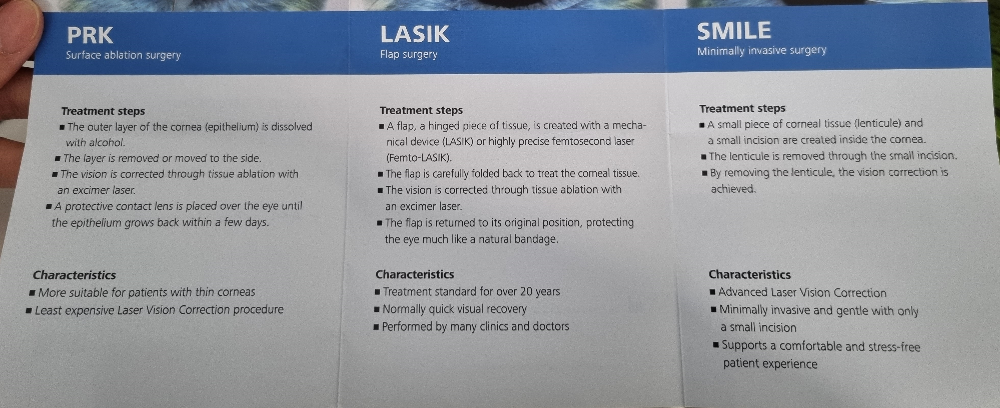
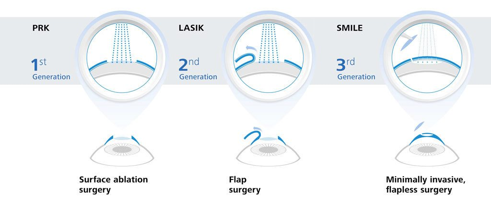
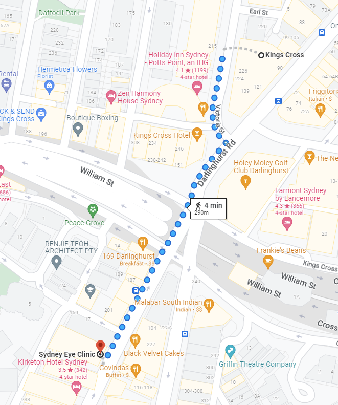
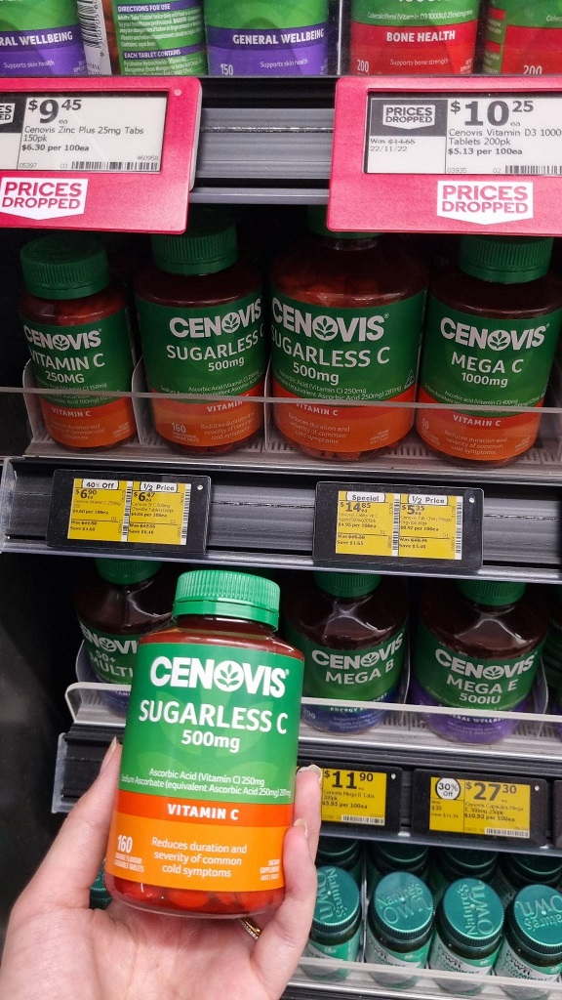
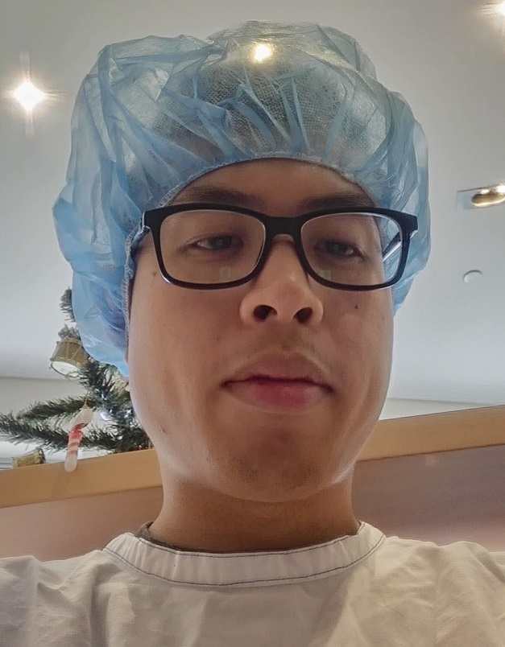
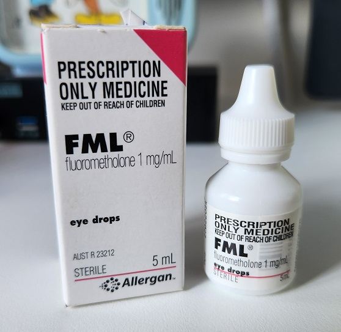
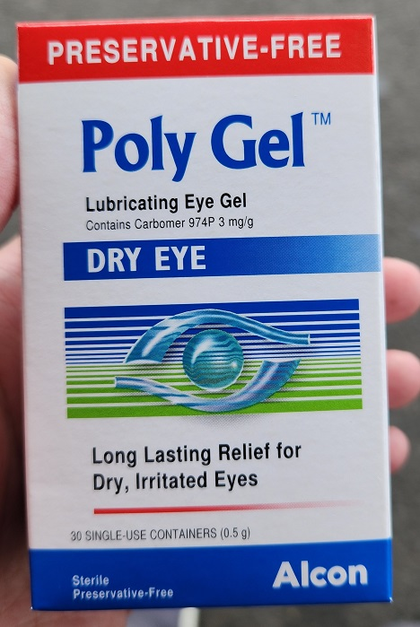
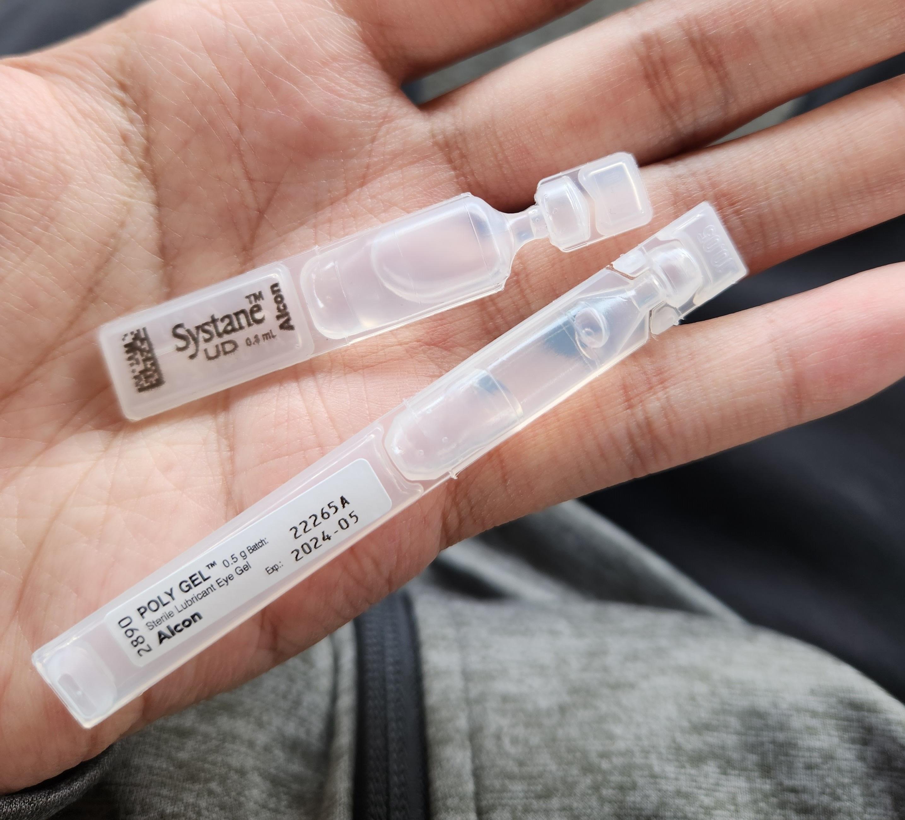
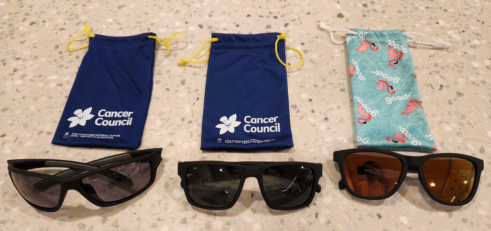

I had Laser Eye surgery last year and wanted to share my experience in a casual post.

<!-- more -->

## Table of Contents

```toc
# This code block gets replaced with the TOC
```

## About Me

I've been wearing glasses since Year 9 when I started having issues seeing the classroom board. My prescription started at -1.25 in each eye and went to -2.5 since then (15 years).

I had been buying cheap glasses from the likes of Zenni, Clearly and more recently through my health insurance extras.

There was no issue wearing them throughout the day at work and then taking them off when I was at home. Eventually, I needed to wear them at home as well to see my computer screen clearly and they became full-time.

I opted to go for laser eye surgery because wearing glasses made my nose and forehead oily. I had to clean it and my glasses frequently which started to get annoying.

## Types of Laser Eye Surgery

There are 3 generations of types of Laser Eye surgery, **PRK**, **LASIK** and **SMILE**.

A description of each from my doctor's pamphlet:





I went with PRK because it was:

- the cheapest
- has no flap (vs. LASIK) or chunk of flesh removed (vs. SMILE)
- the US Air Force and professional athletes use it

## Sydney Eye Clinic

I did the surgery with [Whirlpool forum's beloved Doctor Sebban at Sydney Eye Clinic](https://forums.whirlpool.net.au/thread/37mx7lx3).

<iframe src="https://www.youtube.com/embed/E8ut6aLZWMI" allowfullscreen width="1280" height="720"></iframe>

The clinic is a short walk from King Cross station and the initial consultation was also free. The cost was $1,688 per eye ($3,376 total) before medical costs (~$100).



## Initial Consultation

The initial consultation was performed by a specialist (not the Doctor). They used a couple of machines to measure my eyes and determine the cornea's thickness and shape. I was told right after that I was eligible for the surgery and a spot was available in 3 days.

Leading up to the surgery, I was told to take 1000mg of Vitamin C each day to help with healing.



## Surgery Process

### Pre-surgery

I arrived at 11:30 AM at the clinic where a few other people were also arriving or leaving their surgery. The receptionist gave me a list of prescriptions and told me to go downstairs to the pharmacy to buy $66.24 of medicine.

| Medicine          | Qty | Price  | Prescription |
|:------------------|:----|:-------|:-------------|
| Dolased Forte     | 20  | $18.50 | Yes          |
| Valpam 5          | 10  | $39.90 | Yes          |
| Dozile            | 20  | $11.95 | Yes          |
| 3.5g Polyvisc Eye | 2   | $19.95 | No           |

Afterwards, I was given a gown, hairnet and a blue bag with:

- Instructions for recovery
- Systane eye drops
- Ciloxan eye drops
- Numbing eye drops (worse case)

The consultant also gave me half a Xanax to calm my nerves before sending me to another waiting room.

I spent time in the waiting room setting up my medicine reminders using the [MyTherapy Pill Reminder](https://play.google.com/store/apps/details?id=eu.smartpatient.mytherapy). There are a lot of things to note down and they all have different frequencies.



After a little while, I went through the same checks from the initial consultation but with Dr Sebban. He was a very nice guy, but I did feel rushed and another box to check for him before he could go home. The tests that he runs will determine the numbers they put into the laser machine, so make sure you are focusing and concentrating! After the tests, I went back into the waiting room for a few minutes before being called to the surgery room.

### Surgery

In the surgery room, there was one nurse and two laser technicians. They made me comfortable with a blanket and leg pillow on the operating table.

One eye is operated on at a time. Tape is used to keep the eye open and numbing drops are applied to stop any need to blink. The surgery then brushes away the top layer of the cornea, and it is not painful at all. The laser then gets placed over the eye and I'm told to look into a red dot for 20 seconds that slowly gets bigger each time it flashes. I can smell my cornea being shaped/burnt away, which is a common experience. Afterwards, my eye is flushed with a cold liquid and the bandage contact lens is applied. The same steps are repeated for the other eye.

When the surgery was over, I stood up and was asked to look at the time on the wall. My vision felt the same (but it was not that bad, to begin with) and I could still see clearly and was not sensitive to light. I was taken into a dim room and given a few of my pills which would ultimately make me fall asleep on the train home.

## Recovery

### Week 1

- Slept after the surgery and the entirety of the following day
- Whenever I did wake up, I would take the prescribed eye drops
- On day 3, I awoke and my eyes were slow to open, but eventually did around midday
- Computers and phones were zoomed in massively (175-200%)

### Week 2

- At the first follow-up, the contact lens bandage was removed
- Polyvisc was added to the agenda each night and Ciloxan was removed
- I was cleared to drive but didn't feel ready yet
- Still wasn't see any improvements



### Week 3

- At the second follow-up, I was changed from Systane to PolyGel because my eyes were too dry
- Since changing to PolyGel, improvements started coming rapidly as I zoomed out on computers and phones steadily back to 100%
- Polygel is a viscous gel, and much harder to apply than Systane





### Week 4

- My vision was better than 20/20
- Polyvisc removed from the agenda
- Eye drops every hour or optional

One week of eye drops:


### Week 8

- At the final check-up, all medication dropped, but I could still use eye drops if my eyes felt dry

## Eye Care

It's important to wear sunglasses when outdoors for 1 year after surgery. I recommend skipping designer glasses and buying [Cancer Council sunglasses](https://www.cancercouncilshop.org.au/collections/sunglasses?pf_t_collection=mens+sunglasses) which are cheaper and rated for the Australian sun. I bought a pair of [Tocal Sunglasses](https://www.cancercouncilshop.org.au/collections/sunglasses/products/tocal-sunglasses-1903427) and [Barton Sunglasses](https://www.cancercouncilshop.org.au/collections/sunglasses/products/barton-sunglasses-1) when they were on sale at David Jones, which happens a few times a year.

For exercising, I bought a pair of [Goodr Sunglasses](https://goodr.com.au/) which have stayed stuck on my face been bike riding.


