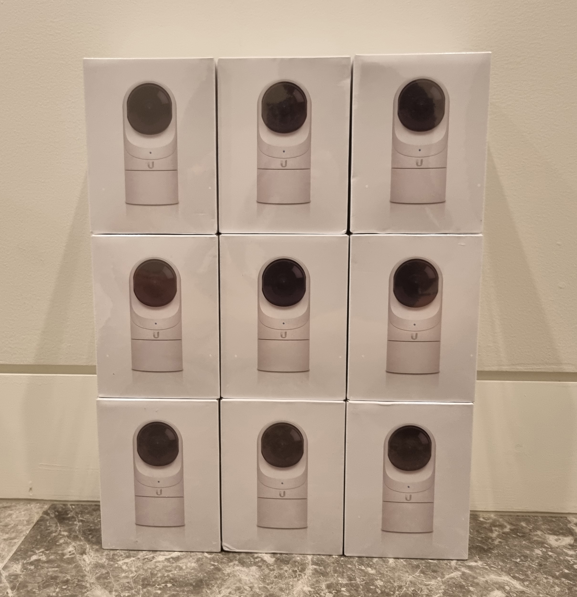

Not that there's anything of value to steal.

## Table of Contents

```toc
# This code block gets replaced with the TOC
```

## Front Door

At the front door, I have the [Eufy Smart Lock Touch + WiFi (T8520)](https://myeufy.com.au/smart-lock-touch-wifi.html) lock with a [Eufy Dual Camera Doorbell](https://myeufy.com.au/dual-camera-doorbell.php). Both were purchased before the entire [Eufy/Anker scandal](https://www.youtube.com/watch?v=qOjiCbxP5Lc).


### Lock

The [Eufy Smart Lock Touch + WiFi (T8520)](https://myeufy.com.au/smart-lock-touch-wifi.html) is a battery-powered mortise lock. The battery typically lasts about a month, although it is advertised for a year. My original battery was draining 5 days before Eufy sent me a replacement.


The installation was straightforward, as I already had a Samsung lock. The cutouts for the mortise lock were the same.


The lock can be opened with a fingerprint, PIN, Bluetooth/WiFi or key. Temporary PINs can be added to the app to allow anybody access. I always use the fingerprint method takes about 1-2 seconds to register. The best part is no longer having to carry house keys.


The lock also has a poorly implemented auto-lock feature that locks the door when it detects it is in a closed position. This feature works for the first few days before requiring calibration. Other brands (like Samsung) use a magnet to detect when the door is in the closed position which in my experience works a lot better.


### Camera Doorbell

The [Eufy Dual Camera Doorbell](https://myeufy.com.au/dual-camera-doorbell.php) is a battery-powered doorbell with two cameras, one facing forward and the other facing downward to see packages. The package camera is what made me pick it over other video doorbells.


I had an older Alhua doorbell previously installed. I reused the screw holes to mount the Eufy doorbell.


The camera comes with the Eufy Homebase which acts as a door chime and storage. I also have the Eufy app on my phone and [wall-mounted tablets around the house](/smart-home-dashboard/#tablets) which send a notification when the doorbell is pressed. The app allows for two-way audio and integrates with my Eufy lock to easily unlock the door for friends and family.


Unfortunately, the wired version is not sold in Australia. [LifeHackster has a video](https://www.youtube.com/watch?v=hDK6uZE3ltc) comparing both doorbells. The lag in starting the video stream and the delay in audio are very noticeable. The ideal non-Eufy replacement would be the [UniFi G4 Doorbell Pro](https://store.ui.com/collections/unifi-protect-cameras/products/g4-doorbell-pro), but over a year since its release, it is consistently sold out and hasn't reached Australia. I have wiring ready from the old doorbell for PoE.


### Home Assistant

Both devices, including the HomeBase 2, are supported in Home Assistant with the [fuatakgun/eufy_security](https://github.com/fuatakgun/eufy_security) integration which utilises the [bropat/eufy-security-ws](https://github.com/bropat/eufy-security-ws) library.

The lock is currently having [issues with locking/unlocking](https://github.com/fuatakgun/eufy_security/issues/681). I only use it for tracking battery and status, so it doesn't matter that much to me.


The doorbell is barely compatible. It takes too long to open/close a video stream and two-way audio does not work. I don't keep it in Home Assistant.

## Security Cameras

I am using the [UniFi Protect platform](https://www.ui.com/camera-security) for security cameras. Inside and outside the house, I have 9 x [UniFi G3 Flex cameras](https://store.ui.com/collections/unifi-protect/products/unifi-video-g3-flex-camera) connected to a [UniFi UNVR](https://store.ui.com/collections/unifi-protect-nvr/products/unvr).


I went with the UniFi ecosystem mostly for its superb web/[mobile](https://play.google.com/store/apps/details?id=com.ubnt.unifi.protect) interfaces. Previously, I used [Hikvision cameras in Milestone XProtect](/home-security-cameras/) when living with my Grandma, but it's still a Windows-only program with subscriptions required after 8 devices. I've switched my Grandma over to Blue Iris, but its mobile and web interfaces are bad, plus support and upgrades require a subscription.

### Installation

I had electricians run CAT6e around the house for cameras and wireless access points. This was overkill for the cameras given they only required Fast Ethernet (100 Mbps).


### Cameras

The G3 Flex camera is a mini turret camera purchased for $112 AUD each. These cameras only work with Ubiquiti's NVR, Cloud Key and Dream Machine products as they do not expose an RTSP stream.



I also bought 3 x [waterproof mounts](https://store.ui.com/collections/unifi-accessories/products/uvc-g3-flex-wall-mount) for most of the outdoor cameras ($26 each).


I found they were the best for value after watching a comparison video from DPC Technology.

<iframe src="https://www.youtube.com/embed/gaiGrIdZIWs" allowfullscreen width="1280" height="720"></iframe>


There is now a [G5 Flex in Early Access](https://eu.store.ui.com/collections/unifi-protect-cameras/products/camera-g5-flex-ea) with a [video comparison on YouTube](https://www.youtube.com/watch?v=xoWjU6bEOQU) showing its clearer and wider image.

<iframe src="https://www.youtube.com/embed/xoWjU6bEOQU" allowfullscreen width="1280" height="720"></iframe>

To get a wider view, I 3D printed a [tilted mount from Thinigverse by benjaloco17](https://www.thingiverse.com/thing:4945242). It includes holes to run an ethernet cable without a boot I will use once I patch up the holes.


### NVR

The [UniFi UNVR](https://store.ui.com/collections/unifi-protect-nvr/products/unvr) is a video recorder with 4 hard drive bays running UniFi Protect. I paired it with a [16 TB Seagate Skyhawk AI](https://www.seagate.com/au/en/products/surveillance-drives/skyhawk-hard-drive/) hard drive for $455. This has provided 81 days of continuous footage from the 9 cameras recording at 25 FPS at the highest quality.


These are the camera capacities for the UNVR and UNVR-PRO:

| Host     | 2MP (HD) | 4/5MP (2K HD) | 8MP (4K) |
|:---------|:---------|:--------------|:---------|
| UNVR     | 50       | 25            | 15       |
| UNVR-PRO | 60       | 30            | 20       |

The UNVR only supports UniFi cameras, but there's a [project on GitHub](https://github.com/keshavdv/unifi-cam-proxy) that allows any RTSP cameras to work.

I also connected the SFP+ port to my [network switch](/juniper-ex3300-48p/) for 10 Gbps+ networking. As mentioned earlier, this is overkill considering the cameras are only rated for 100 Mbps.


### UniFi Protect

The biggest selling point is UniFi Protect's web and mobile interfaces. They are fast, easy to use and wife-approved.


### Home Assistant

Home Assistant has an official integration for [UniFi Protect](https://www.home-assistant.io/integrations/unifiprotect/). The camera feeds are laggy and delayed compared to viewing them from UniFi Protect directly. One workaround is to enable the RTSP stream and use the [WebRTC custom component](https://github.com/AlexxIT/WebRTC) instead.


## Alarm

The house came with a [Bosch 2000](https://commerce.boschsecurity.com/au/en/Solution-2000-3000-Control-Panel/p/F.01U.292.968/) alarm system. The system includes:

- Metal cabinet
- PCB control panel
- Touch screen
- Motion detectors
- Backup battery (12V 7Ah)
- Internal siren

It took a few days to figure out as the previous owners left it inactive. I disconnected the siren and reset the tampers with the help of the manuals online. The alarm would trip instantly because of the tamper switch inside the cabinet and the backup battery tamper. I suspect they never got it working for that reason.


### Keypad/Screen

The system came with a Micron Touchpanel instead of an official Bosch screen. It was missing a lot of advanced features (no keypad commands) and was full of bugs.


I replaced it with the Bosch 5" touch screen (IUI-SOL-TS5) with help from [Cheap Alarm Parts in North Bondi](https://www.cheapalarmparts.com.au/bosch-5-hi-res-touch-screen-code-pad-to-suit-2000) for $220 AUD. The slightly bigger 7" model was double the price, so I had to pass on it.


The screen can be replaced by matching up the cables from the control panel to the new connector. [FYI In Australia, by law, all electrical work must be performed by a licensed electrician](https://www.fairtrading.nsw.gov.au/buying-products-and-services/product-and-service-safety/electrical-safety).


The screen also supports custom backgrounds...


### Motion Detector

The motion detectors are the basic [Blue Line Gen2 PIR](https://commerce.boschsecurity.com/au/en/Blue-Line-Gen2-PIR-Motion-Detectors/p/2602384139/) models. They detect movement within a 12m x 12m area. They don't trigger on my robot vacuums, and I assume on small pets as well.


I did have one motion detector sporadically triggering from change in light from an adjacent bedroom window. I did a drop-in replacement  with the newer [Blue Line Gen2 TriTech](https://commerce.boschsecurity.com/au/en/Blue-Line-Gen2-TriTech-Motion-Detectors/p/2612755083/) model which resolved the false positives. It cost $50 AUD.

### Networking

The [Bosch B426-M](https://commerce.boschsecurity.com/au/en/B426-Conettix-Ethernet-Communication-Modules/p/F.01U.332.307/) module is used for cloud access via Ethernet. It allows connectivity through the RSC+ mobile app to arm and disarm the alarm. The module costs $120 AUD.


The module attaches to the side of the metal cabinet with screws.


### Home Assistant

A Home Assistant integration is provided by [sanjay900/solution3000-home-assistant](https://github.com/sanjay900/solution3000-home-assistant). It supports arming, disarming as well as providing the state of the motion detectors.


One of my favourite automations is to send a notification to my phone to arm the alarm if the front door is closed and no motion has been detected after 15 minutes.


```yaml
alias: Alarm - Phone Notification to Arm
description: ""
trigger:
  - platform: state
    entity_id:
      - lock.front_door
    from: unlocked
    to: locked
    for:
      hours: 0
      minutes: 14
      seconds: 30
condition:
  - condition: state
    entity_id: alarm_control_panel.bosch_2000
    state: disarmed
  - condition: state
    entity_id: binary_sensor.motion_detector_1
    state: "off"
    for:
      hours: 0
      minutes: 14
      seconds: 30
  - condition: state
    entity_id: binary_sensor.motion_detector_2
    state: "off"
    for:
      hours: 0
      minutes: 14
      seconds: 30
action:
  - service: notify.mobile_phones
    data:
      title: Turn on alarm system?
      message: No motion has been detected since leaving
      data:
        channel: Alarm
        notification_icon: mdi:shield-lock
        actions:
          - action: ARM_AWAY
            title: Arm away
  - wait_for_trigger:
      - platform: event
        event_type: mobile_app_notification_action
        event_data: {}
    timeout: "01:00:00"
    continue_on_timeout: false
  - choose:
      - conditions:
          - condition: template
            value_template: "{{ wait.trigger.event.data.action == \"ARM_AWAY\" }}"
        sequence:
          - device_id: abc123
            domain: alarm_control_panel
            entity_id: alarm_control_panel.bosch_2000
            type: arm_away
mode: single
```

I use this in combination with another automation to send notifications when the state of the alarm changes.


```yaml
alias: Alarm - State Notifications
description: ""
trigger:
  - platform: device
    device_id: abc123
    domain: alarm_control_panel
    entity_id: alarm_control_panel.bosch_2000
    type: disarmed
    id: disarmed
  - platform: device
    device_id: abc123
    domain: alarm_control_panel
    entity_id: alarm_control_panel.bosch_2000
    type: triggered
  - platform: device
    device_id: abc123
    domain: alarm_control_panel
    entity_id: alarm_control_panel.bosch_2000
    type: armed_away
condition: []
action:
  - service: notify.mobile_phones
    data:
      title: >-
        Alarm System - {{ trigger.to_state.state | regex_replace(find='_',
        replace=' ', ignorecase=False) | title }}
      message: ""
      data:
        group: alarm-state-notifications
        channel: Alarm Notifications
        notification_icon: >-
           mdi:shield-lock  mdi:shield-off  mdi:shield-alert 
        color: >-
            yellow    green    red  
mode: single
```

## Security Screen Doors

For physical security, we got metal security screens on all doors and windows.


They are made out of strands of hard metal mesh, unlike soft fabric fly screens.


One door was 3 metres high and was custom-made for us. Usually, a brace has to be installed in the middle for rigidity, but our supplier was able to forgo it. The door does rub however when opening, but the visual trade-off is worth it.


We also use the doors when cooking to let out all the smell and particles.


