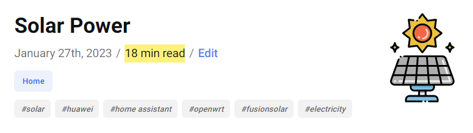

I've been working on some new features and changes for this blog.

## The State of Gatsby

For [3 years now](/now-powered-by-gatsby), this blog has been powered by Gatsby. Unfortunately, [The State of JavaScript 2022 survey](https://2022.stateofjs.com/en-US/) was not nice to Gatsby. It's retention score (would use again rating) is still on freefall from 51% to 38%. This is less than half of the next framework.

Ultimately, it doesn't matter as long as it's still the right tool for the job. Gatsby is still being maintained and updated regularly and does almost everything I need.

## Categories

I've removed the following three [categories](/categories) on the site and moved their posts:

- Review: The items I was reviewing were from other categories.
- Hacking: Similar to the above.
- Privacy: Posts moved to the [Security](/categories/security) category.

In there place, I've made three new categories:

- [3D Printing](/categories/3d%20printing/)
- [Career](/categories/career/)
- [Hardware](/categories/hardware/)

## Time to Read

A time to read indicator is now shown at the top of each post next to its date. This information has always been available but I chose to hide it.

## Floating Table of Contents

On larger screens, there is now a floating table of contents on the right-hand side. This is helpful on some of my larger posts. I plan to add an indicator to track the active heading/section.

## Smooth Scrolling

[Smooth scrolling](https://gomakethings.com/how-to-animate-scrolling-to-anchor-links-with-one-line-of-css/) has been implemented to beautifully jump between anchor points. See it in action in the video below:

<video autoplay loop controls width="100%" height="auto">
  <source type="video/webm" src="scrolling.webm">
  
Your browser does not support the video element.

</video>

## Page Progress Indicator

Lastly, I've implemented a [page progress indicator](https://github.com/devjmetivier/gatsby-plugin-page-progress) top the top of each blog post. The red colour matches my favicon.

<video autoplay loop controls width="100%" height="auto">
  <source type="video/webm" src="progress.webm">
  
Your browser does not support the video element.

</video>
