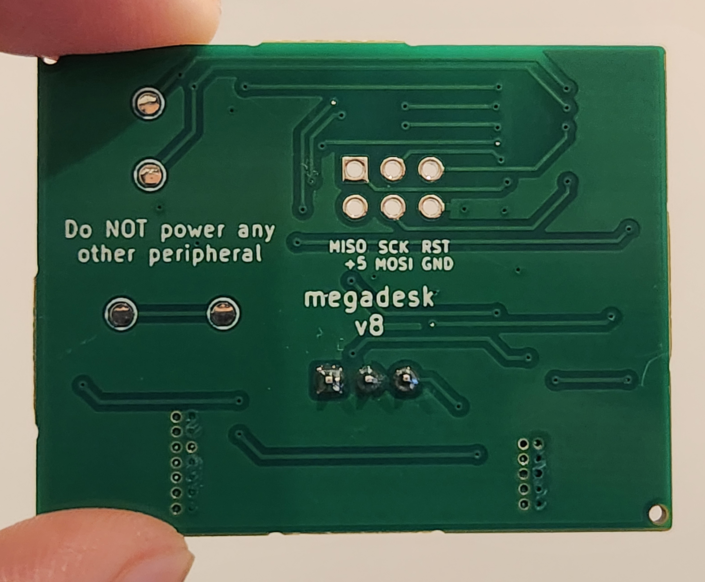
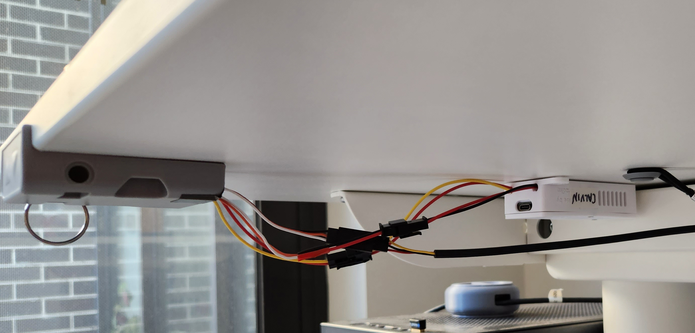

I modified the IKEA Bekant sit/stand desk to add memory positions and remote control.

<!-- more -->

```toc
# This code block gets replaced with the TOC
```

<video autoplay loop controls muted width="100%" height="auto">
  <source type="video/webm" src="supercut.webm">
  <p>Your browser does not support the video element.</p>
</video>

## IKEA Bekant

The IKEA Bekant is an adjustable sit-stand office desk. We have two desks in the house, a [standard rectangle for me](https://www.ikea.com/au/en/p/bekant-desk-sit-stand-white-s09222577) and a [corner desk for my wife](https://www.ikea.com/au/en/p/bekant-corner-desk-right-sit-stand-white-s09222520/). We bought these a long time ago when they were the best for value on the market, but there are more options nowadays.


## The Problem

As much as we want to, the standing feature is rarely used. It's not because of any joint pain, as we also have the amazing [Ergodriven standing desk mats](https://ergodriven.com/products/topo). After discussing the problem, it boiled down to:

1. No memory positions and having to do micro-adjustments whenever changes are made
2. The button is not the easiest to hold and press
3. Forgetting about the need to stand

My solution to the problem involves using:

- [Megadesk](https://www.tindie.com/products/gcormier/megadesk/) to add memory positions
- [ESPHome](https://esphome.io/) to control the desk wirelessly
- [Home Assistant](https://www.home-assistant.io/) to automate raising and lowering the desk.

## Megadesk

Megadesk is an [open-source](https://github.com/gcormier/megadesk) drop-in controller that adds memory positions. It was created by Greg Cormier and is [for purchase on Tindie](https://www.tindie.com/products/gcormier/megadesk/). I found out about this on [Tobias Brunner's blog](https://tobru.ch/ikea-bekant-table-control-over-mqtt-with-megadesk-and-esp32/). It is also possible to print the circuit board yourself if you have the know-how.

<video autoplay loop controls muted width="100%" height="auto">
  <source type="video/webm" src="megadesk/megadesk.webm">
  <p>Your browser does not support the video element.</p>
</video>




Here's a video from Keep things alive on YouTube:

<iframe src="https://www.youtube.com/embed/QopaeB1k6LU" allowfullscreen width="1280" height="720"></iframe>

It took a month to arrive from Canada. One of my units was defective and gave out a loud bang. Greg shipped out another one free of charge that arrived in two weeks.

### Installation

Unplug the controller unit and unscrew it from the table.


The hardest part of the installation is opening the unit. The plastic needs to be scored with a knife and pried open. I didn't have much luck with both units and resorted to brute force. These three videos show how it is done:

- [IKEA Bekant / Megadesk disassembly/assembly steps](https://www.youtube.com/watch?v=jCPlM2KYwDQ) by Greg's Tinker Town
- [IKEA Bekant / Megadesk disassembly #2](https://www.youtube.com/watch?v=qiOev3miDo8) by Greg's Tinker Town
- [Making Ikea Bekant a big brain desk](https://www.youtube.com/watch?v=QopaeB1k6LU?t=130) by Keep things alive


The Megadesk PCB is then a direct swap.


I also filed down the sides of my case to make it an easier fit. This may not be an issue with the [v10 of the PCB which reduced the size by 1mm in each direction](https://github.com/gcormier/megadesk/releases/tag/pcb-v10).


### Controls

The controls for the unit can then be found on [GitHub](https://github.com/gcormier/megadesk#quick-commands)

| UP pushes | Function                                        |
|:----------|:------------------------------------------------|
| 2-10      | Memory positions                                |
| 11        | Set the minimum height to the current position  |
| 12        | Set the maximum height to the current position  |
| 14        | Recalibration. Desk lowers to the lowest height |
| 15        | Reset                                           |
| 16        | Newer units, no operation.                      |
| 17        | Toggle audio-feedback mode                      |
| 18        | Toggle both-button mode                         |

## Wi-Fi Control

Controlling the Megadesk over Wi-Fi requires connecting a separate microcontroller, typically an ESP8266 or ESP32, to its serial headers. This allows issuing commands remotely to the Megadesk from the microcontroller's web interface or API. The serial commands are [documented in detail on GitHub](https://github.com/gcormier/megadesk/blob/master/Serial.md).

The microcontroller can be powered directly by the desk. A step-down converter is used to drop the 24V supplied by the desk to the 3.3V needed by the microcontroller.

I created this wiring diagram following [Matthias Schaffer's Megadesk post on Medium](https://medium.com/@matthiasschaffer/make-your-ikea-standing-desk-smart-62b8307da8b6).


### D1 Mini

The [WeMos LOLIN D1 mini](https://www.wemos.cc/en/latest/d1/d1_mini.html) is an ESP8266 microcontroller with USB-C starting from V4.0.0. It can be purchased from their [official AliExpress store](https://www.aliexpress.com/item/32529101036.html) for $7.50 AUD total at the time of posting. I went with a [clone](https://www.aliexpress.com/item/1005004271759155.html) *D1 mimi* for half the price. There was a [voltage regulator issue with clones](https://old.reddit.com/r/esp8266/comments/9iizx4/warning_clone_wemos_d1_minis_with_only_150ma_33v/), but I'm not sure if this applies to newer versions.


### ESPHome

<video autoplay loop controls muted width="100%" height="auto">
  <source type="video/webm" src="esphome/esphome.webm">
  <p>Your browser does not support the video element.</p>
</video>

[ESPHome](https://esphome.io/) is an open-source project by [Nabu Casa](https://www.nabucasa.com/), the company behind [Home Assistant](https://www.home-assistant.io/), to easily configure and flash ESP8266/ESP32 microcontrollers. It can provide a web interface and API for controlling the microcontroller in other home automation systems.

Using ESPHome, the D1 Mini is flashed to support and interface with the Megadesk over serial. The initial flash is done with USB, but subsequent updates can be done over-the-air (OTA, i.e. Wi-Fi).

A full ESPHome guide is [available on the Megadesk GitHub](https://github.com/gcormier/megadesk/blob/master/esphome.md). I made the following improvements to this code, which can be [found on my GitHub](https://github.com/calvinbui/ansible-monorepo/tree/master/files/esphome):

- Added remaining memory buttons
- Read and write saved memory positions
- Cover entity with controls
- Current, minimum and maximum height sensors
- Moving binary sensor
- Icons for all entities
- Codebase operates on the principle that each YAML file corresponds to exactly 1 device
- [Jinja templating](https://jinja.palletsprojects.com/en/)
- Documentation links and comments


### LM2596S

The [LM2596S](https://www.ti.com/product/LM2596) is an adjustable step-down buck converter from Texas Instruments. It can take the Bekant's 24V output and turn it down to 3.3V for the D1 Mini. It's important to power the D1 Mini from the same source as the Megadesk instead of its USB port or ([as I was told by AnAnalogGuy](https://github.com/gcormier/megadesk/discussions/87#discussioncomment-5485446)) a [ground loop](https://en.wikipedia.org/wiki/Ground_loop_(electricity)) will occur. I bought a [clone from AliExpress](https://www.aliexpress.com/item/10000000656280.html) for $2.50 AUD.

Out of the box, it needs to be adjusted to output 3.3V by turning the screw on while measuring the output with a multimeter. I followed this YouTube video by POWER GEN:

<iframe src="https://www.youtube.com/embed/QPntXt8Ea3s" allowfullscreen width="1280" height="720"></iframe>

The converter also holds a charge for about 20 seconds after unplugging it, so handle it with care.


### Case

[Oliver Radke (oradke) designed the perfect case](https://www.thingiverse.com/thing:5877955) to hold a D1 Mini and LM2596S step-down buck converter. There are two cable channels and screw holes to mount the unit directly to the table. The lid can also be secured with four 2x10mm screws.


I printed the design with White eSUN PETG, to match the colour of the table, with 20% infill. The total print time was a bit over 3 hours on the [Bear MK3](/3d-printer-upgrades-galore/#bear-frame-upgrade-21).


### Connectors

Powering both Megadesk and the microcontroller from the desk requires a [JST RCY](https://www.jst-mfg.com/product/pdf/eng/eRCY.pdf) splitter cable. These are also known as RC Servo cables. I purchased two ['1 male to 2 female' splitters from AliExpress](https://www.aliexpress.com/item/4000790972907.html) for $4.50 AUD. As long as there is one male and female, the last split can be anything it will be modified.

- Female: Power from the desk
- Male: Power to Megadesk
- Male: Power to Step-down converter. I modified this to a JST SM connector below.

The cable will also most likely be coloured differently so it's important to mark the right orientation when it's plugged in. I use a bit of masking tape to indicate the way it should be connected.


To make it easy to plug and unplug the microcontroller and step-down converter, I also used [JST SM connectors](https://www.jst-mfg.com/product/pdf/eng/eSM.pdf). Two sets of male and female 2-pin cables are required.

1. Microcontroller to Megadesk
2. Power to Step-down converter. Optional, see above.

I had 3-pin cables lying around that I de-pined to 2-pin.


These cables are a personal preference, but I highly recommend them to make it easier to maintain and move around. It would be possible to achieve the same result with jumpers or soldering a wire directly.

### Soldering

I am still using the same soldering equipment from [my previous post where I installed a modchip into my Nintendo Switch OLED](/nintendo-switch-oled-modding/#modchip).

I started by working on the JST RCY connector. I removed the split male connector and cut off one cable as it won't be used. My colour coding will be:

| Function | Power  | RC Servo | Action                          |
|:---------|:-------|:---------|:--------------------------------|
| LINBUS   | Yellow | Black    | Not required. Cut at the split. |
| GROUND   | Black  | Red      | Solder split to IN-             |
| 24V      | Red    | White    | Solder split to IN+             |


At this point, I chose to connect a male JST connector to the GROUND and 24V wires.

| Function | RC Servo | JST-Connector | Action              |
|:---------|:---------|:--------------|:--------------------|
| GROUND   | Red      | Black         | Solder split to IN- |
| 24V      | White    | Red           | Solder split to IN+ |


Run a JST SM female cable through the case's left channel and solder the black cable to `IN-` (Ground). The red cable will have to be shortened. Cut it just a bit ahead of where `IN+` (24V) is and solder it in.


Connect the step-down converter to the power through the RCY/servo splitter. Adjust the step-down converter until it's outputting 3.3V. [See the above section for more details](#lm2596s). Power it off when done.


Run a JST SM cable through the case's right channel and solder it to the D1 Mini.

| D1 Mini | JST-Connector |
|:--------|:--------------|
| RX      | Yellow        |
| TX      | Red           |


Solder a cable to OUT+ and OUT- on the step-down converter. Use the case's internal cable channels to route the cables. Consider the cable length to allow the lid to close and that it's not too tight and restrictive for future maintenance.


Solder the cables from the previous step to the D1 Mini

| Function | LM2596S | D1 Mini |
|:---------|:--------|:--------|
| 3.3V     | OUT+    | 3V3     |
| GROUND   | OUT-    | Black   |


Check the D1 Mini is being wired properly and working by powering the step-down converter from the RCY/servo splitter and accessing the web interface. Power it off when done.


Solder a male JST connector onto the Megadesk PCB. The cable must be on the side with the other connectors.

| Function | JST-Connector |
|:---------|:--------------|
| MISO     | Yellow        |
| SCK      | Red           |


Connect the RCY/servo splitter to the Megadesk PCB and close it back up. Test it still works by connecting it to power and raising/lowering the desk. Power it off when done.


Connect everything together. Every connector should have a male and a female making it easy to know what goes where. Do a final test raising/lowering the desk manually and through the web interface.

| Function | Color              | From               | To                  |
|:---------|:-------------------|:-------------------|:--------------------|
| Power    | Yellow, Black, Red | Desk               | RCY/Servo Splitter  |
| Power    | Black, Red         | RCY/Servo Splitter | Step-down converter |
| Serial   | Yellow, Red        | Megadesk           | ESP Microcontroller |


Finally, close the lid and secure it with screws.


On my wife's corner desk, the depth is smaller so I can fit it inside of cable net.


On my desk, the cables are too short, so I mounted it with double-sided tape. I could extend the cables or drill holes as well, but the easier solution won.



## Home Assistant

### Adding

Home Assistant should notice ESPHome devices on the network and offer to add them.


The API key can be copied from the ESPHome dashboard.


The device should be added and all non-internal controls made available.


<video autoplay loop controls muted width="100%" height="auto">
  <source type="video/webm" src="home-assistant/cover.webm">
  <p>Your browser does not support the video element.</p>
</video>

### Dashboard

I'm using the [LinakDesk Card by IhorSyerkov](https://github.com/IhorSyerkov/linak-desk-card) to control the table from [my dashboard](/smart-home-dashboard/). It's made for IKEA IDÅSEN desks, however I've created all entities required from ESPHome to make it work.


<video autoplay loop controls muted width="100%" height="auto">
  <source type="video/webm" src="home-assistant/linak.webm">
  <p>Your browser does not support the video element.</p>
</video>

```yaml
cards:
  -
    type: 'custom:config-template-card'
    variables:
      sit_height: parseInt(states['number.megadesk_position_02'].state)
      stand_height: parseInt(states['number.megadesk_position_03'].state)
      min_height: parseFloat(states['sensor.megadesk_minimum_height'].state)
      max_height: parseFloat(states['sensor.megadesk_maximum_height'].state)
      wtf: parseInt(states['sensor.megadesk_height_from_minimum'].state, 10)
    entities:
      - cover.megadesk_controls
      - sensor.megadesk_height_from_minimum
      - binary_sensor.megadesk_moving
    card:
      type: 'custom:linak-desk-card'

      desk: cover.megadesk_controls
      height_sensor: sensor.megadesk_height_from_minimum
      moving_sensor: binary_sensor.megadesk_moving

      min_height: ${min_height}
      max_height: ${max_height}

      presets:
        -
          label: Max
          target: ${max_height}
        -
          label: Stand
          target: ${stand_height}
        -
          label: Sit
          target: ${sit_height}
        -
          label: Min
          target: ${min_height}
```

### Automation

<video autoplay loop controls muted width="100%" height="auto">
  <source type="video/webm" src="home-assistant/automation.webm">
  <p>Your browser does not support the video element.</p>
</video>

I am using Home Assistant's automations to raise and lower the desk during working hours.

I have a [time pattern](https://www.home-assistant.io/docs/automation/trigger/#time-pattern-trigger) that triggers the automation each hour. There isn't 'cron' style support yet, so I will use a conditional to check if the time is between 9 AM and 5 PM. I only half-days on Friday, so there is a condition for that as well.

```yaml
trigger:
  - platform: time_pattern
    hours: /1
    minutes: "0"
    seconds: "0"

condition:
  - alias: Workday
    condition: state
    entity_id: binary_sensor.workday_sensor
    state: "on"

  - alias: Working Hours
    condition: or
    conditions:
      - alias: Monday to Thursday
        condition: time
        after: "09:00:00"
        before: "17:00:00"
        weekday:
          - mon
          - tue
          - wed
          - thu

      - alias: Friday
        condition: time
        after: "09:00:00"
        before: "13:00:00"
        weekday:
          - fri
```

I have another condition to check if I'm at home by checking if the phone is connected to the Wi-Fi:

```yaml
-
  alias: At Home
  condition: device
  device_id: abc123
  domain: device_tracker
  entity_id: device_tracker.galaxy_z_fold4
  type: is_home
```

The last condition is to check the computer is active using the [Home Assistant Companion app](https://www.home-assistant.io/blog/2020/09/18/mac-companion/). It checks if the computer is unlocked and connected to my [Alienware AW3821DW monitor](/displayport-1.4-kvm-alternative/#new-monitor). I also check if the microphone and webcam inactive, to not disrupt any meetings I'm in.

```yaml
- alias: Computer In Use
  condition: and
  conditions:
    - condition: state
      entity_id: binary_sensor.macbook_active
      state: "on"
    - condition: state
      entity_id: binary_sensor.macbook_active
      attribute: Screensaver
      state: "false"
    - condition: state
      entity_id: binary_sensor.macbook_active
      attribute: Locked
      state: "false"
    - condition: state
      entity_id: sensor.macbook_primary_display_name
      state: Dell AW3821DW
    - condition: state
      entity_id: binary_sensor.macbook_audio_input_in_use
      state: "off"
    - condition: state
      entity_id: binary_sensor.macbook_camera_in_use
      state: "off"
```

I use a [Choose](https://www.home-assistant.io/docs/scripts/#choose-a-group-of-actions) script to check whether to raise or lower the desk. The condition checks if the desk is within one centimetre of the saved sitting/standing memory height. The height reported is always within a few millimetres of the saved position in my testing.

```yaml
action:
  - choose:
    - conditions:
        - condition: template
          value_template: >-
            
            
            {{ memory + 1 > current_height > memory - 1 }}

    - conditions:
        - condition: template
          value_template: >-
            
            
            {{ memory + 1 > current_height > memory - 1 }}
```

Three actions are triggered afterwards:

1. Announce the change through the Google Home Mini.
2. Give myself five seconds to prepare.
3. Raise/lower the desk.

```yaml
sequence:
  - service: tts.google_translate_say
    data:
      cache: false
      entity_id: media_player.googlehome3873
      message: The desk is going up
  - delay:
      seconds: 5
  - device_id: abc123
    domain: button
    entity_id: button.megadesk_memory_position_03
    type: press
```


