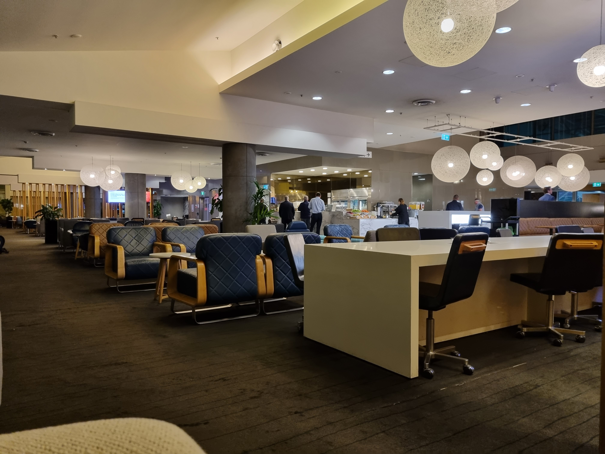
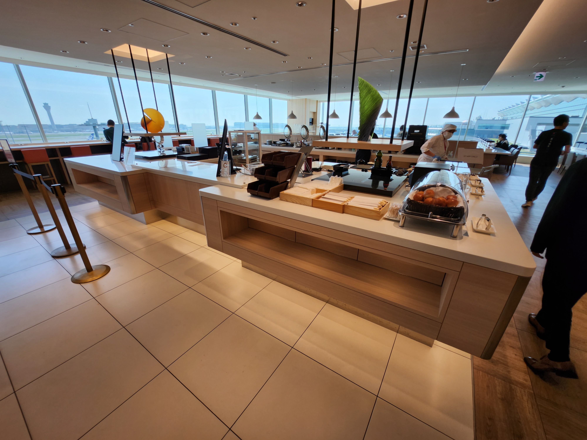
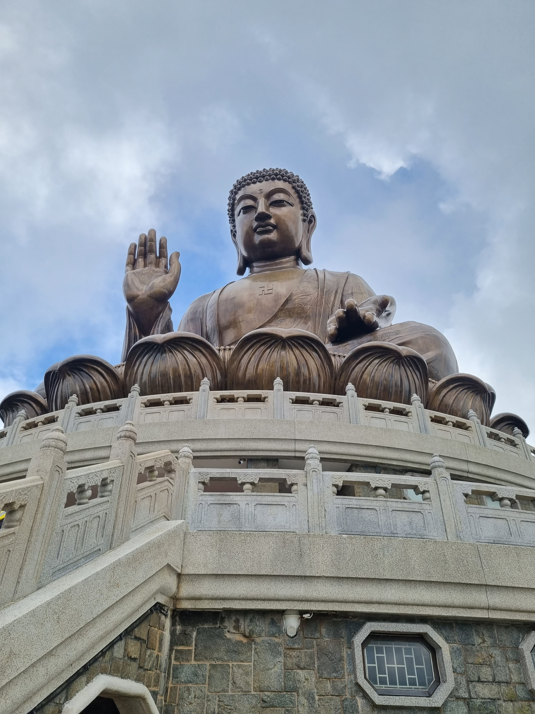
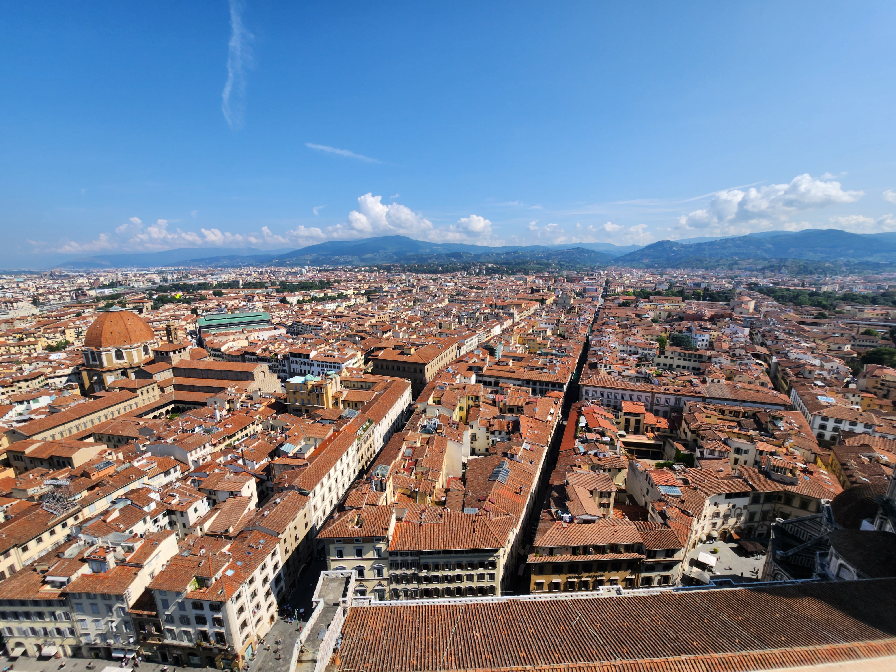
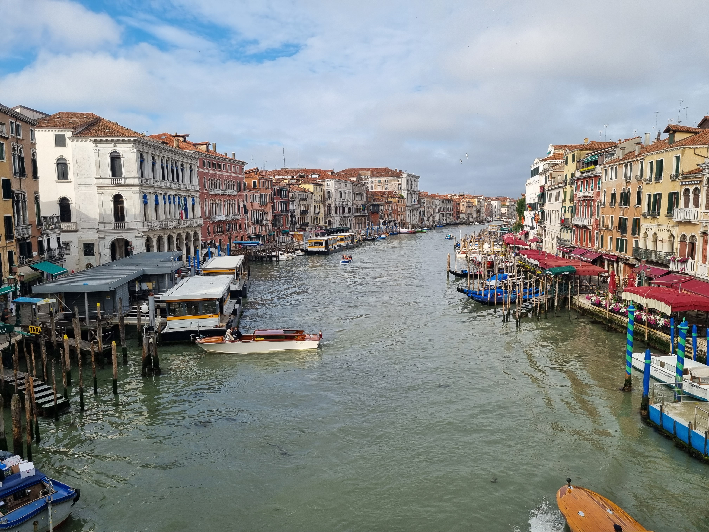
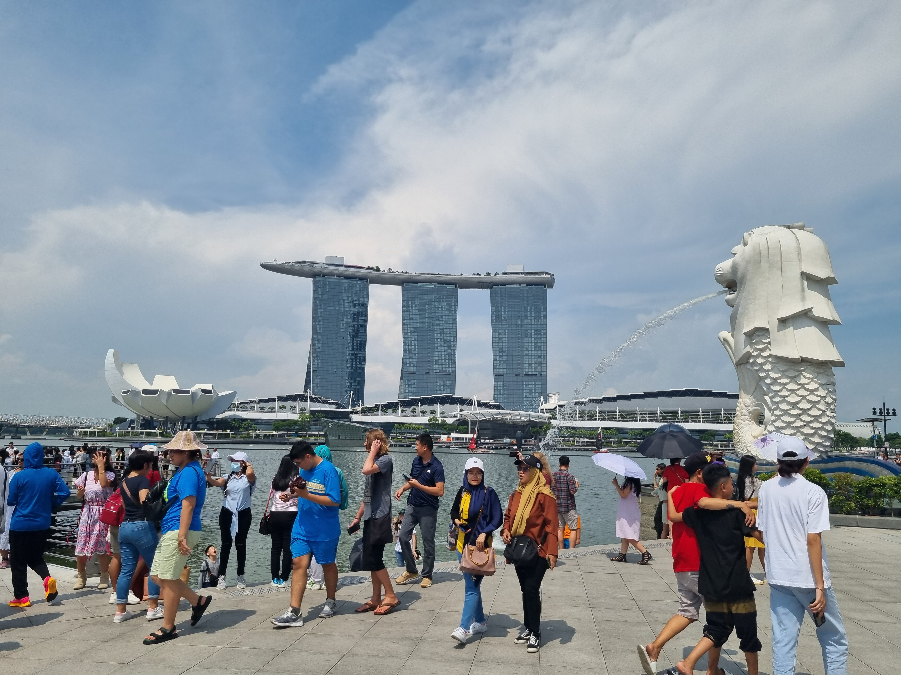

<!-- more -->

I recently flew [Business Class round-the-world](https://www.pointhacks.com.au/qantas/round-the-world-classic-reward-guide/) and have some tips to share.

```toc
# This code block gets replaced with the TOC
```

## Flights/Airlines

### General

- Get paper boarding passes instead of electronic ones. It's just easier to keep together in together with your passport and
- Put the seat cover on early. It makes it so much more comfier.
- If provided a sealed amenities bag, open it by pulling on both ends of the plastic tabs. It's nice to have all the creams and a sleeping mask on long flights.
- All ports at the airport and onboard are USB-A

### QANTAS



- QANTAS luggage drop opens 1.5 hours before their first flight of the day
- QANTAS lounge opens 1 hour before their first flight of the day
- Pyjamas are only available on overnight flights
- Keep the water bottle they provide so they can refill it. Bottles run out.

### Ryanair

- Check-in online or pay €89 at the airport per person.

### Japan Airlines



- The JAL Sakura Lounge Skyview is so much better than the regular lounge.

## Countries/Cities

### Europe

- Rarely had toothpaste provided at the hotel. Bring a big tube.
- Electronic VAT refunds can be completed before leaving, secretly.
- Get coins, ideally €2 & €1 to operate washing machines and lockers.
- Get on trains early to grab luggage storage spots.
- In Italy, use [TRENIT!](https://trenit.app/) to find platform numbers early.
- Europeans rarely use their car blinkers.
- Italian restaurants charge Coperto (service) fees between €1-€3 per person. Lazio (where Rome is) does not, but they try and charge you bread instead. Reject the bread when it comes.
- There was no bread charge in France.
- There was sometimes a bread charge in Spain.

### France (Paris)


- The easiest way to and from both airports is by taxi. There is a set fare for the left and right banks. This is shown clearly on signs near the taxi rank. This may improve when the Olympics arrive in 2024.
- Invalides train station only sell tickets at the main entrance on Robert Street.
- The train ticket machines for Versailles don't like tap and pay. Bring a credit card to insert instead.
- The train to Versailles can be on any platform, not the one being displayed. Keep a look out for the VITY code on the train.
- Follow the recommended route for the Gardens of Versailles. It takes about 2.5 hours to fully walk
- For the Garden of Versailles, buy a ticket with the Petit train included. It has 4 stops, familiarise yourself with where you want to get off/on.
- Bring lunch and water for the Garden of Versailles. It's a whole day activity.
- Buy a return train ticket after arriving in Versailles. The line is long in the afternoon.
- Pedestrian crossings don't make noise and don't always change colour. Just go when it's safe.
- Make restaurant reservations when possible, most restaurants are booked in advance.
- The Eiffel Tower sparkles late in Summer, due to the late sunset.
- Eat at Brasseries, they are a lot cheaper and offer the same food experience.

### Greece (Santorini)


- I recommend going for a walk along the coastline.
- Food in Greece is cheaper than the rest of Europe. I ate a gyro for €3.50 in Fira.

### Hong Kong



- Buy the On-Loan Octopus card, **not** the Tourist Octopus. The On-Loan can be refunded, while the Tourist cannot.
- When I left for an early flight (5:30 AM), the MTR desk at the airport was unmanned and I couldn't get my Octopus refund.
- When buying the Octopus at the vending machine, it only supported my credit card when I inserted it.
- Contactless payment is supported on buses and trams only if I used my physical credit card. Samsung Pay never worked for me.
- Metro stations only support Octopus.
- Walk on the left, but when on escalators, stand on the right and walk on the left.

### Israel


- Pedestrian crossings are respected
- Give yourself 3 hours for the security check. They will grill you.
- There is a set taxi price from the airport, minus other fees like sabbath and luggage handling.
- Not all taxis in Israel take card payments.
- Set up the Gett app beforehand as you need a phone number to use it
- Use a scooter app like Lime or Bird. They don't require an Israeli phone number.
- Tipping culture is expected from restaurants and tour guides.

### Italy (Florence)



- Scammers leave paintings on the floor and if you step on it, they will demand money.
- Shoulders must be covered when entering the Duomo di Firenze
- Enter the Santa Reparata if there's no line. It's boring though, but there is always a line there.

### Italy (Rome)


- Buses support contactless payment
- Most pedestrian crossings are broken.
- Travel light. The sidewalks are small and crowded.
- Only entrance to the Colosseum and Vatican City requires tickets, every other attraction in the city is free or can be bought on the day.

### Italy (Venice)



- If staying for over three days, I recommend staying near the train station or Piazzale Roma. Catching a water bus is busy and expensive.
- Consider a 24 or 48 hour pass if riding the ferry often, or visiting the islands Murano and Burano.
- I was able to complete everything in Venice in 1 full day.
- It is forbidden to sit/stand and eat on the streets, bridges, stairs, etc. A lot of people do it, however.

### Japan


- At Haneda Airport, there is a 7/11 ATM at Terminal 3 on the way to Terminal 2.
- The JR ticket claim line is long. It is next to the train station.
- Japanese currency notes are bigger than Australia's, bring a bigger wallet if yours perfectly fits Australian notes only.
- Bring a coin purse and a way or organise coin denominations.
- Coin lockers are everywhere, inside and outside stations. If too hard then go to another station.
- Get a PASMO, Suica or any other IC card early, you will use it often. You can get a refund for them at the airport. They work almost everywhere to pay for things and are interchangeable if you see any IC card logo.
- Food and drink are cheaper at smaller chain convenience stores than 7/11, Lawson or FamilyMart if possible.
- There are 5 different Namba stations. Make sure you book near the one you want.
- Avoid peak hour trains at Osaka, Kyoto and Tokyo for catching public transport. You will get barged.
- Walk on any side, follow the majority.
- Family Mart ATMs don't work for Citibank cards. 7/11/7&i always works.
- Try and keep the ¥100 coins, they work for everything. Better to break notes than to spend ¥100 coins.
- Most maps in Japan are not oriented properly. Look for the North symbol.
- Trains can be late, not unusual. Buses are almost always late.
- Onsen taxes apply to hotels with onsens
- Vending machines are everywhere, don't worry about being thirsty.
- Most stores list their cost before the 8% sales tax.
- The tax-free ¥5000 limit is separate for goods and consumables.
- Ordinary train to Narita airport on Keisei is half the price of the Skyliner.
- Train platforms can be 3 times longer than Sydney in bigger cities. by the time you walk it, the next train has arrived.
- If you tap on with your ic card you can't tap out. Talk to the station attendant to get out.
- Ginza is overrated. Mostly expensive European brands you can get anywhere.

### Jordan (Petra)


- [This guide](https://travelsurfrepeat.com/complete-one-day-petra-guide-free-trail-map) has everything you need to know about Petra.
- WiFi is available at a few points along the way.
- In 5.5 hours. I was able to hike the main trail to the monastery and the Al-Khubtha trail to the Treasury Viewpoint.

### Netherlands (Amsterdam)


- Buy Anne Frank museum tickets well in advance. I tried buying the Museum Pass on the day to enter, but they were already fully booked for the next 6 weeks.
- There is a €1 charge for a physical train ticket. Use contactless payments instead.
- Coffeeshop means weed. Some require an additional purchase like a drink to enter their smoking rooms, skip those.
- English is abundant, no need to learn Dutch.
- There is a long line for Manneken Pis No. 1 fries. However, there is another location close by that doesn't have a line.
- The ferry near the station across the river is free.
- Free table water is not a thing.

### Singapore



- Ignore Google Maps when it suggests taking a bus from the airport. I found using the metro only takes 3 mins longer and was a bit cheaper.
- Contactless payments are supported on all transport options.
- Hawker centres support a lot of electronic payments like Shopback Pay, SG QR, DBS PayLah, etc., but as a tourist, cash was the easiest.
- The currency has the same image on all the notes, they're just different sizes and colours.
- Some airlines support dropping off your luggage over 3 hours early to visit Jewel. [QANTAS](https://www.qantas.com/us/en/qantas-experience/at-the-airport/airport-guides/singapore-airport-guide.html) is only of them.
- Security screening is at the gate instead of before immigration.

### Spain (Madrid & Barcelona)


- Bread sometimes comes with the meal and is charged extra at the end.
- Look at the T2 Familiar tickets. It even goes all the way to the airport on the R2N (Rodalies R2 Nord) trains.
- There is an airport bus at T2 to go to T1.
- The train from Madrid to Barcelona is fast. My ears were always popping.
- Use the CityMapper app to navigate both cities.
- Rodalies trains don't list the platform they're arriving on. Always know the direction of travel to pick the right platform (i.e. Aeroporto, Castelldefels, ...)

### Switzerland


- There are many [travel passes to get](https://www.youtube.com/watch?v=fzuP0hMUjFk&pp=ygUZc3dpenRlcmxhbmQgdHJhdmxlIHBhc3Nlcw%3D%3D). I went with Saver Day Passes (bought 60 days in advance for the lowest price) with Half Fare Passes.
- The SBB app is good for travel
- There are two stations for Rhine Falls. Schloss Laufen am Rheinfall is for visiting and Neuhausen Rheinfall is for viewing from afar.
- Tickets are checked 90% of the time while on the train.
- From Lucerne to Interlaken, sit on the right in the direction of travel for the best views. There is only one lake at the beginning on the left. The train will also go backwards at one point, but stay on the same side.
- The cable car to Grindelwald First makes two stops (Bort and Schreckfeld). There's no need to get off.
- If you buy a one-way cable car ticket to First, you can choose a few activities to go back down instead of a cable car like gliding, bikes, etc.
- Top of Europe at -1°C was not that cold. No beanie or extra clothes are needed. I wore trackies and a Macpac jacket.
- The Eiger Express runs frequently. There's no set time you need to get on.
- On the Eiger Express, the best views are on the back left when going up and the front right on the way down.
- Check closer to the date if there are specials for Top of Europe. I was able to buy a Good Morning ticket that allows travel from Grindelwald to Jungfrau for 85 CHF on the first 3 trains up from Eigergletscher (7:45, 8:15 & 8:45). I went up at 8:15 and finished when the shops started opening.
- Grindelwald & Grindelwald Terminal are different places. The terminal is where you catch cable cars and other modes of transport to different places. Grindelwald Station is where the hotels are.
- Cable car up from Stechelberg to Piz Gloria will be busy until most people get off at Murren. You will need to swap at Gimmelwald, Murren and Birg.
- Buy train tickets in advance if you know you'll be travelling. They cost more on the day of travel.
- Swiss trains talk up to themselves about being on time. About 1/4 of my trains were not on time. Buses are even worse.
- Tram signs listing stops in Geneva were wrong when I was visiting.
- Pedestrian crossings do not any sound.

### United States of America (New York)


- Walk on the right
- Contactless payments supported for the subway (OMNY).
- No tap off required when leaving the subway. It is one price across the entire network.
- The subway is sketchy, but everyone uses it.
- Most things have a tip in the price. Only some restaurants you may have to calculate unless they already did.
- Google Maps is accurate. Follow what it says for train directions (i.e. to/from Brooklyn, downtown, uptown etc.) as the subway goes in both directions
- Every street is busy. It's like every street was Sydney's George Street.
- There are a lot of scammers near Whitehall Terminal for the Staten Island Ferry. The ferry is free. The scammers wear vests and have ID cards to look legitimate.
- Weed is legal and most of the city stinks of it.
- Pedestrian crossings don't make noises.
