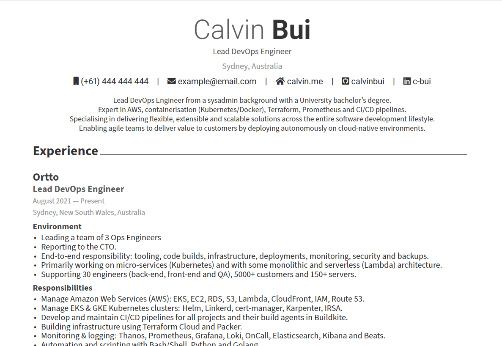
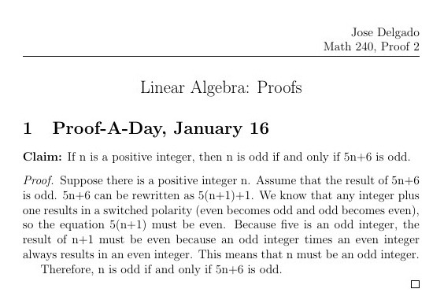
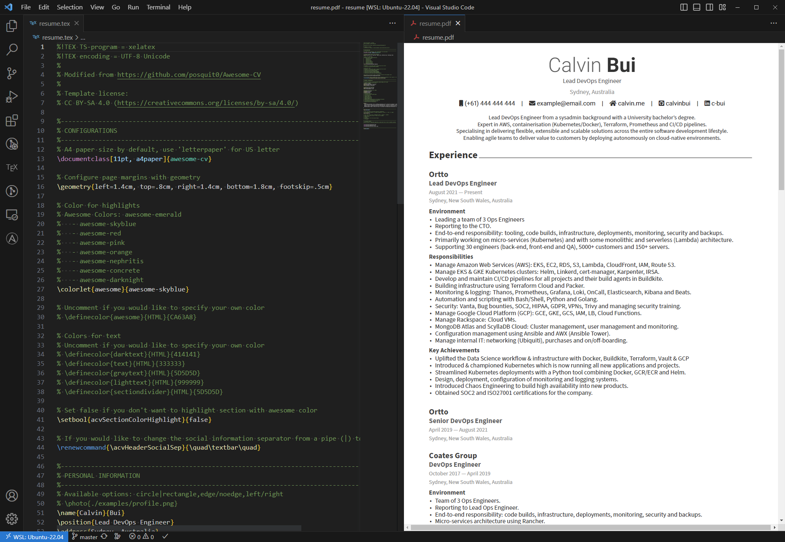
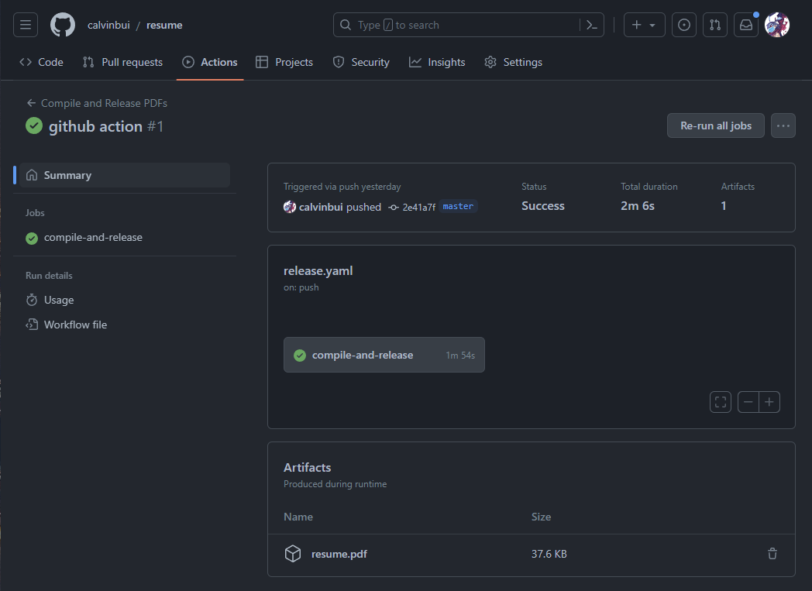
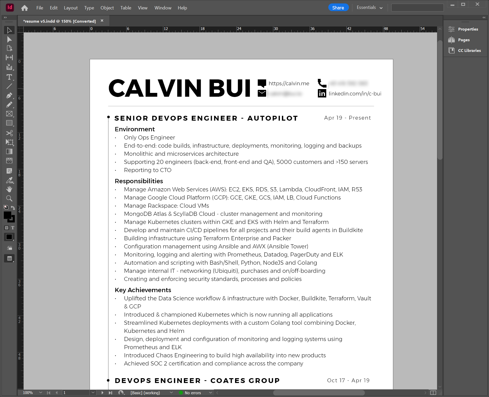

I grew tired of updating my current resume and made a new one with LaTeX.

<!-- more -->

## Resume

The source code for my resume can be found on my GitHub at [calvinbui/resume](https://github.com/calvinbui/resume).



## What is LaTeX?

[LaTeX](https://www.latex-project.org/) is a software system for creating documentation and textbooks within mathematics, engineering and computer science. It uses the [TeX](https://en.wikipedia.org/wiki/TeX) typesetting language underneath.

Creating a document in LaTeX has a programming feel to it by combining content and macros (think functions) to format text and create layouts. This solves my main problem with keeping different sections consistent.

Here is a simple example taken from [Overleaf (Math 240 - Proof 2)](https://www.overleaf.com/latex/examples/math-240-proof-2/jgfggbmwvrtm):



```latex
\documentclass[12pt]{article}
\usepackage{amsmath, amssymb, amsthm, graphicx, epsfig, fancyhdr}

\setlength{\headheight}{28pt}
\pagestyle{fancy}
\fancyhf{}
\fancyhead[R]{Jose Delgado \\ Math 240, Proof 2}
\fancyfoot[C]{\thepage}

\begin{document}
\begin{center} \Large Linear Algebra: Proofs\end{center}
\begin{section} {Proof-A-Day, January 16}
{\bf Claim:} If n is a positive integer, then n is odd if and only if 5n+6 is odd.
\begin{proof}
Suppose there is a positive integer n. Assume that the result of 5n+6 is odd. 5n+6 can be rewritten as 5(n+1)+1. We know that any integer plus one results in a switched polarity (even becomes odd and odd becomes even), so the equation 5(n+1) must be even. Because five is an odd integer, the result of n+1 must be even because an odd integer times an even integer always results in an even integer. This means that n must be an odd integer.

Therefore, n is odd if and only if 5n+6 is odd.
\end{proof}
\end{section}
\end{document}
```

## Development

As it was my first ever LaTeX project, I started with [Awesome CV by posquit0](https://github.com/posquit0/Awesome-CV), a very popular LaTeX template for a CV, resume or cover letter. I've a lot of changes to it (which you see in my commits) to adapt it to my requirements.

To edit the resume, I used VSCode along with the very powerful [LaTeX Workshop extension by James Yu](https://marketplace.visualstudio.com/items?itemName=James-Yu.latex-workshop). It makes changes to the resume a lot easier with automatic compiling on save, IntelliSense support, linting and autocomplete.



## Building with GitHub Actions

LaTeX files (`.tex`) can be compiled into PDFs and other popular file formats. Using GitHub Actions, I am compiling the PDF on each commit with my real phone number and email (via secrets) and exporting the artifact.



At the moment, I am downloading and deleting the artifact straightaway. However, I'll be moving the build to [Gitea Actions](https://blog.gitea.com/feature-preview-gitea-actions/) once it becomes stable, so I can compile the PDF privately.

## Why the change?

My current resume is created using [Adobe InDesign](https://www.adobe.com/au/products/indesign.html). It's what I landed on a few years ago after Microsoft Word became too limiting.



There are a couple of issues I was looking to solve:

- Adobe charges a yearly fee for InDesign → VSCode and other text editors are free.
- Requires a computer with InDesign installed  → Anything with a text editor.
- Specific fonts were required → Included in LaTeX.
- I had to manually export the PDF each time → Builds automatically on each commit.
- I am incompetent with Adobe InDesign → I am still incompetent with LaTeX, but it is a lot easier to find help.
