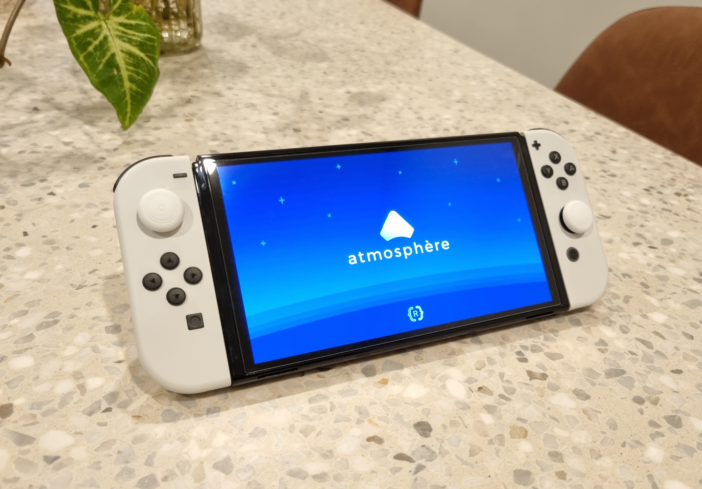
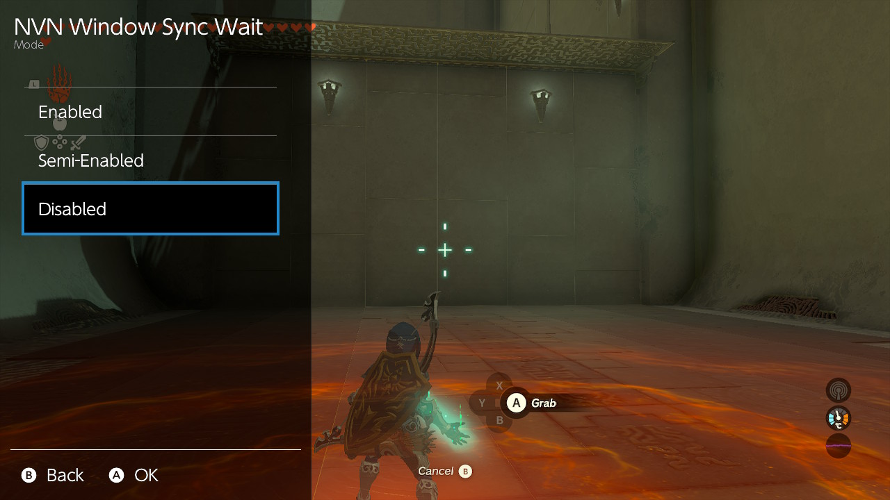
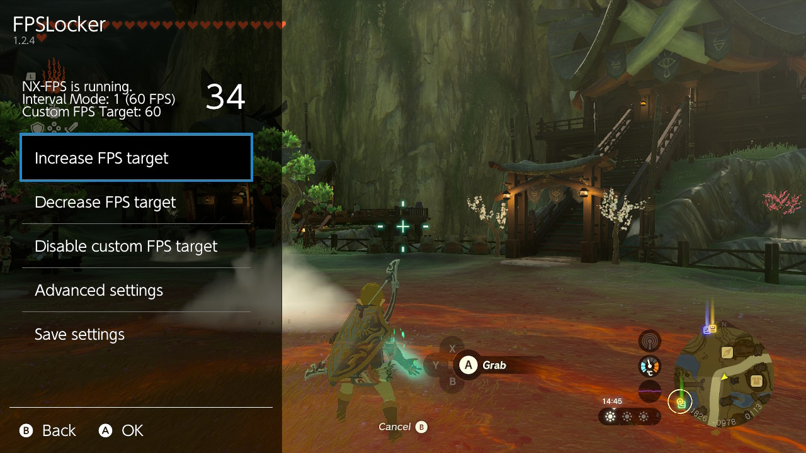
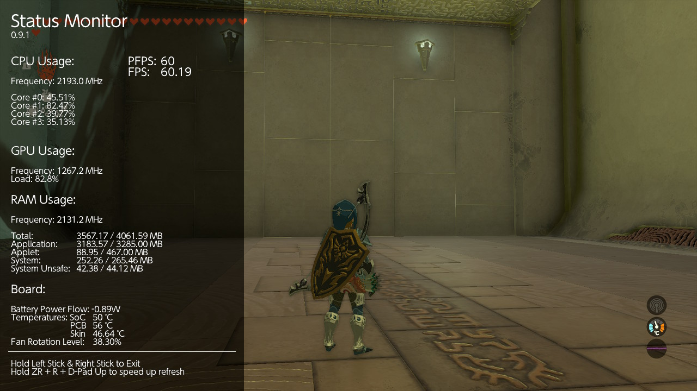
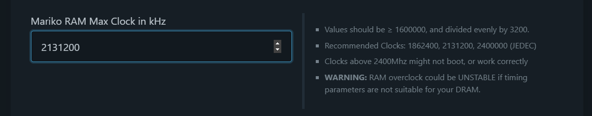
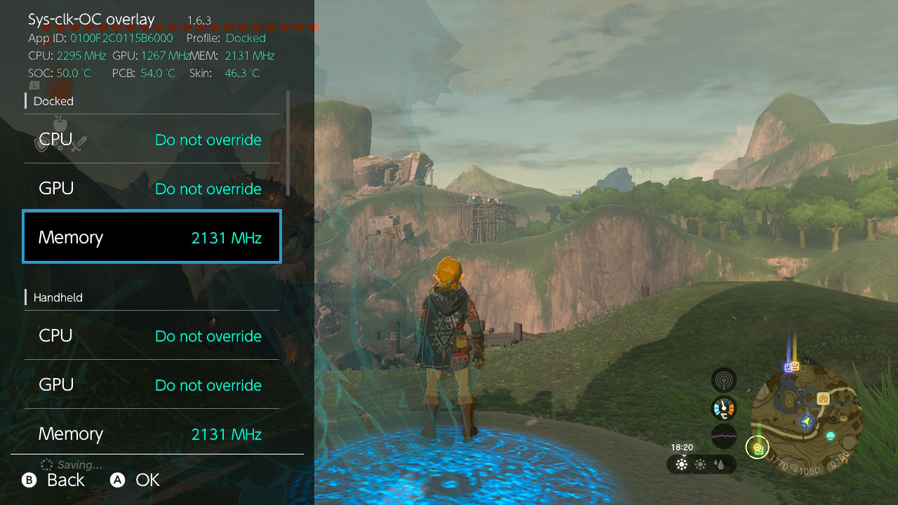
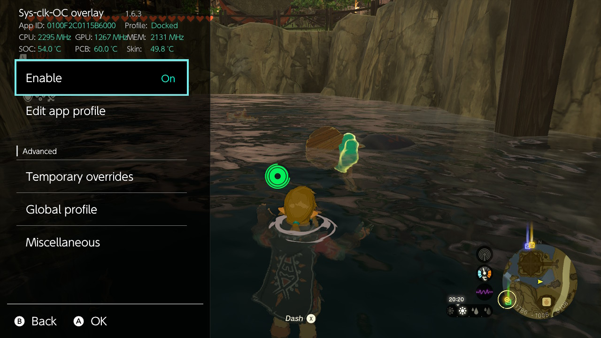
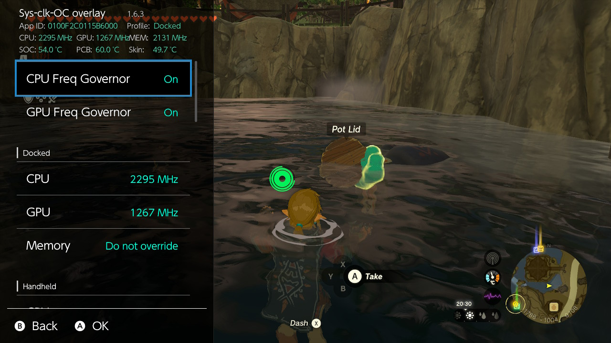

I want to share how I modded [The Legend of Zelda: Tears of the Kingdom](https://zelda.nintendo.com/tears-of-the-kingdom/) on my Nintendo Switch as guides on the internet were targetted at [Yuzu](https://yuzu-emu.org/) or [Ryujinx](https://ryujinx.org/) emulators.

<!-- more -->

```toc
# This code block gets replaced with the TOC
```

## Requirements

Modding the game on a Switch requires a modified Nintedo Switch. In my [previous post](/nintendo-switch-oled-modding/), I cover how I modified my Nintendo Switch OLED using a modchip. I do not condone piracy.



## 60 FPS

Tears of the Kingdom targets 30 frames per second (FPS), and Digital Foundry's John Linneman says the game _"holds very closely to its 30 FPS target. Nearly the entirety of video capture managed to maintain a solid 30 frames per second, at least in most instances which, for the Switch running a game this vast and emergent, is downright impressive."_

<iframe src="https://www.youtube.com/embed/BLlZBwN_-C4" allowfullscreen width="1280" height="720"></iframe>

As the game is capping itself at 30 FPS, there is a bit of performance left on the table. To unlock the frame rate:

1. On the Switch's SD card, create the folder `/atmosphere/contents/0100F2C0115B6000`.

1. Download [TotK DynamicFPS](https://reddit.com/user/ChucksFeedAndSeed/comments/14xksce/beta1_totk_dynamicfps_v155beta1_custom_internal/). At the time of the post, the latest version is [1.5.5beta3](https://www.reddit.com/user/ChucksFeedAndSeed/comments/14xksce/beta1_totk_dynamicfps_v155beta1_custom_internal/jrzm4mu/).

1. Place the `DynamicFPS - #1-0 - v1.5.5 (Required)` and `DynamicFPS - #2-3 - 60FPS (see above) (Optional)` contents in `/atmosphere/contents/0100F2C0115B6000`.

1. Follow [this guide](https://gist.github.com/masagrator/65fcbd5ad09243399268d145aaab899b) to install:

    - [SaltyNX](https://github.com/masagrator/SaltyNX): Background process for the Nintendo Switch for file/code modification
    - [Status-Monitor-Overlay](https://github.com/masagrator/Status-Monitor-Overlay): Hardware monitoring.
    - [FPSLocker](https://github.com/masagrator/FPSLocker): Set custom FPS in Nintendo Switch games
    - [Telsa Menu](https://github.com/WerWolv/Tesla-Menu): Overlay menu to activate FPSLocker and Status-Monitor-Overlay.
    - [nx-ovlloader](https://github.com/WerWolv/nx-ovlloader): Host process for loading Tesla Menu.

1. Your sdcard should look like this by the end of it:

    ```
    sdcard
    ├── SaltySD
    │   ├── exceptions.txt
    │   ├── flags
    │   │   └── log.flag
    │   ├── patches
    │   └── saltysd_core.elf
    ├── atmosphere
    │   └── contents
    │       ├── 0000000000534C56
    │       │   ├── exefs.nsp
    │       │   ├── flags
    │       │   │   └── boot2.flag
    │       │   └── toolbox.json
    │       ├── 0100F2C0115B6000
    │       │   ├── exefs
    │       │   │   ├── main.npdm
    │       │   │   └── subsdk9
    │       │   └── romfs
    │       │       └── dfps
    │       │           ├── 60fps.ini
    │       │           └── default.ini
    │       └── 420000000007E51A
    │           ├── exefs.nsp
    │           ├── flags
    │           │   └── boot2.flag
    │           └── toolbox.json
    └── switch
        └── .overlays
            ├── FPSLocker.ovl
            ├── Status-Monitor-Overlay.ovl
            └── ovlmenu.ovl
    ```

1. Start the game and press `L` + `DPad Down` + `R3` to bring up the Tesla menu overlay.

1. Open FPSLocker and set **Window Sync Wait** set to **Disabled**.

    

1. While still in FPSLocker, increase the FPS target to 60 FPS.

    

1. To confirm the game is running at 60 FPS, use Status-Monitor-Overlay.

    

I don't recommend using the [Disable Quality Reduction patch](https://github.com/HolographicWings/TOTK-Mods-collection/tree/main/Mods/Graphics/Disable%20Quality%20Reduction) or any other FSR/DynamicRes disablers. The game needs to these to keep the FPS high on a Switch. The game will run in `900p` when docked, and drop to `720p` when panning the camera or in portable mode.

Within Shrines and smaller areas, 60 FPS is easy to obtain and hold.

<video loop controls width="100%" height="auto">
  <source type="video/webm" src="shrine.webm">
  <p>Your browser does not support the video element.</p>
</video>

At Kakariko village, one of most intensive areas, the game hold above 30 FPS.

<video loop controls width="100%" height="auto">
  <source type="video/webm" src="kakariko.webm">
  <p>Your browser does not support the video element.</p>
</video>

## Overclocking

Overclocking the Switch will help it hold higher frame rates. It will however, decrease the lifespan of the Switch and may also cause instabilities and file corruption.

[Switch-OC-Suite](https://github.com/hanai3Bi/Switch-OC-Suite/) by hanai3Bi is a collection of tools for overclocking the Switch. It includes and [online configurator](https://hanai3bi.github.io/Switch-OC-Suite/#config) to push clocks further than its defaults. The one setting I changed was increasing the Mariko (OLED model) max memory clock to `2131200`.



Under **Global Profile**, I updated all memory clocks to 2131 MHz. This does not affect temperatures or noise. It's free performance.



Enable an overclocking profile for the game.



I enabled the both CPU and GPU governors and maxed their clocks speeds (`CPU 2295 MHz` and `GPU 1267 MHz`). The governor will decrease clocks in less intensive situations to save energy and power.



## Recommended Mods

These mods can be installed following the method above.

- [Serfrost's Defogger](https://gamebanana.com/mods/446995): Removes the game's fog to increase colour and visibility. Try the image slider comparisons to see the difference.
- [No Loot Boxes](https://gamebanana.com/mods/443894): Guarantee rare items from Amiibo chests.
- [Streamlined Repetitive Events](https://gamebanana.com/mods/446768): Removes or reduces the repetitive animations, dialogue and cutscenes. I recommend playing the game until you get your first companion before applying this mod to see its effects.
- [Loaded Zonaite Deposits and Autocollect](https://gamebanana.com/mods/445703): Reduce farming for zonaite and automatically collects them.
- [Free Armor Enhancements](https://gamebanana.com/mods/446596): No materials or rupees required to upgrade armor.
