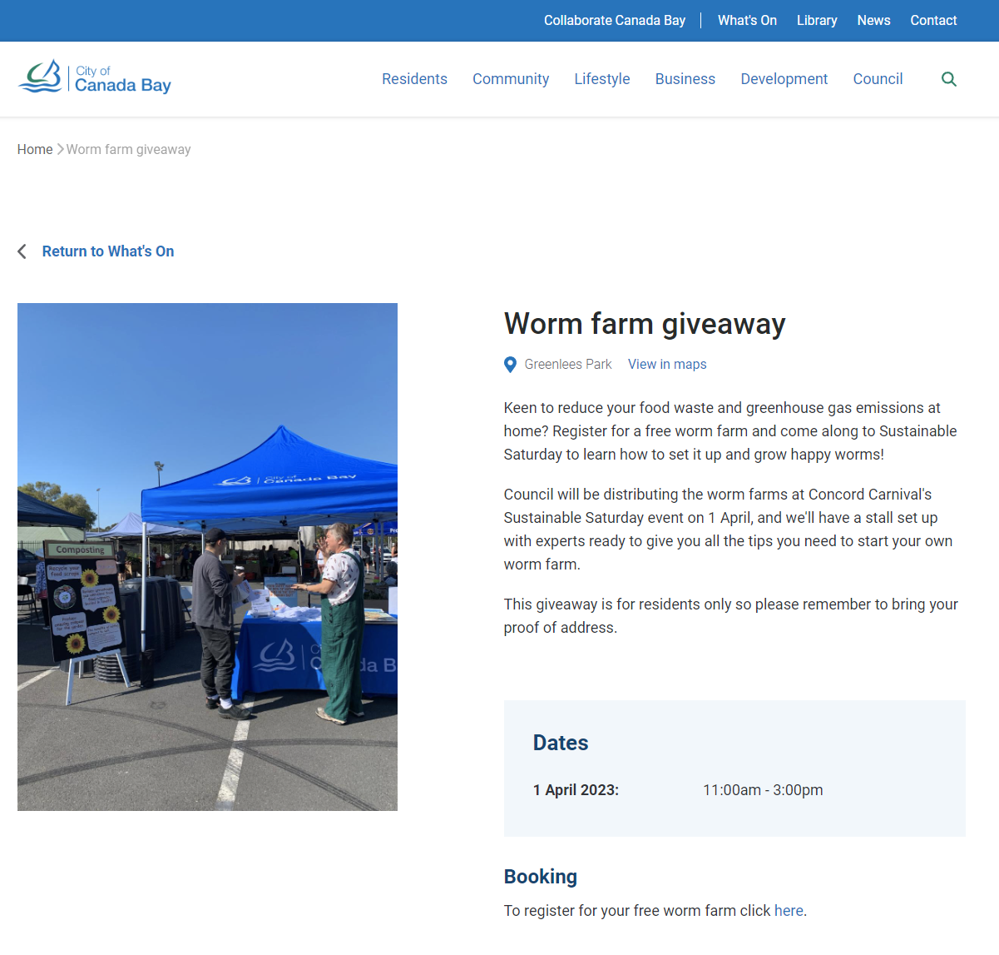
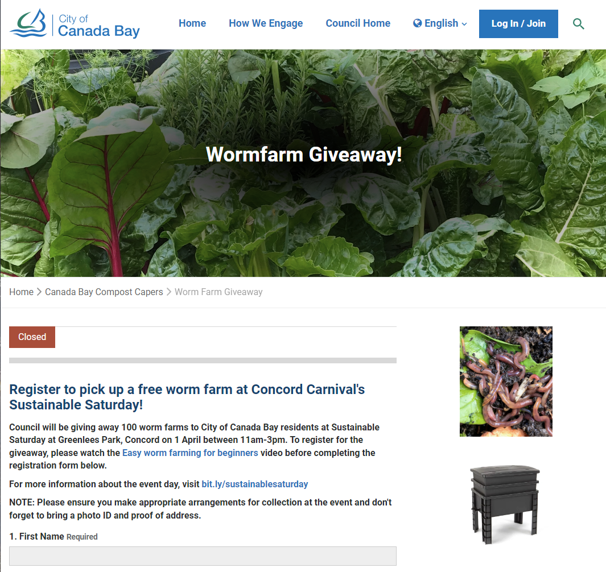
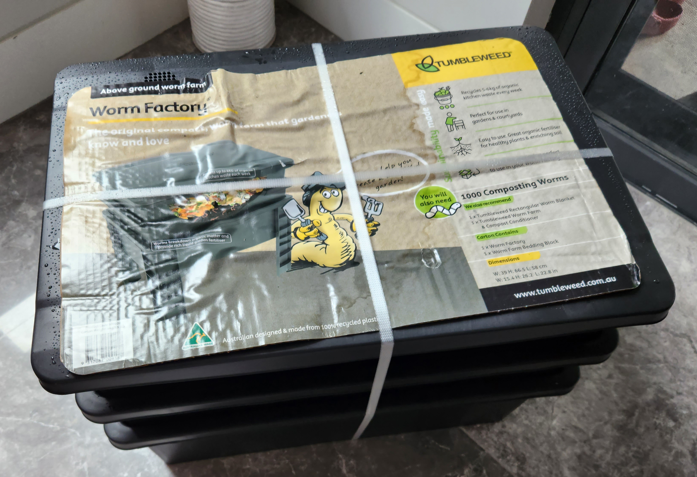
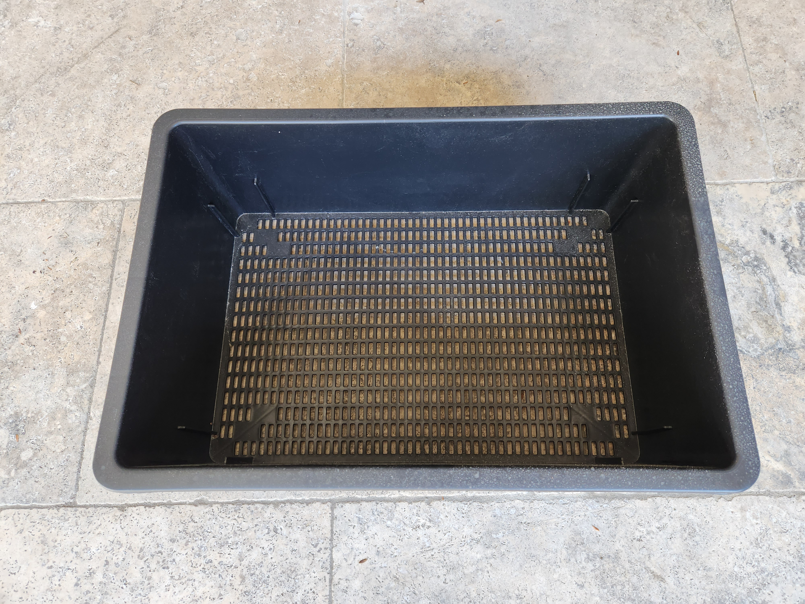
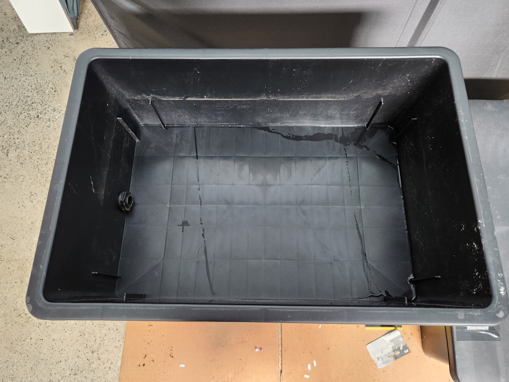
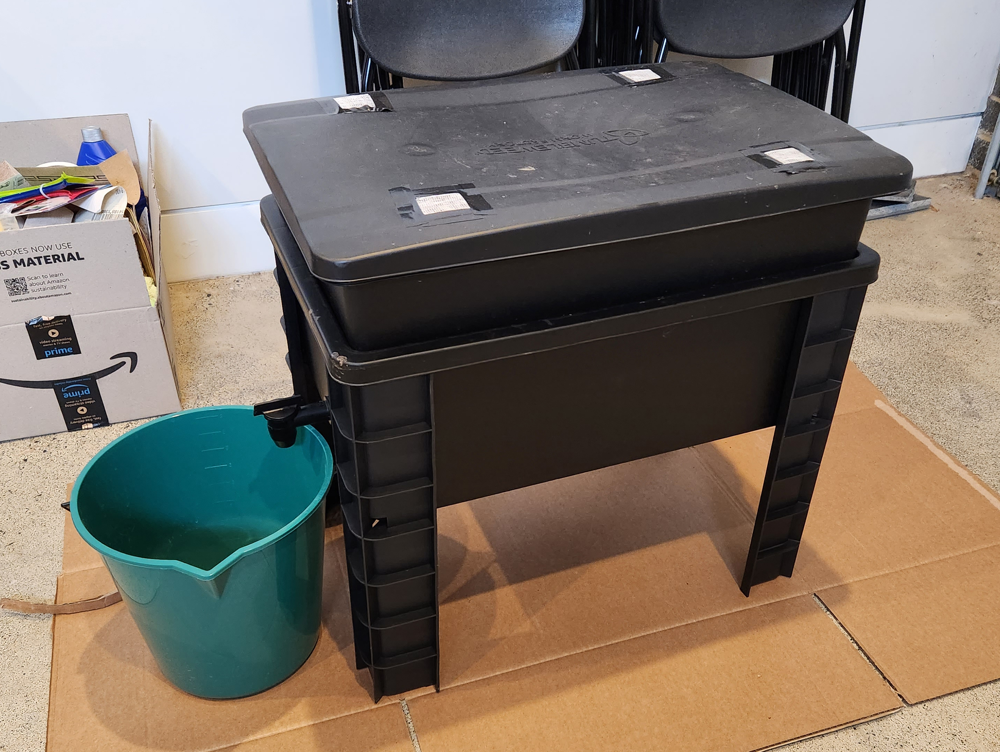
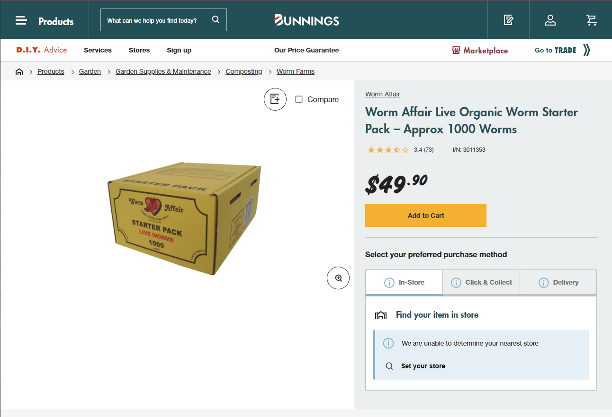
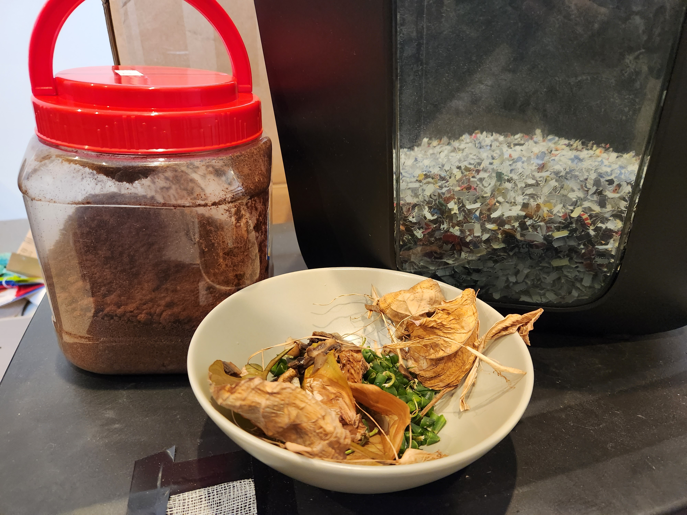

Sharing my worm farm journey over the past couple of weeks.

<!-- more -->

```toc
# This code block gets replaced with the TOC
```

## Worm Farming

A worm farm, or *vermiculture*, is the process of using worms to create compost from food scraps and garden waste. Worms can eat up to half their body weight each day and turn it into **worm castings (plant food)**.

<iframe src="https://www.youtube.com/embed/Ihw9Ha7dY20" allowfullscreen width="1280" height="720"></iframe>

To summarise, the main benefits are:

1. *Worm castings* to fertilise plants.
1. Reducing food waste and rubbish.

## Worm Bin

In April, my local council, The City of Canada Bay, gave away 100 worm bins as part of a sustainability initiative. I collected the worm bin at their Sustainable Saturday event and carried it all the way home in the rain.





The worm bin provided was the [Tumbleweed Worm Factory](https://tumbleweed.com.au/products/worm-factory%C2%AE) which retails for $89 AUD. It is a raised two-tray system with a spout. Inside it contained a [Tumbleweed Worm Farm Bedding Block](https://tumbleweed.com.au/collections/accessories-and-spare-parts/products/worm-farm-bedding-block) made from 100% natural coconut fibre. Unfortunately, worms were **not included**.



The 'working tray' is where the worms live and food is added. As the colony grows, a second working tray is added. Having a second tray helps in harvesting castings by rotating them around when they get full.



<iframe src="https://www.youtube.com/embed/J66GQHUaIZA" allowfullscreen width="1280" height="720"></iframe>

The bottom tray collects excess water and moisture known as leachate. It is dangerous to use as fertiliser as it is anaerobic and contains nasty microbes, bacteria and pathogens.



The air holes on the lid were big enough to allow vinegar flies through. I covered them up using gauze and electrical tape. When it wears out, I'll ask my wife for some old pantyhose.


Worms work best between 18 and 24 degrees Celsius. During winter, I move the bin into the garage to maintain a warmer temperature.



## Bedding

The bedding provided with the worm bin is the [Tumbleweed Worm Farm Bedding Block](https://tumbleweed.com.au/collections/accessories-and-spare-parts/products/worm-farm-bedding-block) made from coconute fibres. Coconut fibres retain their moisture which is important for a worm farm. The bedding block expanded when placed in water and mixed over a few minutes, but I left it for a few hours to set.


The bedding was placed inside the worm bin tray with cardboard underneath.


## Worms

The recommended starting population of a worm farm is 1000 worms. A well-maintained farm doubles in population roughly every 2-3 months. They also self-regulate their population based on food availability, space and conditions.

The cheapest place I could find live worms was at Bunnings. A box of 1000 worms from either of the two available brands (Dr Worms and Worm Affair) was $49.90.



I preferred the Worm Affair brand as I could open it up and inspect if the worms were alive and well.


I emptied the box into the worm bin and then spread it out evenly. The worms burrowed as fast as they could to get out of the light. It is good practice to leave them for 48 hours to acclimatise to their new environment.


<video autoplay muted loop controls width="100%" height="auto">
  <source type="video/webm" src="worms/worms.webm">
  <p>Your browser does not support the video element.</p>
</video>

On top, I have a hessian/burlap blanket to keep their environment dark, moist and warm during colder seasons. I have tried alternatives like paper and cardboard but did not enjoy them. As the material is natural, worms also enjoy eating away at it (or they could just be stuck).


## Feeding

Each week I feed the worms a combination of nitrogen (greens) and carbons (browns). A good combination is required to prevent acidic (low pH levels) or anaerobic (too wet, no oxygen) conditions. The foods I'm commonly feeding are all items I would've previously thrown into the bin:

- Food scraps: everything except citrus, onions, chillis, dairy and meat.
- Coffee grounds and tea bags: crushed coffee pucks from my morning coffee.
- Shredded paper (microcut): sensitive documents, and now the main source of carbon.

A tip I've learnt is to freeze food scraps to stop them from decomposing and smelling. When it thaws, it breaks down the cell walls as water inside expands, making it decompose faster and easier for worms to eat.

Worms can consume anything that was previously 'alive', such as leaves, fingernail clippings, hair and vacuum dust. It's important to bury and cover all food (worms live underground).

*Example 1: Carrot tops, broccoli stems and strawberry tops*


*Example 2: Coffee grounds, shredded paper, dead leaves and green beans ends*




## Benefits

As previously mentioned, worms produce casting used to fertilise plants. Castings are collected from the worm bin and can be used directly as fertiliser or mixed with water to become worm tea.

This is a comparison done by Simple Grow, a company selling worm castings fertiliser:

<iframe src="https://www.youtube.com/embed/rB2aGqD7RpY" allowfullscreen width="1280" height="720"></iframe>

My farm is still too small and difficult to harvest castings. My goal is to first build the farm up to introduce the second tray which takes roughly half a year. Although I got the worm bin in April, I only started using it in August. I will update this post in the future when I do my first harvest.
