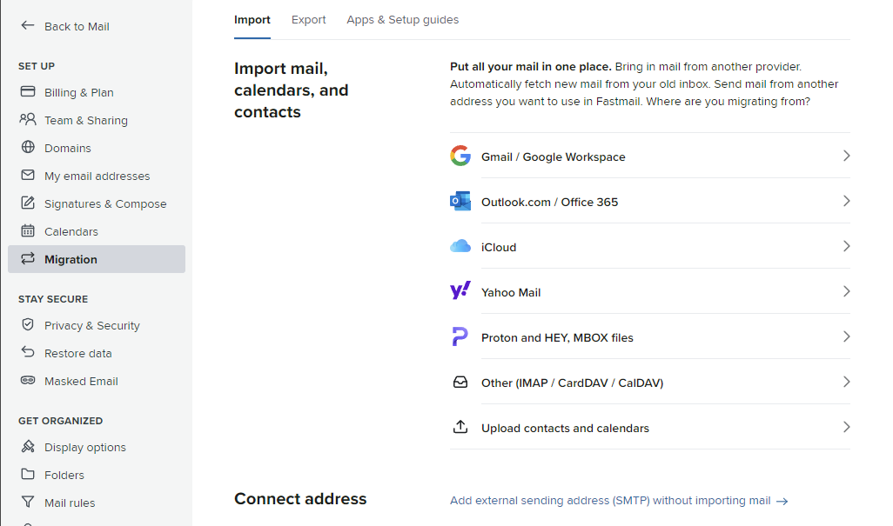
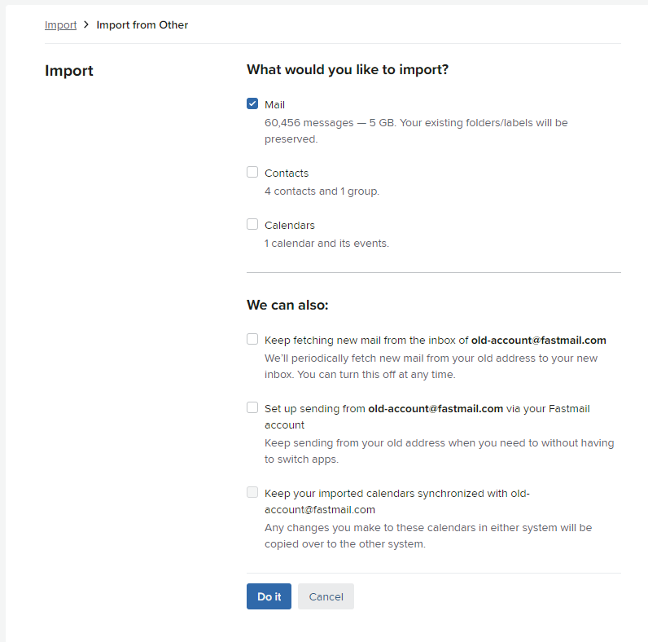
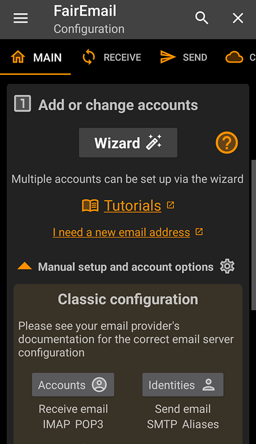

How to migrate between two Fastmail accounts without any downtime when using a custom domain.

```toc
# This code block gets replaced with the TOC
```

## Sign Up

Sign up for a new Fastmail account at [https://app.fastmail.com/signup/](https://app.fastmail.com/signup/). You can also sign up using the [1Password promotional discount for 25%](https://app.fastmail.com/signup/1password) off.


## Email Routing

To ensure no emails are dropped or lost during the migration, I use [Cloudflare's Email Routing](https://developers.cloudflare.com/email-routing/) feature to temporarily forward emails to the new Fastmail account. This can be done with any other provider that can hold or forward emails during the migration.

In Cloudflare, head over to *Email Routing* and the *Routes* tab. Add the new Fastmail account as the *Destination Address* and verify it.


Back in Cloudflare, enable the *Catch-all address* feature to forward all emails to the new Fastmail account.


Go to the *Settings* tab and click on *Enable Email Routing*.


It will prompt to delete conflicting records to allow adding in Cloudflare's DNS `MX` records. Delete all and then click *Add records and enable*.


Send yourself a test email to see if the catch-all address and forwarding to the new Fastmail account works.


## Migrate Emails, Contacts and Calendars

In the old account, create a *new app password*. This will be used to migrate emails, contacts and calendars into the new account.


In the new account, go to *Migrate*, then *Import*.



Select *Other (IMAP / CardDAV / CalDAV)* and enter the old account's details. Use the app password created earlier.


Select everything you want to import and then click *Do it*.



The import will complete once everything has transferred. Fastmail will also send an email notifying you. It took 15 minutes to migrate 60000 emails (~5 gigabytes).


## Migrate Settings

While the import is finishing, go through each setting and copy it from the old account to the new account. Important settings include:

- [ ] Signatures and compose options.
- [ ] Enable two-step verification.
- [ ] Loading remote images.
- [ ] Create new app passwords for email clients.
- [ ] Blocked senders and spam settings.
- [ ] Display options.
- [ ] Filters and rules (export then import).

We will migrate custom domains in the next step.

## Migrate custom domains

In the old Fastmail account, the custom domain has to be removed before it can be added into the new account. In most cases, the domain cannot be deleted until it is also removed from:

1. User management
1. Team addresses

Note that trial accounts cannot delete addresses and therefore cannot delete domains. Deleting the entire account is the only way to free the domain.


Once the domain is deleted from the old account, add it to the new account until it prompts to set up DNS records.


Back in Cloudflare's Email Routing, go to the *Settings* tab and click *Start Disabling*.


Choose to *Unlock and keep DNS records* then click *Unlock records and continue*.


Head over to the DNS page and start updating the records to Fastmail.

1. Fastmail has 2 `MX` records, but Cloudflare has 3 records.
1. Delete the lowest priority `MX` record (the highest number).
1. Update the remaining 2 `MX` records as fast as possible.
1. The `DKIM` `CNAME` records should be already correct.
1. Update the `SPF` `TXT` record.


Head back to Fastmail and click *Check now* to finish configuring the domain to send and receive mail.


Test the domain and any custom addresses again.


## Update Email clients

### Thunderbird

Under Account Settings, within Default Identity, update the Email Address field.


Click Edit SMTP server and update the User Name field.


Under Server Settings, Update the User Name field. Thunderbird will prompt for a Restart.


Enter the new app password when prompted.


Try sending an email, and you may also be prompted for the password again.


### FairEmail

Under Settings, open *Manual setup and account options* and select *Accounts*.



Scroll down and update the IMAP User name and Password then click Save at the bottom.


Go back to *Settings* and select *Identities* this time. Scroll down and update the SMTP User name and Password then click Save at the bottom.


