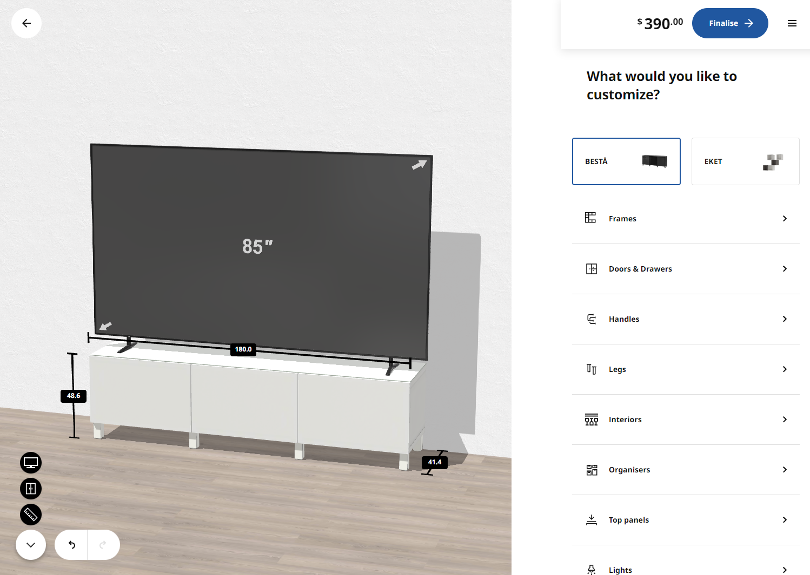
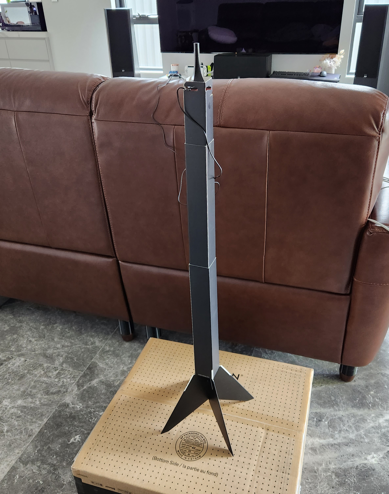

Sharing my living room setup which includes my television, speakers, gaming and karaoke.

```toc
# This code block gets replaced with the TOC
```

## Couch

Our couch is the Chicago 3-seater with a chaise and electric recliner from OzDesignFurniture. I have written about my couch in a [previous post](/designing-taller-sofa-feet).


## Entertainment Unit

I found the IKEA BESTÅ after [reading the recommendations online](https://www.ozbargain.com.au/node/547113). It relatively cheap and modular system with multiple presets already provided by IKEA.

IKEA has an [online BESTÅ planner](https://www.ikea.com/addon-app/storageone/besta/web/latest/au/en/) to mix and match all the different combinations. The designs can also be saved for later. My configuration code is `P2DZTD`.




Building the unit took about 2 hours in total and was easy to do with all the right tools.


I also purchased the [FIXA 5 Hole Saw (now known as TRIXIG)](https://www.ikea.com/au/en/p/trixig-5-piece-hole-saw-set-20563739/) to drill holes into the backboard for airflow.


I 3D printed this [hole cover by pauljs75](https://www.thingiverse.com/thing:2385308) and enlarged it to fit over the holes for a nicer look. My modified file is [available here](entertainment-unit/LouveredCover-F.3mf).


## TV

### Sony A90J 83"

The [Sony 83" A90J](https://www.sony.com.au/electronics/televisions/a90j-series) is an OLED running Google TV and support for [Dolby Vision](https://www.dolby.com/technologies/dolby-vision/) from 2021. At the time of purchase, it was [RTINGS.com's Best TV](https://www.rtings.com/tv/reviews/best/tvs-on-the-market) for Home Theater, which is now occupied by its successor the A95L. However, Sony has yet to release an 83' inch TV since the A90J.

The negatives of the TV however are, with workarounds:

- Older CPU which lags Google TV: I use an NVIDIA Shield Pro TV now.
- Only 2 x HDMI 2.1 ports, one used for eARC: I connect everything to the AVR instead.


The very first movie I watched on it was 1917. Didn't even take off the plastic.


The other TVs I considered were Samsung and LG. Samsung lacks Dolby Vision and instead uses HDR10+. This is odd considering their phones support Dolby Vision. LG, on the other hand, does support Dolby Vision but doesn't run Google TV, instead opting for WebOS.

### FUTIEYES TV Stand

The Sony A90J has three ways to mount its feet, only one that could fit within the width of the IKEA BESTÅ entertainment unit. I knew down the line I wanted a centre channel speaker speaker as well, so raising the TV higher would be necessary. Additionally, my wife did not want to wall mount the TV, so a stand was the only option.


It was difficult to find a TV stand that could support an 83" monitor. Most could only do up to 65". The first one I bought made by [Hemudu](https://www.amazon.com.au/gp/product/B08117X7DW) was a two-piece design that caused it to slightly bend with the weight of the TV. I returned this to Amazon.


The second one I bought made by [FITUEYES](https://www.amazon.com.au/FITUEYES-Universal-Tabletop-Adjustable-TT107003GB/dp/B01CORQRX0) was a better one-piece design. I've had it for over a year now and it's still straight.


### Govee T1 Backlight

The [Govee T1](https://us.govee.com/products/govee-dreamview-t1-tv-backlight) is a smart ambient backlight that uses a camera to colour-match the content on the TV. There is a [newer T2 model](https://us.govee.com/products/govee-envisual-tv-backlight-t2), but it is not available for 65-inch and above sizes in Australia yet.


To mount the camera on the thin TV, I used [this mount designed by JG97](https://www.thingiverse.com/thing:5138794).


The results from the Govee T1 are impressive and immersive I forget it's ever there. Mine is configured to 1% Saturation and just left of centre for the White Balance.


<video autoplay muted loop controls width="100%" height="auto">
  <source type="video/webm" src="backlight/video.webm">
  <p>Your browser does not support the video element.</p>
</video>

A downside of the Govee is that it does not turn off when the TV turns off, as it does not know when the TV is off. To work around this, I have a simple automation in Home Assistant to follow the state of the TV.

```yaml
alias: TV - Ambient LED Lights
description: ""
trigger:
  - platform: device
    type: turned_off
    device_id: abc123
    entity_id: remote.sony_bravia_tv
    domain: remote
    id: "off"
  - platform: device
    type: turned_on
    device_id: abc123
    entity_id: remote.sony_bravia_tv
    domain: remote
    id: "on"
condition: []
action:
  - if:
      - condition: trigger
        id: "off"
    then:
      - service: light.turn_off
        data: {}
        target:
          entity_id: light.dreamview_t1
  - if:
      - condition: trigger
        id: "on"
    then:
      - service: light.turn_on
        data: {}
        target:
          entity_id: light.dreamview_t1
mode: single
```

### Calibration

I dialed in my colour settings using [D-Nice's post on AVSForum](https://www.avsforum.com/posts/60533051/). To calibrate each, the TV's source must be playing SDR or HDR content first, then editing the `Custom Pro N` setting will apply those settings to that type of source and content from then on.

| Setting            | Content      | Picture Mode      |
|--------------------|--------------|-------------------|
| Enhanced Night SDR | SDR          | Custom Pro 1      |
| Enhanced Day SDR   | SDR          | Custom Pro 2      |
| Enhanced HDR       | HDR          | Custom Pro 2      |
| Dolby Dark         | Dolby Vision | Dolby Vision Dark |

### Automatic Game Picture Mode

There is a Picture Mode called `Game` which greatly reduces input lag and is noticeable when [streaming games from my PC](#nvidia-gamestream) or playing my [Nintendo Switch](/nintendo-switch-oled-modding/). Changing to `Game` is manual and forgetting to switch it back will mean all content from the TV will be in lower quality.

To automate switching between `Game` and `Custom Pro 2`, I created two Home Assistant automations that make API calls to the TV using the [RESTful Command integration](https://www.home-assistant.io/integrations/rest_command/):

```yaml
---
bravia_set_picture_mode:
  url: http://<TV>/sony/video
  verify_ssl: false
  method: POST
  headers:
    X-Auth-PSK: "0000" # configure in the TV's settings
  content_type: application/json
  payload: '{"method":"setPictureQualitySettings","params":[{"settings":[{"value":"{{ pictureMode }}","target":"pictureMode"}]}],"id":40,"version":"1.0"}'
```

In the automation, I watch for whenever [Moonlight](https://moonlight-stream.org/) is opened or closed:

```yaml
---
alias: TV - Game Mode Shield Apps
mode: single
trigger:
  - platform: state
    entity_id:
      - media_player.shield
    attribute: app_id
condition:
  - condition: state
    entity_id: media_player.shield
    state: "on"
action:
  - service: rest_command.bravia_set_picture_mode
    data_template:
      pictureMode: |
        
          game
        
          customForPro2
        
    alias: Change picture mode
```

## Audio

During the 2022 Black Friday sales, I picked up the [Denon X3800H AVR](https://www.denon.com/en-au/shop/avreceiver/avcx3800h), [SVS Ultra Towers](https://www.svsound.com.au/collections/speakers/products/ultra-tower) and [SVS Ultra Centre](https://www.svsound.com.au/collections/speakers/products/ultra-centre) for a 3.0.0 speaker setup.


### Denon X3800H AVR

The Denon AVC-X3800H is an 8K 9.4 channel AV Receiver (AVR). Its purpose is to receive video and/or audio from devices and output them to the TV and speakers. It is connected to the Sony A90J TV via [HDMI eARC](https://www.howtogeek.com/763334/what-is-earc/) which allows volume to be controlled using the TV's remote.

The reasons I chose the X3800H were:

- [11-channel processing](https://manuals.denon.com/AVCX3800H/EU/EN/DRDZSYrjomlmpo.php), with for 9 channels amplified internally.
- 6 x HDMI 2.1 (8K) ports compared to the previous generation X3700H's single 2.1 (8K) HDMI port. Future-proofing the device for a few more years.
- Support for [Dirac Live Room Correction](https://www.dirac.com/live/) which is better than [Audyssey MultEQ](https://audyssey.com/).
- Support for [Dolby Atmos](https://www.dolby.com/technologies/dolby-atmos/)
- Support for [Dolby Vision](https://www.dolby.com/technologies/dolby-vision/)


For room correction, I'm using the provided Audyssey microphone and stand. I haven't played around with the Dirac yet. I try and perform this late at night when it's as quiet as possible.



The AVR initially did not fit inside the [BESTÅ Entertainment Unit](#entertainment-unit). I had to purchase right-angle HDMI adapters, a right-angle power adapter, smaller antennas and a trimmed-down Ethernet cable to just squeeze it in.


I'm using the [UDP Broadcast Relay](https://forum.opnsense.org/index.php?topic=15721.0) to access the AVR across VLANs. The ports I have discovered are:

| Name                                                                                                | Broadcast Address | Port   |
|:----------------------------------------------------------------------------------------------------|:------------------|:-------|
| [Denon AVR Remote App](https://play.google.com/store/apps/details?id=com.dmholdings.DenonAVRRemote) |                   | `3813` |
| SSDP DLNA UPnP (Audyssey)                                                                           | `239.255.255.250` | `1900` |


And the additional firewall rules for [HEOS](https://play.google.com/store/apps/details?id=com.dnm.heos.phone):

| Name                 | Source          | Destination                  |
|:---------------------|:----------------|:-----------------------------|
| Access to Denon HEOS | Net:*           | AVR:80, AVR:10101, AVR:60006 |
| HEOS Response        | AVR:51000-53000 | Net:49200                    |
| HEOS Response 2      | AVR:56000-57000 | Net:49201                    |


### SVS Ultra Speakers

SVS is an American company from Ohio that is known more for its subwoofers and speakers. Australia doesn't get many high-end speaker brands, but [SVS is an exception and they're usually on sale](https://www.ozbargain.com.au/brand/svs). The [Ultra series](https://www.svsound.com/collections/ultra-series) is their top-of-the-line collection which includes a bookshelf, tower, centre and surround speakers.


Initially, I wanted a [5.2.4 overhead system](https://www.dolby.com/about/support/guide/speaker-setup-guides/5.1.4-overhead-speaker-setup-guide/) but the open floorplan design of our lounge room which flows into the kitchen and dining room has made it difficult to setup. I decided to start with a 3.0.0 setup and build upon it slowly.


Before purchasing, I used SVS' AR tool to see how it would look in the lounge room and to get my wife's approval. She preferred the finish of the black oak over the glossy black as it would leave fewer scratches and was slightly cheaper as well.


When setting up the [TV stand](#futieyes-tv-stand), I had the foresight to raise it high enough for the centre channel to squeeze in.


To wire them up to the AVR, I used [Amazon Basics 12-gauge speaker wire](https://www.amazon.com.au/dp/B0758CVS43) and [Monoprice banana plugs](https://www.amazon.com.au/gp/product/B071VWM1X5).


## NVIDIA Shield

The NVIDIA Shield TV Pro is a Google TV media player capable of 4K HDR. Even though it was released in 2019, it remains the best Google TV media player today.


I decided to pick up an NVIDIA Shield instead of using the Sony built-in Google TV as it supported more video and audio codecs. For example, when playing Plex content with TRUEHD 7.1 audio, it would transcode the video instead of playing directly.


Another reason is that Sony's built-in Google TV limited Android apps to 4K60 while HDMI ports can do 4K120. This made a big difference when playing PC games.

### Optimisation

To improve performance on the Shield, I follow these [steps by Florisse](https://florisse.nl/shield/) to downgrade the Shield to 8.2.3 and remove unneeded applications. The newer firmware has more ads, more background processes, more telemetry and video stuttering. Additionally, I also removed GeForce NOW for Shield TV by running:

```shell
adb shell pm uninstall -k --user 0 com.nvidia.tegrazone3
```


### Home

To replace the default Google launcher (unintuitive laggy mess with ad), I use [Leanback Launcher by tsynik](https://github.com/tsynik/LeanbackLauncher). It is the smoothest and easiest launcher I found with slower [FLauncher](https://gitlab.com/flauncher/flauncher) being my 2nd choice. To change the default launcher, I used [Launcher Manager from XDA](https://xdaforums.com/t/app-firetv-noroot-launcher-manager-change-launcher-without-root.4176349/) which has been flawless.


### Button Remapper

The Shield remote comes with a big Netflix button. [Karyudo9 sells laminated stickers](https://shield-labels.square.site/product/shield-oblong-netflix-button-labels/1) that perfectly cover this button from $4 CAD. I went with the new Plex logo.


To make the button open Plex, I used [Button Mapper by flar2](https://play.google.com/store/apps/details?id=flar2.homebutton) to map a single-tap to Plex, double-tap to [SmartTube](https://github.com/yuliskov/smarttube) and long-press to start [Karaoke](#karaoke).


## Gaming

I'm a big gamer and love playing AAA titles. In the living room, I have a Nintendo Switch and stream games from my PC directly to the TV using [NVIDIA Gamestream](https://www.nvidia.com/en-us/support/gamestream/).

### Nintendo Switch

I have posted about my Nintendo Switch OLED in [another post before](/nintendo-switch-oled-modding/).


### NVIDIA GameStream

NVIDIA Gamestream streams my computer's output to my TV using a high-speed, low-latency video encoder built into NVIDIA GeForce GTX/RTX GPUs. From my PC I used [GeForce Experience](https://www.nvidia.com/en-au/geforce/geforce-experience/) as the 'server' and [Moonlight](https://moonlight-stream.org/) as the 'client'.


Unfortunately in February 2023, [NVIDIA announced they were ending support for GameStream clients](https://nvidia.custhelp.com/app/answers/detail/a_id/5436) starting in February 2024. While this only affects their client, it is highly unlikely they would continue their investment into the server if no official client exists.

Around the same time, [Sunshine](https://github.com/LizardByte/Sunshine), an open-source implementation that also works with AMD and Intel GPUs started gaining traction. I have switched over to it completely and have felt no noticeable difference in gaming latency or quality.


Setting up and configuring Sunshine is finicky, and still in its early stages compared to GeForce Experience. Some tips I have to get Sunshine working properly are:

- Ensure audio drivers are updated and set to 48000 Hz.
- Use [QRes](https://sourceforge.net/projects/qres/) to change resolutions such as `QRes.exe /X 2560 /Y 1440 /R 120` for 1440P120 and `QRes.exe /X 3840 /Y 1600 /R 120` to revert to ultrawide.
- For my Galaxy ZFold 4, I used `QRes.exe /X 2176 /Y 1812 /R 120`
- Android apps on the TV are limited to 4K60 while the HDMI ports can do 4K120. I use the [NVIDIA Shield](#nvidia-shield) to workaround this.
- Have controllers connected before streaming starts. I am using PlayStation Dualsense controllers.

### Accessories

I currently use [PlayStation DualSense controllers](https://www.playstation.com/en-au/accessories/dualsense-wireless-controller/) connected via Bluetooth directly to the NVIDIA Shield. There was a noticeable latency difference between this and a Bluetooth USB Adapter. I am still able to get rumble features in some games, but it's not a deal breaker if it doesn't work either. I also have a Logitech G603 mouse and [Logitech G915 TKL Linear](https://www.logitechg.com/en-au/products/gaming-keyboards/g915-tkl-wireless.html) keyboard for games other types of games. The keyboard fits in a [Corsair K63 Lapboard](https://www.corsair.com/us/en/p/keyboards/ch-9510000-ww/k63-wireless-gaming-lapboard-for-the-k63-wireless-keyboard-ch-9510000-ww) with some convincing.


Previously when I was played directly from the TV's built-in Google TV, I used the [8BitDo Wireless USB Adapter](https://www.8bitdo.com/wireless-usb-adapter/) to connect my PlayStation DualSense controllers. The built-in Bluetooth was laggy. There have been no issues with the Bluetooth in the NVIDIA Shield.


The LAN port on the TV is also limited to 100 Mbp (Fast Ethernet). A lot of manufacturers cut costs here as most consumers would use Wi-Fi. Wi-Fi is fast, but the latency is higher which matters when playing games in real-time. Moonlight can use up to 150 Mbp/s when streaming. A workaround is to use an external USB to Gigabit Ethernet adapter. [HDTVTest on YouTube recommended the Cable Matters USB Ethernet adapter](https://www.youtube.com/watch?v=PIef8iRZhLE), but anything plug-and-play (no drivers) would probably work. Luckily the LAN port on the NVIDIA Shield is gigabit.


I sometimes also use [VirtualHere](https://www.virtualhere.com/), a tool that passes USB ports directly to the computer to enable features like rumble, DualSense features, VR headsets and anything else that plugs into a USB port. I read that it can solve lag issues people can have with certain devices.

## Karaoke

I put together a karaoke system that runs through YouTube on the TV and outputs directly through the AVR and speakers. It has 4 microphones and guests can add and remove songs on their phones without interrupting the current song.

### Setup

To support karaoke, I had to purchase wireless microphones, a mixer, an optical-to-analog converter and the cables required to connect them all. The idea came from [Team JustDuet on YouTube](https://www.youtube.com/watch?v=c96_3WcXlOQ) to use a mixer to combine the sound from the TV and the microphones together and send it through the AVR. There was nothing special about any of the components, they were all cheap parts I found on Amazon and eBay that ticked my boxes.


### Mixer

The mixer I found is unbranded other than the words MICROMIX MIX600. It is a stereo mixer with 6 TRS inputs and 1 TRS output. Each input/output has a volume control knob including a master volume knob as well. With the multiple signals and sources, I found a good balance with my microphones at max and the music around 30%. It is powered by a single USB-C cable but does not come with a power adapter. I power it with a USB 5V/2A phone charger.


The mixer's output port is connected to the CD port on the AVR. I like to imagine my voice sounds like [I ate CDs](https://www.urbandictionary.com/define.php?term=eating+cds) when singing karaoke.


### Optical to Analog Converter

To get the sound from the TV to the mixer, I used its Optical/TOSLINK/SPDIF port with an Optical to Analog converter. Most TVs have this port as an alternative to eARC, but I have mine connected to both.

Within the AVR, I have created a `Karaoke` input (renamed from CD) and set the mode to analog. This makes it so the TV uses eARC when the AVR's input is `TV` and Optical when the input is `Karaoke`. I don't think every TV will do this, but I was lucky it behaved this way.


Back to the converter, the one I got is branded PROZOR with 1 optical or coaxial input, 192Hz support, RCA and 3.5mm outputs. It came with an optical cable and USB to barrel power cable but no power adapter. I powered it with a 5V/1A USB adapter.


### Microphones

The [Debra AU-400 wireless microphone system](https://www.amazon.com.au/Debra-Audio-Wireless-Microphone-frequency/dp/B07YTMLGTS) comes with 4 handheld microphones and a receiver with individual volume controls and outputs for each channel. For $199 AUD, it was an absolute bargain compared to other 4-channel wireless microphone systems I found starting at double its price. The only downside I found is it might not be possible to replace individual microphones if they fail, as there is no way to manually pair them.


The receiver outputs on the rear with individual XLR channels or a single combined TRS jack. I used individual [50cm XLR to TRS cables from Swamp](https://www.swamp.net.au/mic-cable-XLR-female-to-1-4-1m) directly into the mixer.


The antennas are long but can be set at an angle to fit inside the entertainment unit.


### SmartTube

YouTube is used as the music source for karaoke, thanks to the millions of songs available by creators like [SingKing](https://www.youtube.com/user/singkingkaraoke), [Musisi Karaoke](https://www.youtube.com/@MusisiKaraoke/videos) and other creators.

SmartTube is installed on the built-in Google TV is used instead of the NVIDIA Shield because it is connected to the AVR over HDMI. The AVR cannot output two different inputs at the same time, even if one is video and the other is audio.

Similar to how casting YouTube works, [SmartTube supports Remote Control](https://github.com/yuliskov/SmartTube?tab=readme-ov-file#casting) using the [Link with a TV Code](https://support.google.com/youtube/answer/7640706) feature. The features are identical to casting with multiple users and with a playlist and remote control abilities.


### Usage and Automation

To start the Karaoke:

1. Open SmartTube on the built-in Google TV
1. Power on the microphones, mixer and optical-to-analog converter
1. Change the AVR source to Karaoke
1. Crank the volume up

To stop singing:

1. Turn down the volume
1. Power off all devices
1. Change the AVR source back to the NVIDIA Shield

To streamline both processes, I trigger a [Home Assistant](https://www.home-assistant.io/) automation that makes use of the Denon, Sony, and Google/Android TV integrations.


To control the power of the microphones, mixer and optical-to-analog converter, I bought the ARLEC Smart Powerboard which can be controlled using the [LocalTuya integration](https://github.com/rospogrigio/localtuya). The power switch controls all outlets, which is fine for this scenario.


The start automation is triggered through Button Mapper's HTTP POST request feature. Long-pressing the Plex button on the NVIDIA Shield remote triggers a webhook in Home Assistant to run the automation. The stop automation is triggered by turning off the TV.


## Cost

Before cashback.

|               Item               |   Date    |   Cost    |
|:--------------------------------:|:---------:|:---------:|
|              Couch               | 30/05/22  | $3598.00  |
|  IKEA BESTÅ Entertainment Unit   | 19/06/22  |  $472.50  |
|          Sony A90J 83"           | 09/07/22  | $6455.00  |
|        FITUEyes TV Stand         | 23/08/22  |  $178.68  |
|   Govee Dreamview T1 Backlight   | 25/11/22  |  $169.95  |
|                                  |           |           |
|    NVIDIA Shield TV Pro 2019     | 27/06/22  |  $248.00  |
|                                  |           |           |
|          Logitech G603           |           |           |
|       Corsair K63 Lapboard       | 30/12/22  |  $110.19  |
|     Logitech G915 TKL Linear     | 23/01/23  |  $175.00  |
|   8BitDo Bluetooth Adapter x 2   | 07/01/23  |  $56.00   |
|  Cable Matters Ethernet Adapter  | 12/07/22  |  $17.99   |
|                                  |           |           |
|           Denon X3800H           | 25/11/22  | $2339.10  |
|    Right Angle HDMI Adapters     | 28/07/23  |   $9.52   |
|  C14 Right Angle Power Adapter   | 29/07/23  |   $4.08   |
|      RP SMA Short Antennas       | 28/07/23  |   $2.06   |
|                                  |           |           |
|         SVS Ultra Towers         | 25/11/22  | $3735.27  |
|         SVS Ultra Centre         | 25/11/22  | $1173.53  |
|           Speaker Wire           | 25/11/22  |  $119.00  |
|       Speaker Banana Plugs       | 25/11/22  |  $24.29   |
|                                  |           |           |
|       Karaoke Microphones        | 10/10/23  |  $199.00  |
|          Karaoke Mixer           | 10/10/23  |  $30.05   |
| Karaoke TOSLINK to RCA Converter | 10/10/23  |  $18.44   |
|     Karaoke Smart Powerboard     | 24/10/23  |  $24.45   |
|    Karaoke XLR to TRS cables     | 10/10/23  |  $55.96   |
|                                  |           |           |
|                                  | **Total** | $19216.06 |
