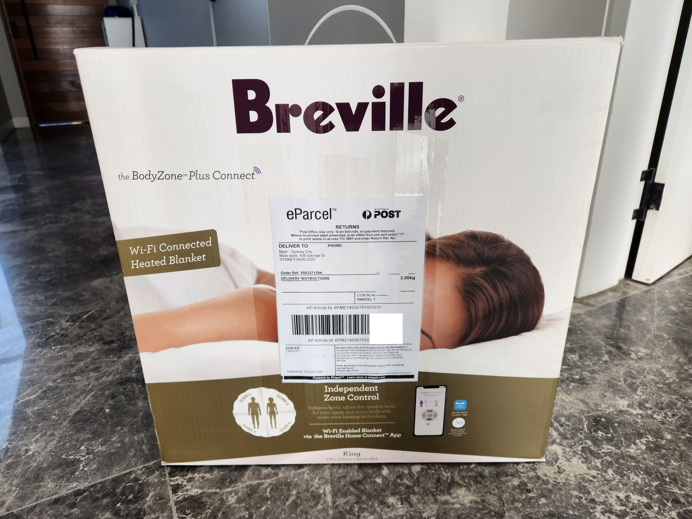
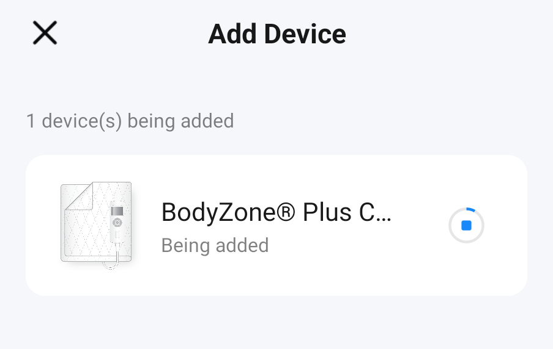
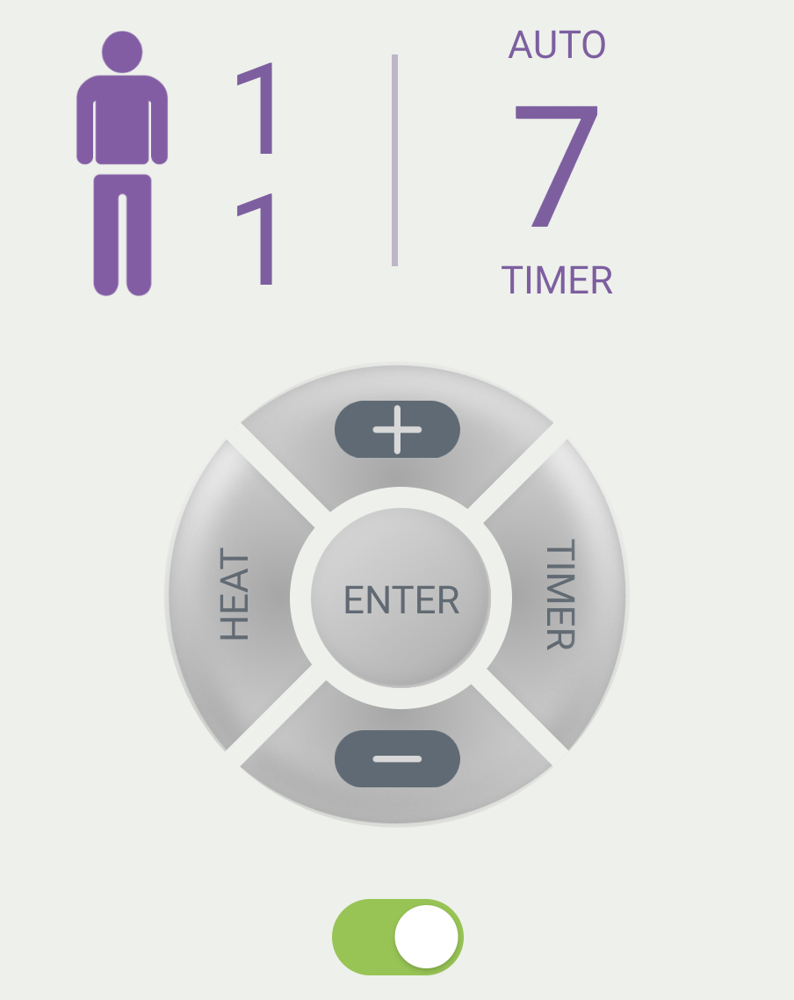
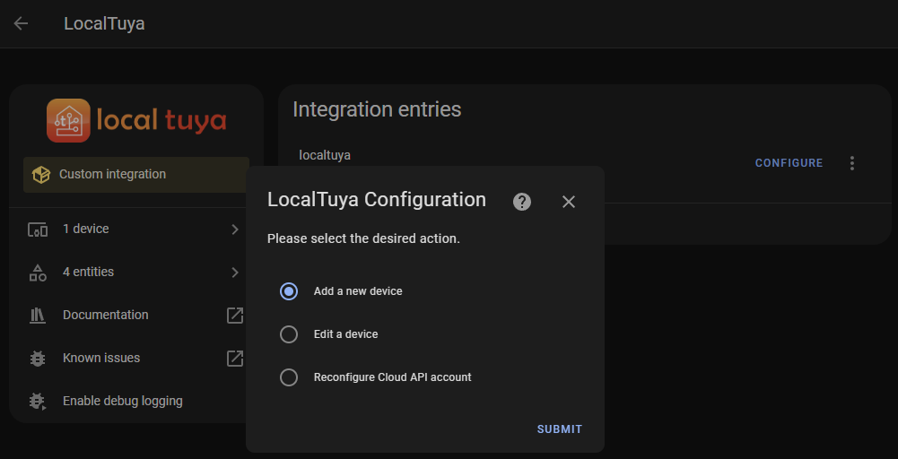
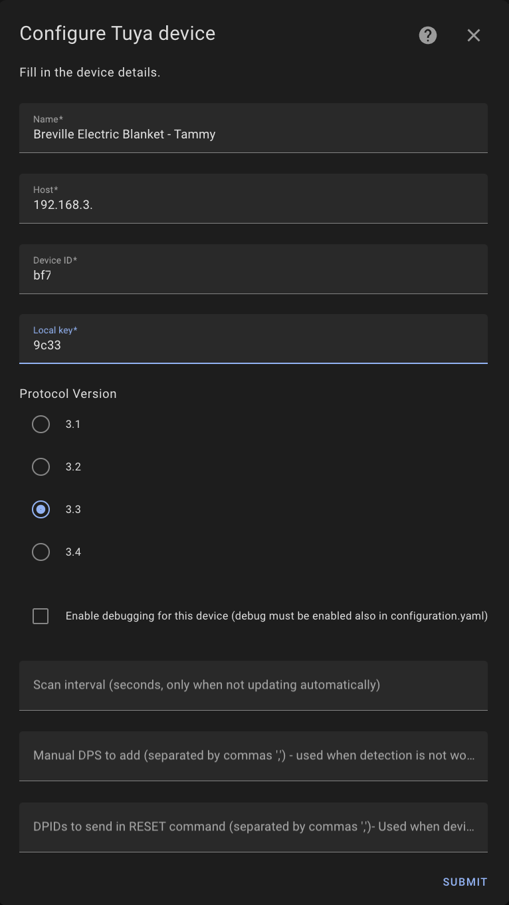
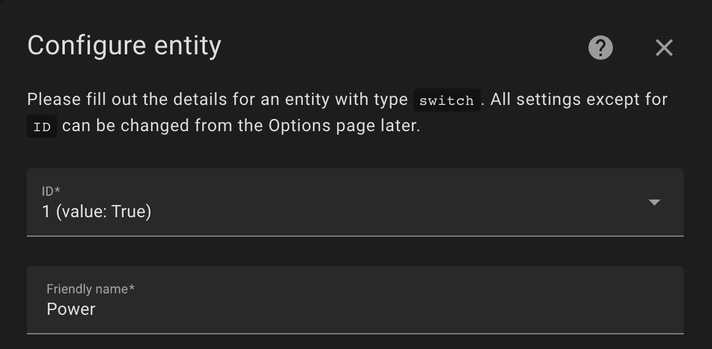
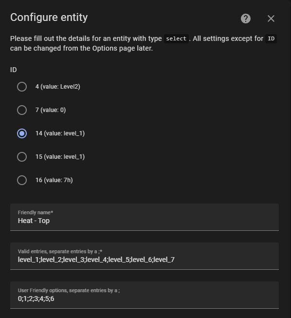
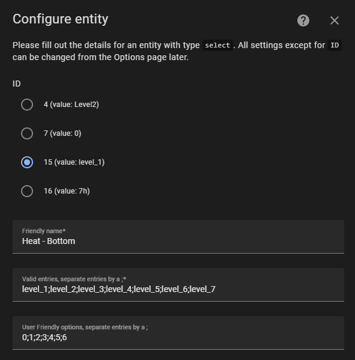
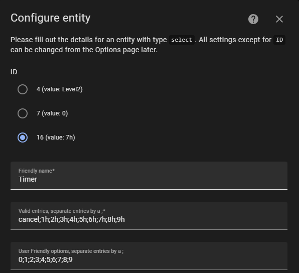
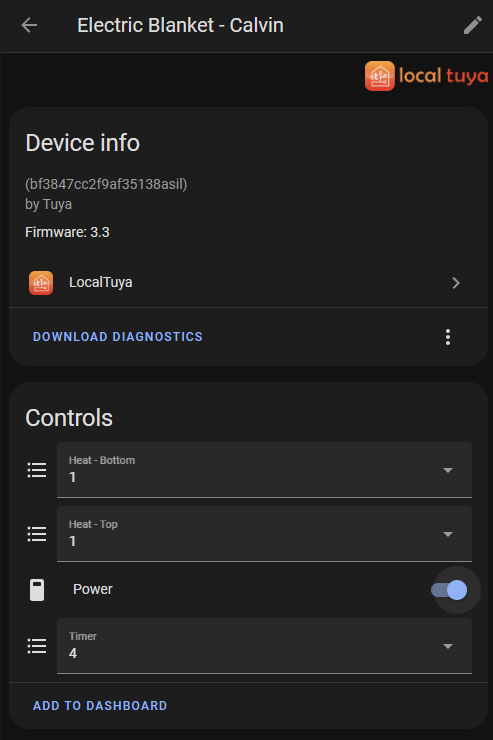

How to connect the Breville BodyZone Plus Connect electric blanket to Home Assistant.

<!-- more -->

```toc
# This code block gets replaced with the TOC
```

## Breville BodyZone Plus Connect

Breville's (or Sage in other parts of the world) line of [BodyZone Plus Connect electric blankets](https://www.breville.com/au/en/products/electric-blankets.html) can be controlled via a mobile app or voice assistant. They use the Tuya platform and like other manufacturers, also reskin the [Tuya Smart Life app](https://play.google.com/store/apps/details?id=com.tuya.smartlife).

In my experience, an electric blanket breaks on me at least once a year, regardless of the brand, especially when I need it the most in Winter. From my misfortunate, I've had to set up this model into Home Assistant at least twice now and decided to document the process.



## Local Tuya

[Local Tuya](https://github.com/rospogrigio/localtuya) is a Home Assistant integration for the local handling of Tuya-based devices. Updates are fast as it pushes updates to the device instead of polling them.

To enable local control of Tuya devices, a Tuya developer account on their IoT platform is required. There are a lot of instructions on how to do this (mostly outdated) but I found this video by [This Smart House on YouTube](https://www.youtube.com/@ThisSmartHouse) the easiest to follow.

<iframe src="https://www.youtube.com/embed/VCd0kYWLvMQ" allowfullscreen width="1280" height="720"></iframe>

The video also explains how to set up the LocalTuya integration into Home Assistant with your Cloud API account configuration.

## Configuration

The blanket first needs to be added to your Tuya account. Connect the blanket to Wi-Fi by pushing the switch to Auto then holding Enter until it starts flashing.

<video autoplay loop controls width="100%" height="auto">
  <source type="video/webm" src="configuration/wifi.webm">
  <p>Your browser does not support the video element.</p>
</video>





Start by adding a new device in the Local Tuya integration.



Let the integration pick your device or enter your configuration manually. I would recommend setting a static DHCP lease for all devices.



Next, it'll ask you to configure the entities for the device. Using [tinytuya](https://github.com/jasonacox/tinytuya), I pulled out the power, heat levels and timer entities.

```json
[
  {
    "name": "Breville Electric Blanket",
    "category": "dr",
    "product_name": "",
    "product_id": "euqfe1zc0ioos5yh",
    "biz_type": 18,
    "model": "LZB559",
    "sub": false,
    "mapping": {
      "1": {
        "code": "switch",
        "type": "Boolean",
        "values": {}
      },
      "14": {
        "code": "level_1",
        "type": "Enum",
        "values": {
          "range": [
            "level_1","level_2","level_3","level_4","level_5","level_6","level_7"
          ]
        }
      },
      "15": {
        "code": "level_2",
        "type": "Enum",
        "values": {
          "range": [
            "level_1","level_2","level_3","level_4","level_5","level_6","level_7"
          ]
        }
      },
      "16": {
        "code": "countdown_set_1",
        "type": "Enum",
        "values": {
          "range": ["cancel","1h","2h","3h","4h","5h","6h","7h","8h","9h"]
        }
      }
    }
  }
]
```

To summarise that output into Local Tuya:

| ID | Name          | Type     | Entries                                                   | Friendly              |
|----|---------------|----------|-----------------------------------------------------------|-----------------------|
| 1  | Power         | `switch` | N/A                                                       | N/A                   |
| 14 | Heat - Top    | `select` | `level_1;level_2;level_3;level_4;level_5;level_6;level_7` | `0;1;2;3;4;5;6`       |
| 15 | Heat - Bottom | `select` | `level_1;level_2;level_3;level_4;level_5;level_6;level_7` | `0;1;2;3;4;5;6`       |
| 16 | Timer         | `select` | `cancel;1h;2h;3h;4h;5h;6h;7h;8h;9h`                       | `0;1;2;3;4;5;6;7;8;9` |

There are also entities `4` and `7`, but I'm unsure what they represent at this time.









The electric blanket will now be available to control via Home Assistant!


