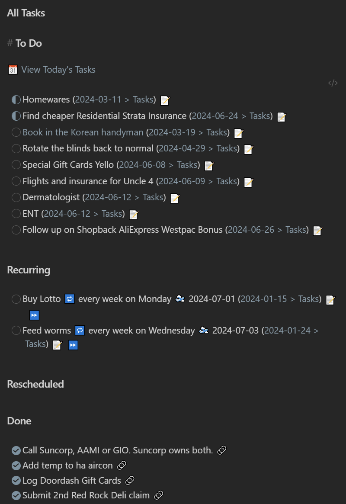
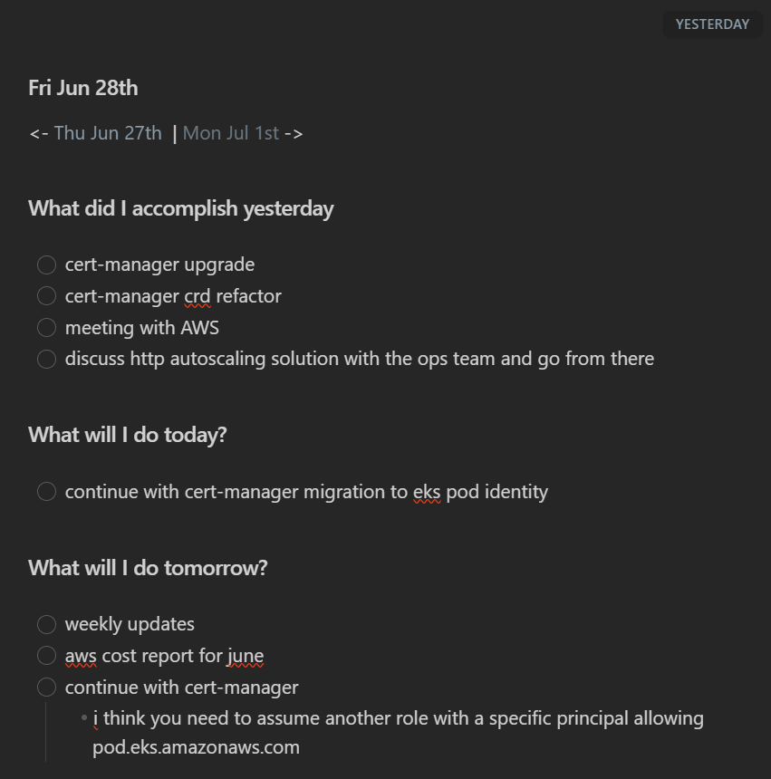

Sharing my note-taking migration from Joplin to Obsidian and how I use it everyday.

<!-- more -->

```toc
# This code block gets replaced with the TOC
```

## Joplin

I've been using [Joplin](https://joplinapp.org/) as my primary note-taking app for the past 5 years. I migrated from [Google Keep](https://www.google.com/keep/) back when I was [retooling for privacy](https://calvin.me/retooling-for-privacy/#google-keep).

Since that time, Joplin has released a [self-hosted server](https://joplinapp.org/help/about/changelog/server/), notebook icons, but not much else. It still suffered from many issues like its mobile app, on-demand syncing and plugin support.


## Obsidian

I've known for the past year or so that everyone was hot for [Obsidian](https://obsidian.md/), a new note-taking app that was developed during COVID-19. I tried it out, but its closed-source development and paid syncing solutions turned me off. I tried a community syncing plugin, but that didn't work reliably for me.

Since then, I have heard it constantly on the [Self-Hosted podcast](https://selfhosted.show/) and have been recommended it by work colleagues. Here's an example of their daily standup notes, dynamically generated.


Over the busy holiday season, I needed a way to manage and track my tasks, errands and chores. This led to trying out [Todoist](https://todoist.com/) and Obsidian again. From here I stumbled upon the [community tasks plugin](https://publish.obsidian.md/tasks/Introduction), figured out the [Self-hosted LiveSync plugin](https://github.com/vrtmrz/obsidian-livesync/) holding me back last time, and this snowballed into moving everything over from Joplin.

The aha moment came when I was watching Nicole van der Hoeven's video on Obsidian task management with Dataview, Templates and Daily Notes. The combination of all three plugins showed off Obsidian's power and ease of use. I recommend going through [Nicole's YouTube channel](https://www.youtube.com/@nicolevdh/videos) and picking out any Obsidian videos that may interest you.

<iframe src="https://www.youtube.com/embed/ccN5vJzXwvo" allowfullscreen width="1280" height="720"></iframe>

## Comparison

### Features

A comparison of the features that matter to me beyond editing notes:

| Feature                           | Joplin                                        | Obsidian                           |
|-----------------------------------|-----------------------------------------------|------------------------------------|
| Open-source                       | Yes                                           | No                                 |
| Mobile App                        | Yes                                           | Yes                                |
| Notes are stored offline          | Yes                                           | Yes                                |
| Notes can be accessed without app | Possible                                      | Yes                                |
| Encryption at rest                | Yes                                           | Possible                           |
| Encryption in transit             | Yes                                           | Possible                           |
| Sync across devices/platforms     | Yes                                           | Possible                           |
| File attachments                  | Yes                                           | Yes                                |
| Plugins                           | [Yes](https://joplinapp.org/plugins/#tab-all) | [Yes](https://obsidian.md/plugins) |

Joplin has a clear lead here, but then when I compare the quality of the features, Obsidian is ahead.

| Feature                 | Winner                                                                                |
|-------------------------|---------------------------------------------------------------------------------------|
| Desktop App             | Obsidian                                                                              |
| Mobile App              | Obsidian                                                                              |
| Quality of plugins      | Obsidian                                                                              |
| Syncing between devices | Obsidian (with plugins)                                                               |
| Sharing notes to others | Same (with plugins)                                                                   |
| Templating              | Neither, but [Obsidian's plugin](https://github.com/SilentVoid13/Templater) is better |
| Flexibility with notes  | Joplin                                                                                |

### Joplin's Flexibility

Looking back at my time with Joplin, the only feature I miss is its flexibility with notes:

- Each entry can either be a note or a to-do item.
- Notes and to-do entries can live together in the same notebook
- Notes can have the same name in the same folder
  - This is because Joplin names each file with a hash
- Note titles can have reserved characters like `/`


## Obsidian Plugins

Using plugins is a must-have for Obsidian as they add a lot of value and make the entire experience better. In alphabetical order, these are the plugins I currently use.

### BRAT

[BRAT](https://obsidian.md/plugins?id=obsidian42-brat) makes it easy to install beta versions of other plugins. Some of the very popular plugins like [Calendar](https://obsidian.md/plugins?id=calendar) or [Periodic Notes](https://obsidian.md/plugins?id=periodic-notes) haven't been updated in a while, but they have prerelease versions with new features that I wanted to use.

### Commander

[Commander](https://obsidian.md/plugins?id=cmdr) allows customising the user interface to add commands to different parts of the user interface. I use it to add a button to run Periodic Note's switch active calendar set command to my sidebar.


### Custom File Explorer sorting

[Custom File Explorer sorting](https://obsidian.md/plugins?id=custom-sort) as the name implies allows custom sorting in each folder.

By default, Obsidian only allows sorting globally by a few methods. I prefer `File name (A to Z)` by default, as it grows muscle memory of folders.


However, I name my stand-up notes using the day of the week, causing them to be out of order when drilling down.


Custom File Explorer sorting solves this by configuring the file sorting using a `sortspec` configuration file. The following code will now sort only the `Stand Up` folder and its files based on the time of creation:

```md
---
sorting-spec: |
  target-folder: Stand Up/*
  order-asc: advanced created
---
```


### Dataview

[Dataview](https://obsidian.md/plugins?id=dataview) allows querying the metadata of notes to list, filter, sort or group their data. The results returned can be dynamic and always up to date. It provides a fast way to search, display and operate on indexed data.

One way I use Dataview is to display and track my gift card balances. Take this gift card for example, within the frontmatter, I set the store name and the amount.


Then on another note, I create a dataview query to display them all in one table.

````js
```dataview
TABLE amount as Amount
FROM "Money/Gift Cards"
SORT file.name
```
````


### Editing Toolbar

[Editing Toolbar](https://obsidian.md/plugins?id=editing-toolbar) adds a row at the top of each note to format the text within the document.

### Front Matter Title

[Front Matter Title](https://obsidian.md/plugins?id=obsidian-front-matter-title-plugin) allows customising a note's title in various places like the file explorer, search results and tab name based on its metadata.

From my previous gift card example with the [Dataview plugin](#dataview), I could change the note's title to show both the store name and amount by using `{{store}} ${{amount}}`.


### Iconize

[Iconize](https://obsidian.md/plugins?id=obsidian-icon-folder) allows adding icons to notes and folders. It is a native feature in Joplin that I loved, but not Obsidian.


### Periodic Notes

[Periodic Notes](https://obsidian.md/plugins?id=periodic-notes)  generates a daily, weekly or monthly note with one button or command. I use this alongside [Templater](#templater) to generate my [daily tasks and stand-up notes](#my-templater-templates).

I'm currently using the beta which supports multiple types of notes through calendar sets. I have my stand-up notes formatted to `YYYY/[W]W/ddd MMM Do` and my daily notes to `YYYY/MM - MMMM/YYYY-MM-DD`.


### Self-hosted LiveSync

[Self-hosted LiveSync](https://obsidian.md/plugins?id=obsidian-livesync) syncs notes, plugins and settings between devices. It uses CouchDB as the intermediary server. It also supports end-to-end encryption and path obfuscation.

You can have one primary device and add others are secondary devices using a password-protected setup URI. Each device can have its own sync settings and it comes with configuration presets. The customization sync for settings is still in beta and requires customising new plugins each time.

Every change is synced between devices which can slow it down. For example, if I create 500 files, and then delete them of all them, when another device syncs those changes, it will repeat the creation of the 500 files step first before deleting them right after. Joplin was much faster when syncing changes. After it is done syncing, I'm usually left with half a dozen popups asking me to reload Obsidian.


Another issue I run into often is sync conflicts. Often when I'm adding new folders or changing icons, it somehow always ends up in a conflict. Luckily the visual conflict resolver makes it easy to decide which version is the correct one to keep. I recommend adding `,\/workspace-mobile.json$` to the list of folders and files to ignore ([and made a PR for it too](https://github.com/vrtmrz/obsidian-livesync/pull/367)) to stop it always appearing as a conflict.


### Tasks

[Tasks](https://obsidian.md/plugins?id=obsidian-tasks-plugin) management adds features to checklists (`- []`) by supporting due dates, recurring tasks, filtering/querying tasks and displaying different statuses.

I was sold on this plugin when I saw the incomplete/in-progress status support (`- [/]`) which I discovered on the [CGP Grey Sidekick Notepad](https://cottonbureau.com/p/XT9MRF/journal/sidekick-notepad). I'm currently using the [Minimal theme](https://minimal.guide/home) to [style my task statuses](https://publish.obsidian.md/tasks/Reference/Status+Collections/Minimal+Theme).


To track and manage my tasks, I use [Periodic Notes](#periodic-notes) and [Templater](#templater) to create a new task list each day. Then, on another note, I aggregate them together using the plugin's query support:


<details>
  <summary>Click to see code</summary>

````javascript
# To Do
```tasks
((not done) AND (scheduled before tomorrow)) OR ((not done) AND (no scheduled date))
path includes To Do

hide task count
```
# Rescheduled
```tasks
not done
scheduled AFTER today
path includes To Do
hide edit button
hide task count
```
# Done
```tasks
done
sort by filename reverse
path includes To Do
hide edit button
short mode
limit 10
```
````

</details>

### Templater

[Templater](https://obsidian.md/plugins?id=templater-obsidian) creates templates with variables and function results from JavaScript.

I've shared [two of my templates below](#my-templater-templates) that I use to dynamically generate my daily tasks and stand-up notes. There is also a section on [GitHub for others to showcase their templates](https://github.com/SilentVoid13/Templater/discussions/categories/templates-showcase).

## My Templater Templates

### Daily Tasks

This template pulls in tasks rescheduled and due today. It also has navigation links to move between days at the top with a link to 'All Tasks'.



<details>
  <summary>Click to see code</summary>

````javascript
# To Do

`="[[ To Do/" + dateformat(date(today), "yyyy/MM - MMMM/yyyy-MM-dd") + "|📆 View Today's Tasks]]"`
```tasks
((not done) AND (scheduled before tomorrow)) OR ((not done) AND (no scheduled date))
is not recurring
path includes To Do

hide task count
```
# Recurring
```tasks
is recurring
not done
hide task count
```
# Rescheduled
```tasks
not done
scheduled AFTER today
path includes To Do
hide edit button
hide task count
```
# Done
```tasks
done
sort by filename reverse
path includes To Do
hide edit button
short mode
limit 10
```
````

</details>

### Stand Up

This template pulls in everything from the previous stand-up notes sections to produce the `What did I accomplish yesterday` and `What will I do today?`.



<details>
  <summary>Click to see code</summary>

````javascript
<%-*
var prevNote;
var noteFolder = "[Stand Up]/YYYY/[W]W/";
var noteTitle = "ddd MMM Do";
var absolutePathFormat = noteFolder + noteTitle;

for (let i = -1; i > -100; i--) {
  prevNote = tp.date.now(absolutePathFormat, i, tp.file.title, noteTitle);
  if (await tp.file.exists(prevNote + ".md")) {
    var prevBreadcrumb = tp.date.now(noteTitle, 0, prevNote, absolutePathFormat);
    for (let j = 1; j < 7; j++) {
      let testDate = tp.date.now("ddd", j, tp.file.title, noteTitle);
      if (testDate != "Sat" && testDate != "Sun") {
        var nextNote = tp.date.now(absolutePathFormat, j, tp.file.title, noteTitle);
        var nextBreadcrumb = tp.date.now(noteTitle, 0, nextNote, absolutePathFormat);
        break;
      }
    }
    break;
  }
}
-%>
<- [[<% prevNote + "|" + prevBreadcrumb %> ]] | [[<% nextNote + "|" + nextBreadcrumb %>]] ->

# What did I accomplish yesterday

<%-*
let yesterday = await tp.file.include("[[" + prevNote + "#^What will I do today?]]");
tR += yesterday.substring(yesterday.indexOf("\n")+1).toString();
-%>
# What will I do today?

<%-*
let today = await tp.file.include("[[" + prevNote + "#^What will I do tomorrow?]]");
tR += today.substring(today.indexOf("\n")+1).toString();
-%>

# What will I do tomorrow?

- [ ]

````

</details>
