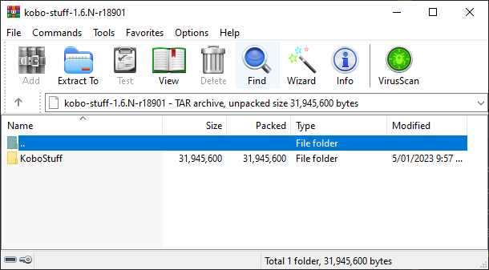

Breathing life back into my [Kobo Clara HD eBook Reader](https://au.kobobooks.com/products/kobo-clara-hd) from 2018.

<!-- more -->

```toc
# This code block gets replaced with the TOC
```

The Kobo Clara HD is a 6" eBook reader from 2018. I bought it to study and read eBooks on the train to and from work before COVID-19. Since then, it has been collecting dust with my company allowing 100% work from home. I have recently had the urge to read eBooks again and thought to document the process I went through.


## Update Firmware

Update to the latest version. At the time of writing it is `4.38.21908`. I followed the [official guide from Kobo](https://help.kobo.com/hc/en-us/articles/360017478234-Update-your-Kobo-eReader). It is also possible to [download it directly from Kobo's servers](https://pgaskin.net/KoboStuff/kobofirmware.html) and install it manually by extracting it into the `.kobo` folder on the device.


## Factory Reset

Following the firmware update, I started fresh by performing a [factory reset](https://help.kobo.com/hc/en-us/articles/360017605114-Reset-your-Kobo-eReader) on the device. This is under Settings > Device information > Factory reset your eReader.


## Bypass Login

Kobo requires an account on initialisation, but there is a way to work around it:

1. Select your language.

    

1. Press `Don't have a Wi-Fi network?` and connect the device to a computer

    

1. Plug the device into a computer.

    

1. In `KOBOeReader/.kobo/Kobo/Kobo eReader.conf`, under `[ApplicationPreferences]`, add: `SideloadedMode=true`.

    ```ini
    [ApplicationPreferences]
    CurrentLocale=en
    EarliestChangeLog=4.38.21908
    ...
    SideloadedMode=true
    ```

1. Delete `KOBOeReader/.kobo/KoboReader.sqlite`.

    

1. Eject and unplug from the computer.

1. Restart the device and it will land on the home screen.

    

## NickelMenu

[NickelMenu](https://pgaskin.net/NickelMenu/) is a tool by pgaskin to inject menu items into Nickel on the home screen, reader, browser or library. Menu items can quickly launch apps, control system settings or run commands/scripts conveniently without delving into the settings and other menus.

To install NickelMenu:

1. [Download KoboRoot.tgz from GitHub](https://github.com/pgaskin/NickelMenu/releases/latest)
1. Place it at `KOBOeReader/.kobo/KoboRoot.tgz`
1. Eject and unplug from the computer.
1. An 'Updating' page will appear while it is being installed.
1. NickelMenu will appear in the bottom right menu.


Configure NickelMenu:

1. Create `KOBOeReader/.adds/nm/config`
1. Following [the instructions](https://github.com/pgaskin/NickelMenu/blob/master/res/doc) in `/.adds/nm/doc` to create a config file. Here's mine:

```
# ---

menu_item  :main     :Calibre        :nickel_browser  :modal:http://calibre:8081/mobile
menu_item  :main     :KOReader       :cmd_spawn       :quiet:exec /mnt/onboard/.adds/koreader/koreader.sh
menu_item  :main     :Screenshots    :nickel_setting  :toggle :screenshots
menu_item  :main     :Keep Wi-Fi On  :nickel_setting  :toggle :force_wifi
menu_item  :main     :IP Address     :cmd_output      :500:/sbin/ifconfig | /usr/bin/awk '/inet addr/{print substr($2,6)}'
menu_item  :main     :Dark Mode      :nickel_setting  :toggle :dark_mode
menu_item  :main     :Reload         :nickel_misc     :rescan_books_full
menu_item  :main     :Reboot         :power           :reboot
menu_item  :main     :Shutdown       :power           :shutdown

# ---

menu_item  :reader   :Dark Mode      :nickel_setting  :toggle :dark_mode

# ---

menu_item  :library  :Dark Mode      :nickel_setting  :toggle :dark_mode
menu_item  :library  :Import books   :nickel_misc     :rescan_books_full

# ---

menu_item  :browser  :Quit           :nickel_misc     :home

# ---
```


## Install KOReader

[KOReader](https://github.com/koreader/koreader) is an alternative reading application designed for e-ink readers. I prefer its additional features and speed over Plato and Nickel (Kobo default OS and reader).

Following the [installation instructions](https://github.com/koreader/koreader/wiki/Installation-on-Kobo-devices#alternative-manual-installation-method-based-on-nickelmenu):

1. Add the following to `KOBOeReader/.kobo/Kobo/Kobo eReader.conf`:
    ```ini
    [FeatureSettings]
    ExcludeSyncFolders=(\\.(?!kobo|adobe).+|([^.][^/]*/)+\\..+)
    ```
1. [Download](https://github.com/koreader/koreader/releases) and extract KOReader to `KOBOeReader/.adds`.
1. Eject and unplug
1. Start KOReader from NickelMenu


## Autostarting KOReader

[It's no longer possible/recommended](https://github.com/koreader/koreader/issues/9781) after [KB Start Menu (KSM) stopped development](https://www.mobileread.com/forums/showthread.php?t=293804).

## Enable Telnet/SSH

[Kobo Stuff](https://www.mobileread.com/forums/showthread.php?t=254214) by NiLuJe (creator of kfmon) is a set of various tools which includes a telnet/ssh server.

1. Download the `.tar` file from the [MobileRead forum post](https://www.mobileread.com/forums/showthread.php?t=254214).
1. Inside of it is another archive without a file extension. Open this file as an archive.

    

1. Place the `KoboRoot.tgz` at `KOBOeReader/.kobo/KoboRoot.tgz`
1. Eject and unplug from the computer.
1. An 'Updating' page will appear while it is being installed.
1. Get the IP Address. I used the NickelMenu menu item.

    

1. Perform an SSH using the `root` user and no password to test it works.

    

1. SCP is also available and files can be found under `/mnt/onboard/`.

    

## Kobopatch

[Kobopatches](https://pgaskin.net/kobopatch-patches/) is a collection of customisations for the default Kobo OS and reading app. There are a few examples in the interactive demos to see what they do. Here's a small example of reducing the header and footer height:


[KoboPatchFan](https://github.com/folkemat/KoboPatchFan) is a helpful GUI for Kobopatches to easily select patches and generate the patch file.

1. Select your device, firmware version and download the required files

    

1. Select your patches from each menu. A [backup file can also be generated](kobopatch/kobopatch.yaml), so they can be regenerated for future firmware updates. The patches I selected are:

    - No. 4: Increase home screen cover size (in nickel.yaml)
    - No. 5: Dictionary pop-up - increase available text area (in nickel.yaml)
    - No. 6: Increase Book Details synopsis area (in nickel.yaml)
    - No. 7: Increase library cover size (in nickel.yaml)
    - No. 9: Reduce new header/footer height (in nickel.yaml)
    - No. 13: Series list increase cover thumbnails (in nickel.yaml)
    - No. 14: Increase headlines font (in nickel.yaml)
    - No. 20: Increase size of kepub chapter progress chart (in nickel.yaml)
    - No. 52: Increase page navigation history (in libnickel.so.1.0.0.yaml)
    - No. 66: Never show Kobo Plus, wishlist, and points SmartLinks (in libnickel.so.1.0.0.yaml)
    - No. 76: FeatureSettings - BookSpecificStats (in libnickel.so.1.0.0.yaml)
    - No. 81: DeveloperSettings - AutoUsbGadget (in libnickel.so.1.0.0.yaml)

1. Generate the patch file and copy the `KoboRoot.tgz` file to the `.kobo` folder on your device.

    

## Calibre

[Calibre]((https://calibre-ebook.com/)) is free software for managing and organizing e-books. It helps users convert between different formats, edit metadata, sync with e-book readers, and download news to create e-books. I use the [Docker image by LinuxServer](https://github.com/linuxserver/docker-calibre) which makes the Calibre desktop app available via KasmVNC in the browser.

### Transferring Books

1. Within Calibre's preferences, enable the sharing server.

    

1. Open the browser using NickelMenu. My [menu item](#nickelmenu) is set to open the browser and the URL `http://<calibre-server>:8081/mobile`

    

1. Click on the `epub`/`kfx`/`pdf` button to start downloading a book from Calibre. The Clara has a black-and-white screen, so it may not appear to be a link at first.

    

1. Reload through the NickelMenu and the downloaded books will appear.

    

    


### Converting eBooks

The [Kobo Clara HD only supports `EPUB`, `EPUB2`, `EPUB3`, `PDF`, `FlePub` and `MOBI` formats](https://help.kobo.com/hc/en-us/articles/360017763713-File-formats-your-Kobo-eReader-and-Kobo-Books-app-support). If the eBook you own is any other format, it first needs to be converted before the Kobo can view it.

1. Download [DeDRM_tools](https://github.com/noDRM/DeDRM_tools/releases) Calibre plugin and import your existing keyfiles.

    

1. Download the [KFX Input plugin](https://plugins.calibre-ebook.com/) install it into Calibre.

    

1. Locate your ebooks. For example, the Kindle app stores it at `C:/Users/Calvin/Documents/My Kindle Content`.

1. Using Calibre, convert between the two formats.

    

## Other Mods

- [Kute File Monitor (kfmon)](https://github.com/NiLuJe/kfmon) is a tool by NiLuJe to launch actions when opening specific books on the device. I prefer NickelMenu.
- [Plato](https://github.com/baskerville/plato): An alternative reader. Not enough customisations for my needs.
