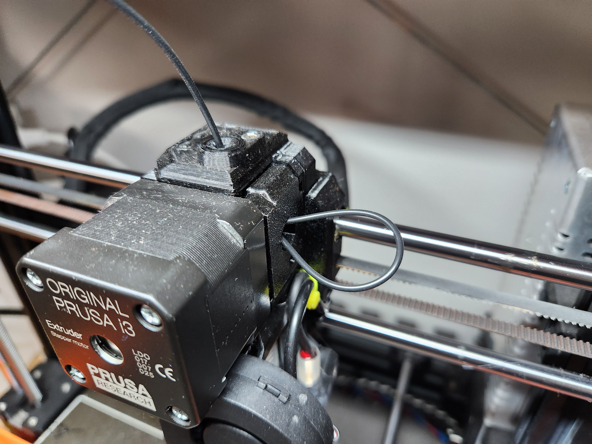

Documenting how I succeeded in 3D printing with TPE/TPU on my Prusa i3 MK3S.

<!-- more -->

```toc
# This code block gets replaced with the TOC
```

## Flexible Filaments

Flexible filaments are known as TPE (thermoplastic elastomers). They are created by mixing hard plastic and soft rubber to have the benefits of both properties. [An explanation of the common types of flexible filaments can be found on All3DP](https://all3dp.com/2/flexible-3d-printing-filament-which-should-you-chose). They are:

- Thermoplastic polyurethane (TPU)
- Soft PLA
- Thermoplastic polyamide (TPA)
- Polyether block amide (PEBA)
- Thermoplastic copolyester (TPC)
- Thermoplastic styrene block copolymer (TPS)

Flexible filaments are soft, elastic and stretchy compared to more commonly used materials such as PLA, PETG or ABS. This property is beneficial for use cases such as vibration dampening and impact resistance for cases, straps, protective feet and stress balls.

The softness of a material is its shore hardness, measured by its resistance to indentation when pressed. Most flexible filaments sit within the 80A to 95A range (30D to 50D), with the most popular and easiest to print being 95A. See [this chart by Smooth-On](https://www.smooth-on.com/page/durometer-shore-hardness-scale/) for examples:


For my prints, I will be using black [eSUN's eLastic TPE](https://www.esun3d.com/elastic-tpe-83a-product/) with a shore hardness of 83A.


## How to Print

### Drying

Drying flexible filaments is necessary as they are more susceptible to stringing and oozing. This can be heard during printing with a sizzling sound.

I use a [SUNLU S1 Filament Dryer with a hygrometer](/3d-printer-upgrades-galore/#sunlu-filament-dryer) to dry my filaments. I wait for the humidity to drop to around ~25% before I begin printing. This takes roughly 12 hours.


### Filament Profile

eSUN provides a [filament profile for Bambu Lab printers](https://www.esun3d.com/uploads/eLastic%EF%BC%88TPE-83A%EF%BC%89-Parameters-for-Bambu-Lab.rar) on their website. They also have recommended print settings, and I assume all other manufacturers will as well.


I use the NinjaTek NinjaFlex TPU filament profile on PrusaSlicer has the same temperatures, speed and retraction settings.


Enable the `Avoid crossing perimeters` setting under 'Print Settings > Layers and perimeters' as this will reduce stringing.


### Feeding

I normally load my filament through the side, but this has not worked well for flexible filaments as the extruder gears need more bite.


Instead, feed the filament directly to the hotend through the top of the printer or a bowden tube.


### Loading

Loading the flexible filament into the hotend requires a bit of song and dance. If done incorrectly, it will either:

- not extrude at all, from the gears not biting into the filament
- spill out the side of the idler, from too much bite into the filament



First, heat the hotend and bed. There is a `FLEX` option at the bottom of the list.


Disable the filament autoload sensor. We will be loading the filament manually.


Completely loosen the idler.


Load the filament into the hotend, a bit past the filament sensor and into the gears. Tighten the idler slightly so it is not loose.


Press the load filament button on the printer.


Start tightening the idler until the gears bite into the filament and extrude it. If you are too slow, answer `No` when it asks if the filament is extruding with the correct colour.

## Prints

Here are prints I've done using flexible filaments.

[Stove Top Grill Feet by cchaffee](https://www.printables.com/model/687231-stove-top-grill-feet): Prevents the stove top from scratching the glass underneath.


[Samsung S21 Slim TPU Case by addigreen](https://www.printables.com/model/494638-samsung-s21-slim-tpu-case): A temporary case for my wife's S21 before she traded it in for a new phone.


