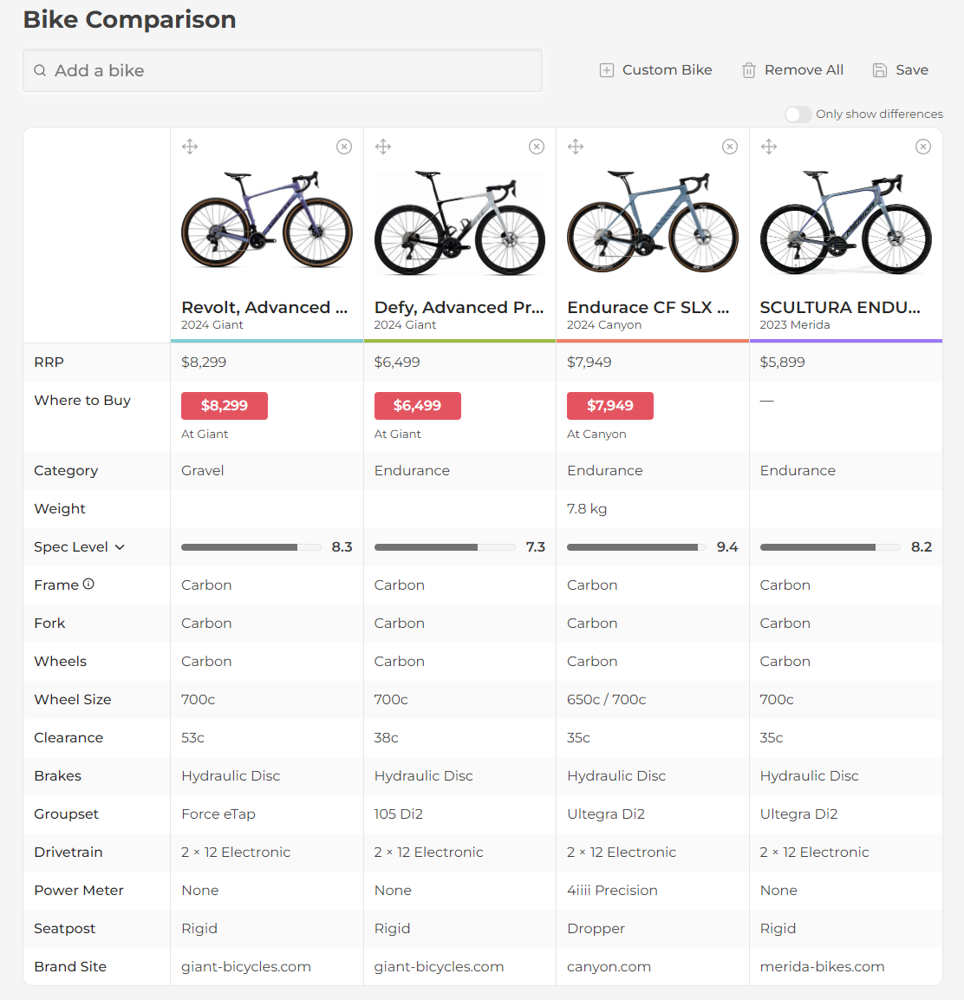
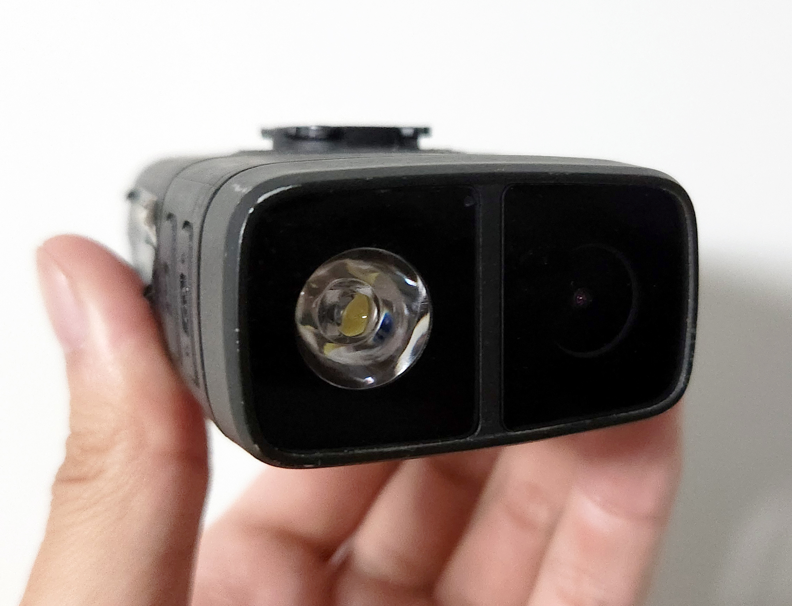

Last year, I bought a bike and began cycling near my home around Sydney Olympic Park.

<!-- more -->

```toc
# This code block gets replaced with the TOC
```

## Bicycles

Choosing a bike can be confusing as there are too many overlapping use cases (hybrid, all-road, gravel, endurance). About myself, my area and my style of riding:

- I want to feel and be comfortable at all times.
- I ride on bike paths, with twigs, people, rocks and leaves, etc. I would like to ride on the road, but it is dangerous and I don't wake up early enough for it.
- I may ride for commuting between places or short shopping trips.
- I'm never riding in the rain, and won't need any wet weather gear.
- I live in a relatively flat area with only one or two steep climbs which I can avoid or go around.
- I am not a fast rider or aim to be.

After researching, my priorities were:

1. Comfort

    - Endurance or gravel bike for a comfortable frame geometry.
    - Drop bars for more hand positions, reducing fatigue.
    - Carbon frame and wheels.
    - 30mm to 40mm tyres. Most road bikes are 25 or 28mm.
    - Tubeless tyres.

1. Safety:

    - Hydraulic disc brakes.
    - Can mount accessories such as lights, radars and cameras.

1. Technology

    - Electronic shifting ([Di2](https://bike.shimano.com/en-US/technologies/component/details/di2.html)/[eTap](https://www.sram.com/en/sram/road/collections/etap-axs)) for automatic synchro shifts.
    - Anything that improves compliance

1. Weight/Performance

    - 2x12 gearing for flexibility.
    - Internal cable routing

Aiding with my research, I highly recommend [99 Spokes](https://99spokes.com/en-AU/bikes) for finding bikes and [Bike Insights](https://bikeinsights.com/) for comparing geometries.




### Canyon Endurace

The first bike I bought was a [Canyon Endurace CF SLX 8 Di2 Aero](https://www.canyon.com/en-au/road-bikes/endurance-bikes/endurace/cf-slx/endurace-cf-slx-8-di2-aero/2740.html) for $7949. I bought it for its relaxed geometry, big tyres (30/32mm), aero cockpit (no cables!), shock-absorbing seatpost and Ultegra Di2 groupset.

The bike arrives in a box and requires additional construction. to fit the wheels, handlebars and seatpost.


I ended up [returning the bike for free within the 30-day window](https://www.canyon.com/en-au/customer-service/manage-return-order/returns.html) as the bottle cage screw holes on the downtube were out of alignment.


Other aspects I did not enjoy were:

- The geometry was strangely uncomfortable. I always felt too high and preferred riding in the drops.
- The saddle was uncomfortable. I couldn't bear sitting on it for more than an hour.
- I felt a lot of bumps while riding. The 30/32mm tyres were not tubeless either.

### Giant Revolt

The current bike is the [2024 Giant Revolt Advanced Pro 0](https://www.giant-bicycles.com/au/revolt-advanced-pro-0-2024) for $7499.


Compared to the Canyon Endurace:

- It comes with 40mm tubeless tyres which has been a comfort improvement.
- It's marketed as a gravel bike compared to an Endurance bike.
- It weighs 2 kg more at 9.88 kg, which has been noticeable on some hill climbs.
- SRAM instead of Shimano. I prefer Shimano for their [D-FLY](https://bike.shimano.com/en-US/technologies/component/details/d-fly.html) and configurable synchro shifting.


## Gear

The accessories I bring along when riding for safety, hydration, fitness tracking or emergencies.

### Stem Mount

My stem mount holds my cycling computer, light and camera. As the name implies, it connects to the bottom two bolts on the front of the handlebar stem. The mount was purchased on AliExpress and supports Garmin, Wahoo and GoPro adapters.


During installation, I used carbon paste as my handlebar is made of carbon. Carbon paste creates a stronger bond to carbon parts to prevent slippage.


To keep my handlebar position, I marked its position using tape. I also painted the screws black for aesthetics.


The mount is perpendicular to the ground to prevent glare. This has worked well during my rides.

### Karoo 2

The [Hammerhead Karoo 2](https://www.au.hammerhead.io/pages/karoo2) ride metrics like speed, distance, cadence, and heart rate. It also offers GPS navigation, altitude/elevation data, and wireless connectivity for data syncing and notifications.

I chose it over Garmin and Wahoo devices for its bigger screen and modern user interface. The battery life drains faster than others as it runs Android, but I haven't had any issues with it.


I connect it to my head unit using a Garmin adapter.


### Cycliq Fly12 CE

The [Cycliq Fly12 CE](https://cycliq.com/bike-cameras/fly12ce/?v=7516fd43adaa) is a camera and light combination. I have been involved in car accidents in the past and felt a 'dashcam' would come in handy if anything were to happen while riding.



The lights connect to my Karoo using ANT+ which automatically turns it on when I start a ride, and power off afterwards as well. The brightness can also be controlled through the Karoo, but I prefer pressing the physical button. Strangely the current model, the [Fly12 Sport](https://cycliq.com/bike-cameras/fly12-sport/) does support ANT+.


I connect it to my head unit using a GoPro adapter.


### Garmin Varia

The [Garmin Varia RCT715](https://www.garmin.com/en-AU/p/721258) is a radar, camera and rear light combo. The three-in-one solution is incredibly handy when there is limited space to mount each device separately.


The Varia is mounted to my saddle bag using a [3D printed adapter by darazs](https://www.thingiverse.com/thing:4591315) and [quarter turn adapter by 5ppppp](https://www.thingiverse.com/thing:5849643).


Similar to the Fly12 CE above, the devices connect to my Karoo using ANT+ and will turn on when starting a ride and power off afterwards. I can control the brightness of the light, as well as see alerts from the radar as cars and other cyclists come up behind me. Here's some footage showing this feature:

<video autoplay muted loop controls width="100%" height="auto">
 <source type="video/webm" src="gear/varia/bike-rear-radar.webm">
 <p>Your browser does not support the video element.</p>
</video>

<video autoplay muted loop controls width="100%" height="auto">
 <source type="video/webm" src="gear/varia/bike-rear-radar-2.webm">
 <p>Your browser does not support the video element.</p>
</video>

### Water Bottles

I am using [Bolany 650 mL water bottles](https://www.aliexpress.com/item/1005002651166337.html) and [ROCKBROS bottle cages](https://www.aliexpress.com/item/1005002721861328.html) from AliExpress. Neither are made of carbon, but they do their job.


To ensure the bottle cages stay in place, I'm using Loctite 222 low-strength thread locker.


### Bells

I have two bells on my bike. Legally, there must be a bell on the bike (no matter where it is mounted). As I ride on bike paths and shared paths, it's essential to alert others of my presence.


The [Knog Oi](https://www.knog.com/products/oi-classic-bike-bell) is on my handlebar tops.


The [Trigger Bell](https://www.triggerbell.com/) is near my hoods/drops.


The Trigger Bell can also be installed in other positions, but I was able to reach it while on the hoods or in the drops.


### Saddle Bag

My saddle bag was purchased from ALDI's special buy on clearance. It measures 16 cm x 10.5 cm x 8.5 cm for a total volume of 1.428 litres.


I like that this bag has clips/buckles instead of velcro straps that will loosen over time when riding.


The bag is mounted onto my seatpost with all-weather tape to protect the carbon and paint.


Inside the saddle bag, I have all my emergency and repair tools:

- [Ridenow TPU Inner Tube](https://www.ridenowtech.com/?page_id=649&lang=en): In case I get a big puncture. Weighs 45g.
- [Topeak Mini PT30 Multi-Tool](https://www.topeak.com/global/en/product/1339-MINI-PT30): has tubeless tyre repair tools and a removable chain breaker. It's important for a multi-tool to have a 2.5mm hex which is used in SRAM limit screws.
- Tyre repair strips: Can be used with my multi-tool.
- [Pedro Tire Levers](https://pedros.com/products/tire-levers): Most recommended tire levers
- Protein bars
- Gloves to keep my hands clean


### Pump

I bought a generic bike pump from AliExpress that has a gauge and pressure release button. I've used it a few times and it is painfully slow and tiring as expected.


It is mounted at the bottom of my bike using this [3D printed mount by Conrad_F89](https://www.thingiverse.com/thing:5445594) and [M5 spacers by Jer](https://www.printables.com/model/438876-m5-socket-screw-spacer-set) (5mm at 110%).


### Wireless Blips

[SRAM eTap AXS Wireless Blips](https://www.sram.com/en/sram/models/ec-blip-b1) are wireless shifters that can be mounted anywhere. I have mine zip-tied to my handlebar so I can shift when riding on my tops.


Mine is configured to shift up on the left and down on the right, so I can shift up or down with a single hand.


These unfortunately do not have easily replaceable batteries. Inside of them are coin batteries. SRAM estimates they can "last from 4 to more than 7 years".

### Pedals

I am using the [City 520 Hypergrip flat pedals from Decathlon](https://www.decathlon.com.au/p/city-520-hypergrip-city-bike-pedals-btwin-8404128.html). I don't plan to wear cycling shoes anytime soon.

The pedals have a rough surface for grip. I used a cheap pedal wrench from AliExpress to install them.


### Chain Catcher

A chain catcher protects the bike's frame and paintwork by making sure it doesn't go beyond it. I am using a Lebycle chain catcher from AliExpress that screws onto the braze-on front derailleur.


The chain catcher comes in two parts, making it easy to fix the dropped chain without adjusting the position of the front derailleur.


SRAM is infamous for dropping chains. My chain has dropped on three occasions on the same hill climb when shifting the front derailleur.

## Clothing

I wear cycling clothes. I didn't want to at the start, but the benefits were too much to ignore:

- Tighter fitting clothes help wick sweat away
- Materials are breathable compared to other workout/street clothes
- Zipped pockets on the rear of my jersey
- Shorts are padded and ease pain in my crutch
- Gloves alleviate pain in my hands and wrists


From top to bottom, I'm wearing:

⛑️ Helmet - [*Giro Aries Spherical*](https://www.giro.com/p/aries-spherical-road-bike-helmet/100000000300000146.html): Holds the number 1 position on [Virginia Tech Bicycle Helmet Ratings](https://www.helmet.beam.vt.edu/bicycle-helmet-ratings.html). I thought, if I was in an accident, would I have wondered if the extra dollars could've been the difference between a minor and major injury?

🧢 Cycling cap: A random white cap from AliExpress. I chose white to reflect sunlight and keep my head cooler. The cap also absorbs sweat, so I don't need to clean my helmet as often.


👓 Glasses: From AliExpress. Has an adjustable nose bridge and different coloured lenses. I wear the clear lense on cloudy days.


🎶 Earbuds - [*Tozo OpenBuds*](https://www.tozostore.com/products/open-buds): Open ear style earbuds so I can still hear my surroundings. Sounds better than bone conductions like Haylou or Shokz.


👕 Jersey - [*Decathlon RC500*](https://www.decathlon.com.au/p/men-s-short-sleeved-road-cycling-summer-jersey-rc500-navy-blue-van-rysel-8667948.html): For a jersey, I looked for a full front zipper and at least 3 pockets with one zipped.


💪 Sleeves - During summer, I have some regular sleeves for UV protection. For Winter, I use Decathlon leg and arm warmers.


🧤 Gloves - Fingerless and full-length gloves from InBike on AliExpress. I chose these for the extra protection on the knuckles.


🩳 Bib shorts - [*Decathlon Racer 2*](https://www.decathlon.com.au/p/road-cycling-bib-shorts-racer-2-black-van-rysel-8733010.html): I tried a few in store and the straps on these felt the best. I think the padding could be better however, I still feel a lot of saddle.


👟 Shoes - Regular shoes for my flat pedals.

After each ride, I do a quick wash of my clothes and hang them up so I can use them again the next day. After a few rides, I put them into the washing machine.


## Continued in Part 2

There was too much to fit into one post. [A second post](/cycling-part-2/) continues on from this one.
