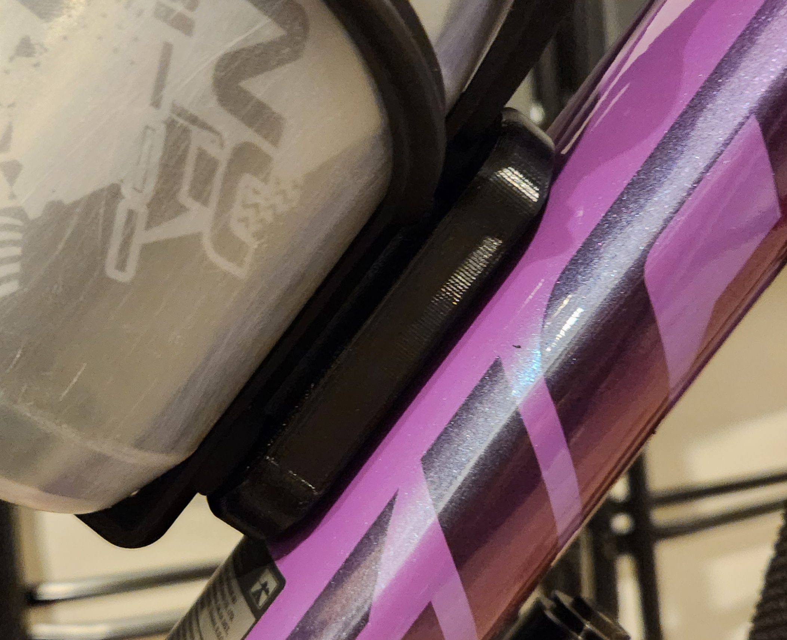
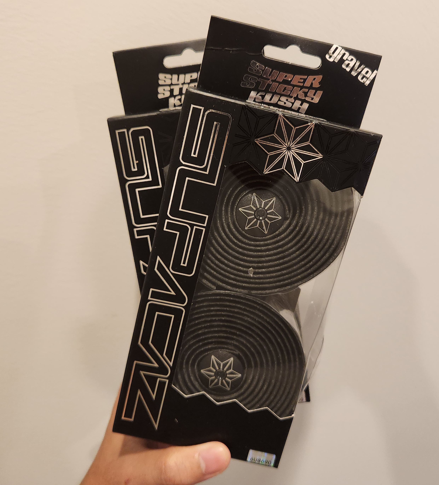
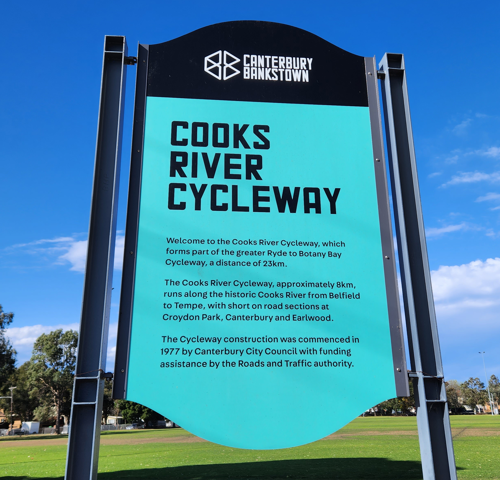

Continuing from [my previous post](/cycling-part-1/).

## Stands

I own two different bike stands. The display stand is the [BIKE HAND YC-97](https://www.bikehand.com/en/product-343707/Display-Stand-YC-97.html) and the repair stand is [from ALDI](https://www.ozbargain.com.au/node/795502) I bought half-price on clearance.

## Tubeless Accessories

I have bought (not yet used) the [Muc-Off Tubeless Sealant](https://muc-off.com/products/tubeless-sealant?variant=7779683860508) and a cheap injector from AliExpress. I chose this sealant based on [this test by Cycling Weekly](https://www.youtube.com/watch?v=s4FHCg72dXQ).

## Security

I bought a [Via Velo U-Lock with cables](https://viavelolock.com/products/bike-u-lock-with-cable-via-velo-heavy-duty-bicycle-u-lock-14mm-shackle-and-10mm-x1-8m-cable-with-mounting-bracket-for-road-mountain-electric-folding-bike) in the rare instances I leave my bike unattended outside. It is an approved [Sold Secure Lock](https://www.soldsecure.com/product/via-velo-bicycle-u-lock).

In addition, I have a [Samsung SmartTag2 installed underneath my water bottle holder](https://news.samsung.com/global/user-guide-guard-your-bike-gear-with-the-galaxy-smarttag2). I used this [3D printed design by lelong92](https://www.thingiverse.com/thing:6324699).

The bike is also registered on the free [PropertyVault](https://www.propertyvault.com.au/) service.

## Torque Wrench

The [EPAuto Torque Wrench](https://www.amazon.com.au/EPAuto-Torque-Wrench-Bicycle-Maintenance/dp/B08MJ4ZZFY/358-1329147-2578419?psc=1) is very important for tightening screws properly into carbon. I prefer wrenches that stop turning completely rather than waiting for a 'click', but they are more expensive.

For my bike, a few obscure newton-metres (Nm) required are:

- Carbon stem mounting bolts (shown underneath): 6nm
- [Front derailleur mounting bolt](https://www.sram.com/en/sram/road/campaigns/troubleshooting-etap-axs-chain-drop): 6nm
- [Chain catcher mounting bolt](https://k-edge.com/wp-content/uploads/2016/06/ProRoadChainCatcher-K13-002.pdf): 4-5nm

## Bar Tape

[Supacaz Super Sticky Kush Gravel](https://supacaz.com/product/super-sticky-kush-gravel-black/) is the most recommended bar tape on the internet. I have yet to open and use these.

## Floor Pump

The [ALDI Bike Floor Pump](https://www.ozbargain.com.au/node/795502) does the job for $15. No fancy features like 2-stage, pressure-release or digital meters. It at least has clips to store the hose.

Based on [SRAM's tyre pressure calculator](https://axs.sram.com/tirepressureguide), the optimal amount of air in my tyres is 35.5 PSI in the front and 38 PSI in the rear.

## 3D Printed Designs

SRAM has released official 3D printed designs to help adjust the [front derailleur](https://www.thingiverse.com/thing:4775539) and [rear derailleur](https://www.thingiverse.com/thing:4828353)

## Chain Waxing

Waxing a bicycle chain provides smoother, quieter rides, reduces friction and wear on drivetrain components, and keeps the chain cleaner for longer intervals, extending its lifespan.

It is best to do this process on a brand-new chain. I bought 2 new chains to rotate between them and the one on my bike (3 total). Note that brand-new chains are long and may need to have a few links removed.

The tools needed are:

- Slow cooker
- Master Link Pliers
- Master Link Adapters (as they don't last forever)
- Pillar candles (or pure wax)
- Mineral Turpentine (turps)
- Methylated Spirits (metho)
- Leakproof containers
- Specialty chain wax (I used pillar candles)

<TODO IMAGE>

### Chain Preparation

The most important one-time first step is to remove the factory lubricant on the new chain. I found two popular methods, one by [Oz Cycle](https://www.youtube.com/watch?v=sYxzHClWfQU) (i.e. [the dog beater method](https://www.abc.net.au/news/2022-07-05/steven-john-leffanue-jailed-over-killing-neighbours-dog/101209462)) and (my preferred method) by [Zero Friction Cycling (ZFC)](https://zerofrictioncycling.com.au/wp-content/uploads/2020/09/waxing-how-to-zen-master-guide-v4.pdf). The Oz Cycle method left a while film behind on the chain and specks in the methylated spirits after rinsing multiple times.

The ZFC method goes something like this:

1. Submerge in a container with turps for 15 mins, then agitate (shake) for 30 seconds.
1. Repeat a few more times, shaking for 2 mins until the liquid is clear.
1. Rinse with metho twice, shaking for 2 mins until the liquid is clear.

### Waxing

Keep the lid open, otherwise it goes over 100C. Takes 2 hours to fully melt the wax on Low. Left in there for another hour.

1. Place the wax into the slow cooker and turn it on low.
1. Make a [hook/swishing tool](waxing/swisher.png).
1. Place the chain on the swishing tool and place it into the wax. It may not have melted yet, but when it does, it will submerge the chain as well.

    

1. Come back in 2 hours when the wax has melted.

    

1. Swish the chain around for 30 seconds.
1. Remove the chain, let any excess drip back into the pot and hang it until dry.
1. Break the wax bond on each link.
1. Reinstall the chain onto the bike.

    

## Routes

My favourite routes to ride are:

- Around Sydney Olympic Park
- Along Parramatta River
- Cooks River Cycleway
- Carlingford Line (now known as the Parramatta Light Rail)
- Underneath the M4 Motorway

Additionally, [Transport NSW has a Cycleway Finder](https://roads-waterways.transport.nsw.gov.au/maps/cycleway_finder/index.html) to discover new cycle paths.

## Future

Things I'm looking forward to adding:

- A new saddle. They are subjective, but a 3D-printed saddle seems like the way to go.
- A floor pump with tubeless capabilities such as the Topeak JoeBlow [Tubi 2STAGE](https://www.topeak.com/global/en/product/1368-JOEBLOW-TUBI-2STAGE) or [Booster](https://www.topeak.com/global/en/product/1322-JOEBLOW-BOOSTER).
