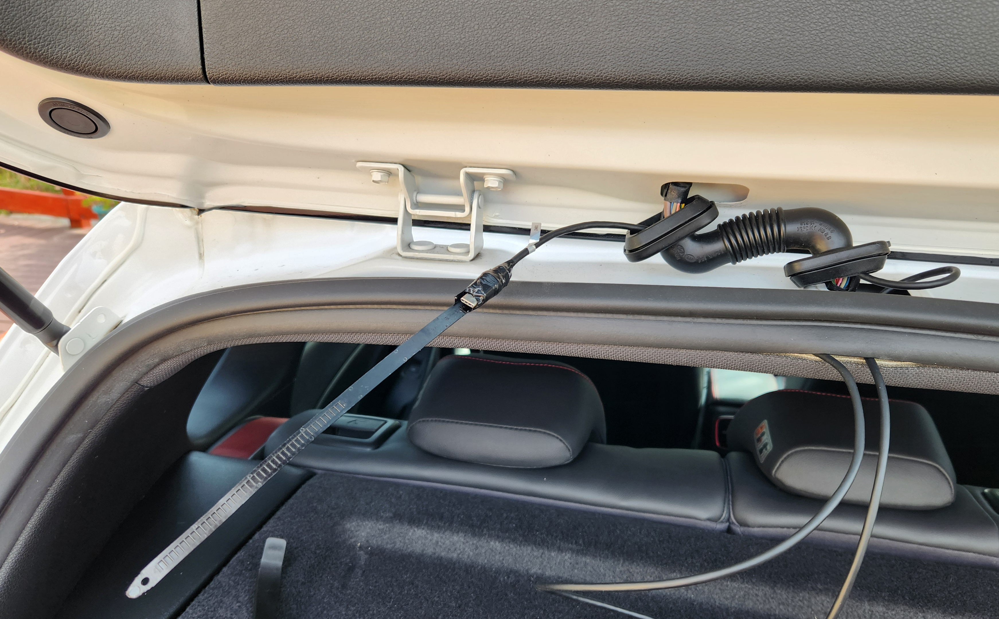

Five years ago, I wrote about the [Tech Inside My 2018 Volkswagen Golf R](/tech-inside-my-2018-vw-golf-r/). I sold that car in November 2022 and have gone without one for a year and a half. Earlier this year, we purchased a used **2018 Hyundai i30 SR Premium** to regularly go bouldering and aid in transporting our newborn in a few months.

<!-- more -->


```toc
# This code block gets replaced with the TOC
```

## Why an i30?

1. **Ventilated seats**. The i30 is one of the cheapest cars on the Australian market with ventilated seats. I used to feel horrible with  swamp ass and a sweaty back after drives, but now I feel cool and refreshed. I will never buy a car again without ventilated seats.

    

1. **Fits baby seats, pram and groceries**. A hatchback is small enough to fit in our garage, but also spacious to fit everything we need.

    <iframe src="https://www.youtube.com/embed/K4QxGPUBcxc" allowfullscreen width="1280" height="720"></iframe>

1. **Popular model in Australia**. The i30 is a very popular car in Australia after winning Car of the Year in 2017 in many publications. This makes it easier to repair or replace parts. It hopefully also makes it easier to resell.

    

## The Perfect i30 Variant

In Australia, Hyundai provides the i30 Hatchback in multiple trims. They are:

- Go
- Active
- Elite
- Premium
- SR (known as N-Line after the late 2018 facelift)
- SR Premium (known as N-Line Premium after te\he late 2018 facelift)


I was only interested in models with ventilated seats, the **Premium** or **SR/N-Line Premium**. The main difference between them is the turbo engine and interior colour options. I would've liked a Polar White Premium with a beige leather interior, but no one had it available.

In early 2018, Hyundai updated the Premium/SR Premium with a 7-speaker Infinity premium audio system. This upgrade included a subwoofer in the trunk and the words *Infinity* on the infotainment touchscreen.


In late 2018, Hyundai did a facelift to the i30 and replaced the SR and SR Premium branding with N-Line and N-Line Premium. The facelift changed the rear bumper which caused the car to lose a sensor and safety features:

- **Blind Spot Collision Warning**: the orange indicator on the side mirrors when a car is in the blind spot.
- **Rear Cross Traffic Collision Warning**: when reversing, it will indicate if a car or someone is walking across outside of view.
- **Rear Fog Lights**: not required for my driving conditions.


Therefore the ***perfect*** i30 variant would be:

- Premium or SR Premium: For the ventilated seats
- 2018 model: has the 7-speaker Infinity Sound System
- Pre-2018 facelift: For the safety features over the facelift models
- Polar White colour: reduces heat in the Australian sun.
- Beige Interior if Premium: also reduces heat

I set up alerts thinking it would take a while before one appeared, but it only took a few days for an **SR Premium** to appear on Gumtree and I bought it!


## Accessories

**Key covers** from Temu:


**Cargo liner** with cutouts for the cargo net hooks.


**Dash mat** with cutout for speakers and airbag:


**Weather shields** by Team HEKO that go below the chrome instead of over it.


**Bonnet protector** which came with the car.


**AENVTOL Replacement LEDs** from AliExpress. Not any better than OEM.


**Bosch Aerotwin** wiper blades. The AR141S set (650mm + 400mm) fit perfectly. The previous owner never replaced this.


**OEMassive Cabin Filter**. Cheap replacement filter that is the same size as the stock 97133-F2100. The previous owner never replaced this.


**Carlinkit 5.0 2AIR** for wireless Android Auto.


**SuperCharge Gold Plus MF55H Battery** (242mm x 175mm x 190mm) with 50-month warranty. The previous owner never replaced this.


**Viofo A229 Pro dashcam** with the HK4 hardwiring kit, CPL-300 CPL filter and Micro2 5A fuse taps. I installed this myself by running it through the roof of the car.





Various cleaning products from Bowden's Own:

- Orange Agent
- Wheely Clean
- Wash and Wax
- 3-Way
- Ta Ta Tar

The car was parked outside on the street for its entire life. The iron decontamination was crazy!


## Comparison with the 2018 Volkswagen Golf R

Better in the Golf:

- I can lock the car without having to wait for the passenger to close their door. My wife is slow to get out of the car and I have to stand by the i30's door to lock it as soon as she closes her door.
- Auto-hold can always be enabled. I have to enable it on each drive.
- Cruise control is one button press. It takes two buttons to start it on the i30.
- Lane-keeping in cruise control works more often.
- Parking sensors automatically turn on when driving slowly. They only activate in reverse or when pressing the parking sensor button.
- The cup holders are nicer.
- The glove box has a wine cooler mode.
- It supports SD cards, CDs and USB ports for music.
- Keyless entry does not require a button press on the door handle like i30.
- Each key had driving profiles.
- Driver seat memory.
- Modding with OBD
- The side mirror heating has its own button. It is merged with the rear defogger on the i30.
- The key could open and close windows and sunroof.
- Opening the mirror in the sunshade automatically turns on the light. It is a separate light switch in the i30.
- Steering wheel stalks had LEDs in them to see in the dark.
- There was a spot to rest my right foot (driving foot) during cruise control.
- Reversing flips down the passenger side mirrors to see the curb.
- The trunk had side pockets that held stuff.
- The hand brake automatically activates when entering park. I have to remember to activate it on the i30 or it rolls a bit.
- The cabin noise is quieter in the Golf. My wife made that comment as well.
- The Golf R is AWD. The i30 is FWD. I felt the difference driving the rain when the rear tyres would lose traction.
- There is a GROUND location near the battery to make it easier to jump-start or charge it.

Better in the i30:

- Android Auto is more responsive. It lagged in the Golf.
- The cigarette charger is inside the centre armrest, away from sight.
- Wireless charging, but always used cable anyway.
- The selected driving mode sticks. I always drove in Eco and had to change it manually each time on the Golf.
- The i30 would detect the key and turn on its lights when approached in the dark.
- The sunroof is longer.
- Ventilated seats are the best feature ever made.
- Adaptive cruise control doesn't brake heavily when a car moves into the lane.
- No more VAG brake dust.
- Changing the gear indicator or rain wiper stalks displays its position on the dashboard. I don't have to look down or fiddle around with it.
- Better turning circle. I always had to do a 3-point turn on the Golf R.
