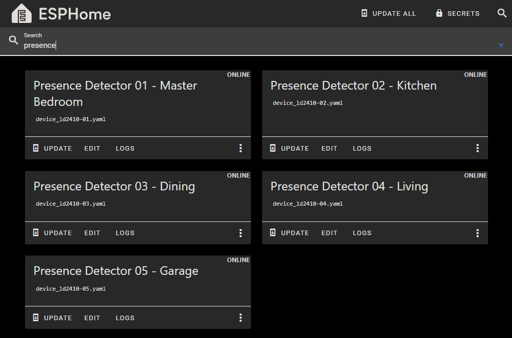

Building a mmWave presence detector from off-the-shelf components.

<!-- more -->

```toc
# This code block gets replaced with the TOC
```

## What is mmWave

mmWave presence detectors use millimeter-wave radar technology (30-300 GHz range) to detect motion and presence. Unlike traditional motion detectors (PIR sensors), mmWave sensors are more sensitive and detect subtle movements like breathing.

The best mmWave detectors are either the [Aqara FP2](https://www.aqara.com/us/product/presence-sensor-fp2) or use the HiLink [LD2410](https://hlktech.net/index.php?id=988) or [LD2450](https://hlktech.net/index.php?id=1157) such as [Apollo](https://apolloautomation.com/collections/sensors) or [Everything Presence](https://shop.everythingsmart.io/collections/everything-presence-one). This great video by Make It Work on YouTube covers most of them.

<iframe src="https://www.youtube.com/embed/Kt1FpRM8R18" allowfullscreen width="1280" height="720"></iframe>

## Why/Need

I want to turn off the lights and TV automatically when no presence is detected. I have been using my alarm system and security camera's motion detectors, but they only detect large movements and not when sitting at the dining table or on the couch. I used a few workarounds like checking if our phones are connected to certain Wi-Fi access points, but it was inaccurate.

I started looking again recently when the lights turned off with guests over. When the Aqara FP2 was released, the high price tag put me off. I needed multiple to cover the different rooms of my house. Reviews from [Smart Home Scene](https://smarthomescene.com/) were all positive for devices using the LD2410 and I got the idea to DIY my own when I came across [their post about attaching one to an ESP32 micro-controller](https://smarthomescene.com/diy/diy-presence-sensor-with-hi-link-ld2410-and-esp32-for-home-assistant/).

## My Components

| Component                 | Price (AUD) |
|---------------------------|-------------|
| Lolin D1 Mini v4 ESP8266  | $3.96       |
| HiLink LD2410             | $4.31       |
| 1.25mm to 2.54 Connectors | $0.71       |
| USB-C cable               | N/A         |
| 5V Power Adapter          | N/A         |
| Case                      | N/A         |
|                           |             |
| **TOTAL**                 | $9.98*      |

Notes:

- All components are purchased from AliExpress.
- I used the D1 Mini ESP8266 as I few spare ones lying around. If I didn't have these, I would instead use an ESP32-C3 device like the Super Mini.
- I purchased the LD2410 and 1.25mm to 2.54 connectors in 5 packs for a discount.
- I have spare USB-C and 5V/1A Phone chargers lying around.
- I created my own 3d-printed case which is [shared below](#caseenclosure).

Building my presence detector comes to a saving of 94% over buying the Aqara FP2 ($167 on sale) and 60% over an Apollo MSR2 ($67 shipped). Disregarding the time and effort for soldering and putting it together, that's a total saving of $785 for five devices.


## Flashing (ESPHome)

Flash the firmware onto the microcontroller before connecting the LD2410 sensor. The USB connector makes a connection on the same UART ports as the LD2410 which will cause it to fail. Use OTA to update/install new firmware.

This config can be found in [my GitHub repository](https://github.com/calvinbui/ansible-monorepo/blob/master/files/esphome/.project-presence-detectors.yaml.j2). Everything is taken from ESPHome's documentation, including the [built-in support for the LD2410 sensor](https://esphome.io/components/sensor/ld2410.html). Everything from the [HLKRadarTool app](https://play.google.com/store/apps/details?id=com.hlk.hlkradartool) can be added to ESPHome.



## Soldering

Connect the devices as follows:

| Wire Colour | LD2410  | D1 Mini |
|-------------|---------|---------|
| Black       | VCC     | VBUS    |
| Red         | GND     | GND     |
| White       | UART Tx | GPIO15  |
| Yellow      | UART Rx | GPIO13  |
| Orange      | N/A     | N/A     |

The 1.25mm connector is tough to get on.


I tested first by plugging into the board cable directly.


To keep it compact, I soldered directly onto the board without any pins.


## Case/Enclosure

I designed a rectangular case with a snap-fit lid and exposed the sensor to get more accurate readings. It is a remix of my own remix [made by Bri0nac](https://www.printables.com/model/668546-esphome-sensor-d1-mini-esp8266-usbc-and-ld2410-cas). All files are available on [Printables](https://www.printables.com/model/998232-lolin-d1-mini-usb-c-and-ld2410) and [here](lolin-d1-mini-usb-c-and-ld2410-model_files.zip)


The compact size and colour options available when 3D printing allowed me to blend into my dining, kitchen and living areas.


## Tuning Sensitivity

There is a small learning curve to tuning the sensor. I'll do my best to summarise what I know.

There are two energy sensors, moving (big) and static (small). Each has a configurable sensitivity threshold between 0 to 100 for different distances.

| Gate |   Distance    | Move Sensitivity | Still Sensitivity |
|:----:|:-------------:|:----------------:|:-----------------:|
|  0   | 0.00m - 0.00m |        50        |         0         |
|  1   | 0.00m - 0.75m |        50        |         0         |
|  2   | 0.75m - 1.50m |        40        |        40         |
|  3   | 1.50m - 2.25m |        40        |        40         |
|  4   | 2.25m - 3.00m |        40        |        40         |
|  5   | 3.00m - 3.75m |        40        |        40         |
|  6   | 3.75m - 4.50m |        30        |        15         |
|  7   | 4.50m - 5.25m |        30        |        15         |
|  8   | 5.25m - 6.00m |        30        |        15         |

It is only possible to tune sensitivity with Engineering mode enabled. I liked to do this through Home Assistant because the updates were instant. Half the time, the value does not update, so try again.


When someone walks into a room, the moving target triggers. If the target stops moving, it becomes a static target if that value exceeds the sensitivity threshold. It is not possible to be a static target without first triggering the moving target sensor.

I tune sensitivity by setting every gate threshold 2-3 points above the highest value it reaches in an empty room.

The unmanned duration keeps a static target detected for a few more seconds after it drops below the sensitivity threshold. I set this to 20 seconds, as sometimes people just sit and stare at their phones like a statue.

Spinning fans are the mortal enemy of mmWave sensors as they will trigger false positives. I have this issue with my air purifiers, 3D printer fan and computer case fans.

## Speed Comparison

In this video, the LD2410 is 10 seconds faster compared to my UniFi G3 Flex camera's motion detection. In Home Assistant, I have a simple automation to turn on the garage light when motion is detected.

<video autoplay loop controls width="100%" height="auto">
  <source type="video/webm" src="comparison.webm">
  <p>Your browser does not support the video element.</p>
</video>

While I use it mainly as a presence sensor to keep lights on, its motion-detecting speed is also perfect for turning on lights.
