Sharing my playthrough of Pikmin 4 on the Nintendo Switch.

<!-- more -->

As a long-time fan of the Pikmin series, I've had the joy of experiencing these charming little creatures across multiple consoles. From my early days as a young boy playing on the GameCube at a nearby Kmart to having Pikmin 1 and 2 on the Wii and Pikmin 3 on the Wii U, I am now exploring Pikmin 4 on my Nintendo Switch.

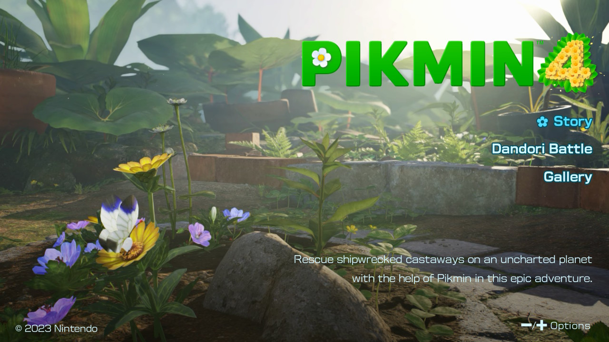

One aspect of Pikmin that resonates with me is its emphasis on "dandori", the art of efficient planning and execution. I find myself drawn to the challenge of maximising every move and optimising my strategies like the perfectionist I am. There's something deeply satisfying about orchestrating a well-coordinated day with my Pikmin.

Here are my Pikmin 4 stats!

- Completion time of 48 hours
- Infinite Rush unlocked for Oatchi
- Extra Hand unlocked from Louie
- Managed to keep all my Pikmin safe - never losing a single one
- I amassed a total of 2398 Pikmin throughout my adventure
- Fully completed every area 100%
- Finished every night expedition with a gold rating

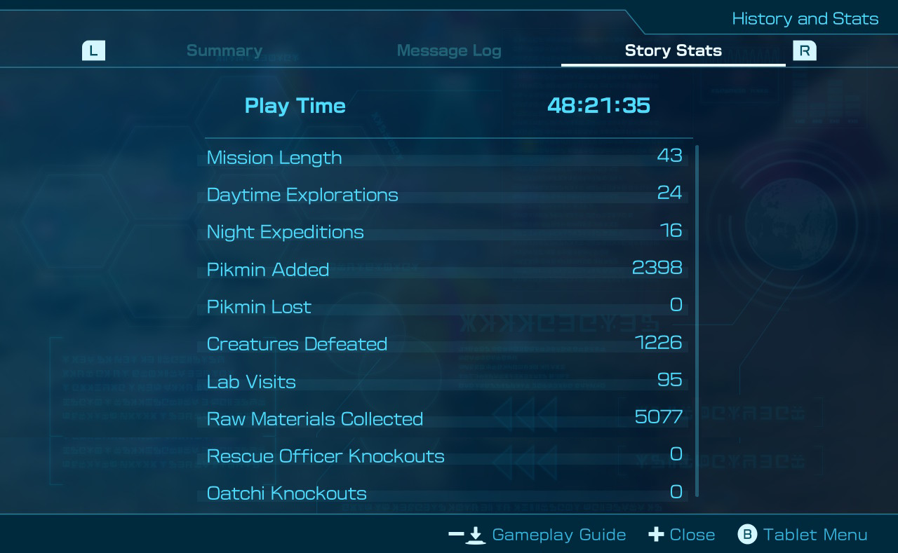

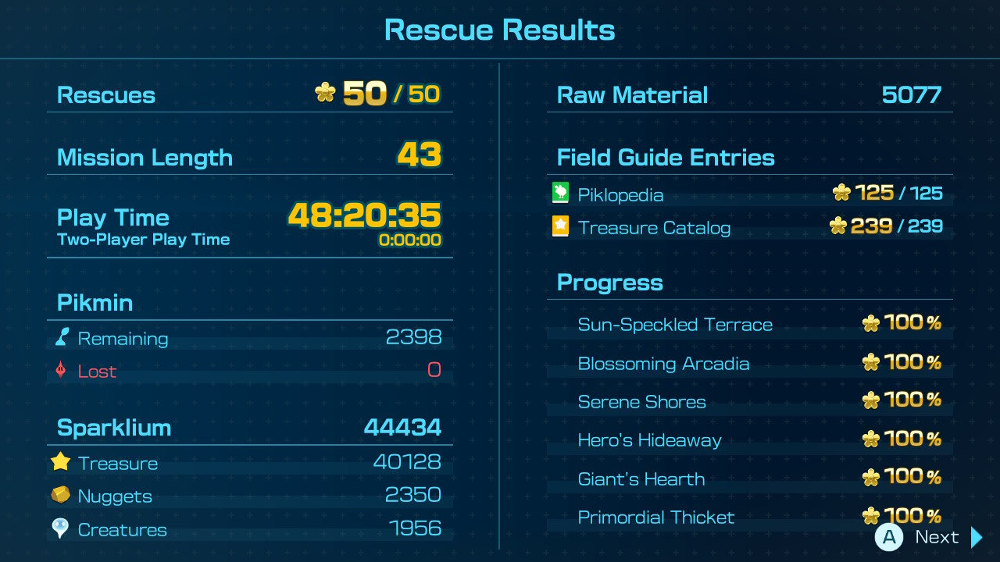

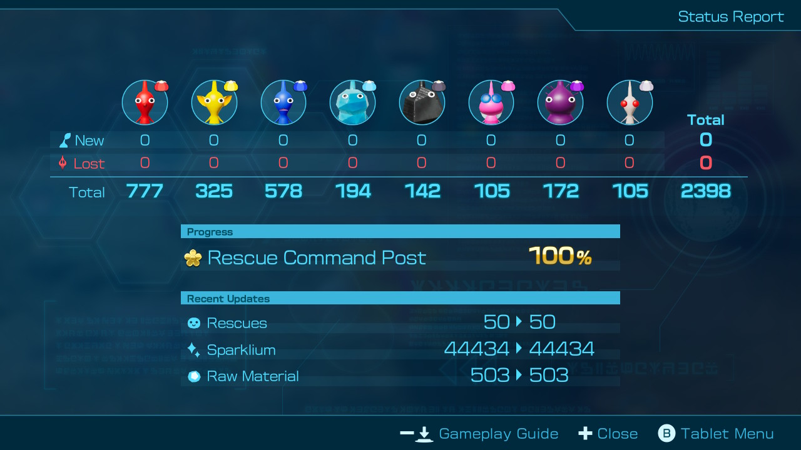

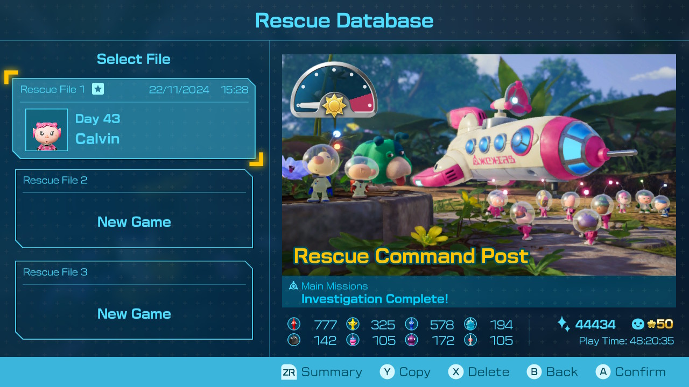

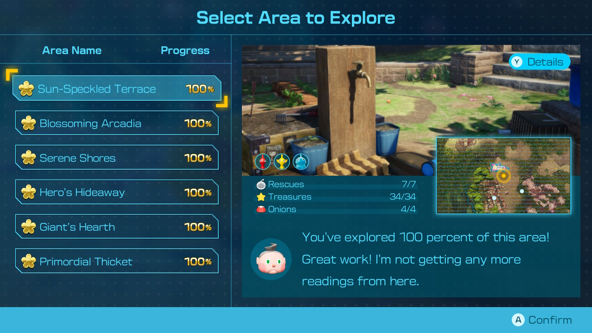

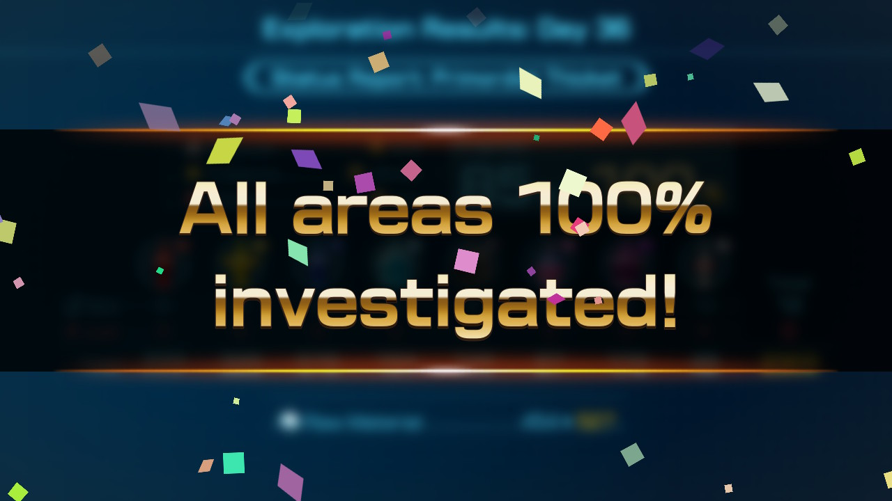

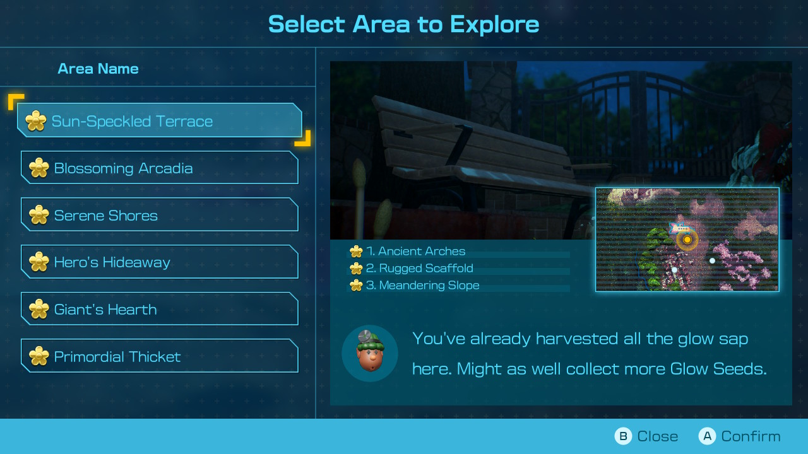

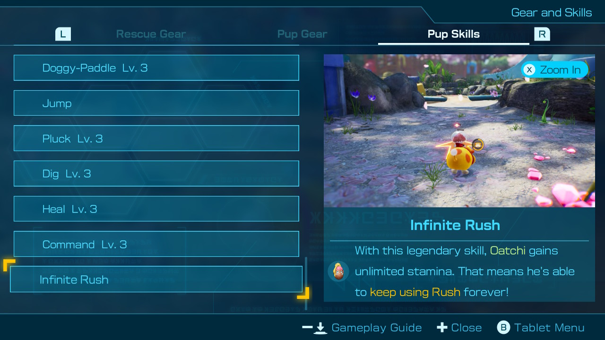

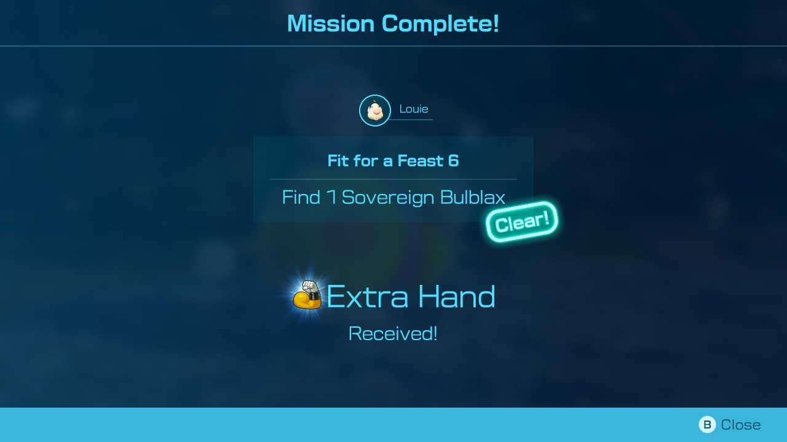

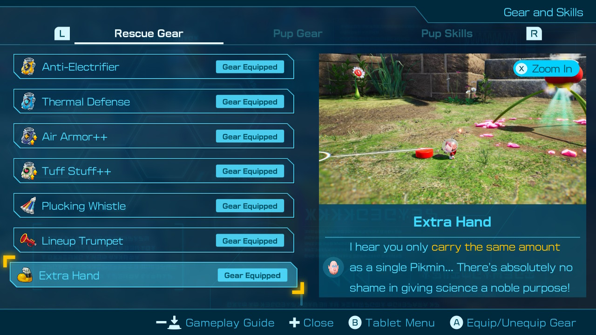

Pikmin 4 has been a long time coming, 10 years after Pikmin 3, with development kicking off back in 2015. It feels like Pikmin is in a similar situation to Metroid, receiving less attention from Nintendo than their more prominent IPs. Given the unique gameplay and charm of the Pikmin universe, I genuinely hope that Nintendo revitalises this beloved franchise and gives it the love and support it deserves in the future!

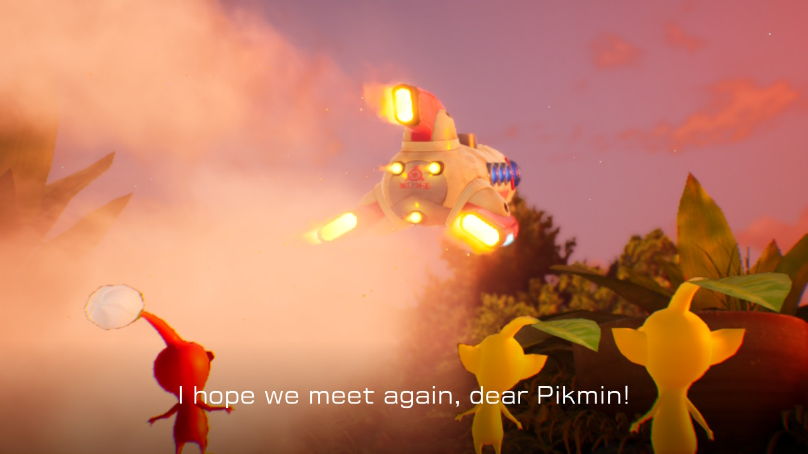
