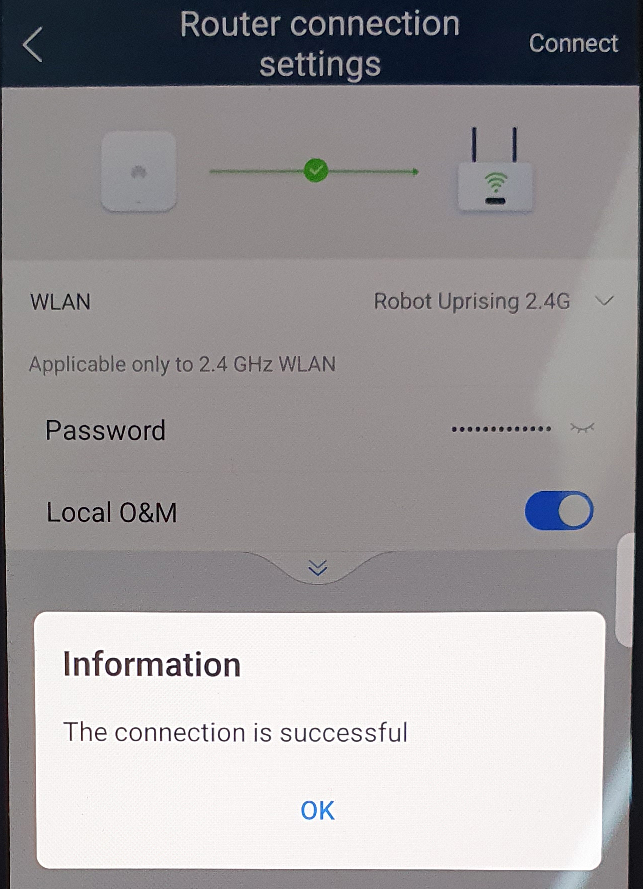

Updates about [my 12.76 kW solar system](/solar-power) installed at the end of July 2022.

<!-- more -->

```toc
# This code block gets replaced with the TOC
```

## Payback Period

As of June 2024, [my expected payment period](/solar-power/#payback-period) date was the 13th of July 2027, or 5 years.

With recent electricity price changes, the payback period is 13th September 2027, two months later.

## Fixing Random Shutdowns

Whenever my solar output reached 10 kW, it would trip the main breaker and shut down.


Whenever this happened, I didn't know about it until I looked at my dashboards and saw nothing. The FusionSolar app doesn't send a notification either. I wrote this Home Assistant automation to send an alert to my phone:

```yaml
alias: Solar - Alarms
mode: single
triggers:
  - entity_id:
      - sensor.inverter_1_alarms
    from: None
    for:
      hours: 0
      minutes: 1
      seconds: 0
    trigger: state
  - entity_id:
      - sensor.inverter_2_alarms
    from: None
    for:
      hours: 0
      minutes: 1
      seconds: 0
    trigger: state
conditions: []
actions:
  - action: notify.mobile_app_calvin_s_galaxy_z_fold6
    data:
      message: Solar Alarm Triggered
```

After some back and forth with my installer, [Banana Solar](https://www.bananasolar.com.au/), they came out and replaced the breaker. The issue hasn't appeared again since the replacement. This is why you pay for a reputable installer!

If replacing the breaker doesn't help, [read this article by Solar Quotes](https://support.solarquotes.com.au/hc/en-us/articles/115001759153-My-Inverter-Keeps-Tripping-or-Reducing-Power-On-Over-voltage-What-can-I-do) on other possible causes.

## Firmware Update

Huawei regularly [releases firmware updates to my SUN2000L inverter](https://support.huawei.com/enterprise/en/fusionsolar/sun2000l-pid-22027611/software/), which can only be installed by 'installer' accounts. My FusionSolar account is not an 'installer', so I connected to the inverter directly to install the update. [See my previous post about accessing installer mode](http://localhost:8000/solar-power/#installer-mode-access).

After logging in, I was prompted to update the firmware. This took about 5 minutes to complete and also required a restart of the inverter.


I have not noticed any differences after updating the firmware.

## Removing Wi-Fi Network Bridges

Since [V200R001C00SPC124](https://community.home-assistant.io/t/integration-solar-inverter-huawei-2000l/132350/2206), Huawei has re-enabled local network access to their inverters. This is enabled using the Local O&M (stands for operation and maintenance) option within the inverter's Wi-Fi settings.

In my previous post, I was using [OpenWrt routers as dedicated WLAN bridges to the inverters](http://localhost:8000/solar-power/#openwrt-wlan-bridge). This completely removes them and Home Assistant connects directly to the inverters.

The setting can be found under Router connection settings:



You can test it works by running `telnet`:

```console
❯ telnet 192.168.3.46 6607
Trying 192.168.3.46...
Connected to solar-inverter-1.xxx.
Escape character is '^]'.
Connection closed by foreign host.
```

If `telnet` doesn't work, make sure absolutely nothing is connected to the inverter or it's Wi-Fi signal. Only 1 device can connect to the Wi-Fi access point at a time and only 1 device can be connected to port `6607`. This includes the FusionSolar app in installer mode, other `telnet` connections, Home Assistant, OpenWrt, etc.

Finally, update Home Assistant to point directly at the inverter and port `6607`.


