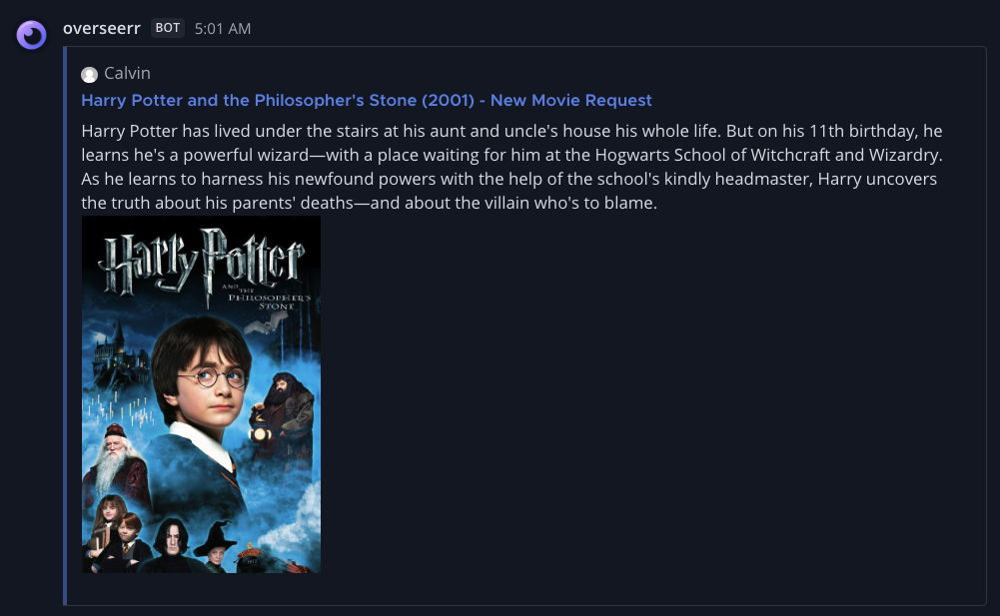
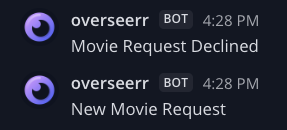
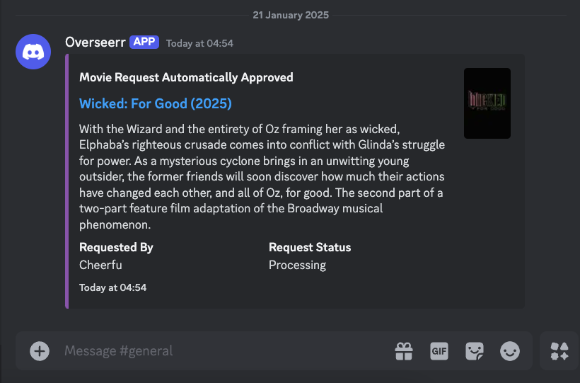
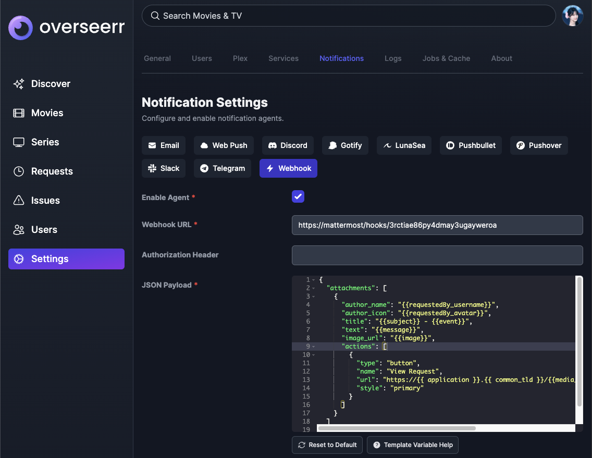
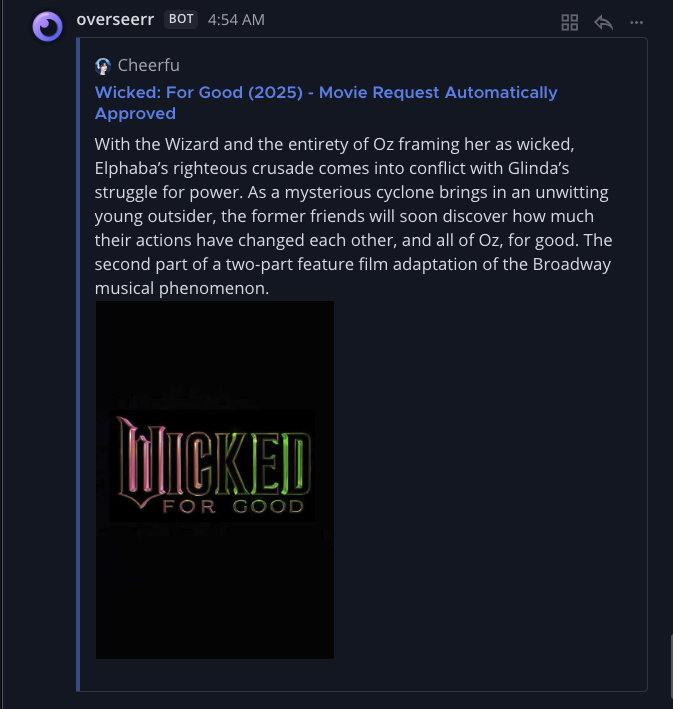
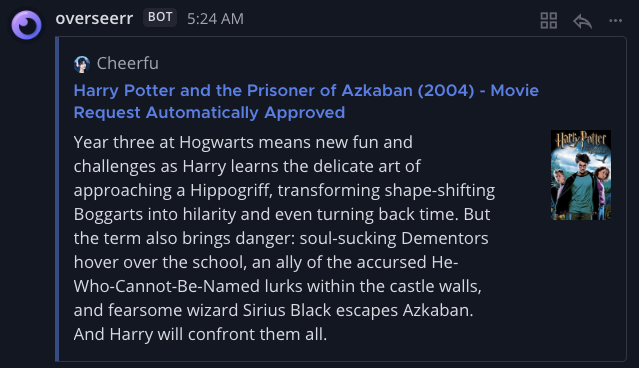

Creating better notifications from [Overseerr](https://overseerr.dev/) to Slack/Mattermost using the webhooks.

<!-- more -->



As my Plex server's user base expanded to include friends and family over the past year, managing content requests became increasingly important. To streamline this process, I encouraged users to utilise Overseerr, a powerful tool for handling media requests.

However, I found that the default notification system, especially for Slack and Mattermost, was quite basic. In this post, I'll show you how to enhance these notifications using webhooks for a more informative and visually appealing experience.

## Slack Notifications

Overseerr's default Slack/Mattermost notification is lacking. It's basic text with no rich formatting, images or links. It's a simple status update that something happened.



## Discord Notifications

Overseerr's Discord notifications, however, are first-class. There's a link to the request, details about the content and a thumbnail as well.



## Webhook Notifications

Thankfully a [webhook option](https://docs.overseerr.dev/using-overseerr/notifications/webhooks) exists in Overseerr to send a custom JSON payload to any endpoint. This can be used with the Incoming Webhooks feature in [Slack](https://api.slack.com/messaging/webhooks) or [Mattermost](https://developers.mattermost.com/integrate/webhooks/incoming/) to send a customised and formatted message.

```json
{
  "attachments": [
    {
      "author_name": "{{requestedBy_username}}",
      "author_icon": "{{requestedBy_avatar}}",
      "title": "{{subject}} - {{event}}",
      "title_link": "https://overseerr/{{media_type}}/{{media_tmdbid}}{{media_tvdbid}}",
      "text": "{{message}}",
      "image_url": "{{image}}"
    }
  ]
}
```

Place this inside Settings > Notifications > Webhook > JSON Payload.



Request content and see how it appears.



The `image_url` key can be replaced with `thumb_url` for a smaller poster. This matches how Discord is presented.



## Conclusion

By leveraging Overseerr's webhook feature, you can transform basic notifications into rich, informative messages tailored to your preferences. Whether you're using Slack, Mattermost, or another platform that supports webhooks, customising your notifications enhances communication and keeps your team informed effortlessly. Try implementing the JSON payload provided and adjust it to fit your specific needs!
